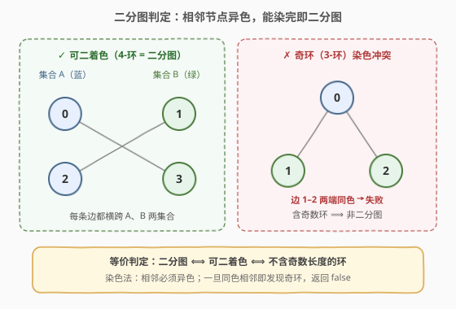
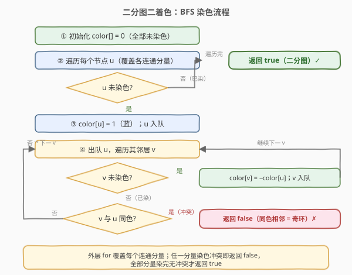
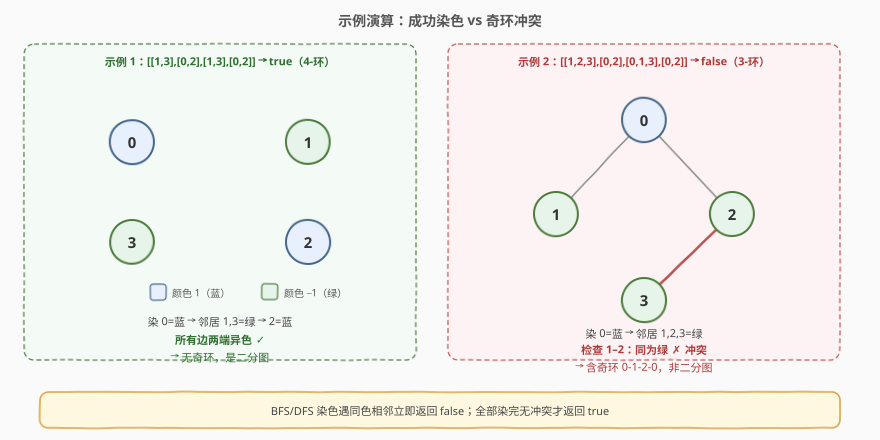

# 判断二分图

- **题目名称**：判断二分图
- **链接**：[785. 判断二分图](https://leetcode.cn/problems/is-graph-bipartite/)
- **难度**：中等
- **标签**：深度优先搜索、广度优先搜索、图、并查集、二分图

## 1. 题目概述

给定一个无向图 `graph`，其中有 `n` 个节点，编号 `0` 到 `n-1`。`graph[i]` 是一个列表，表示与节点 `i` 相邻的所有节点。判断该图是否是**二分图**（bipartite）。

二分图的定义：能把所有节点划分到**两个独立集合** `A`、`B` 中，使得**每条边都连接 `A` 中一个节点与 `B` 中一个节点**（即集合内部没有边）。

**示例 1**：

```text
输入：graph = [[1,3],[0,2],[1,3],[0,2]]
输出：true
解释：4 个节点 0-1-2-3-0 构成 4-环，可分成 {0,2} 与 {1,3} 两组，每条边都跨组。
```

**示例 2**：

```text
输入：graph = [[1,2,3],[0,2],[0,1,3],[0,2]]
输出：false
解释：0、1、2 构成三角形（3-环，奇环），无法二着色，非二分图。
```

**约束条件**：

- `1 <= n <= 100`
- `0 <= graph[i].length <= n - 1`
- `0 <= graph[i][j] <= n - 1`
- `graph[i]` 不会包含 `i`（无自环），且不会有重复元素
- 图是无向的：若 `j` 在 `graph[i]` 中，则 `i` 也在 `graph[j]` 中

---

## 2. 解题思路

> 💡 **核心等价**：二分图 ⟺ **可二着色**（相邻节点异色）⟺ **不含奇数长度的环**。染色法正是利用这条等价关系，用一次遍历把"能否二着色"验证出来。

### 2.1 暴力思路

枚举所有把 `n` 个节点拆成两组 `(A, B)` 的方式，共有 $2^n$ 种；对每种划分检查是否所有边都跨组。复杂度 $O(2^n \cdot E)$，`n=100` 时完全不可行。

**优化方向**：在每个连通分量里，一旦确定某个起点的颜色，它的邻居颜色就被**强制**成相反色，邻居的邻居又被强制回原色……整棵连通分量的染色是**唯一确定**的。因此根本不需要枚举划分——只需从一个未染色节点出发，按"相邻异色"贪心染色，能染完即合法，中途出现"同色相邻"即无解。

### 2.2 核心观察：二着色（BFS / DFS）



关键直觉：

- 用两种颜色 `1` / `-1`（未染为 `0`）。从某个节点出发染 `1`，则其所有邻居**必须**染 `-1`，邻居的邻居染 `1`，交替进行。
- 若 BFS 过程中遇到一个邻居 `v` **已经染色且与 `u` 同色**，说明这条边的两端被迫落在同一集合里 → **染色冲突** → 图中存在奇环 → 非二分图，立即返回 `false`。
- 若所有连通分量都顺利染完无冲突，则存在合法二着色 → 是二分图，返回 `true`。

> 💡 一句话：**染色是"被强制"的，不是"被搜索"的**。所以一次 BFS/DFS 即可验证，不必回溯、不必枚举。这和回溯里的"涂色搜索"不同——本题只有 2 种颜色，约束强到唯一确定。

### 2.3 算法流程图



外层 `for` 遍历每个节点，保证**每个连通分量都被处理**（图可能不连通，任一分量非二分图则整图非二分图）。每个节点至多入队一次、每条边至多被检查一次，总时间 $O(V+E)$。

### 2.4 示例演算



**示例 1（true，4-环）**：`graph = [[1,3],[0,2],[1,3],[0,2]]`

| 步骤 | 取出 u | 邻居处理 | 颜色变化 | 队列 |
|------|--------|----------|----------|------|
| 初始 | — | 染 0=蓝(1) | 0:1 | `[0]` |
| 1 | 0 | 1,3 未染→绿(−1) | 1:−1, 3:−1 | `[1,3]` |
| 2 | 1 | 0 蓝✓，2 未染→蓝(1) | 2:1 | `[3]` |
| 3 | 3 | 0 蓝✓，2 蓝✓ | — | `[]` |

所有边两端异色，无冲突 → `true`。最终染色 `{0,2}`=蓝、`{1,3}`=绿，正是两个独立集合。

**示例 2（false，3-环）**：`graph = [[1,2,3],[0,2],[0,1,3],[0,2]]`

| 步骤 | 取出 u | 邻居处理 | 颜色变化 | 队列 |
|------|--------|----------|----------|------|
| 初始 | — | 染 0=蓝(1) | 0:1 | `[0]` |
| 1 | 0 | 1,2,3 未染→绿(−1) | 1:−1, 2:−1, 3:−1 | `[1,2,3]` |
| 2 | 1 | 0 蓝✓，**2 绿 ✗ 冲突** | — | — |

检查 `1` 的邻居 `2` 时发现 `color[2] == color[1] == -1`（同色相邻）→ 立即返回 `false`。这正是奇环 `0-1-2-0` 导致的必然冲突。

---

## 3. 参考代码

### 方法一：BFS 染色（推荐）

### C++

```cpp
class Solution {
  public:
    bool isBipartite(vector<vector<int>>& graph) {
        int n = graph.size();
        vector<int> color(n, 0);          // 0 未染, 1 / -1 两种颜色
        for (int i = 0; i < n; ++i) {
            if (color[i] != 0) continue;  // 该连通分量已染过
            queue<int> q;
            q.push(i);
            color[i] = 1;                 // 起点染颜色 1
            while (!q.empty()) {
                int u = q.front(); q.pop();
                for (int v : graph[u]) {
                    if (color[v] == 0) {              // 未染 → 染相反色
                        color[v] = -color[u];
                        q.push(v);
                    } else if (color[v] == color[u]) {
                        return false;                 // 同色相邻 → 奇环
                    }
                }
            }
        }
        return true;
    }
};
```

### Python

```python
from collections import deque

class Solution:
    def isBipartite(self, graph: List[List[int]]) -> bool:
        n = len(graph)
        color = [0] * n                  # 0 未染, 1 / -1 两种颜色
        for start in range(n):
            if color[start] != 0:
                continue                 # 该连通分量已染过
            q = deque([start])
            color[start] = 1             # 起点染颜色 1
            while q:
                u = q.popleft()
                for v in graph[u]:
                    if color[v] == 0:        # 未染 → 染相反色
                        color[v] = -color[u]
                        q.append(v)
                    elif color[v] == color[u]:
                        return False          # 同色相邻 → 奇环
        return True
```

### 方法二：DFS 染色

把 BFS 换成递归：进入节点 `u` 时染色 `c`，对其每个邻居递归染 `-c`；遇到已染且同色即冲突。写法更短，但要注意递归栈深度。

### C++

```cpp
class Solution {
    vector<vector<int>> g;
    vector<int> color;
    bool dfs(int u, int c) {
        color[u] = c;
        for (int v : g[u]) {
            if (color[v] == 0) { if (!dfs(v, -c)) return false; }
            else if (color[v] == c) return false;   // 同色相邻 → 奇环
        }
        return true;
    }
  public:
    bool isBipartite(vector<vector<int>>& graph) {
        g = graph;
        color.assign(g.size(), 0);
        for (int i = 0; i < (int)g.size(); ++i)
            if (color[i] == 0 && !dfs(i, 1)) return false;
        return true;
    }
};
```

### Python

```python
class Solution:
    def isBipartite(self, graph: List[List[int]]) -> bool:
        n = len(graph)
        color = [0] * n

        def dfs(u: int, c: int) -> bool:
            color[u] = c
            for v in graph[u]:
                if color[v] == 0:
                    if not dfs(v, -c):
                        return False
                elif color[v] == c:
                    return False
            return True

        return all(dfs(i, 1) for i in range(n) if color[i] == 0)
```

> 💡 **两种方法的选择**：BFS 无递归栈溢出风险，且与"按层交替染色"的直觉一致，面试首选；DFS 写法更短，迁移到「二分图相关计数」「判断是否二分图并输出方案」等变体时更顺手。本题 `n <= 100`，两者都安全。

---

## 4. 复杂度分析

| 维度 | 方法 | 复杂度 | 说明 |
|------|------|--------|------|
| 时间复杂度 | BFS / DFS 染色 | $O(V+E)$ | 每个节点至多染色一次 $O(V)$；每条边在遍历邻居时至多检查一次 $O(E)$ |
| 空间复杂度 | BFS 染色 | $O(V)$ | `color` 数组 $O(V)$，队列最坏存所有节点 $O(V)$；邻接表由输入给出，不计入额外空间 |
| 空间复杂度 | DFS 染色 | $O(V)$ | `color` 数组 $O(V)$，递归栈最深 $O(V)$（链状连通分量） |

> ⚠️ 若题目把规模放到 $10^5$，DFS 的递归栈可能溢出，应改用 BFS 或手写栈迭代。

---

## 5. 扩展：并查集判定二分图

二分图也可用**带权/扩展并查集**判定：把每个节点 `i` 拆成两个角色 `i` 与 `i+n`（"自身"和"对立面"）。对每条无向边 `(u, v)`，由于 `u`、`v` 必须异色，等价于：

- `u` 与 `v+n` 同集合（`u` 是蓝 ⟺ `v` 是绿）
- `v` 与 `u+n` 同集合

依次 `union(u, v+n)`、`union(v, u+n)`。若某条边处理前 `find(u) == find(v)`（`u`、`v` 已被迫同集合），说明无法异色 → 非二分图。并查集写法在「边动态加入、随时查询是否仍为二分图」的在线场景更顺手；染色法在「一次性判定」时更直观，两者本质等价（都等价于判定有无奇环）。

---

## 6. 面试要点

1. **为什么染色法是正确的（不漏解）？**

   - 在每个连通分量里，起点颜色一旦确定，其余节点颜色被"交替"规则**唯一确定**。若存在合法二着色，BFS 给出的就是它；若 BFS 中途冲突，说明任何二着色都会冲突（即存在奇环）。因此"贪心染色 + 一致性检查"与"是否存在二着色"完全等价。

2. **为什么外层要 `for` 遍历所有节点？**

   - 图可能不连通。每个连通分量独立判定；只要有一个分量非二分图，整图就非二分图。`if (color[i] != 0) continue` 跳过已染分量，避免重复。

3. **BFS 还是 DFS？**

   - 都可以，复杂度相同。BFS 无递归栈溢出风险，适合大规模图；DFS 代码更短，迁移到「输出一种合法分组」「二分图相关 DP」更顺手。本题 `n <= 100`，随意选。

4. **颜色用 `1 / -1` 还是 `0 / 1 / 2`？**

   - 用 `1 / -1` 可直接 `color[v] = -color[u]` 取反，最简洁；用 `0 / 1 / 2`（0 表未染）则取反写 `3 - color[u]`。本质一样，`1 / -1` 更不易写错。

5. **染色冲突为什么一定意味着奇环？**

   - 冲突发生在边 `(u, v)` 同色。沿 BFS 树从 `u`、`v` 回溯到它们的最近公共祖先，再接上这条冲突边，得到一个长度为奇数的环（树路径两端同色说明路径长度为偶数，加一条边变奇数）。因此"同色相邻 ⟺ 存在奇环 ⟺ 非二分图"。

6. **和并查集解法什么关系？**

   - 并查集维护"必同集 / 必异集"的二元关系；染色法是它的一次性、在线版等价。并查集适合"边逐条加入、动态查询"；染色法适合"一次性判定整图"。

---

## 7. 同类练习题

- [886. 可能的二分法](https://leetcode.cn/problems/possible-bipartition/)：把"互相讨厌"当作无向边，完全等价于判断二分图，几乎是同一道题换皮
- [1042. 不邻接植花](https://leetcode.cn/problems/flower-planting-with-no-adjacent/)：着色扩展到 4 种颜色（保证有解），贪心给每个节点选邻居没用的花即可
- [684. 冗余连接](https://leetcode.cn/problems/redundant-connection/)：并查集找无向图中的环，可对比"奇环判定"与"任意环判定"的区别
- [323. 无向图中连通分量的数量](https://leetcode.cn/problems/number-of-connected-components-in-an-undirected-graph/)：理解"按连通分量分别处理"，是二分图判定外层 `for` 的前置概念
