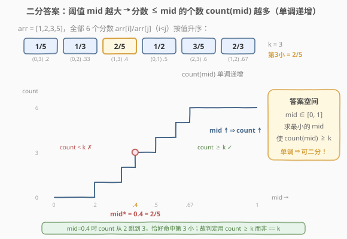
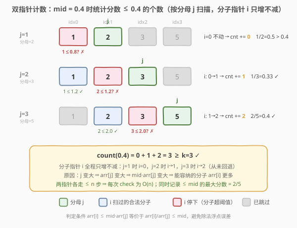
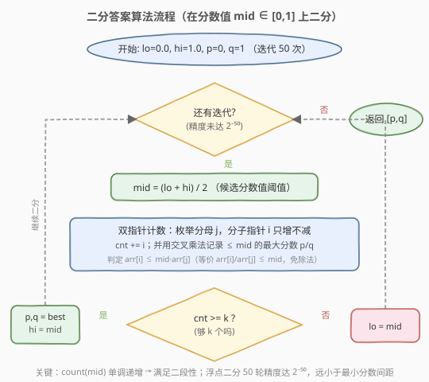

# 第 K 个最小的质数分数

- **题目名称**：第 K 个最小的质数分数
- **链接**：[786. 第 K 个最小的质数分数](https://leetcode.cn/problems/k-th-smallest-prime-fraction/)
- **难度**：中等
- **标签**：数组、二分查找、双指针

## 1. 题目概述

给定一个**严格递增**排序的数组 `arr` 和一个整数 `k`。数组 `arr` 由 `1` 和若干**质数**组成，且所有整数互不相同。对于每对满足 `0 <= i < j < arr.length` 的 `i` 和 `j`，可以得到分数 `arr[i] / arr[j]`。返回**第 `k` 个最小**的分数，以长度为 2 的整数数组 `[arr[i], arr[j]]` 返回。

> 💡 由于 `arr` 严格递增且 `i < j`，故 `arr[i] < arr[j]`，所有分数都落在 `(0, 1)` 区间内。

**示例 1**：

```text
输入：arr = [1,2,3,5], k = 3
输出：[2,5]
解释：所有分数按值升序为：
1/5(0.2), 1/3(0.33), 2/5(0.4), 1/2(0.5), 3/5(0.6), 2/3(0.67)
第 3 小的分数是 2/5。
```

**示例 2**：

```text
输入：arr = [1,7], k = 1
输出：[1,7]
解释：只有一个分数 1/7，第 1 小即 1/7。
```

**约束条件**：

- $2 \le \text{arr.length} \le 1000$
- $1 \le \text{arr}[i] \le 3 \times 10^4$
- $\text{arr}[0] == 1$，且 `arr[i]` 是质数（$i > 0$）
- `arr` 中所有数字互不相同且严格递增
- $1 \le k \le \dfrac{n(n-1)}{2}$

**进阶**：能否设计时间复杂度小于 $O(n^2)$ 的算法？

---

## 2. 解题思路

### 2.1 暴力思路

最直接的做法是**枚举所有分数对** $\binom{n}{2}$ 个，排序后取第 `k` 个。$n = 1000$ 时数对约 $5 \times 10^5$ 个，排序 $O(n^2 \log n)$ 虽能勉强通过，但空间 $O(n^2)$ 偏大，且未利用「数组已排序」的结构。

> 💡 **关键转化**：答案（第 k 小的分数值）一定落在 $[0, 1]$ 之间。把「求第 k 小的值」变成「求最小的 `mid`，使分数 $\le \text{mid}$ 的个数 $\ge k$」——这是**二分答案**的标准信号，与 [找出第 K 小的数对距离](../0701-0800/719_找出第K小的数对距离.md) 同骨架。

### 2.2 核心观察：二分答案 + 双指针计数



注意到「分数 $\le \text{mid}$ 的个数 `count(mid)`」关于 `mid` **单调递增**：

- `mid` 越大（阈值越宽），满足条件的分数越多。
- `mid = 0` 时 `count = 0`；`mid = 1` 时所有分数都算入，`count = n(n-1)/2`。

于是存在一个**分界点** `mid*`：

```text
mid < mid* → count(mid) < k    (不够 k 个，阈值太小)
mid >= mid* → count(mid) >= k  (够 k 个，阈值够大)
```

这正是二分查找所需的**二段性**。在 $[0, 1]$ 上**浮点二分**，每次 $O(n)$ 统计 `count(mid)`，可行则去左半找更小的，不可行则去右半放宽。统计时**顺手记录 $\le \text{mid}$ 的最大分数**作为候选答案。

> 💡 **识别信号**：题目求「第 k 小」且能高效统计「$\le$ 某值的元素个数」→ 想「二分答案」。本题与 [719. 找出第 K 小的数对距离](../0701-0800/719_找出第K小的数对距离.md)、[378. 有序矩阵中第 K 小元素](https://leetcode.cn/problems/kth-smallest-element-in-a-sorted-matrix/) 同骨架，只是 `check()` 换成了「按分母枚举 + 分子双指针」。

> ⚠️ **为什么 `count(mid) >= k` 就算可行？** 因为我们找的是「使计数达到 k 的**最小**阈值」。`count >= k` 说明第 k 小的分数 $\le \text{mid}$，可以尝试更小；`count < k` 说明第 k 小的分数 $> \text{mid}$，必须放大阈值。

### 2.3 双指针计数：O(n) 统计分数个数



数组已排序。对每个**分母** `j`，满足 `arr[i]/arr[j] <= mid` 的分子 `arr[i]` 是一个**前缀** `[0, i_max]`（因为 `arr[i]` 随 `i` 递增）。且随着 `j` 右移，`arr[j]` 变大 ⇒ `mid * arr[j]` 变大 ⇒ 能容纳的分子更多 ⇒ `i_max` 只增不减。于是可用**滑动窗口式双指针**在 $O(n)$ 内统计：

```text
i = 0, count = 0
for j in range(1, n):
    while i < j and arr[i] <= mid * arr[j]:   # 等价 arr[i]/arr[j] <= mid
        # arr[i]/arr[j] 是一个 ≤ mid 的分数，顺便更新候选最大值
        i += 1
    count += i      # 分子 arr[0..i-1] 与分母 arr[j] 都合法，共 i 个分数
```

> ⚠️ **三个易错点**：
> 1. **判定用乘法 `arr[i] <= mid * arr[j]` 而非除法**：等价于 `arr[i]/arr[j] <= mid`，但避免浮点除法误差。
> 2. **为什么 `i` 不回退？** `j` 变大时 `arr[j]` 增大，`mid * arr[j]` 增大，上一轮合法的 `i` 对当前 `j` 仍合法，`i` 只需继续右移。这正是双指针 $O(n)$ 而非 $O(n^2)$ 的关键。
> 3. **记录候选用交叉乘法**：比较 `arr[i]/arr[j]` 与当前最优 `p/q` 的大小，用 `arr[i] * q > p * arr[j]` 判断，全程整数运算，无精度问题。

### 2.4 算法流程图



注意判定为「可行」时**先记录 `p, q = best` 再收缩右界**（`hi = mid`），保证最终保留的是「最小的可行阈值」对应的分数。浮点二分用**固定 50 轮**迭代，精度达 $2^{-50} \approx 9 \times 10^{-16}$，远小于任意两个不同分数的最小间距（$\ge 1/(\max arr)^2 \approx 10^{-9}$），确保候选收敛到精确答案。

### 2.5 示例演算

![示例演算：arr = [1,2,3,5], k = 3](../images/ktpf_example_walkthrough.svg)

以 `arr = [1,2,3,5]`、`k = 3` 为例。6 个分数升序为 `[1/5, 1/3, 2/5, 1/2, 3/5, 2/3]`，第 3 小为 `2/5 = 0.4`。在 `[0, 1]` 上二分：

- **第 1 轮** `mid=0.5`：`count=4`（1/5, 1/3, 2/5, 1/2）`≥ 3` ✓ → 记录 `1/2`，`hi=0.5`。
- **第 2 轮** `mid=0.25`：`count=1`（1/5）`< 3` ✗ → `lo=0.25`。
- **第 3 轮** `mid=0.375`：`count=2`（1/5, 1/3）`< 3` ✗ → `lo=0.375`。
- **第 4 轮** `mid=0.4375`：`count=3`（1/5, 1/3, 2/5）`≥ 3` ✓ → 记录 `2/5`，`hi=0.4375`。
- **第 5 轮** `mid=0.40625`：`count=3` `≥ 3` ✓ → 记录 `2/5`，`hi=0.40625`。
- … 继续二分，`mid → 0.4`，区间收敛到 `v* = 0.4`，最终返回 `[2, 5]`。

> 💡 观察第 4 轮：`mid=0.4375` 时 `count` 恰好等于 `k=3`，且 $\le 0.4375$ 的最大分数正是 `2/5`（0.4），命中答案。后续轮次只是把 `mid` 进一步逼近 `0.4`，候选 `2/5` 不再改变。

---

## 3. 参考代码

### 方法一：二分答案 + 双指针计数（推荐，O(n log) 浮点二分）

### C++

```cpp
class Solution {
  public:
    vector<int> kthSmallestPrimeFraction(vector<int>& arr, int k) {
        int n = arr.size();
        double lo = 0.0, hi = 1.0;
        int p = 0, q = 1;                 // 最终答案 arr[i]/arr[j]
        for (int iter = 0; iter < 50; ++iter) {
            double mid = (lo + hi) / 2;
            int cnt = 0;
            int bestP = 0, bestQ = 1;     // 本次 ≤ mid 的最大分数
            for (int i = 0, j = 1; j < n; ++j) {
                // 分子指针 i 只增不减：j 变大 ⇒ mid*arr[j] 变大
                while (i < j && arr[i] <= mid * arr[j]) {
                    // 交叉乘法比较 arr[i]/arr[j] 与 bestP/bestQ，保留较大者
                    if (arr[i] * bestQ > bestP * arr[j]) {
                        bestP = arr[i];
                        bestQ = arr[j];
                    }
                    ++i;
                }
                cnt += i;                 // 分母 arr[j] 下共有 i 个合法分数
            }
            if (cnt >= k) {
                p = bestP;
                q = bestQ;
                hi = mid;                 // 可行，尝试更小
            } else {
                lo = mid;                 // 不够 k 个，放大阈值
            }
        }
        return {p, q};
    }
};
```

### Python

```python
class Solution:
    def kthSmallestPrimeFraction(self, arr: List[int], k: int) -> List[int]:
        n = len(arr)
        lo, hi = 0.0, 1.0
        p, q = 0, 1
        for _ in range(50):
            mid = (lo + hi) / 2
            cnt = 0
            best_p, best_q = 0, 1      # 本次 ≤ mid 的最大分数
            i = 0
            for j in range(1, n):
                # 分子指针 i 只增不减：j 变大 ⇒ mid*arr[j] 变大
                while i < j and arr[i] <= mid * arr[j]:
                    # 交叉乘法比较 arr[i]/arr[j] 与 best_p/best_q，保留较大者
                    if arr[i] * best_q > best_p * arr[j]:
                        best_p, best_q = arr[i], arr[j]
                    i += 1
                cnt += i               # 分母 arr[j] 下共有 i 个合法分数
            if cnt >= k:
                p, q = best_p, best_q
                hi = mid               # 可行，尝试更小
            else:
                lo = mid               # 不够 k 个，放大阈值
        return [p, q]
```

> ⚠️ **为什么迭代 50 次而非 `while hi - lo > eps`？** 固定迭代次数保证终止且精度可控：50 轮把 $[0,1]$ 区间缩到 $2^{-50}$，远小于最小分数间距 $\ge 1/(\max arr)^2 \approx 1.1 \times 10^{-9}$，确保「$\le$ mid 的最大分数」就是精确答案。用 `eps` 判停虽也可行，但 `eps` 取不当可能在间距极小的用例上出错。

---

## 4. 复杂度分析

| 维度 | 复杂度 | 说明 |
|------|--------|------|
| 时间复杂度 | $O(50 \cdot n) = O(n)$ | 50 轮浮点二分，每轮双指针 $O(n)$（`i`、`j` 各至多走 `n` 步） |
| 空间复杂度 | $O(1)$ | 只用常数额外变量，不计输出 |

> ⚠️ 相比暴力的 $O(n^2 \log n)$ 时间、$O(n^2)$ 空间，二分答案把时间压到 $O(n)$、空间压到 $O(1)$，满足题目「小于 $O(n^2)$」的进阶要求。$n = 1000$ 时约 $5 \times 10^4$ 次比较，极快。

---

## 5. 扩展：优先队列 k 路归并（另一思路）

利用「数组已排序」的结构，可把问题建模为 **k 路归并取第 k 小**：

- 对每个分母 `j`（`j = 1..n-1`），分子 `i` 从 `0` 开始递增，得到的分数序列 `arr[0]/arr[j], arr[1]/arr[j], ...` **单调递增**。
- 共 `n-1` 条已排序链表，用一个**小根堆**维护每条链表的当前头，每次弹出最小分数并补入该链的下一个，弹 `k` 次即得答案。

```cpp
// 小根堆按 arr[i]/arr[j] 升序；初始每条链头为 arr[0]/arr[j]
auto cmp = [&](const auto& a, const auto& b) {
    return arr[a.first] * arr[b.second] > arr[b.first] * arr[a.second];
};
priority_queue<pair<int,int>, vector<pair<int,int>>, decltype(cmp)> pq(cmp);
for (int j = 1; j < n; ++j) pq.push({0, j});
for (int t = 1; t < k; ++t) {
    auto [i, j] = pq.top(); pq.pop();
    if (i + 1 < j) pq.push({i + 1, j});
}
auto [i, j] = pq.top();
return {arr[i], arr[j]};
```

时间 $O(k \log n)$，空间 $O(n)$。当 `k` 较小时优于二分答案；但 `k` 最大可达 $n^2/2$，最坏 $O(n^2 \log n)$ 不满足进阶要求。**面试首选二分答案**；优先队列思路适合作为「多路归并求第 k 小」范式的对照讲解。

---

## 6. 面试要点

1. **为什么能二分？二段性体现在哪？**

   - `count(mid)`（分数 $\le \text{mid}$ 的个数）随 `mid` 单调递增。存在分界点 `mid*`，使 `mid < mid*` 时 `count < k`（不合法）、`mid >= mid*` 时 `count >= k`（合法）。这种「左不合法 / 右合法」的结构就是二段性，可用二分定位 `mid*`。

2. **双指针计数为什么是 O(n)？为什么不重置 i？**

   - 数组已排序。`j` 右移时 `arr[j]` 增大，`mid * arr[j]` 增大，上一轮合法的 `i` 对当前 `j` 仍合法，`i` 只需继续右移。两个指针各自至多走 `n` 步，总计 $O(n)$。若每轮重置 `i` 则退化成 $O(n^2)$。

3. **为什么用 `arr[i] <= mid * arr[j]` 而不是 `arr[i]/arr[j] <= mid`？**

   - 两者等价，但乘法形式避免浮点除法误差，更稳健。注意 `arr[j] > 0`（数组元素 $\ge 1$），乘法方向安全。

4. **如何保证记录的候选 p/q 就是精确答案，不受浮点误差影响？**

   - 候选用**交叉乘法** `arr[i] * q > p * arr[j]` 比较大小，全程整数运算；浮点只用于二分区间的收缩。50 轮二分把区间缩到 $2^{-50}$，远小于最小分数间距（$\ge 1/(\max arr)^2$），故最终「$\le$ mid 的最大分数」精确等于第 k 小分数。

5. **判定条件为什么是 `cnt >= k` 而不是 `==`？**

   - 可能有多个分数落在同一小区间内，`count` 会跳跃式增长，`count == k` 可能永远不成立。我们求的是「使计数首次达到 k 的最小阈值」，只要 `count \ge k` 就说明第 k 小 $\le \text{mid}$，应继续向左找更小。用 `>=` 才能正确处理平台期。

6. **和 719（第 K 小的数对距离）的本质区别？**

   - 套路完全相同（二分答案 + 双指针计数），只是「距离」是 $|a-b|$（整数，二分整数阈值），「分数」是 $a/b$（实数，二分浮点阈值且需交叉乘法避误差）。把 719 的 `nums[j] - nums[i] <= mid` 换成 `arr[i] <= mid * arr[j]` 即可。

---

## 7. 同类练习题

- [719. 找出第 K 小的数对距离](https://leetcode.cn/problems/find-k-th-smallest-pair-distance/)（[题解](../0701-0800/719_找出第K小的数对距离.md)）：同骨架二分答案，`check` 换成整数距离双指针计数
- [378. 有序矩阵中第 K 小的元素](https://leetcode.cn/problems/kth-smallest-element-in-a-sorted-matrix/)：二分值域，`check` 用矩阵从左下角双指针计数
- [668. 乘法表中第 K 小的数](https://leetcode.cn/problems/kth-smallest-number-in-multiplication-table/)：二分值域，`check` 统计乘法表中小于等于该值的个数
- [410. 分割数组的最大值](https://leetcode.cn/problems/split-array-largest-sum/)：同「二分答案求第 k 小/最值」范式，`check` 换成贪心划段数
- [373. 查找和最小的 K 对数字](https://leetcode.cn/problems/find-k-pairs-with-smallest-sums/)：优先队列 k 路归并取第 k 小，对照本题扩展解法的多路归并思路
