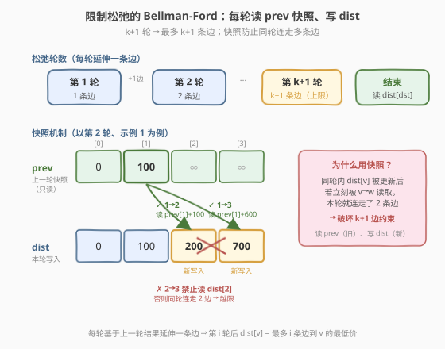
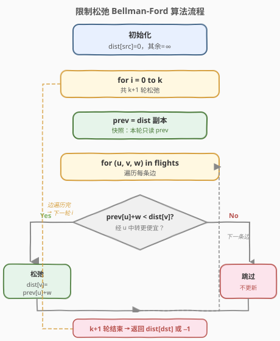
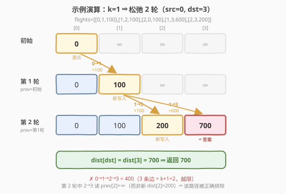

# K 站中转内最便宜的航班

- **题目名称**：K 站中转内最便宜的航班
- **链接**：[787. K 站中转内最便宜的航班](https://leetcode.cn/problems/cheapest-flights-within-k-stops/)
- **难度**：中等
- **标签**：图、最短路径、Bellman-Ford、动态规划

## 1. 题目概述

有 `n` 个城市通过若干航班连接。给定航班列表 `flights`，其中 `flights[i] = [from, to, price]` 表示从 `from` 到 `to` 的一趟航班，价格为 `price`。再给定起点 `src`、终点 `dst` 和整数 `k`，求从 `src` 到 `dst` 且**中转次数最多 `k` 次**的最便宜价格；若不存在这样的路线返回 `-1`。

> 💡 **「中转 `k` 次」=「最多经过 `k+1` 条边」**：每次中转意味着在中间城市换一趟航班，因此 `k` 次中转等价于路径上最多有 `k+1` 条边。这是本题区别于普通最短路的关键约束——不仅要便宜，还要「边数受限」。

**示例 1**：

```text
输入：n = 4, flights = [[0,1,100],[1,2,100],[2,0,100],[1,3,600],[2,3,200]], src = 0, dst = 3, k = 1
输出：700
解释：0 → 1 → 3 价格 100+600=700（中转 1 次，合法）。
      0 → 1 → 2 → 3 价格 100+100+200=400 更便宜，但中转 2 次超过 k=1，非法。
```

**示例 2**：

```text
输入：n = 3, flights = [[0,1,100],[1,2,100],[0,2,500]], src = 0, dst = 2, k = 1
输出：200
解释：0 → 1 → 2 价格 200（中转 1 次），比直达 0 → 2 的 500 更便宜。
```

**示例 3**：

```text
输入：n = 3, flights = [[0,1,100],[1,2,100],[0,2,500]], src = 0, dst = 2, k = 0
输出：500
解释：k=0 即不允许中转，只能直达 0 → 2，价格 500。
```

**约束条件**：

- `1 <= n <= 100`
- `0 <= flights.length <= n * (n - 1) / 2`
- `flights[i].length == 3`
- `0 <= from, to < n`，`from != to`
- `1 <= price <= 10^4`
- `0 <= src, dst, k < n`，`src != dst`
- 不存在重复航班，不存在自环

---

## 2. 解题思路

### 2.1 暴力思路：为什么普通 Dijkstra 不直接可行？

[743. 网络延迟时间](../0701-0800/743_网络延迟时间.md) 中，边权非负、无条数限制，用堆优化 Dijkstra 一次确定每个节点的最短路即可。但本题多了一条「**最多 `k+1` 条边**」的约束：

- 一条**价格更低但边数更多**的路径可能因超过 `k+1` 条边而**非法**；
- 一条**价格更高但边数更少**的路径反而**合法**且是答案。

> ⚠️ 也就是说，「价格最优」和「边数最优」会冲突。单纯按 `dist[城市]` 取最小的 Dijkstra 会过早锁定一个价格最低但边数已用满的状态，从而错过后续合法的更优解。

暴力做法是枚举所有边数 `≤ k+1` 的路径取最小价格，但路径数随 `k` 指数增长，必然超时。我们需要一种**按边数分层递推**的方法——这正是 **Bellman-Ford** 的本质。

### 2.2 核心观察：限制松弛轮数的 Bellman-Ford



Bellman-Ford 的经典结论是：**进行 `i` 轮松弛后，`dist[v]` 表示从源点出发、最多经过 `i` 条边到达 `v` 的最短距离**。因此只需跑 **`k+1` 轮**，得到的 `dist[dst]` 就是「最多 `k+1` 条边」约束下的最优价格。

**关键细节：每轮必须用上一轮的快照松弛**。如果在同一轮内，`u→v` 松弛后更新的 `dist[v]` 立刻被后续 `v→w` 读取，就会在本轮内连走两条边，破坏「每轮只延伸一条边」的语义，导致边数约束失效。

> 💡 **正确做法**：每轮开始时复制一份 `prev = dist`，松弛时**只读 `prev[u]`、只写 `dist[v]`**。这样一条边只能基于「上一轮结束时的状态」延伸，恰好保证每轮推进一条边。

递推式（`dp[i][v]` = 最多经过 `i` 条边到达 `v` 的最低价格）：

```text
dp[i][v] = min(dp[i-1][v],  min over (u→v) { dp[i-1][u] + w(u,v) })
```

即「要么不多走这条边（沿用 `i-1` 轮的值），要么从某个 `u` 经一条边过来」。滚动掉第一维后就是上面的 `prev/dist` 双数组写法。

### 2.3 算法流程图



### 2.4 示例演算

以示例 1 `flights = [[0,1,100],[1,2,100],[2,0,100],[1,3,600],[2,3,200]], src=0, dst=3, k=1` 为例，共进行 `k+1=2` 轮松弛。



| 轮次 | prev（上一轮 dist） | 松弛成功的边 | dist（本轮结果） | 含义 |
|------|---------------------|--------------|------------------|------|
| 初始 | — | dist[0]=0 | [0,∞,∞,∞] | 仅起点可达 |
| 第 1 轮 | [0,∞,∞,∞] | 0→1: 0+100=100 | [0,100,∞,∞] | 1 条边可达：0→1 |
| 第 2 轮 | [0,100,∞,∞] | 1→2: 100+100=200；1→3: 100+600=700 | [0,100,200,700] | 2 条边可达：0→1→2、0→1→3 |

> ⚠️ 第 2 轮中，`1→2` 松弛得到 `dist[2]=200`，但 `2→3` 读的是 **`prev[2]=∞`** 而非刚更新的 `dist[2]=200`，所以 `0→1→2→3`（3 条边）不会被错误地在本轮算出。这正是「快照松弛」防止越限的核心。两轮后 `dist[3]=700`，返回 `700`。

---

## 3. 参考代码

### C++

```cpp
class Solution {
  public:
    int findCheapestPrice(int n, vector<vector<int>>& flights,
                          int src, int dst, int k) {
        const int INF = INT_MAX / 2;
        vector<int> dist(n, INF);
        dist[src] = 0;

        // 最多 k+1 条边 → 松弛 k+1 轮
        for (int i = 0; i <= k; ++i) {
            vector<int> prev = dist;          // 快照：只读 prev
            for (auto& f : flights) {
                int u = f[0], v = f[1], w = f[2];
                if (prev[u] + w < dist[v]) {
                    dist[v] = prev[u] + w;    // 只写 dist
                }
            }
        }

        return dist[dst] >= INF ? -1 : dist[dst];
    }
};
```

### Python

```python
class Solution:
    def findCheapestPrice(self, n: int, flights: List[List[int]],
                          src: int, dst: int, k: int) -> int:
        INF = float('inf')
        dist = [INF] * n
        dist[src] = 0

        # 最多 k+1 条边 → 松弛 k+1 轮
        for _ in range(k + 1):
            prev = dist[:]                   # 快照：只读 prev
            for u, v, w in flights:
                if prev[u] + w < dist[v]:
                    dist[v] = prev[u] + w    # 只写 dist

        return dist[dst] if dist[dst] != INF else -1
```

> 💡 **不用邻接表也能跑**：Bellman-Ford 直接遍历边数组 `flights` 即可，每轮扫一遍所有边。用邻接表会减少无效扫描（只看可达 `u` 的出边），但总复杂度阶不变。本题 `n ≤ 100`、`E ≤ 4950`，直接扫边数组最简洁。

---

## 4. 复杂度分析

| 维度 | 复杂度 | 说明 |
|------|--------|------|
| 时间复杂度 | `O((k+1)·E)` | 共 `k+1` 轮，每轮遍历全部 `E` 条边做一次松弛 |
| 空间复杂度 | `O(n)` | `dist` 与每轮的 `prev` 快照各 `O(n)`；边数组为输入不算额外空间 |

> ⚠️ 注意与标准 Bellman-Ford `O(V·E)` 区别：标准版本跑 `V-1` 轮（保证收敛），而本题只跑 `k+1` 轮，复杂度与 `k` 而非 `n` 挂钩。当 `k` 远小于 `n` 时本题解法明显更快。

---

## 5. 扩展：Dijkstra 变体（带边数状态）

Bellman-Ford 是本题最直接的模板。也可用 **Dijkstra + 状态 `(城市, 已用边数)`**：把每个节点按「已走边数」拆成多层，堆里放 `(价格, 城市, 边数)`，弹出时若 `边数 > k+1` 则跳过。优势是能更早剪枝；劣势是实现更复杂，且需保证同一 `(城市, 边数)` 状态只处理一次。

| 方法 | 时间 | 适用场景 |
|------|------|----------|
| **Bellman-Ford（本题）** | `O(k·E)` | 边数受限最短路，模板简洁，面试首选 |
| Dijkstra + 边数状态 | `O(k·E log(k·n))` | 同题，常数大但可剪枝 |
| 标准 Bellman-Ford | `O(V·E)` | 单源、可含负权、无条数限制 |
| SPFA | 平均 `O(k·E)`，最坏 `O(V·E)` | 同 Bellman-Ford，易被卡 |

> 💡 本题边权全为正，若**没有 `k` 约束**就直接用 [743 的堆优化 Dijkstra](../0701-0800/743_网络延迟时间.md)；有了「最多 `k+1` 条边」的限制，Bellman-Ford 的「按轮分层」天然契合，是更优选择。

---

## 6. 面试要点

1. **「中转 `k` 次」对应几条边？**

   - `k` 次中转意味着中间停留 `k` 个城市，等价于路径上经过 `k+1` 条边。所以 Bellman-Ford 松弛 `k+1` 轮。

2. **为什么每轮要用 `prev` 快照？不用会怎样？**

   - 若同一轮内 `u→v` 更新了 `dist[v]` 后，`v→w` 立刻读取新的 `dist[v]`，就会在本轮连走两条边，破坏「每轮只延伸一条边」的语义，导致超出 `k+1` 条边的路径被错误计入。用 `prev` 快照保证「读旧写新」。

3. **Bellman-Ford 第 `i` 轮结束后 `dist[v]` 的含义？**

   - 从源点出发、**最多经过 `i` 条边**到达 `v` 的最短距离。注意是「最多」而非「恰好」——因为递推式中保留了 `dp[i-1][v]` 这一项（不多走边）。

4. **和标准 Bellman-Ford 的区别？**

   - 标准版本跑 `V-1` 轮以保证最短路在无负环时完全收敛；本题只跑 `k+1` 轮，是「提前停止」的受限版本，复杂度 `O(k·E)` 而非 `O(V·E)`。

5. **能否用普通 Dijkstra？**

   - 不能直接用。因为「价格最优」与「边数最优」会冲突：一个价格稍高但边数更少的状态可能才是合法答案，而 Dijkstra 会按价格过早锁定状态。需改用「(城市, 边数) 状态」的 Dijkstra 变体。

6. **为什么返回前要判断 `INF`？**

   - `k+1` 轮内可能根本无法从 `src` 到达 `dst`（图不连通或边数不够），此时 `dist[dst]` 仍为 `INF`，按题意返回 `-1`。

---

## 7. 同类练习题

- [743. 网络延迟时间](https://leetcode.cn/problems/network-delay-time/)（[题解](../0701-0800/743_网络延迟时间.md)）：堆优化 Dijkstra 单源最短路，无条数限制——对照理解何时用 Dijkstra、何时用 Bellman-Ford
- [1514. 概率最大的路径](https://leetcode.cn/problems/path-with-maximum-probability/)：Dijkstra 变体，把「最大概率」转成「最长路」
- [1928. 规定时间内到达终点的最小花费](https://leetcode.cn/problems/minimum-cost-to-reach-destination-in-time/)：带「时间上限」约束的最短路，状态 Dijkstra，思路与本题的「边数约束」同构
- [399. 除法求值](https://leetcode.cn/problems/evaluate-division/)（[题解](../0301-0400/399_除法求值.md)）：图上带权搜索，Floyd / DFS 求点对关系
