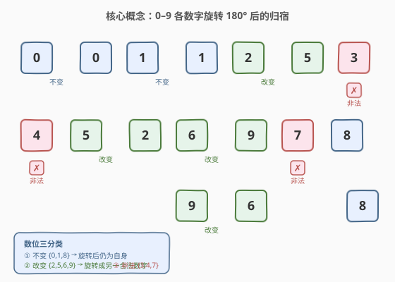
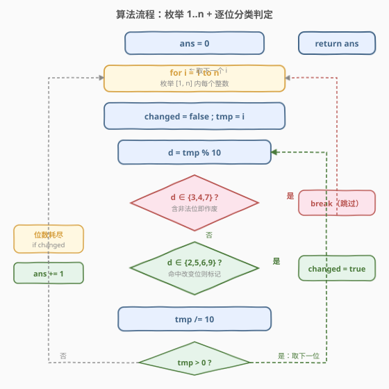
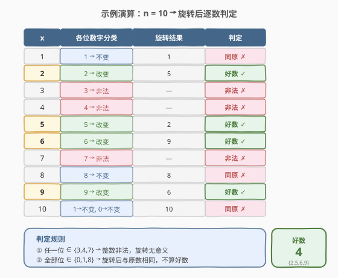

# 旋转数字

- **题目名称**：旋转数字
- **链接**：[788. 旋转数字](https://leetcode.cn/problems/rotated-digits/)
- **难度**：中等
- **标签**：数学、动态规划

## 1. 题目概述

我们称一个数 `X` 是**好数**：当且仅当把它每一位数字各自旋转 $180°$ 之后，整个数仍然是一个**合法**的数字，且**与原数不同**。

每一位数字旋转 $180°$ 的规则如下：

- `0`、`1`、`8` 旋转后**仍是自身**（不变）；
- `2` 与 `5`、`6` 与 `9` 旋转后**互变为对方**（改变）；
- `3`、`4`、`7` 旋转后**不是合法数字**（非法）。

> ⚠️ **「每一位」必须旋转**，不能选择性地保留某一位不动；只要有一位落在非法集合 `{3,4,7}`，整个数就作废。旋转是**按位原地替换**，数字顺序不变（不是把整个数物理翻转后再读）。

给定正整数 `n`，返回区间 `[1, n]` 内好数的个数。

**示例 1**：

```text
输入：n = 10
输出：4
解释：[1, 10] 内的好数有 2, 5, 6, 9。
  2 → 5（不同，合法）  5 → 2（不同，合法）
  6 → 9（不同，合法）  9 → 6（不同，合法）
  其余：1/8 旋转不变；3/4/7 非法；10 旋转后仍为 10。
```

**示例 2**：

```text
输入：n = 1
输出：0
解释：1 旋转后仍是 1，与原数相同，不算好数。
```

**示例 3**：

```text
输入：n = 857
输出：247
```

**约束条件**：

- $1 \le n \le 10^4$

> 💡 $n \le 10^4$ 意味着枚举每个数逐位判定的暴力法完全可行；但「数位分类」的观察可以把判定写得很干净，并能进一步推广为 $O(\log n)$ 的数位计数（见第 5 节）。

---

## 2. 解题思路

### 2.1 暴力思路

对区间 `[1, n]` 中的每个数 `x`，逐一检查其每一位数字 `d`：

1. 若某位 `d ∈ {3,4,7}` → 该数非法，立即判定非好数；
2. 若某位 `d ∈ {2,5,6,9}` → 标记「发生了改变」；
3. 扫完全部位后，只有「全程无非法位 **且** 至少出现一次改变位」的数才是好数。

由于 $n \le 10^4$，至多枚举 $10^4$ 个数，每个数至多 5 位，总运算量约 $5 \times 10^4$ 次取余——暴力枚举即为最优解的朴素版本。

> 💡 转机在于把「旋转结果」抽象成对**单个数位**的三分类，避免真正去构造旋转后的整数再比较——判定只需关心「是否含非法位」「是否含改变位」两个布尔量。

### 2.2 核心观察：数位三分类 + 两个布尔量



把 $0 \sim 9$ 按旋转结果分成三类：

| 分类 | 数字集合 | 旋转结果 | 对判定的影响 |
|------|----------|----------|--------------|
| **不变** | $\{0,1,8\}$ | 仍为自身 | 既不非法、也不改变——「安全但中性」 |
| **改变** | $\{2,5,6,9\}$ | 变成另一合法数字 | 「好数」的充要来源：至少出现一位即「不同」 |
| **非法** | $\{3,4,7\}$ | 不是数字 | 一票否决：出现即整个数作废 |

> 💡 **关键转化**：设 $S=\{0,1,8\}$（不变）、$C=\{2,5,6,9\}$（改变）、$I=\{3,4,7\}$（非法）。则
>
> $$\text{x 是好数} \iff (\text{x 的每一位} \notin I) \;\wedge\; (\text{x 至少有一位} \in C)$$
>
> 也就是说：**全程避开非法位**保证了「旋转后合法」，**至少命中一位改变位**保证了「与原数不同」。两个布尔量 `valid`（无非法位）与 `changed`（有改变位）即可完成判定，无需真正算出旋转后的数。

**等价的集合语言**：令合法旋转位集合 $V = S \cup C = \{0,1,2,5,6,8,9\}$。则

- 「旋转后合法」$\iff$ 每一位 $\in V$；
- 「旋转后与原数相同」$\iff$ 每一位 $\in S$；
- 故「合法且不同（即好数）」$=$ 「合法」$-$ 「合法且相同」$=$ 「每一位 $\in V$」$-$ 「每一位 $\in S$」。

这个「作差」视角正是第 5 节 $O(\log n)$ 数位计数的理论基础。

### 2.3 算法流程图



**完整步骤**：

1. **外层枚举** `for x = 1 to n`，`ans = 0`。
2. **对每个 x**：初始化 `changed = false`，用 `tmp = x` 遍历位数。
3. **逐位提取** `d = tmp % 10`，`tmp /= 10`：
   - 若 `d ∈ {3,4,7}` → `break`（该数作废，直接跳到下一个 x）；
   - 若 `d ∈ {2,5,6,9}` → `changed = true`；
   - 重复直到 `tmp == 0`。
4. **位数耗尽**后：若 `changed == true` → `ans += 1`。
5. 返回 `ans`。

> ⚠️ **`break` 的语义**：一旦遇到非法位，该数必非好数，无需继续看剩余位——这是「一票否决」的直接体现。而「改变位」只是累加标记，不能因命中一次就提前结束，因为后面可能藏着非法位（如 `23`：先见 `3`？实际从低位看是先见 `3` → 立即 break；从高位看先见 `2` 标记 changed，再见 `3` 才 break——两种顺序结论一致，都是「非好数」）。

### 2.4 示例演算

以 `n = 10` 为例，逐数推演：



| $x$ | 各位分类 | 旋转结果 | 判定 |
|-----|---------|---------|------|
| 1 | 1 → 不变 | 1 | 同原 ✗ |
| 2 | 2 → 改变 | 5 | 好数 ✓ |
| 3 | 3 → 非法 | — | 非法 ✗ |
| 4 | 4 → 非法 | — | 非法 ✗ |
| 5 | 5 → 改变 | 2 | 好数 ✓ |
| 6 | 6 → 改变 | 9 | 好数 ✓ |
| 7 | 7 → 非法 | — | 非法 ✗ |
| 8 | 8 → 不变 | 8 | 同原 ✗ |
| 9 | 9 → 改变 | 6 | 好数 ✓ |
| 10 | 1→不变, 0→不变 | 10 | 同原 ✗ |

10 个数中好数共 4 个：$\{2,5,6,9\}$，`ans = 4` ✓。

> 💡 **规律**：单位数中只有 $\{2,5,6,9\}$ 是好数；`10` 虽然两位都合法，但全部位都在不变集 $S$ 中，旋转后仍是 `10`，被「同原」规则排除。这印证了「合法」与「不同」是**两个独立的必要条件**。

---

## 3. 参考代码

### C++

```cpp
class Solution {
  public:
    int rotatedDigits(int n) {
        int ans = 0;
        for (int x = 1; x <= n; ++x) {
            if (isGood(x)) ++ans;
        }
        return ans;
    }

  private:
    bool isGood(int x) {
        bool changed = false;
        while (x) {
            int d = x % 10;
            if (d == 3 || d == 4 || d == 7) return false; // 非法位，一票否决
            if (d == 2 || d == 5 || d == 6 || d == 9) changed = true;
            x /= 10;
        }
        return changed; // 合法且至少一位改变 → 好数
    }
};
```

### Python

```python
class Solution:
    def rotatedDigits(self, n: int) -> int:
        def is_good(x: int) -> bool:
            changed = False
            while x:
                d = x % 10
                if d in (3, 4, 7):
                    return False       # 非法位，一票否决
                if d in (2, 5, 6, 9):
                    changed = True
                x //= 10
            return changed              # 合法且至少一位改变 → 好数

        return sum(1 for i in range(1, n + 1) if is_good(i))
```

> 💡 **两个实现细节**：
> 1. **用 `x` 本身遍历位数**：本题判定不需要保留原数（不像 [728. 自除数](../0701-0800/728_自除数.md) 要拿原数取余），直接 `x % 10` / `x /= 10` 即可，省一个副本变量。
> 2. **`return changed` 收尾**：循环正常结束意味着「全程无非法位」，此时好数与否完全取决于 `changed`——把它作为返回值，一行同时表达「合法」与「是否改变」两个语义，无需额外 `valid` 变量。Python 中整数除法务必用 `//`。

---

## 4. 复杂度分析

| 维度 | 复杂度 | 说明 |
|------|--------|------|
| 时间复杂度 | $O(n \log_{10} n)$ | 遍历 $n$ 个数，每个数检查至多 $\lfloor\log_{10} n\rfloor + 1$ 位；$n \le 10^4$ 时上界约 $5 \times 10^4$ 次取余 |
| 空间复杂度 | $O(1)$ | 仅 `changed`、`d` 等常数个变量 |

> 💡 由于一票否决的 `break`，大多数含非法位的数在前 1–2 位即被淘汰，实际运算量远小于上界。即便如此，当 $n$ 扩到 $10^9$ 时暴力法必然超时——此时需改用第 5 节的数位计数法，复杂度降至 $O(\log n)$。

---

## 5. 扩展：作差数位计数法（$O(\log n)$，适用于大 $n$）

若约束放宽到 $n \le 10^9$ 甚至更大，逐数枚举不再可行。利用 2.2 节的「作差」视角，可以把问题转化为**两次数位计数**：

$$\text{好数个数} = \underbrace{\text{count}(每\text{位} \in V)}_{A:\,\text{旋转合法}} - \underbrace{\text{count}(每\text{位} \in S)}_{B:\,\text{旋转合法且与原数相同}}$$

其中 $V=\{0,1,2,5,6,8,9\}$（$|V|=7$），$S=\{0,1,8\}$（$|S|=3$）。$A$ 统计「旋转后合法」的数，$B$ 统计其中「旋转后不变」的数，二者之差恰为「合法且变化」= 好数。

> 💡 **为什么作差成立**：好数集 = (合法集) ∖ (合法不变集)，且 (合法不变集) ⊆ (合法集)。由容斥原理，差集大小 $= |A| - |B|$。这里 $S \subseteq V$，故 $B \le A$，结果非负。

**数位计数 `count(limit, allowed)`**：统计 $[1, \text{limit}]$ 内「每一位都落在 `allowed` 集合」的正整数个数（`allowed` 含 $0$，但首位不能为 $0$）。把 `limit` 转成数字串后分两段统计：

1. **位数 $< m$ 的正整数**：长度 $L \in [1, m-1]$，首位取 `allowed \ {0}`（$k-1$ 种），其余 $L-1$ 位各 $k$ 种，共 $(k-1)\cdot k^{L-1}$ 个；
2. **位数恰为 $m$ 且 $\le \text{limit}$**：从高到低逐位「卡上界」——在位置 $i$ 选一个 $< d_i$ 且在 `allowed` 中的数字（首位还需 $\ne 0$），剩余位随意；若 $d_i$ 本身不在 `allowed` 则无法继续「卡紧」，提前 break。

```python
class Solution:
    def rotatedDigits(self, n: int) -> int:
        def count_allowed(limit, allowed):
            s = str(limit)
            m = len(s)
            k = len(allowed)
            cnt = 0
            # 段 1：位数少于 m 的正整数
            for L in range(1, m):
                cnt += (k - 1) * (k ** (L - 1))
            # 段 2：位数恰为 m 且 <= limit
            for i, ch in enumerate(s):
                di = int(ch)
                # 在位置 i 选 < di 的合法数字；首位还要排除 0
                less = sum(1 for a in allowed if a < di and (i > 0 or a != 0))
                cnt += less * (k ** (m - i - 1))
                if di not in allowed:   # 上界位本身不合法，无法继续卡紧
                    break
            else:
                cnt += 1                 # limit 本身各位都在 allowed 中
            return cnt

        valid = {0, 1, 2, 5, 6, 8, 9}    # 旋转后合法
        same = {0, 1, 8}                 # 旋转后不变
        return count_allowed(n, valid) - count_allowed(n, same)
```

**验证 `n = 10`**：

- $A = \text{count}(10, V)$：位数 1 的有 $\{1,2,5,6,8,9\}$ 共 6 个；位数 2 且 $\le 10$ 的只有 `10` 本身（首位 1 ∈ V，次位 0 ∈ V），共 1 个 → $A=7$；
- $B = \text{count}(10, S)$：位数 1 的有 $\{1,8\}$ 共 2 个；位数 2 且 $\le 10$ 的只有 `10` → $B=3$；
- $A - B = 4$ ✓，与示例一致。

> ⚠️ **首位不能为 0 的处理**：段 1 用 $k-1$ 排除首位 0；段 2 在 $i=0$ 处用 `i > 0 or a != 0` 排除首位 0。否则会把「首位为 0」的串误计为短位数，导致重复计数。这是数位计数题（如 [902. 最大为 N 的数字组合](https://leetcode.cn/problems/numbers-at-most-n-given-digit-set/)）的通用陷阱。

> 💡 本质上这是一种**数位 DP** 的退化形式——没有显式 `dp` 数组，只用「卡上界」逐位累乘。写成标准记忆化数位 DP（状态 `(pos, tight, lead_zero)`）可推广到更复杂的约束，如「旋转后恰好等于某值」等。

---

## 6. 面试要点

1. **为什么「不变位 `{0,1,8}`」单独成类，而不是并入合法集？**

   - 因为好数要求旋转后**与原数不同**。若一个数的每一位都在 `{0,1,8}`，旋转后仍等于原数（如 `11`、`101`、`88`），虽合法但「同原」，不算好数。必须区分「合法不变」与「合法改变」两类，前者要被排除。这正是 `changed` 标记存在的意义。

2. **遇到非法位 `{3,4,7}` 为什么要立即 `break`/`return false`？**

   - 题目规定「每一位必须旋转」，只要有一位旋转后不是数字，整个数就无意义。后续位无论怎样都无法挽回，提前终止既正确又省时。注意：这与「改变位命中一次即可」不同——改变位只是累加标记，不能因命中就停，因为后面可能藏着非法位。

3. **`return changed` 为什么能一行表达两个条件？**

   - `while` 循环正常结束（未 `return false`）隐含了「全程无非法位」= 合法。此时好数与否只取决于是否出现过改变位，即 `changed`。若循环中途 `return false`，则该数非法，根本走不到 `return changed`。所以 `changed` 为真 ⇔ 合法且有改变 ⇔ 好数，一行足矣。

4. **作差法 `A - B` 为什么正确？会不会出现 $B > A$？**

   - 因为 $S = \{0,1,8\} \subseteq V = \{0,1,2,5,6,8,9\}$，故「每一位 ∈ S」的数必满足「每一位 ∈ V」，即 $B \subseteq A$，恒有 $B \le A$。好数集 = (旋转合法) ∖ (旋转合法且不变) = $A \setminus B$，其大小恰为 $A - B$。容斥原理保证非负。

5. **数位计数里「首位不能为 0」为什么是陷阱？**

   - `0` 虽在 `allowed` 中（它是不变/合法位），但作为正整数的最高位会构成前导零，使实际位数变少。若不排除，段 1 会重复计数（把 `0X` 当作 $L$ 位数），段 2 会把 `0xxxx` 计为 $m$ 位数。统一处理：段 1 用 $k-1$，段 2 在 $i=0$ 处过滤掉 `a == 0`。

> 💡 **一句话总结**：旋转数字的核心是「**数位三分类**」——把 $0\sim9$ 分为不变/改变/非法三类，用 `changed` + `valid` 两个布尔量完成单数判定；进阶视角则是「合法集作差」`A − B`，把计数问题降为两次 $O(\log n)$ 数位计数。这个「分位 + 作差」范式可迁移到一切「按位性质计数」的题目。

---

## 7. 同类练习题

- [728. 自除数](https://leetcode.cn/problems/self-dividing-numbers/)（[题解](../0701-0800/728_自除数.md)）：同样是「逐位提取数字并按位判定」，含零短路 + 逐位取余模板，本题位提取的直接来源
- [902. 最大为 N 的数字组合](https://leetcode.cn/problems/numbers-at-most-n-given-digit-set/)：数位计数母题，「卡上界」逐位累乘 + 首位去零，本题第 5 节作差计数的模板出处
- [1012. 至少有 1 位重复的数字](https://leetcode.cn/problems/numbers-with-repeated-digits/)：「至少有一位满足性质」的经典作差——总数减去「各位互不重复」，与本题「合法减合法不变」同构
- [231. 2 的幂](https://leetcode.cn/problems/power-of-two/)（[题解](../0201-0300/231_2的幂.md)）：数位/位运算性质判定，对照「按位性质分类」的思路
- [9. 回文数](https://leetcode.cn/problems/palindrome-number/)（[题解](../0001-0100/9_回文数.md)）：逐位取余 + `n / 10` 截短的数字处理基本功，本题位提取模板即源于此
