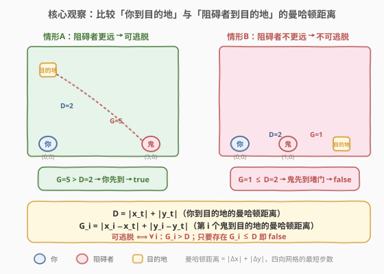
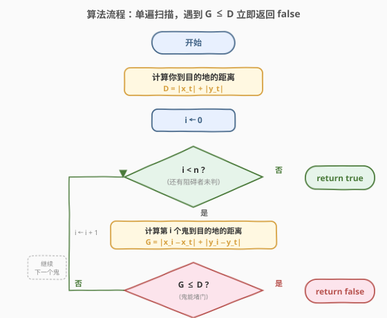
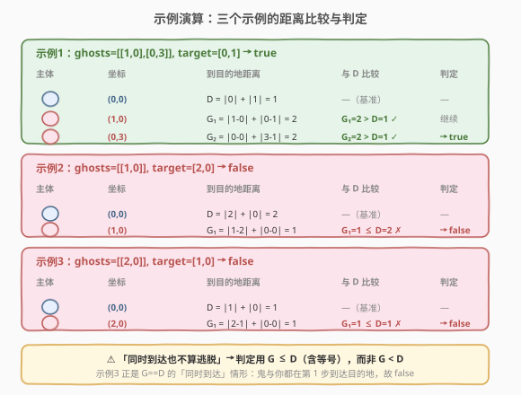

# 逃脱阻碍者

- **题目名称**：逃脱阻碍者
- **链接**：[789. 逃脱阻碍者](https://leetcode.cn/problems/escape-the-ghosts/)
- **难度**：中等
- **标签**：数组、数学、曼哈顿距离、贪心

## 1. 题目概述

你在进行一个简化版的吃豆人游戏。你从 `[0, 0]` 出发，目的地是 `target = [xtarget, ytarget]`。地图上有若干**阻碍者**（ghost），第 `i` 个阻碍者从 `ghosts[i] = [xi, yi]` 出发。所有坐标均为整数。

每一回合，你和所有阻碍者**同时**向东、西、南、北四个方向之一移动 1 个单位，也可以选择**不动**。如果你能在任何阻碍者抓住你**之前**到达目的地，则逃脱成功。**如果你和阻碍者同时到达同一位置（包括目的地），都不算逃脱成功**。

问：无论阻碍者如何移动，你是否都能成功逃脱？是则返回 `true`，否则 `false`。

**示例 1**：

```text
输入：ghosts = [[1,0],[0,3]], target = [0,1]
输出：true
解释：你一步即可到达 (0,1)；(1,0) 与 (0,3) 的阻碍者都来不及抓住你。
```

**示例 2**：

```text
输入：ghosts = [[1,0]], target = [2,0]
输出：false
解释：(1,0) 的阻碍者正卡在你与目的地 (2,0) 之间。
```

**示例 3**：

```text
输入：ghosts = [[2,0]], target = [1,0]
输出：false
解释：阻碍者与你同时到达目的地 (1,0)，不算逃脱。
```

**约束条件**：

- $1 \le \text{ghosts.length} \le 100$
- $\text{ghosts}[i].\text{length} == 2$
- $-10^4 \le x_i, y_i \le 10^4$
- 同一位置可能有**多个**阻碍者
- $\text{target.length} == 2$
- $-10^4 \le x_t, y_t \le 10^4$

> 💡 数据规模极小（$n \le 100$），看似可以模拟 BFS/搜索对抗，但真正考点是**用曼哈顿距离一步判定**，把「无限策略博弈」化解为「距离比较」。

---

## 2. 解题思路

### 2.1 暴力思路

把「你 vs 阻碍者」看成多智能体博弈：你在每一步选 5 种动作（四向或不动），每个阻碍者也独立选 5 种动作，状态空间随回合数与阻碍者数指数爆炸。即便用 BFS 搜索「你能否抢在所有阻碍者之前到目的地」，也需在每个时刻维护所有阻碍者位置，状态维度极高，且「阻碍者可任意行动」意味着要做最坏情况分析（minimax），实现极其复杂且对 $n=100$ 不可行。

> ⚠️ 暴力的根源：把「同时移动 + 任意策略」误解为需要模拟全部对抗过程。实际上**阻碍者的最优策略是确定的**——直奔目的地堵门，这使得博弈可被距离公式直接裁决。

### 2.2 核心观察：比较到目的地的曼哈顿距离



在四向网格上，从 $(x_1,y_1)$ 到 $(x_2,y_2)$ 的**最短步数**恰为曼哈顿距离 $|x_1-x_2| + |y_1-y_2|$（每步改变一维坐标 1 个单位）。记：

- $D = |x_t| + |y_t|$：**你**从起点 $(0,0)$ 到目的地的最短步数；
- $G_i = |x_i - x_t| + |y_i - y_t|$：第 $i$ 个阻碍者到目的地的最短步数。

**判定**：

$$\text{可逃脱} \;\iff\; \forall i:\; G_i > D$$

即只要**所有**阻碍者到目的地的距离都**严格大于**你的距离，就返回 `true`；只要存在某个 $G_i \le D$，就返回 `false`。

> 💡 **为什么比的是「到目的地的距离」而不是「到你的距离」？** 因为目的地是你唯一确定的终点。阻碍者要抓你，最高效的策略不是追你（你可能绕路），而是**直接去目的地堵门**——你迟早得到那里。于是博弈被简化为：「谁先到目的地」。

**两方向正确性**：

1. **若存在 $G_i \le D$ → 不可逃脱（返回 `false`）**。该阻碍者沿最短路直奔目的地，$G_i$ 步到达。由于 $G_i \le D$，它**不晚于你**到达目的地：若 $G_i < D$，它先到原地等待，你抵达即被抓住；若 $G_i = D$，与你同时到达，依题意「同时到达不算逃脱」。故必 `false`。

2. **若所有 $G_i > D$ → 可逃脱（返回 `true`）**。你走一条到目的地的最短路（长度 $D$）。设在第 $t$ 步（$0 \le t \le D$）你位于路径上的点 $P_t$，则 $\text{dist}(P_t, \text{target}) = D - t$。任一阻碍者若想在时刻 $t$ 抓住你，需满足 $\text{dist}(\text{ghost}_i, P_t) \le t$。由曼哈顿距离的**三角不等式**：

$$\text{dist}(\text{ghost}_i, P_t) + \text{dist}(P_t, \text{target}) \;\ge\; \text{dist}(\text{ghost}_i, \text{target}) = G_i$$

$$\Rightarrow\; \text{dist}(\text{ghost}_i, P_t) \;\ge\; G_i - (D - t) \;=\; G_i - D + t \;>\; t \quad(\text{因 } G_i > D)$$

   即阻碍者在第 $t$ 步**根本到不了** $P_t$，无法在路径任意点截杀你。你在第 $D$ 步抵达目的地时，所有阻碍者仍未到达（各自还需 $G_i - D > 0$ 步），逃脱成功。

> ⚠️ **三角不等式是关键**：它保证「阻碍者离目的地远」蕴含「阻碍者离你路径上每一点也都够远」，从而排除了「半路拦截」的可能。没有这一步，仅凭「鬼到目的地比你远」并不能直接排除拦截——例如鬼若在你路径中段可能更近。曼哈顿距离的三角不等式恰好封堵了这个反例。

### 2.3 算法流程图



单遍扫描即可：

1. **计算基准距离** $D = |x_t| + |y_t|$。
2. **遍历每个阻碍者** $[x_i, y_i]$，计算 $G_i = |x_i - x_t| + |y_i - y_t|$。
3. **逐个比较**：一旦发现 $G_i \le D$，立即返回 `false`（提前退出）。
4. **遍历结束未命中**：返回 `true`。

整个过程无排序、无额外数据结构，时间 $O(n)$、空间 $O(1)$。

### 2.4 示例演算



以三个官方示例对照：

| 示例 | `target` | $D$ | 阻碍者 | $G_i$ | 比较 | 结论 |
|------|----------|-----|--------|-------|------|------|
| 1 | $[0,1]$ | $\|0\|+\|1\|=1$ | $[1,0]$ | $\|1-0\|+\|0-1\|=2$ | $2>1$ ✓ | 继续 |
| 1 | $[0,1]$ | 1 | $[0,3]$ | $\|0-0\|+\|3-1\|=2$ | $2>1$ ✓ | **true** |
| 2 | $[2,0]$ | $\|2\|+\|0\|=2$ | $[1,0]$ | $\|1-2\|+\|0-0\|=1$ | $1\le 2$ ✗ | **false** |
| 3 | $[1,0]$ | $\|1\|+\|0\|=1$ | $[2,0]$ | $\|2-1\|+\|0-0\|=1$ | $1\le 1$ ✗ | **false** |

> 💡 **示例 3 是最易错的边界**：$G_i == D$ 即「同时到达」，依题意不算逃脱，故判定用 $\le$（含等号）而非 $<$。若误用 $G_i < D$，示例 3 会错判为 `true`。

---

## 3. 参考代码

### C++

```cpp
class Solution {
  public:
    bool escapeGhosts(vector<vector<int>>& ghosts, vector<int>& target) {
        int D = abs(target[0]) + abs(target[1]);          // 你到目的地的曼哈顿距离
        for (auto& g : ghosts) {
            int G = abs(g[0] - target[0]) + abs(g[1] - target[1]);
            if (G <= D) {                                  // 鬼能不晚于你到达目的地
                return false;
            }
        }
        return true;
    }
};
```

### Python

```python
class Solution:
    def escapeGhosts(self, ghosts: List[List[int]], target: List[int]) -> bool:
        D = abs(target[0]) + abs(target[1])                # 你到目的地的曼哈顿距离
        for g in ghosts:
            G = abs(g[0] - target[0]) + abs(g[1] - target[1])
            if G <= D:                                      # 鬼能不晚于你到达目的地
                return False
        return True
```

> ⚠️ **易错点**：判定条件是 `G <= D` 而非 `G < D`——「同时到达不算逃脱」，等号情形必须判 `false`。另外比较的是到**目的地**的距离，而非到**你当前位置**的距离，二者不要混淆。

---

## 4. 复杂度分析

| 维度 | 复杂度 | 说明 |
|------|--------|------|
| 时间 | $O(n)$ | 单遍遍历 `ghosts`，每个阻碍者做 4 次绝对值与几次加减比较，$O(1)$ |
| 空间 | $O(1)$ | 仅用 `D`、`G` 两个标量，无额外数据结构 |
| 提前退出 | 有 | 一旦发现 $G_i \le D$ 立即返回 `false`，最好情况 $O(1)$ |

> 💡 即便 $n$ 扩大到 $10^6$，本算法依然轻松通过；瓶颈只在读入数据。题目给 $n \le 100$ 主要是为了让「模拟博弈」的暴力写法不至于直接爆栈，但真正优雅解法与 $n$ 几乎无关。

---

## 5. 扩展：为什么「直奔目的地」是阻碍者的最优策略？

判定背后隐含一个博弈论事实：**阻碍者的最优策略就是走最短路到目的地**。可用极小化极大（minimax）视角说明：

- 你的目标是「到达目的地且不被抓住」；阻碍者的目标是「在你到达目的地前或同时抓住你」。
- 若某阻碍者能比你**不晚**到目的地（$G_i \le D$），它直接去目的地即可获胜——你无法绕开目的地，因为目的地是终判条件。
- 若所有阻碍者都比你**晚**到目的地（$G_i > D$），它们能否转而**半路拦截**？由 2.2 的三角不等式证明：不能。阻碍者到任意路径点的距离都严格大于你到该点的时间，拦截无门。

因此博弈的胜负**完全由「到目的地的距离」决定**，与中途路径选择无关。这正是「同时移动 + 任意策略」看似复杂、实则一锤定音的原因。

> 💡 **迁移思考**：这类「把多智能体博弈降维成距离比较」的套路，在 [289. 生命游戏](https://leetcode.cn/problems/game-of-life/) 的「同步更新」、[787. K 站中转内最便宜的航班](https://leetcode.cn/problems/cheapest-flights-within-k-stops/)（[题解](787_K站中转内最便宜的航班.md)）的「按轮松弛」中都有体现——核心是看清「同步性」带来的不变量，而非逐时刻模拟。

---

## 6. 面试要点

1. **为什么比较的是到目的地的距离，而不是到你的距离？**

   因为目的地是你唯一确定的终点，你迟早必须到达那里。阻碍者最高效的策略是直奔目的地堵门，而非追一个可能绕路的你。于是「谁能先到目的地」就足以裁决胜负，把无限策略博弈化为距离比较。

2. **为什么判定用 $G \le D$ 而非 $G < D$？**

   题目明确规定「你与阻碍者同时到达同一位置（包括目的地）都不算逃脱」。当 $G = D$ 时，阻碍者与你同时到达目的地，属「同时到达」，判 `false`。故必须用含等号的 $\le$。示例 3（$G=D=1$）正是测试这一边界。

3. **如何排除「阻碍者半路拦截」的可能？**

   用曼哈顿距离的三角不等式：$\text{dist}(\text{ghost}, P_t) \ge G - (D - t) > t$（当 $G > D$）。即在第 $t$ 步，你位于路径点 $P_t$ 时，阻碍者到 $P_t$ 的距离严格大于 $t$，根本来不及到达，无法拦截。没有这一步论证，「鬼离目的地远」并不能直接推出「鬼离你远」。

4. **曼哈顿距离为什么是四向网格的最短步数？**

   每步只能沿东/西/南/北移动 1 单位，即每步改变一维坐标 1 个单位。从 $(x_1,y_1)$ 到 $(x_2,y_2)$ 至少需要 $|x_1-x_2|$ 步消除横向差距、$|y_1-y_2|$ 步消除纵向差距，两者互不干扰可累加，故最短步数 $= |x_1-x_2| + |y_1-y_2|$。若允许对角移动则不再是曼哈顿距离。

5. **若阻碍者也可以「不动」，会影响判定吗？**

   不会。「不动」是阻碍者的一种可选动作，但它只会让阻碍者**更晚**到达目的地，对阻碍者而言是劣策略。我们分析的是「阻碍者采取最优策略（最短路直奔目的地）」这一最坏情况，阻碍者额外的不动选项不会让它更快抓到你，判定 $G > D$ 仍然充分。

---

## 7. 同类练习题

- [1030. 距离顺序排列矩阵单元格](https://leetcode.cn/problems/matrix-cells-in-distance-order/)：同样以曼哈顿距离为核心，按到给定点的距离排序所有网格点，巩固「四向网格 = 曼哈顿距离」的直觉
- [787. K 站中转内最便宜的航班](https://leetcode.cn/problems/cheapest-flights-within-k-stops/)（[题解](787_K站中转内最便宜的航班.md)）：同为「把同步/逐轮博弈降维」的图论最短路变体，对照理解「同步性带来的不变量」
- [1779. 找到最近的有相同 X 或 Y 坐标的点](https://leetcode.cn/problems/find-nearest-point-that-has-the-same-x-or-y-coordinate/)：用曼哈顿距离找最近点，巩固距离公式的直接比较写法
- [289. 生命游戏](https://leetcode.cn/problems/game-of-life/)：同步更新所有细胞状态，与本题「你与阻碍者同时移动」共享「同步性」思维，对照「不变量优先于逐时刻模拟」
