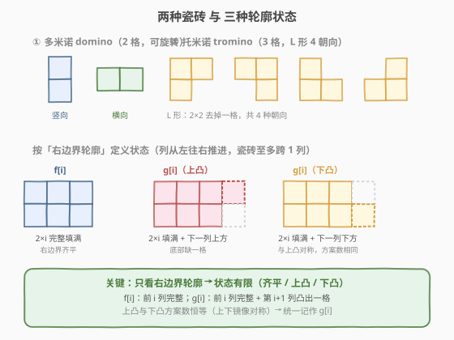
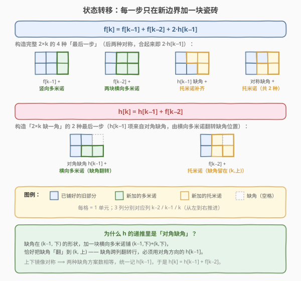
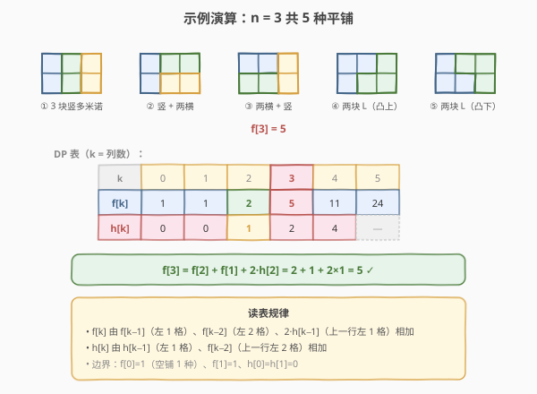

# 多米诺和托米诺平铺

- **题目名称**：多米诺和托米诺平铺
- **链接**：[790. 多米诺和托米诺平铺](https://leetcode.cn/problems/domino-and-tromino-tiling/)
- **难度**：中等
- **标签**：动态规划

## 1. 题目概述

有两种形状的瓷砖：一种是 $2 \times 1$ 的**多米诺**形（可旋转为竖向 / 横向），另一种是形如 "L" 的**托米诺**形（占 3 格，可旋转为 4 种朝向）。给定整数 `n`，返回可以平铺 $2 \times n$ 面板的方法数量，答案对 $10^9 + 7$ 取模。

**平铺**指的是每个正方形都必须有瓷砖覆盖。两个平铺不同，当且仅当面板上存在两个相邻单元，恰好被一个平铺的同一块瓷砖同时占据、而另一个平铺没有。

**示例 1**：

```text
输入：n = 3
输出：5
解释：五种不同的方法如题目图所示。
```

**示例 2**：

```text
输入：n = 1
输出：1
```

**约束条件**：

- `1 <= n <= 1000`

---

## 2. 解题思路

### 2.1 暴力思路

从第 1 列开始逐列尝试所有瓷砖摆放方式，DFS 搜索所有合法铺法。由于每个空格都有多种填法分支，方案数随 $n$ 指数增长（实际上 $f[n]$ 增长接近 $2^n$），$n=1000$ 时必然超时且会爆 `long long`。需要找到**子结构**做 DP。

### 2.2 核心观察：按右边界轮廓定义状态

把 $2 \times n$ 看作从左到右逐列推进。每块瓷砖至多横跨 2 列，因此**只需关心最右边界那一列的轮廓**——它是「齐平」还是「凸出一格」。轮廓确定后，左边如何铺的具体方案数已经被压缩成一个计数，后续决策只依赖这个轮廓，与具体铺法无关（最优子结构 / 无后效性）。

由此定义两个状态：

- $f[i]$：前 $i$ 列**完整填满**（右边界齐平）的方案数。答案即 $f[n]$。
- $h[i]$：前 $i$ 列填满后、**第 $i$ 列缺一个角**（即 $2 \times i$ 缺右上一格，缺右下一格对称、方案数相同）的方案数。



上图给出关键直觉：

- 多米诺占 2 格（竖 / 横），托米诺占 3 格（L 形 4 朝向）。
- 右边界只有 3 种轮廓：**齐平**（$f$）、**上凸**、**下凸**。上下凸互为镜像，方案数恒等，统一记作 $h$。

> 💡 **这是「轮廓线 DP」的入门典范**：瓷砖铺类问题几乎都用「按列推进 + 右边界轮廓做状态」的套路。本题轮廓只有 3 种，状态极简；若瓷砖更复杂（如俄罗斯方块），轮廓会变成一整列的位掩码（状压 DP），但思想一致。

### 2.3 算法流程图：每一步只在新边界加一块瓷砖



由上图可读出两条递推：

**构造完整 $f[k]$ 的 4 种「最后一步」**（后两种对称，合起来即 $2 \cdot h[k-1]$）：

1. $f[k-1]$ + 一块**竖向多米诺**填第 $k$ 列；
2. $f[k-2]$ + 两块**横向多米诺**填第 $k-1,k$ 列；
3. $h[k-1]$（缺角）+ 一块**托米诺**补齐缺角并填满第 $k$ 列；
4. 对称缺角 + 一块**托米诺**（镜像，第 3 种的上下翻转）。

$$f[k] = f[k-1] + f[k-2] + 2 \cdot h[k-1]$$

**构造缺角 $h[k]$ 的 2 种「最后一步」**：

1. 对角缺角 $h[k-1]$ + 一块**横向多米诺**——把缺角从第 $k-1$ 列「翻」到第 $k$ 列（缺角跨列时行会翻转，故必须用对角方向的 $h[k-1]$，由对称性其计数等于同向 $h[k-1]$）；
2. $f[k-2]$ + 一块**托米诺**，直接把缺角留在第 $k$ 列。

$$h[k] = h[k-1] + f[k-2]$$

> ⚠️ **易错点**：$h$ 递推里的 $h[k-1]$ 项看似「同向缺角延伸」，实则来自**对角缺角**——同向缺角缺的那格没有空邻居，无法只加一块瓷砖补上。横向多米诺在铺满一行时会把缺角翻到另一行的下一列。这正是 $h$ 递推里 $f$ 取 $k-2$、而 $h$ 取 $k-1$（对角）的根因。图右下绿色注释详细说明了这一点。

**边界**：$f[0] = 1$（空铺算 1 种）、$f[1] = 1$（一块竖多米诺）、$h[0] = h[1] = 0$（单格无法放任何瓷砖）。

### 2.4 示例演算

以 $n = 3$ 为例，5 种平铺与 DP 表如下：



读表验证 $f[3]$：

| k | f[k] | h[k] | 说明 |
|---|------|------|------|
| 0 | 1 | 0 | 空铺 1 种；单格不可铺 |
| 1 | 1 | 0 | 一块竖多米诺 |
| 2 | 2 | 1 | 两竖 / 两横；缺角为一块 L 托米诺 |
| 3 | 5 | 2 | $f[3]=f[2]+f[1]+2h[2]=2+1+2=5$ ✓ |
| 4 | 11 | 4 | $f[4]=f[3]+f[2]+2h[3]=5+2+4=11$ |

$$f[3] = f[2] + f[1] + 2 \cdot h[2] = 2 + 1 + 2 \times 1 = 5 \quad \checkmark$$

---

## 3. 参考代码

### C++

```cpp
class Solution {
  public:
    int numTiling(int n) {
        const int MOD = 1e9 + 7;
        if (n == 1) return 1;
        long long f0 = 1, f1 = 1;          // f[0], f[1]
        long long h0 = 0, h1 = 0;          // h[0], h[1]
        for (int k = 2; k <= n; k++) {
            long long fk = (f1 + f0 + 2 * h1) % MOD;   // f[k] = f[k-1] + f[k-2] + 2*h[k-1]
            long long hk = (h1 + f0) % MOD;            // h[k] = h[k-1] + f[k-2]
            f0 = f1; f1 = fk;
            h0 = h1; h1 = hk;
        }
        return (int)f1;
    }
};
```

### Python

```python
class Solution:
    def numTiling(self, n: int) -> int:
        MOD = 10 ** 9 + 7
        if n == 1:
            return 1
        f0, f1 = 1, 1          # f[0], f[1]
        h0, h1 = 0, 0          # h[0], h[1]
        for k in range(2, n + 1):
            fk = (f1 + f0 + 2 * h1) % MOD    # f[k] = f[k-1] + f[k-2] + 2*h[k-1]
            hk = (h1 + f0) % MOD             # h[k] = h[k-1] + f[k-2]
            f0, f1 = f1, fk
            h0, h1 = h1, hk
        return f1
```

> 💡 用 4 个滚动变量代替整个 `f`/`h` 数组，空间降到 $O(1)$。每步先算 `fk`、`hk` 再平移，注意 `fk` 依赖旧的 `f0/f1/h1`，`hk` 依赖旧的 `h1/f0`，二者都用更新前的值，故不可先覆盖 `f0`。

---

## 4. 复杂度分析

| 维度 | 复杂度 | 说明 |
|------|--------|------|
| 时间复杂度 | $O(n)$ | 单层循环 2→n，每轮常数次加法与取模 |
| 空间复杂度 | $O(1)$ | 仅 4 个滚动变量；若保留全表则为 $O(n)$ |

> ⚠️ 必须每步取模。$f[n]$ 增长近似 $\lambda^n$（$\lambda \approx 1+\sqrt{2} \approx 2.414$），$n=1000$ 时位数极多，不取模会溢出。

---

## 5. 扩展：消元成单变量递推

两条递推可以消去 $h$，得到只含 $f$ 的三阶递推。由 $h[k] = h[k-1] + f[k-2]$ 与 $f[k] = f[k-1] + f[k-2] + 2h[k-1]$ 作差：

$$f[k] - f[k-1] = f[k-2] + 2h[k-1], \quad f[k-1] - f[k-2] = f[k-3] + 2h[k-2]$$

两式相减，并用 $h[k-1] - h[k-2] = f[k-3]$，化简得：

$$\boxed{\,f[k] = 2 f[k-1] + f[k-3]\,} \quad (k \ge 3)$$

边界 $f[0]=1, f[1]=1, f[2]=2$。验证：$f[3] = 2f[2] + f[0] = 4 + 1 = 5$ ✓；$f[4] = 2f[3] + f[1] = 10 + 1 = 11$ ✓。

```python
def numTiling(self, n: int) -> int:
    MOD = 10 ** 9 + 7
    if n <= 2:
        return n            # f[0]=1, f[1]=1, f[2]=2
    a, b, c = 1, 1, 2       # f[0], f[1], f[2]
    for _ in range(3, n + 1):
        a, b, c = b, c, (2 * c + a) % MOD    # f[k] = 2*f[k-1] + f[k-3]
    return c
```

> 💡 单变量递推更短，但**几何直觉丢失**。面试时建议先讲双状态 $f/h$ 版本（能解释清楚每块瓷砖的贡献），再作为化简展示三阶递推——既体现推导能力，又证明你真懂转移的来源。

---

## 6. 面试要点

1. **为什么按「右边界轮廓」做状态？**
   - 瓷砖至多跨 2 列，右边界轮廓决定了后续能放什么。轮廓一确定，左侧具体铺法不影响未来决策（无后效性），故可把方案数压缩成计数做 DP。这是所有铺砖题的通用思路。

2. **$h[i]$ 到底代表什么？为什么不是 $h[i-1]$ 直接延伸？**
   - $h[i]$ 是「$2 \times i$ 缺右上一角」的方案数（缺右下对称）。递推里 $h[k] = h[k-1] + f[k-2]$ 的 $h[k-1]$ 项来自**对角缺角**：缺角在 $(k-1,\text{下})$ 时，加一块横向多米诺铺 $(k-1,\text{下})+(k,\text{下})$，缺角翻到 $(k,\text{上})$。同向缺角缺的那格没有空邻居，无法只加一块瓷砖补齐。

3. **$f[k]$ 里为什么是 $2 \cdot h[k-1]$？**
   - 缺角有上、下两种对称位置，每种都能用一块托米诺补齐到完整 $f[k]$。上下方案数相等（镜像对称），故贡献 $2 \cdot h[k-1]$。

4. **边界为什么 $f[0]=1$？**
   - 「什么都不铺」也是一种合法铺法（空铺），计数为 1。这保证 $f[2] = f[1]+f[0]+2h[1] = 1+1+0 = 2$ 正确。若令 $f[0]=0$ 会全错。

5. **取模有哪些坑？**
   - 每次加法后立即取模；$2 \cdot h[k-1]$ 要先取模再乘 2 再取模。用 `long long` / Python 大整数避免中间溢出。$n=1000$ 时答案约 $\lambda^{1000}$，不取模位数上千。

---

## 7. 同类练习题

- [70. 爬楼梯](https://leetcode.cn/problems/climbing-stairs/)（[题解](../0001-0100/70_爬楼梯.md)）：最朴素的「末步加一块」一维 DP，本题 $f$ 递推的精神源头
- [62. 不同路径](https://leetcode.cn/problems/unique-paths/)：网格计数 DP，状态转移同样来自「最后一步从哪来」
- [96. 不同的二叉搜索树](https://leetcode.cn/problems/unique-binary-search-trees/)（[题解](../0001-0100/96_不同的二叉搜索树.md)）：卡塔拉尼数计数，与本题同为「分步构造 + 子结构计数」
- [1139. 最大的以 1 为边界的正方形](https://leetcode.cn/problems/largest-1-bordered-square/)：网格上按边界轮廓做预处理的另一思路
- [LCP 69. Hello LeetCode!](https://leetcode.cn/problems/Hello-LeetCode/)：更复杂的铺砖/轮廓线状压 DP 进阶
