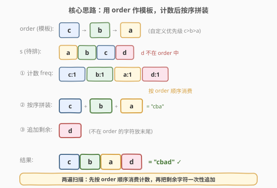
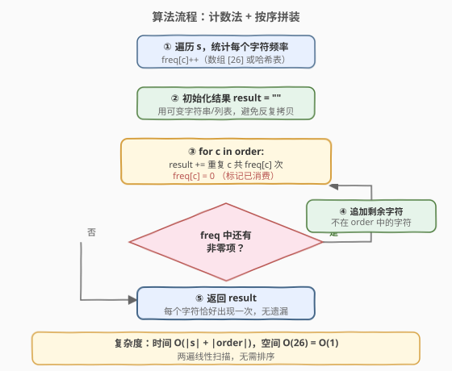
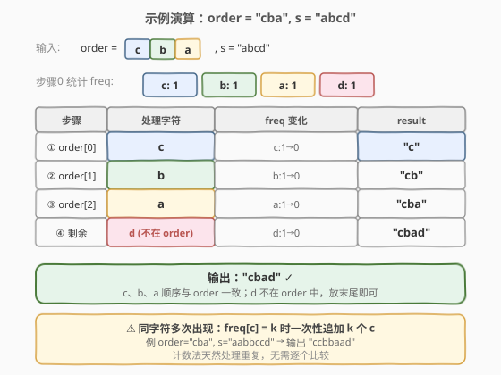

# LeetCode 自定义字符串排序 题解

## 1. 题目概述

- **标题 / 题号**：自定义字符串排序（#791，medium）
- **链接**：https://leetcode.cn/problems/custom-sort-string/
- **难度**：中等
- **标签**：哈希表、字符串、排序、计数

**题意**：给定两个字符串 `order` 和 `s`。`order` 的所有字母都是**唯一**的，并且预先按照某种**自定义顺序**排序。要求对 `s` 的字符进行置换，使其与 `order` 的排序相匹配：若 `order` 中字符 `x` 出现在字符 `y` 之前，则排列结果中 `x` 也应出现在 `y` 之前。返回满足该性质的 `s` 的**任意一种**排列。

> ⚠️ `s` 中可能存在 `order` 中未出现的字符，这些字符的相对位置**不受约束**，可放在结果任意位置（通常放末尾）。

**示例 1**：

```text
输入：order = "cba", s = "abcd"
输出："cbad"
解释："a"、"b"、"c" 在 order 中出现，按 order 顺序应排成 "c"、"b"、"a"。
     "d" 不在 order 中，可放任意位置，"dcba"、"cdba"、"cbda" 也都合法。
```

**示例 2**：

```text
输入：order = "bcafg", s = "abcd"
输出："bcad"
解释："b"、"c"、"a" 决定顺序，"d" 不在 order 中放末尾即可。
```

**约束**：

- `1 <= order.length <= 26`
- `1 <= s.length <= 200`
- `order` 和 `s` 仅由小写英文字母组成
- `order` 中的所有字符**互不相同**

## 2. 解题思路

### 2.1 暴力思路

最朴素的方案是生成 `s` 的所有排列，逐一检查是否符合 `order` 定义的偏序关系。排列数为 $n!$，每次校验 $O(n)$，总复杂度 $O(n! \cdot n)$，对 `n = 200` 完全不可行。

退一步：把 `order` 转成「优先级表」`rank[c] = c 在 order 中的下标`，对 `s` 直接调用库排序，传入按 `rank` 比较的自定义比较器。这是可行的，但带来 $O(n \log n)$ 的排序开销，且未利用**字符集极小**（仅 26 个小写字母）这一关键性质。

> 💡 暴力的核心痛点：把问题当成「一般排序」处理，而忽视了「优先级种类数 $k \leq 26$」这一极小常数——这意味着可以用**计数**代替**比较**，把 $O(n \log n)$ 降到 $O(n)$。

### 2.2 核心观察：计数 + 按 order 顺序拼装



关键观察是**两步走**：

1. **`order` 是模板**：`order` 已经告诉我们「哪些字符要先放、哪些后放」。只需按 `order` 的顺序逐个「消费」字符即可，**无需比较**。
2. **计数代替比较**：先遍历 `s` 统计每个字符的出现次数 `freq`。随后按 `order` 顺序，对每个字符 `c` 一次性把 `freq[c]` 个 `c` 追加到结果——这就等价于「按自定义顺序排好了序」。

**不在 `order` 中的字符怎么办？** 题目允许它们放任意位置，最简单是等 `order` 扫完后，把 `freq` 中剩余的非零字符一次性追加到末尾（它们之间无相对顺序要求）。

> 💡 这本质上是**桶排序 / 基数排序**的简化版：每个字符是一个「桶」，桶的输出顺序由 `order` 决定。由于桶数 $\leq 26$，整体复杂度被压到线性。

### 2.3 算法流程图



整体流程：

1. 遍历 `s`，统计每个字符频率 `freq[c]`（数组 `[26]` 或哈希表）。
2. 初始化空结果 `result`（用可变字符串/列表，避免反复拷贝）。
3. **按 `order` 顺序**遍历每个字符 `c`：把 `c` 重复 `freq[c]` 次追加到 `result`，并将 `freq[c]` 置 0（标记已消费）。
4. 扫描 `freq` 中剩余非零项（即不在 `order` 中的字符），按任意顺序追加到 `result`。
5. 返回 `result`。

### 2.4 示例演算



以 `order = "cba"`、`s = "abcd"` 为例：

| 步骤 | 处理字符 | freq 变化 | result |
|------|---------|----------|--------|
| 步骤 0 | 统计 freq | `c:1, b:1, a:1, d:1` | `""` |
| ① order[0] | `c` | `c:1→0` | `"c"` |
| ② order[1] | `b` | `b:1→0` | `"cb"` |
| ③ order[2] | `a` | `a:1→0` | `"cba"` |
| ④ 剩余 | `d`（不在 order） | `d:1→0` | `"cbad"` ✓ |

**重复字符示例**：`order = "cba"`、`s = "aabbccd"`，统计得 `a:2, b:2, c:2, d:1`，按 order 顺序消费：`c` 追加 2 个、`b` 追加 2 个、`a` 追加 2 个，最后追加 `d`，结果 `"ccbbaad"`。计数法天然处理重复，无需逐个比较。

> 💡 计数法的优势在重复字符上体现得最明显：`freq[c] = k` 时一次性追加 `k` 个 `c`，省去 `k` 次独立比较。

## 3. 参考代码

### 方法一：计数法 + 按 order 顺序拼装（推荐）

### C++

```cpp
class Solution {
  public:
    string customSortString(string order, string s) {
        int freq[26] = {0};
        for (char c : s) freq[c - 'a']++;

        string result;
        result.reserve(s.size());

        // 按 order 顺序消费
        for (char c : order) {
            result.append(freq[c - 'a'], c);
            freq[c - 'a'] = 0;
        }

        // 追加不在 order 中的剩余字符
        for (int i = 0; i < 26; i++) {
            if (freq[i] > 0) result.append(freq[i], 'a' + i);
        }
        return result;
    }
};
```

### Python

```python
class Solution:
    def customSortString(self, order: str, s: str) -> str:
        freq = Counter(s)

        result = []
        # 按 order 顺序消费
        for c in order:
            if freq[c] > 0:
                result.append(c * freq[c])
                freq[c] = 0

        # 追加不在 order 中的剩余字符
        for c, cnt in freq.items():
            if cnt > 0:
                result.append(c * cnt)

        return "".join(result)
```

> ⚠️ Python 中 `Counter` 遍历 `order` 时若 `c` 不在 `freq` 中会返回 0，无需额外判空；但显式 `if freq[c] > 0` 更清晰且避免生成空字符串。C++ 用 `string::append(count, char)` 一次性追加多个字符，比循环 `+=` 更高效。`result.reserve(s.size())` 预分配避免扩容拷贝。

## 4. 复杂度分析

| 维度 | 复杂度 | 说明 |
|------|--------|------|
| 时间复杂度 | $O(|s| + |\text{order}|)$ | 统计 `s` 一遍 $O(|s|)$；按 `order` 拼装最多遍历 $|\text{order}|$ 个桶；扫剩余字符 $O(26)$ |
| 空间复杂度 | $O(26) = O(1)$ | 频率表固定 26 项（不计返回结果所需空间） |

> 💡 由于字符集仅为 26 个小写字母，$|\text{order}| \leq 26$，$|\text{order}| + 26$ 是常数级开销，整体可视为 $O(|s|)$。若字符集扩大（如 Unicode），则频率表规模随字符种类数增长，但算法结构不变。

## 5. 扩展：自定义比较器排序法

若不关心极致效率、或想用库排序的稳定性，可把 `order` 转成「优先级表」，对 `s` 排序：

### C++

```cpp
class Solution {
  public:
    string customSortString(string order, string s) {
        int rank[26];
        for (int i = 0; i < 26; i++) rank[i] = 26; // 不在 order 中的字符优先级最低
        for (int i = 0; i < order.size(); i++) rank[order[i] - 'a'] = i;

        sort(s.begin(), s.end(), [&](char a, char b) {
            return rank[a - 'a'] < rank[b - 'a'];
        });
        return s;
    }
};
```

### Python

```python
class Solution:
    def customSortString(self, order: str, s: str) -> str:
        rank = {c: i for i, c in enumerate(order)}
        # 不在 order 中的字符赋予大 rank，排到末尾
        return "".join(sorted(s, key=lambda c: rank.get(c, len(order))))
```

**两种方法对比**：

| 维度 | 计数法 | 比较器法 |
|------|--------|---------|
| 时间 | $O(|s| + |\text{order}|)$ ≈ $O(|s|)$ | $O(|s| \log |s|)$ |
| 空间 | $O(26)$ | $O(26)$（rank 表） |
| 实现复杂度 | 两遍扫描，逻辑清晰 | 一行 `sorted`，最简洁 |
| 可迁移性 | 桶排序思想，可迁移到[767. 重构字符串](../0701-0800/767_重构字符串.md)等频率问题 | 通用比较器模板，适合任意偏序 |

> 💡 面试中两种都值得提及：计数法展示「利用字符集小常数」的优化意识，比较器法展示「抽象偏序为 rank 表」的通用思路。当 $|s| = 200$ 时两者实际都很快，差异可忽略；当 $|s|$ 达到 $10^6$ 时计数法优势显著。

## 6. 面试要点

1. **为什么计数法比排序更优？**

   - 字符集仅 26 种，优先级种类数 $k \leq 26$ 是极小常数。排序需 $O(n \log n)$ 次比较，而计数法把「比较」替换为「按桶输出」，每个字符只被访问常数次，复杂度降到 $O(n)$。

2. **不在 order 中的字符如何处理？**

   - 题目允许它们放任意位置。最简单是扫完 `order` 后，把 `freq` 中剩余非零字符追加到结果末尾；也可在排序法中给它们赋一个大于所有 `order` rank 的值，使其自然排到末尾。

3. **`order` 中字符唯一这一条件如何利用？**

   - 唯一性保证 `rank[c]` 是单值映射，没有歧义；也保证按 `order` 顺序消费时每个桶只被访问一次。若 `order` 有重复，需先去重或定义「首次出现位置」为 rank。

4. **计数法为什么天然支持重复字符？**

   - `freq[c] = k` 时一次性追加 `k` 个 `c`，等价于把同一桶里的 `k` 个元素整体输出。排序法通过稳定排序也能保持同字符的原始相对顺序，但计数法直接用乘法 `c * k` 更高效。

5. **和[451. 根据字符出现频率排序](https://leetcode.cn/problems/sort-characters-by-frequency/)的区别？**

   - 451 按「频率降序」排列字符，排序键是**频率**；791 按 `order` 的**自定义顺序**排列，排序键是**位置**。两者都用计数/桶思想，但键的来源不同：451 的键需统计后才知道，791 的键由 `order` 直接给出。

## 同类练习题

| # | 题目 | 与本题的关联 |
|---|------|-------------|
| 767 | [重构字符串](https://leetcode.cn/problems/reorganize-string/)（[题解](../0701-0800/767_重构字符串.md)） | 同样用频率表 + 按序拼装思想，增加「不相邻」约束 |
| 451 | [根据字符出现频率排序](https://leetcode.cn/problems/sort-characters-by-frequency/) | 按频率降序排字符，桶排序的简化版 |
| 1365 | [有多少小于当前数字的数字](https://leetcode.cn/problems/how-many-numbers-are-smaller-than-the-current-number/) | 值域小（≤100），计数前缀和代替排序 |
| 1122 | [数组的相对排序](https://leetcode.cn/problems/relative-sort-array/) | 与本题完全同构，只是输入是数组而非字符串，`arr2` 即 `order` |
| 274 | [H 指数](https://leetcode.cn/problems/h-index/) | 值域计数思想，用桶代替排序求最值 |
