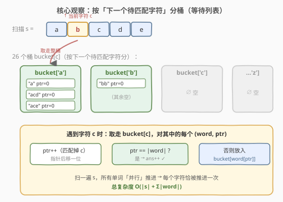
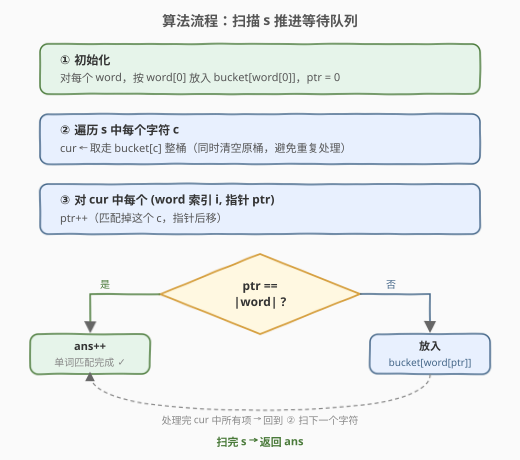

# LeetCode 匹配子序列的单词数 题解

## 1. 题目概述

- **标题 / 题号**：匹配子序列的单词数（#792，medium）
- **链接**：https://leetcode.cn/problems/number-of-matching-subsequences/
- **难度**：中等
- **标签**：字典、字符串、子序列匹配、桶分组

**题意**：给定字符串 `s` 和字符串数组 `words`，返回 `words[i]` 中是 `s` 的**子序列**的单词个数。

**子序列**是从原字符串中删除一些（也可以不删除）字符后、不改变剩余字符相对顺序得到的新字符串。例如 `"ace"` 是 `"abcde"` 的子序列。

**示例 1**：

```text
输入：s = "abcde", words = ["a","bb","acd","ace"]
输出：3
解释："a"、"acd"、"ace" 都是 "abcde" 的子序列；
     "bb" 需要 s 中有两个 'b'，但 s 只有一个，不匹配。
```

**示例 2**：

```text
输入：s = "dsahjpjauf", words = ["ahjpjau","ja","ahbwzgqnuk","tnmlanowax"]
输出：2
解释："ahjpjau" 与 "ja" 是 s 的子序列。
```

**约束**：

- $1 \le \text{s.length} \le 5 \times 10^4$
- $1 \le \text{words.length} \le 5000$
- $1 \le \text{words[i].length} \le 50$
- `words[i]` 和 `s` 都只由小写字母组成

> 💡 本题正是 [392. 判断子序列](../0301-0400/392_判断子序列.md) 的**进阶批量版**：把「判定单个 `s` 是否为 `t` 的子序列」升级为「对同一个 `t` 判定 5000 个 `s`」。若对每个单词独立套用 392 的双指针，会反复扫 `s`，最高 $5000 \times 5\times10^4 = 2.5\times10^8$ 次比较，常数大就会超时。核心在于**复用对 `s` 的一次遍历**，让所有单词「并行」匹配。

## 2. 解题思路

### 2.1 暴力思路

对每个 `word`，套用 392 的双指针：指针 `i` 扫 `word`、`j` 扫 `s`，匹配则 `i++`，无论如何 `j++`，最后看 `i` 是否走完 `word`。单次 $O(|word| + |s|)$，总计 $O(\sum|word| + |\text{words}|\cdot|s|)$。当 $|s| = 5\times10^4$、$|\text{words}| = 5000$ 时，主要开销 $2.5\times10^8$，常数大即 TLE。

### 2.2 核心观察：按「下一个待匹配字符」分桶——所有单词并行匹配



关键洞察是：**`s` 只需扫一遍**。把每个单词看作一个「正在等待某个字符出现」的顾客——它当前指针指向 `word[ptr]`，就在等 `s` 里下一个等于 `word[ptr]` 的字符。

于是维护 **26 个桶** `bucket[c]`（$c \in$ `'a'..'z'`），`bucket[c]` 装着所有「当前正等字符 `c`」的单词（连同它们已匹配到的指针位置 `ptr`）：

1. **初始化**：每个 `word` 按 `word[0]` 放进对应桶，`ptr = 0`。
2. **扫 `s`**：对 `s` 中每个字符 `c`，把 `bucket[c]` 整桶取走（清空），对其中的每个 `(word, ptr)`：
   - `ptr++`（匹配掉这个 `c`，指针后移）；
   - 若 `ptr == |word|`：该单词全部匹配完，`ans++`；
   - 否则：把它放进 `bucket[word[ptr]]`（等待下一个字符）。
3. 扫完 `s`，`ans` 即为答案。仍未匹配完的单词永远留在桶里，不计入。

> 💡 **为什么正确？** 扫描 `s` 是**按字符出现顺序**处理每个桶的：`bucket[c]` 里的单词只有在 `s` 出现 `c` 的时刻被推进一格，且推进后进入「等待 `word[ptr]`」的新桶，等 `s` 中**之后**出现该字符时再推进。这恰好等价于 392 的贪心「在 `s` 中取最早可匹配位置」——因为 `s` 从左到右扫，第一次遇到 `c` 就把所有等 `c` 的单词推进，正是「取最早」。所以每个单词能否匹配完，与对它单独跑 392 双指针的结论完全一致。

> ⚠️ **实现细节：取走整桶时必须先清空再遍历**。若一边遍历 `bucket[c]` 一边往 `bucket[c]` 里 push（某单词推进后的下一个字符恰好仍是 `c`），会陷入死循环或重复处理。标准做法是 `swap` 出一个局部副本再清空原桶，遍历副本。

### 2.3 算法流程图



整个流程只对 `s` 做一次线性扫描；每个单词的每个字符恰好被推进一次（指针 `ptr` 从 0 单调走到 `|word|`）。因此总推进次数 $= \sum |word|$，与 $|s|$ 同阶，是本题的最优解。

### 2.4 示例演算

![示例演算：s = "abcde", words = ["a","bb","acd","ace"]](../images/nms_example_walkthrough.svg)

以 `s = "abcde"`、`words = ["a","bb","acd","ace"]` 为例，初始分桶（按首字符）：

- `bucket['a'] = [("a",0), ("acd",0), ("ace",0)]`
- `bucket['b'] = [("bb",0)]`

逐步扫描 `s`：

| 扫描字符 | 取走的桶 | 推进结果 | 新分桶 | ans |
|----------|----------|----------|--------|-----|
| `s[0]='a'` | `'a'` 桶 3 个 | "a" 完成匹配；"acd"→ptr=1 等 'c'；"ace"→ptr=1 等 'c' | `c:[("acd",1),("ace",1)]`；`b:[("bb",0)]` | 1 |
| `s[1]='b'` | `'b'` 桶 1 个 | "bb"→ptr=1 仍等 'b' | `c:[...]`；`b:[("bb",1)]` | 1 |
| `s[2]='c'` | `'c'` 桶 2 个 | "acd"→ptr=2 等 'd'；"ace"→ptr=2 等 'e' | `d:[("acd",2)]`；`e:[("ace",2)]`；`b:[("bb",1)]` | 1 |
| `s[3]='d'` | `'d'` 桶 1 个 | "acd" 完成匹配 | `e:[("ace",2)]`；`b:[("bb",1)]` | 2 |
| `s[4]='e'` | `'e'` 桶 1 个 | "ace" 完成匹配 | `b:[("bb",1)]`（残留） | 3 |

最终 `ans = 3`。"bb" 因 `s` 中只有一个 `'b'`，第二格永远等不到，残留在 `bucket['b']` 不计入答案。

## 3. 参考代码

### C++

```cpp
class Solution {
  public:
    int numMatchingSubseq(string s, vector<string>& words) {
        // 每个桶装 (word 索引, 当前指针 ptr)
        vector<vector<pair<int, int>>> bucket(26);
        for (int i = 0; i < (int)words.size(); i++) {
            bucket[words[i][0] - 'a'].push_back({i, 0});
        }
        int ans = 0;
        for (char c : s) {
            auto& b = bucket[c - 'a'];
            // 关键：先取走整桶再清空，避免推进后又落入同桶导致死循环
            vector<pair<int, int>> cur;
            cur.swap(b);                 // cur 拿走原桶内容，b 变空
            for (auto& [i, ptr] : cur) {
                ptr++;
                if (ptr == (int)words[i].size()) {
                    ans++;
                } else {
                    bucket[words[i][ptr] - 'a'].push_back({i, ptr});
                }
            }
        }
        return ans;
    }
};
```

### Python

```python
class Solution:
    def numMatchingSubseq(self, s: str, words: List[str]) -> int:
        bucket = [[] for _ in range(26)]
        for i, w in enumerate(words):
            bucket[ord(w[0]) - ord('a')].append((i, 0))
        ans = 0
        for c in s:
            idx = ord(c) - ord('a')
            cur = bucket[idx]
            bucket[idx] = []          # 先清空原桶，cur 持有旧引用
            for i, ptr in cur:
                ptr += 1
                if ptr == len(words[i]):
                    ans += 1
                else:
                    nxt = ord(words[i][ptr]) - ord('a')
                    bucket[nxt].append((i, ptr))
        return ans
```

> ⚠️ **三个易错点**：
> 1. **取走整桶要先清空再遍历**。C++ 用 `swap` 把原桶内容换到局部变量 `cur`、原桶变空；Python 用 `cur = bucket[idx]; bucket[idx] = []` 让 `cur` 持有旧列表引用、原桶换新空列表。否则当 `word[ptr]` 推进后仍等同一个字符 `c` 时，会 push 进正在遍历的桶，导致死循环。
> 2. **存指针而非复制单词**。桶里只放 `(word 索引 i, 指针 ptr)`，匹配时通过 `words[i]` 取字符，避免反复拷贝字符串。
> 3. **去重优化（可选）**。若 `words` 含大量重复单词，可先用 `Counter` 统计，对每个**不同单词**判定一次再乘以计数，能把 $|\text{words}|$ 维度降到「不同单词数」。本题约束下不必须，但面试可提。

## 4. 复杂度分析

| 维度 | 复杂度 | 说明 |
|------|--------|------|
| 时间复杂度 | $O(|s| + \sum |word|)$ | 扫 `s` 一次；每个单词的每个字符恰好被推进一次（`ptr` 单调从 0 到 `|word|`） |
| 空间复杂度 | $O(\sum |word|)$ | 所有 `(i, ptr)` 任意时刻分散在 26 个桶中，总数 $\le \sum |word|$；存指针不复制单词 |

## 5. 扩展：二分预处理法（392 进阶模板的直接迁移）

另一种解法是直接套用 [392. 判断子序列](../0301-0400/392_判断子序列.md) 的进阶模板：预处理 `pos[c] = [s 中字符 c 的所有下标升序]`，对每个 `word` 维护 `pre = -1`，逐字符用 `upper_bound` 在 `pos[word[k]]` 里找第一个 `> pre` 的下标。

- 预处理 $O(|s|)$；
- 单词查询 $O(|word| \cdot \log |s|)$；
- 总计 $O(|s| + \sum|word| \cdot \log |s|) \approx 5\times10^4 + 2.5\times10^5 \cdot 16 \approx 4\times10^6$，足以通过。

```cpp
class Solution {
  public:
    int numMatchingSubseq(string s, vector<string>& words) {
        vector<vector<int>> pos(26);
        for (int j = 0; j < (int)s.size(); j++) pos[s[j] - 'a'].push_back(j);
        int ans = 0;
        for (auto& w : words) {
            int pre = -1;
            bool ok = true;
            for (char c : w) {
                auto& v = pos[c - 'a'];
                auto it = upper_bound(v.begin(), v.end(), pre);
                if (it == v.end()) { ok = false; break; }
                pre = *it;
            }
            if (ok) ans++;
        }
        return ans;
    }
};
```

| 维度 | 桶分组（主解） | 二分预处理 |
|------|----------------|------------|
| 预处理 | $O(\sum|word|)$（初始化分桶） | $O(|s|)$（建 `pos` 表） |
| 匹配 | $O(|s| + \sum|word|)$ | $O(\sum|word| \cdot \log |s|)$ |
| 优势 | 不依赖 $|s|$ 大小，扫一遍即推进所有单词 | 思路直接来自 392 进阶，单次查询独立、可中断 |
| 劣势 | 需维护 26 个动态桶，实现略繁 | 带 $\log |s|$ 因子，$|s|$ 很大时略慢 |

> 💡 **面试怎么选？** 若 $|s|$ 远大于 $\sum|word|$（如 `s` 是海量文本），桶分组把 $|s|$ 的扫描「摊」给所有单词，最优；若 $|\text{words}|$ 很少但单个 $|word|$ 较长，二分预处理更直观。本题约束下两者都过，桶分组是更「教科书」的最优解。

## 6. 面试要点

1. **为什么桶分组法扫一遍 `s` 就能正确判定每个单词？**

   扫描 `s` 从左到右，`bucket[c]` 里的单词只在 `s` 出现 `c` 时被推进一格——这正是「取 `s` 中最早可匹配的 `c`」的贪心（与 392 双指针一致）。推进后进入等待 `word[ptr]` 的新桶，等 `s` **之后**出现该字符时再推进，保证字符相对顺序。所以每个单词的匹配轨迹与独立跑 392 完全一致。

2. **为什么取走桶时必须先清空再遍历？**

   若 `word` 推进后下一个待匹配字符仍是当前 `c`（如 `word = "aaa"`、`s` 当前字符 `'a'`），直接 push 进正在遍历的 `bucket[c]` 会让循环永远走不到结尾或重复处理。`swap`/换新空列表后，遍历的是「取走那一刻」的快照，新 push 的进入新桶，下一轮 `s` 再遇到 `c` 才处理。

3. **桶分组法和二分预处理法的本质区别是什么？**

   二分预处理是「**单词主动**」：每个单词独立查 `pos` 表，靠二分快速定位 `s` 中下一个匹配位置，单词间互不影响；桶分组是「**`s` 主动**」：`s` 流式推进，按当前字符把所有「正好等这个字符」的单词一起推进，单词间共享对 `s` 的一次遍历。后者把 $O(|\text{words}|\cdot|s|)$ 降到 $O(|s| + \sum|word|)$，是对批量查询的极致优化。

4. **如果 `words` 里有大量重复单词怎么办？**

   先用哈希表统计每个不同单词的频次，对每个不同单词判定一次，答案累加 `频次`。能把 $O(\sum|word|)$ 进一步降到 $O(\sum|\text{不同}word|)$。本题约束下不必须，但是 $|\text{words}|$ 极大时的必备优化。

5. **如果 `s` 也会动态变化（批量查询后 `s` 被修改）怎么办？**

   桶分组法必须重新初始化所有桶、重扫 `s`，因为推进状态依赖 `s` 的具体内容；二分预处理的 `pos` 表也得重建。若 `s` 频繁小改动，可考虑平衡树维护各字符下标集合，但已超出本题范围。

## 同类练习题

| # | 题目 | 与本题的关联 |
|---|------|-------------|
| 392 | [判断子序列](https://leetcode.cn/problems/is-subsequence/)（[题解](../0301-0400/392_判断子序列.md)） | 单次子序列判定，双指针 + 二分预处理模板，本题的基础版 |
| 115 | [不同的子序列](https://leetcode.cn/problems/distinct-subsequences/)（[题解](../0101-0200/115_不同的子序列.md)） | 求 `s` 作为 `t` 子序列的匹配方案数，DP 计数版 |
| 727 | [最小窗口子序列](https://leetcode.cn/problems/minimum-window-subsequence/)（[题解](../0701-0800/727_最小窗口子序列.md)） | 在 `S` 中找包含 `T` 为子序列的最短连续子串，滑动窗口 + 双指针 |
| 76 | [最小覆盖子串](https://leetcode.cn/problems/minimum-window-substring/)（[题解](../0001-0100/76_最小覆盖子串.md)） | 滑动窗口求包含 `t` 全部字符的最短子串，另一类「保序/包含」匹配 |
| 79 | [单词搜索](https://leetcode.cn/problems/word-search/)（[题解](../0001-0100/79_单词搜索.md)） | 网格中的单词匹配，DFS 回溯，与一维子序列匹配对照「网格 vs 一维」 |
