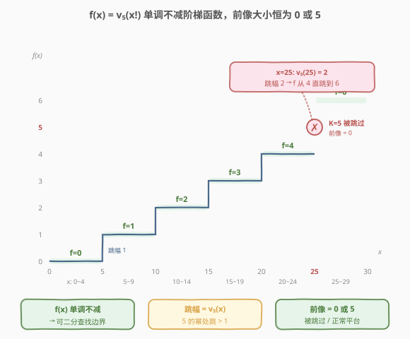
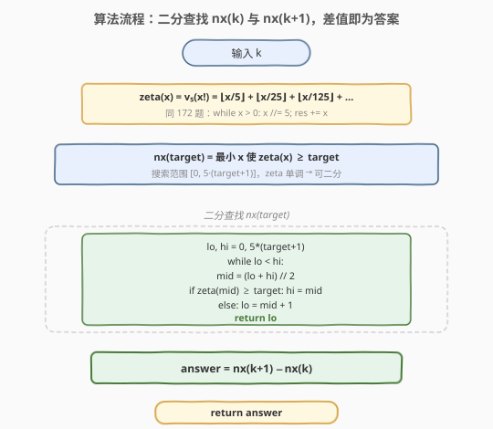
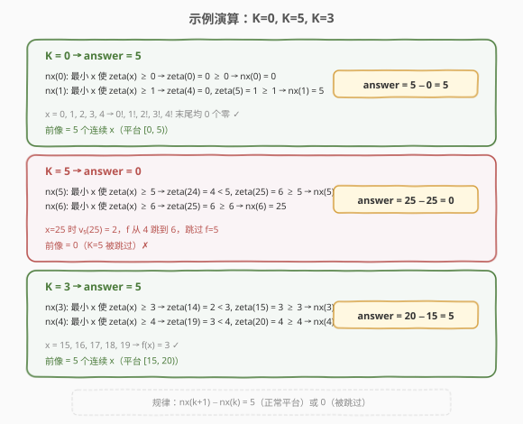

# 阶乘函数后K个零

- **题目名称**：阶乘函数后K个零
- **链接**：[793. 阶乘函数后 K 个零](https://leetcode.cn/problems/preimage-size-of-factorial-zeroes-function/)
- **难度**：困难
- **标签**：数学、二分查找、数论

## 1. 题目概述

定义 $f(x)$ 为 $x!$ 末尾零的数量（即从最低位起连续的 0 的个数）。给定整数 $k$，求有多少个**非负整数** $x$ 满足 $f(x) = k$。

> 💡 $x! = 1 \times 2 \times 3 \times \cdots \times x$，约定 $0! = 1$。例如 $f(3) = 0$（$3! = 6$ 无末尾零），$f(11) = 2$（$11! = 39916800$ 有 2 个末尾零）。

**示例 1**：

```text
输入：k = 0
输出：5
解释：0!, 1!, 2!, 3!, 4! 均满足 f(x) = 0。
```

**示例 2**：

```text
输入：k = 5
输出：0
解释：没有任何 x! 的末尾零个数恰好为 5。
```

**示例 3**：

```text
输入：k = 3
输出：5
```

**约束条件**：

- $0 \le k \le 10^9$

> ⚠️ **为什么是困难题？** $k$ 高达 $10^9$，对应的 $x$ 可达 $\sim 5 \times 10^9$，既不可能逐个枚举 $x$，更不可能计算 $x!$ 本身。必须从 $f(x)$ 的**数论结构**出发，利用单调性做二分查找，并用「前像恒为 0 或 5」的洞察把问题简化为一次判定。

---

## 2. 解题思路

### 2.1 暴力思路：逐个枚举 x？

最直白的做法：从 $x = 0$ 开始逐个计算 $f(x)$，统计 $f(x) = k$ 的个数。这条路有三个致命障碍：

1. **范围太大**：$f(x) \approx x/4$（因为 $v_5(x!) = \sum \lfloor x/5^i \rfloor \le x/4$），$k = 10^9$ 时 $x$ 可达 $\sim 5 \times 10^9$，线性枚举必然超时。
2. **无法计算 $x!$**：$x!$ 的位数约为 $x \log_{10} x$，$x = 10^9$ 时约有 $9 \times 10^9$ 位，任何标准类型都装不下。
3. **终止条件不明**：不知道何时该停止枚举——$f(x)$ 单调不减，但无法预知 $f(x) = k$ 的 $x$ 何时出现完毕。

> 💡 暴力法的失败提示我们：**不要逐个枚举 $x$，而要利用 $f(x)$ 的全局结构**。$f(x)$ 来自 [172. 阶乘后的零](../0101-0200/172_阶乘后的零.md) 的勒让德公式 $v_5(x!) = \sum \lfloor x/5^i \rfloor$，它是一个**单调不减的阶梯函数**——这正是二分查找的信号。

### 2.2 核心观察：f(x) 单调不减 + 前像恒为 0 或 5



#### 观察 1：f(x) 单调不减

$f(x) = v_5(x!) = \sum_{i=1}^{\infty} \lfloor x/5^i \rfloor$ 是 $x$ 的**单调不减函数**——$x$ 越大，$5$ 的因子只增不减。更进一步：

$$f(x) - f(x-1) = v_5(x)$$

即 $x$ 每增加 1，$f$ 的增量恰好等于 $x$ 中因子 5 的个数 $v_5(x)$。

- $x$ 不是 5 的倍数：$v_5(x) = 0$，$f$ 不变。
- $x = 5m$（$m$ 不是 5 的倍数）：$v_5(x) = 1$，$f$ 跳 1。
- $x = 25m$（$m$ 不是 5 的倍数）：$v_5(x) = 2$，$f$ 跳 2。
- $x = 125m$：$v_5(x) = 3$，$f$ 跳 3。依此类推。

#### 观察 2：前像大小恒为 0 或 5

$f(x)$ 是一个**阶梯函数**，在连续 5 个整数上保持恒定（因为 $f$ 只在 5 的倍数处才可能变化）。具体来说，$f$ 在区间 $[5m, 5m+4]$ 上恒定，然后跳到下一个值。

**关键洞察**——跳幅决定前像：

| 跳跃位置 | 跳幅 $v_5(x)$ | 效果 |
|----------|--------------|------|
| $5, 10, 15, 20, 30, \ldots$（5 的倍数，非 25 的倍数） | 1 | 不跳过任何值，每个 $k$ 的前像 = 5 |
| $25, 50, 75, \ldots$（25 的倍数，非 125 的倍数） | 2 | 跳过 1 个值，该 $k$ 的前像 = 0 |
| $125, 250, \ldots$（125 的倍数，非 625 的倍数） | 3 | 跳过 2 个值，这些 $k$ 的前像 = 0 |

> 💡 **为什么前像非 0 即 5？** 因为 $f$ 在 $[5m, 5m+4]$ 上恒定（5 个连续 $x$），跳幅 $\ge 1$。跳幅为 1 时不跳过任何值，该 $k$ 有 5 个前像；跳幅 $> 1$ 时跳过某些值，被跳过的 $k$ 前像为 0。不存在前像为 $1, 2, 3, 4$ 的情况——**要么恰好 5 个，要么 0 个**。

#### 观察 3：二分查找边界

由于 $f(x)$ 单调不减，满足 $f(x) = k$ 的 $x$ 构成一个**连续区间** $[\text{left}, \text{right})$（可能为空）。定义：

$$\text{nx}(\text{target}) = \min \{ x : f(x) \ge \text{target} \}$$

则答案为：

$$\text{answer} = \text{nx}(k+1) - \text{nx}(k)$$

- 若 $k$ 是正常平台值：$\text{nx}(k+1) - \text{nx}(k) = 5$。
- 若 $k$ 被跳过：$\text{nx}(k+1) = \text{nx}(k)$，差为 0。

> ⚠️ **等价判定法**：也可以只求 $\text{nx}(k)$，然后检查 $f(\text{nx}(k)) == k$。若相等返回 5，否则返回 0。两种写法等价，本文采用差值法更直观。

### 2.3 算法流程图



算法分三步：

1. **定义 `zeta(x)`**：计算 $f(x) = v_5(x!)$，直接复用 172 题的勒让德公式实现（`while x > 0: x //= 5; res += x`）。
2. **定义 `nx(target)`**：在 $[0,\ 5 \times (\text{target}+1)]$ 上二分，找最小的 $x$ 使 $\text{zeta}(x) \ge \text{target}$。
3. **返回 `nx(k+1) - nx(k)`**。

> 💡 **上界为何取 $5 \times (\text{target}+1)$？** 因为 $f(5t) = \lfloor 5t/5 \rfloor + \cdots \ge t$，所以 $\text{nx}(\text{target}) \le 5 \times \text{target} \le 5 \times (\text{target}+1)$。对于 $k = 0$，上界为 $5$，覆盖 $\text{nx}(0) = 0$ 和 $\text{nx}(1) = 5$。

### 2.4 示例演算



**K = 0**（answer = 5）：

- $\text{nx}(0)$：最小 $x$ 使 $\text{zeta}(x) \ge 0$ → $\text{zeta}(0) = 0 \ge 0$ → $\text{nx}(0) = 0$
- $\text{nx}(1)$：最小 $x$ 使 $\text{zeta}(x) \ge 1$ → $\text{zeta}(4) = 0,\ \text{zeta}(5) = 1 \ge 1$ → $\text{nx}(1) = 5$
- answer $= 5 - 0 = 5$。$x = 0, 1, 2, 3, 4$ 对应 $f(x) = 0$ ✓

**K = 5**（answer = 0）：

- $\text{nx}(5)$：$\text{zeta}(24) = 4 < 5,\ \text{zeta}(25) = 6 \ge 5$ → $\text{nx}(5) = 25$
- $\text{nx}(6)$：$\text{zeta}(25) = 6 \ge 6$ → $\text{nx}(6) = 25$
- answer $= 25 - 25 = 0$。$x = 25$ 时 $v_5(25) = 2$，$f$ 从 4 直跳到 6，跳过 5 ✗

**K = 3**（answer = 5）：

- $\text{nx}(3)$：$\text{zeta}(14) = 2 < 3,\ \text{zeta}(15) = 3 \ge 3$ → $\text{nx}(3) = 15$
- $\text{nx}(4)$：$\text{zeta}(19) = 3 < 4,\ \text{zeta}(20) = 4 \ge 4$ → $\text{nx}(4) = 20$
- answer $= 20 - 15 = 5$。$x = 15, 16, 17, 18, 19$ 对应 $f(x) = 3$ ✓

---

## 3. 参考代码

### C++

```cpp
class Solution {
    // v₅(x!) = ⌊x/5⌋ + ⌊x/25⌋ + ⌊x/125⌋ + …  （同 172 题）
    long long zeta(long long x) {
        long long res = 0;
        while (x > 0) {
            x /= 5;
            res += x;
        }
        return res;
    }

    // 最小 x 使 zeta(x) >= target（lower_bound 二分）
    long long nx(long long target) {
        long long lo = 0, hi = 5LL * (target + 1);
        while (lo < hi) {
            long long mid = lo + (hi - lo) / 2;
            if (zeta(mid) >= target)
                hi = mid;
            else
                lo = mid + 1;
        }
        return lo;
    }

  public:
    int preimageSizeFZF(int k) {
        return (int)(nx(k + 1) - nx(k));
    }
};
```

### Python

```python
class Solution:
    def preimageSizeFZF(self, k: int) -> int:
        def zeta(x: int) -> int:
            res = 0
            while x > 0:
                x //= 5
                res += x
            return res

        def nx(target: int) -> int:
            lo, hi = 0, 5 * (target + 1)
            while lo < hi:
                mid = (lo + hi) // 2
                if zeta(mid) >= target:
                    hi = mid
                else:
                    lo = mid + 1
            return lo

        return nx(k + 1) - nx(k)
```

> ⚠️ **三个易错点**：
> 1. **必须用 `long long`（C++）**：$k \le 10^9$，上界 $5 \times (k+1) \approx 5 \times 10^9 > 2^{31}-1$，`int` 会溢出。Python 无此问题。
> 2. **二分用左闭右开 `[lo, hi)`**：`while lo < hi`，`hi = mid`（而非 `mid - 1`），这是 lower_bound 标准写法——找首个满足 `zeta(mid) >= target` 的位置。
> 3. **上界 $5 \times (\text{target}+1)$ 而非 $5 \times \text{target}$**：当 $\text{target} = 0$ 时上界为 $5$（非 $0$），保证二分范围非空；且 $\text{nx}(k+1) \le 5 \times (k+1)$ 需要上界覆盖 $k+1$ 的情形。

---

## 4. 复杂度分析

| 维度 | 复杂度 | 说明 |
|------|--------|------|
| 时间复杂度 | $O(\log^2 k)$ | 二分 $O(\log k)$ 次（范围 $\sim 5k$），每次调用 `zeta` 耗 $O(\log_5 k) = O(\log k)$，总计 $O(\log^2 k)$ |
| 空间复杂度 | $O(1)$ | 仅常数个变量，与输入规模无关 |

> 💡 **实际开销极小**：$k = 10^9$ 时，二分约 $\log_2(5 \times 10^9) \approx 32$ 次，每次 `zeta` 约 $\log_5(5 \times 10^9) \approx 13$ 轮，总计约 $32 \times 13 \approx 416$ 次整数运算，远在时限内。这是数论结构 + 二分带来的双重对数级降维。

---

## 5. 扩展：等价判定法与 172 正逆对照

### 5.1 等价判定法：只求 nx(k) 一次

差值法调用了两次 `nx`，但由「前像恒为 0 或 5」的洞察，只需一次 `nx(k)` 再判定即可：

```python
def preimageSizeFZF(self, k: int) -> int:
    def zeta(x):
        res = 0
        while x > 0:
            x //= 5
            res += x
        return res

    def nx(target):
        lo, hi = 0, 5 * (target + 1)
        while lo < hi:
            mid = (lo + hi) // 2
            if zeta(mid) >= target:
                hi = mid
            else:
                lo = mid + 1
        return lo

    left = nx(k)
    return 5 if zeta(left) == k else 0
```

逻辑：$\text{nx}(k)$ 是最小的 $x$ 使 $f(x) \ge k$。若 $f(\text{nx}(k)) = k$，说明 $k$ 是正常平台值，前像 = 5；若 $f(\text{nx}(k)) > k$，说明 $k$ 被跳过，前像 = 0。两版等价，差值法更对称，判定法更简洁。

### 5.2 172 与 793：正逆对照

| 维度 | [172. 阶乘后的零](../0101-0200/172_阶乘后的零.md) | 793. 阶乘函数后K个零 |
|------|------|------|
| 方向 | **正向**：给定 $x$，求 $f(x)$ | **逆向**：给定 $k$，求满足 $f(x)=k$ 的 $x$ 个数 |
| 核心 | 勒让德公式 $v_5(x!) = \sum \lfloor x/5^i \rfloor$ | 二分查找 + 单调性 |
| 复杂度 | $O(\log n)$ | $O(\log^2 k)$ |
| 关系 | 172 的 `trailingZeroes` = 793 的 `zeta`（判定器） | 793 把 172 的计数器变为二分的判定函数 |

两题合看才能完整理解「阶乘末尾零」这个数论对象的正逆两个方向：172 解决「$x \to f(x)$」的映射，793 解决「$f(x) = k$ 的前像大小」的逆问题。

---

## 6. 面试要点

1. **为什么前像大小恒为 0 或 5？**

   > $f(x) = v_5(x!)$ 是阶梯函数，在 $[5m, 5m+4]$ 上恒定（5 个连续整数），因为 $f$ 只在 5 的倍数处变化。跳跃处 $x = 5m$ 的跳幅 $= v_5(5m)$。跳幅为 1（$m$ 非 5 的倍数）时不跳过任何值，前像 = 5；跳幅 $> 1$（$m$ 是 5 的倍数，即 $x$ 是 25/125/… 的倍数）时跳过某些 $k$，被跳过的前像 = 0。不存在前像为 1–4 的情况。

2. **为什么能二分？二段性体现在哪？**

   > $f(x)$ 单调不减。定义 $\text{nx}(\text{target}) = \min \{x : f(x) \ge \text{target}\}$。对任意 target，存在分界点：$x < \text{nx}(\text{target})$ 时 $f(x) < \text{target}$（不满足），$x \ge \text{nx}(\text{target})$ 时 $f(x) \ge \text{target}$（满足）。这种「左不满足 / 右满足」的结构就是二段性，可用 lower_bound 二分定位。

3. **上界为什么取 $5 \times (\text{target}+1)$？**

   > 因为 $f(5t) \ge \lfloor 5t/5 \rfloor = t$，所以 $\text{nx}(\text{target}) \le 5 \times \text{target} \le 5 \times (\text{target}+1)$。取 $+1$ 是为保证 $\text{target}=0$ 时上界非零（$= 5$），且 $\text{nx}(k+1)$ 的上界 $5 \times (k+2)$ 也被覆盖（差值法中两次调用共享同一上界公式）。

4. **C++ 为什么要用 `long long`？**

   > $k \le 10^9$，上界 $5 \times (k+1) \approx 5 \times 10^9 > 2^{31}-1 \approx 2.1 \times 10^9$，`int` 溢出。`mid`、`lo`、`hi` 均需 `long long`。Python 整数任意精度无此问题。这与 172 题不同——172 中 $n \le 10^9$ 且 `n` 只减不增可用 `int`，793 的上界 $5k$ 超出了 `int` 范围。

5. **差值法和判定法哪个更好？**

   > 两者等价。差值法 `nx(k+1) - nx(k)` 更对称直观，调两次二分；判定法 `zeta(nx(k)) == k ? 5 : 0` 只调一次二分加一次 zeta，略快。面试中讲清「前像非 0 即 5」的洞察后，用判定法更简洁；若想强调二分边界的思想，用差值法更自然。

> 💡 **一句话总结**：793 是 172 的逆问题——给定末尾零个数 $k$，求前像大小。核心洞察是 $f(x) = v_5(x!)$ 单调不减且在 5 的倍数处跳跃，跳幅 $= v_5(x)$，使得前像恒为 0（被跳过）或 5（正常平台）。用二分找 $\text{nx}(k)$ 与 $\text{nx}(k+1)$ 的边界，差值即为答案，$O(\log^2 k)$ 时间 $O(1)$ 空间。

---

## 7. 同类练习题

- [172. 阶乘后的零](https://leetcode.cn/problems/factorial-trailing-zeroes/)（[题解](../0101-0200/172_阶乘后的零.md)）：本题的正向问题——给定 $x$ 求 $f(x) = v_5(x!)$。793 的 `zeta` 函数直接复用 172 的勒让德公式实现，两题合看才能完整理解「阶乘末尾零」的正逆两个方向
- [719. 找出第 K 小的数对距离](https://leetcode.cn/problems/find-k-th-smallest-pair-distance/)（[题解](./719_找出第K小的数对距离.md)）：同属二分查找框架，利用单调性做 `count(x)` 统计定位边界。793 的 `zeta(x)` 对应 719 的 `count(mid)`，都是单调判定函数
- [410. 分割数组的最大值](https://leetcode.cn/problems/split-array-largest-sum/)：二分答案经典题，在答案域上二分 + 贪心验证。与 793 同属「二分 + 单调判定」骨架，差异在 `check()` 的实现
- [875. 爱吃香蕉的珂珂](https://leetcode.cn/problems/koko-eating-bananas/)：二分吃速 + 求和验证，同为「在单调函数上找边界」的范式，可对比 `zeta` 与 `check` 两套判定器的设计
