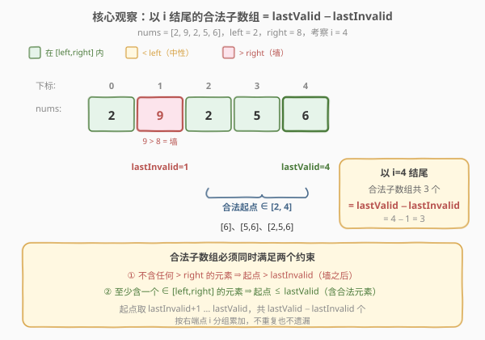
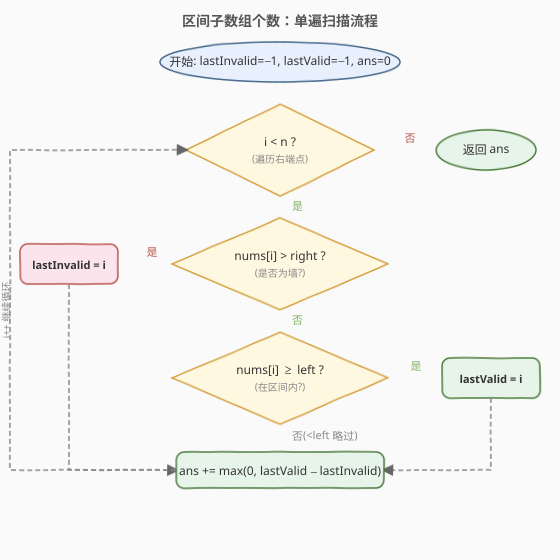

# LeetCode 区间子数组个数 题解

## 1. 题目概述

- **标题 / 题号**：区间子数组个数（#795，medium）
- **链接**：https://leetcode.cn/problems/number-of-subarrays-with-bounded-maximum/
- **难度**：中等
- **标签**：数组、双指针、计数

**题意**：给定一个整数数组 `nums` 和两个整数 `left`、`right`，找出 `nums` 中**连续、非空**且其中**最大元素在范围** `[left, right]` **内**的子数组，返回满足条件的子数组个数。

**示例 1**：

```text
输入：nums = [2,1,4,3], left = 2, right = 3
输出：3
解释：满足条件的三个子数组：[2]、[2,1]、[3]。
      [1] 的最大值 1 不在 [2,3] 内；含 4 的子数组最大值 4 > 3，都不算。
```

**示例 2**：

```text
输入：nums = [2,9,2,5,6], left = 2, right = 8
输出：7
解释：满足条件的 7 个子数组：[2]、[2,5]、[5]、[5,6]、[6]、[2,5,6]、[2]（下标 2 的那个）。
```

**约束**：

- `1 <= nums.length <= 10^5`
- `0 <= nums[i] <= 10^9`
- `0 <= left <= right <= 10^9`

> 💡 注意题目要的是「**最大值落在某个区间**」，不是「所有元素落在区间」。两者差别很大：含一个超界大元素就整个子数组作废，但夹几个小于 `left` 的小元素并不破坏合法性（只要其中有至少一个元素落在 `[left, right]`）。

## 2. 解题思路

### 2.1 暴力思路

枚举所有子数组 `[i, j]`，对每个子数组求最大值判断是否在 `[left, right]` 内。共有 $O(n^2)$ 个子数组，每个求最大值 $O(n)$，总复杂度 $O(n^3)$（边枚举边维护最大值可降到 $O(n^2)$），`n = 10^5` 时必然超时。

优化方向：把每个元素按与 `[left, right]` 的关系**分三类**，再用「按右端点分组计数」的思路一次扫描搞定。

### 2.2 核心观察：三区分类 + 双游标计数



把每个 `nums[i]` 按与区间的关系分三类：

| 分类 | 条件 | 作用 |
|------|------|------|
| **墙**（红色） | `nums[i] > right` | 任何含它的子数组最大值必然 `> right`，**直接作废**；它是一道不可逾越的硬边界 |
| **合法**（绿色） | `left <= nums[i] <= right` | 它本身就能让子数组的最大值落入区间；子数组**必须含至少一个**这类元素 |
| **中性**（黄色） | `nums[i] < left` | 既不破坏合法性（不会让最大值超标），也不保证合法性（单靠它最大值 `< left`） |

对每个位置 `i`（作为子数组的**右端点**），维护两个游标：

- `lastInvalid`：最近的「墙」的下标（初始 `−1`），即最近的满足 `nums[k] > right` 的 `k`。
- `lastValid`：最近的「合法」元素的下标（初始 `−1`），即最近的满足 `left <= nums[k] <= right` 的 `k`。

一个以 `i` 结尾的子数组 `[start, i]` 合法，**当且仅当同时满足**：

1. **不含墙**：`start > lastInvalid`（否则会包含那堵墙，最大值必超界）。
2. **含合法元素**：`start <= lastValid`（否则区间内全是中性元素，最大值 `< left`）。

因此合法的起点 `start` 取值恰为 `lastInvalid + 1, …, lastValid`，共 $\text{lastValid} - \text{lastInvalid}$ 个（当 `lastValid > lastInvalid` 时；否则本轮为 `0`）。

> 💡 **为什么按右端点分组不会重复或遗漏？** 每轮只统计「以当前 `i` 结尾」的合法子数组，不同 `i` 的组右端点不同、互不相交，故不重复；每个合法子数组都有唯一的右端点 `i`，故不遗漏。这与 [713. 乘积小于 K 的子数组](https://leetcode.cn/problems/subarray-product-less-than-k/) 的 `ans += right - left + 1` 是同一套「按右端点分组累加」的计数范式。

### 2.3 算法流程图



整体只有一重 `for` 循环遍历 `i`，每个元素只做常数次判断与赋值，没有内层收缩循环，总复杂度 $O(n)$。

### 2.4 示例演算

![示例演算：nums = [2,1,4,3], left = 2, right = 3](../images/nsbm_example_walkthrough.svg)

以 `nums = [2, 1, 4, 3]`、`left = 2`、`right = 3` 为例，逐步执行：

- `i=0`，`nums[0]=2` ∈ [2,3]（合法）：`lastValid=0`，`lastInvalid=−1`，本轮 `0−(−1)=1`，新增 `[2]`，`ans=1`。
- `i=1`，`nums[1]=1` < 2（中性）：两个游标不变，本轮 `0−(−1)=1`，新增 `[2,1]`（必须含下标 0 的合法元素 2），`ans=2`。
- `i=2`，`nums[2]=4` > 3（墙）：`lastInvalid=2`，`lastValid` 仍为 0，本轮 `max(0, 0−2)=0`（含 4 的子数组全部作废），`ans=2`。
- `i=3`，`nums[3]=3` ∈ [2,3]（合法）：`lastValid=3`，`lastInvalid=2`，本轮 `3−2=1`，新增 `[3]`，`ans=3`。

最终答案为 `3`。

## 3. 参考代码

### C++

```cpp
class Solution {
  public:
    int numSubarrayBoundedMax(vector<int>& nums, int left, int right) {
        int lastInvalid = -1, lastValid = -1, ans = 0;
        for (int i = 0; i < (int)nums.size(); i++) {
            if (nums[i] > right) {
                lastInvalid = i;          // 遇墙：之后的子数组起点必须越过它
            } else if (nums[i] >= left) {
                lastValid = i;            // 遇合法元素：刷新最近合法位置
            }
            // nums[i] < left 时为中性，两个游标都不动
            if (lastValid > lastInvalid) {
                ans += lastValid - lastInvalid;
            }
        }
        return ans;
    }
};
```

### Python

```python
class Solution:
    def numSubarrayBoundedMax(self, nums: List[int], left: int, right: int) -> int:
        last_invalid = -1
        last_valid = -1
        ans = 0
        for i, x in enumerate(nums):
            if x > right:
                last_invalid = i
            elif x >= left:
                last_valid = i
            if last_valid > last_invalid:
                ans += last_valid - last_invalid
        return ans
```

> ⚠️ **两个易错点**：
> 1. **「墙」要用 `>` 严格大于 `right`，合法用 `>= left` 配合外层 `else if`**。两者顺序不能反：先判 `> right`（墙），再判 `>= left`（此时已保证 `<= right`，即落入区间）。若先判 `>= left`，会把 `> right` 的元素误当合法。
> 2. **计数前必须判 `lastValid > lastInvalid`**。当最近一次墙出现在最近一次合法之后（`lastInvalid > lastValid`），本轮没有合法子数组，差值为负，要按 `0` 处理，不能直接累加负数。

## 4. 复杂度分析

| 维度 | 复杂度 | 说明 |
|------|--------|------|
| 时间复杂度 | $O(n)$ | 一重循环遍历 `n` 个元素，每轮只做常数次比较与赋值，无内层循环 |
| 空间复杂度 | $O(1)$ | 仅用 `lastInvalid / lastValid / ans` 三个变量 |

## 5. 扩展：另一种解法——「至多上界」差分

本题还有另一个清晰的角度：**最大值落在 `[left, right]`** 的子数组个数，等于**最大值 $\leq$ `right`** 的子数组个数，减去**最大值 $\leq$ `left − 1`** 的子数组个数：

$$\text{ans} = \text{atMost}(\text{right}) - \text{atMost}(\text{left} - 1)$$

其中 `atMost(bound)` 统计「所有元素都 $\leq$ `bound`」的子数组个数：扫描时维护当前合法段长度 `cur`，遇到 `nums[i] <= bound` 则 `cur++`（以 `i` 结尾有 `cur` 个全合法子数组），否则 `cur = 0`，累加 `cur` 即可。

```python
def atMost(self, nums, bound):
    cur = 0
    ans = 0
    for x in nums:
        cur = cur + 1 if x <= bound else 0
        ans += cur
    return ans

def numSubarrayBoundedMax(self, nums, left, right):
    return self.atMost(nums, right) - self.atMost(nums, left - 1)
```

> 💡 这是「**恰好 = 至多上界差分**」的经典转化，与 [713. 乘积小于 K 的子数组](../0701-0800/713_乘积小于K的子数组.md) 的扩展、[1248. 统计「优美子数组」](https://leetcode.cn/problems/count-number-of-nice-subarrays/) 的 `exactly(K) = atMost(K) - atMost(K-1)` 同源。两种解法都是 $O(n)/O(1)$：差分法代码更短、更通用；双游标法一次扫描、无需做两次，且对「最大值在区间内」这类**带下界**的约束更直观。

## 6. 面试要点

1. **为什么不能简单地用滑动窗口收缩？**

   - 滑窗依赖窗口合法性随端点**单调变化**。本题含 `nums[i] < left` 的中性元素：扩展窗口加入它既可能让最大值不变（仍由已有的合法元素决定、保持合法），也可能在还没有合法元素时仍然不合法——合法性不随 `right` 右移单调改善，无法像 [713](https://leetcode.cn/problems/subarray-product-less-than-k/) 那样靠收缩左端修正。因此改用「记录最近关键位置」而非维护一个可收缩窗口。

2. **`lastValid - lastInvalid` 这个计数为什么正确？**

   - 以 `i` 结尾的合法子数组必须满足两条：起点 `> lastInvalid`（不含墙）、起点 `<= lastValid`（含合法元素）。起点取 `lastInvalid+1 … lastValid` 恰有 `lastValid - lastInvalid` 个；两者不满足时差值非正，本轮计 `0`。

3. **「墙」和「合法」的判断顺序为什么不能反？**

   - 必须先判 `nums[i] > right`（墙）。若先判 `nums[i] >= left`，则 `> right` 的元素会先被归为「合法」而错误地刷新 `lastValid`，导致把含超界元素的子数组也计入。用 `if/else if` 保证互斥分类。

4. **中性元素（`< left`）为什么两个游标都不动，却仍可能贡献合法子数组？**

   - 中性元素本身不能让子数组合法（最大值 `< left`），所以不刷新 `lastValid`；但它不破坏合法性（不会让最大值超标），所以也不刷新 `lastInvalid`。只要它落在 `lastInvalid` 与 `lastValid` 之间，以它为右端点的子数组仍可包含更早的合法元素而合法——这正是 `lastValid - lastInvalid` 把它们计入的原因。

5. **两种解法（双游标 vs 差分）各自的优势？**

   - 双游标法单趟扫描、无需调用两次，且直接刻画「带下界 + 带上界」的双侧约束；差分法把问题拆成两个「至上界」单侧问题，代码更短、更易复用（同一 `atMost` 函数解决一类题），但需扫描两遍。面试中两种都能讲，差分法更体现「化双侧为单侧」的转化思维。

## 同类练习题

| # | 题目 | 与本题的关联 |
|---|------|-------------|
| 713 | [乘积小于 K 的子数组](https://leetcode.cn/problems/subarray-product-less-than-k/)（[题解](../0701-0800/713_乘积小于K的子数组.md)） | 同为「按右端点分组计数」的子数组计数范式，正数滑窗 |
| 1248 | [统计「优美子数组」](https://leetcode.cn/problems/count-number-of-nice-subarrays/) | `exactly(K) = atMost(K) - atMost(K-1)` 差分转化，与本文扩展同源 |
| 930 | [和相同的二元子数组](https://leetcode.cn/problems/binary-subarrays-with-sum/) | 计数子数组，差分法求「恰好等于 goal」 |
| 2302 | [统计子数组的得分](https://leetcode.cn/problems/count-subarrays-with-fixed-score/) | 滑窗计数 + 「合法段长度」贡献，按右端点累加同套路 |
| 2762 | [不间断子数组](https://leetcode.cn/problems/continuous-subarrays/) | 维护窗口内最值差，按右端点计数的变体 |
