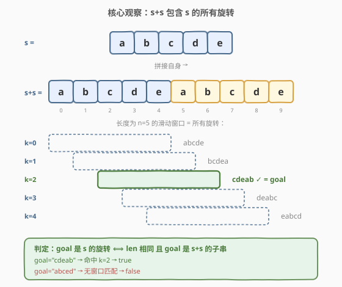
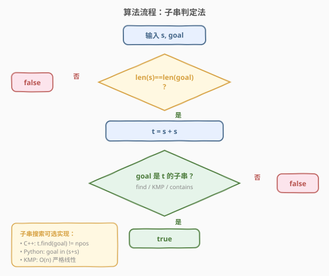
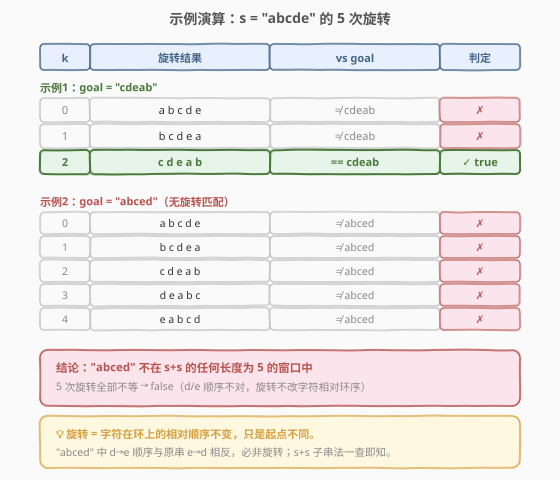

# LeetCode 旋转字符串 题解

## 1. 题目概述

- **标题 / 题号**：旋转字符串（#796，easy）
- **链接**：https://leetcode.cn/problems/rotate-string/
- **难度**：简单
- **标签**：字符串、子串判定、KMP

**题意**：给定两个字符串 `s` 和 `goal`。`s` 的**旋转操作**定义为将 `s` 最左边的字符移动到最右边（可执行任意次，包括 0 次）。问：经过若干次旋转后，`s` 能否变成 `goal`？能则返回 `true`，否则 `false`。

> 💡 旋转本质是把字符串看成一个**环**，从不同位置切开读出。例如 `s = "abcde"` 看作环 `a→b→c→d→e→a`，旋转 2 次得 `cdeab`。

**示例 1**：

```text
输入：s = "abcde", goal = "cdeab"
输出：true
解释：旋转 2 次：abcde → bcdea → cdeab，等于 goal。
```

**示例 2**：

```text
输入：s = "abcde", goal = "abced"
输出：false
解释：5 次旋转分别为 abcde / bcdea / cdeab / deabc / eabcd，均不等于 "abced"。
```

**约束**：

- $1 \le \text{s.length},\; \text{goal.length} \le 100$
- `s` 和 `goal` 由小写英文字母组成

> 💡 数据规模极小（$n \le 100$），暴力枚举 $n$ 次旋转逐一比较完全可行；但「`s+s` 子串判定」一行即可解决，且能推广到 $n$ 更大的场景。

## 2. 解题思路

### 2.1 暴力思路

枚举所有旋转：对 $k = 0, 1, \dots, n-1$，构造旋转结果 `s[k:] + s[:k]`，逐一与 `goal` 比较。命中即返回 `true`，全部不等返回 `false`。

每次构造旋转串需 $O(n)$，共 $n$ 次，总时间 $O(n^2)$，对 $n \le 100$ 毫无压力。

> ⚠️ 暴力的低效在于「每次旋转都重新拼接整个串」。其实所有旋转串早已「藏在」一个拼接串里——这就是下面的核心观察。

### 2.2 核心观察：`s+s` 包含 `s` 的所有旋转



把 `s` 与自身拼接得到 `t = s + s`（长度 $2n$）。则 `s` 的**每一个旋转**都恰好是 `t` 中某个长度为 $n$ 的子串：

- 旋转 $k$ 次（把前 $k$ 个字符挪到末尾）的结果 = `t[k : k+n]`。

以 `s = "abcde"` 为例，`t = "abcdeabcde"`，5 个旋转分别对应 `t` 中起点为 $0,1,2,3,4$、长度为 5 的窗口：

| 旋转次数 $k$ | 窗口 `t[k:k+5]` | 结果 |
|------|-----------------|------|
| 0 | `t[0:5]` = `abcde` | `abcde` |
| 1 | `t[1:6]` = `bcdea` | `bcdea` |
| 2 | `t[2:7]` = `cdeab` | `cdeab` |
| 3 | `t[3:8]` = `deabc` | `deabc` |
| 4 | `t[4:9]` = `eabcd` | `eabcd` |

> 💡 **为什么窗口只看起点 $0 \sim n-1$？** 旋转 $n$ 次等于回到原串（环转一圈），所以只有 $n$ 种**本质不同**的旋转，对应 `t` 中 $n$ 个长度为 $n$ 的窗口（起点 $0$ 到 $n-1$）。起点 $n$ 的窗口就是起点 $0$ 的重复。

于是判定化为：

$$\text{goal 是 s 的旋转} \;\iff\; \underbrace{\text{len}(s) = \text{len}(goal)}_{\text{长度相同}} \;\wedge\; \underbrace{\text{goal 是 } s{+}s \text{ 的子串}}_{\text{落入某个窗口}}$$

> ⚠️ **长度检查不可省**：若 `goal` 比 `s` 短但仍出现在 `s+s` 中（如 `s="abc"`, `goal="ab"`），不补长度判定会误判 `true`。`"ab"` 虽是 `"abcabc"` 的子串，但长度不等，不是 `s` 的旋转。

**两方向正确性**：

1. **若 `goal` 是 `s` 的旋转 → 必满足两条件**。旋转不改变长度，故 `len` 相等；旋转结果 `s[k:]+s[:k]` 恰是 `t[k:k+n]`，是 `s+s` 的子串。
2. **若两条件满足 → `goal` 是 `s` 的旋转**。`goal` 在 `t=s+s` 中出现，设起点为 $k$（$0 \le k < 2n$）。因 `len(goal)=n`，该子串为 `t[k:k+n]`。若 $k \ge n$，取 $k' = k - n$，由 `t` 的周期性 `t[k:k+n] = t[k':k'+n]`，可归约到 $k' < n$。于是 `goal = t[k:k+n] = s[k:]+s[:k]`，恰为旋转 $k$ 次的结果。

### 2.3 算法流程图



**完整步骤**：

1. **长度检查**：若 `len(s) != len(goal)`，直接返回 `false`。
2. **拼接**：`t = s + s`。
3. **子串搜索**：在 `t` 中查找 `goal`。
   - 库函数：C++ `t.find(goal) != string::npos`，Python `goal in (s+s)`；
   - 手写：KMP / 暴力双循环。
4. **返回**：找到返回 `true`，否则 `false`。

> 💡 长度检查放在拼接之前是**早退优化**：长度不等直接 `false`，免去拼接与搜索。即便省略长度检查，`s+s` 的子串判定也可能因长度不匹配而失败，但显式检查让逻辑更清晰、避免边界误判。

### 2.4 示例演算



以官方两个示例对照：

| 示例 | `s` | `goal` | `t=s+s` | `goal∈t`? | 结论 |
|------|-----|--------|---------|-----------|------|
| 1 | `abcde` | `cdeab` | `abcdeabcde` | ✓（`t[2:7]`） | **true** |
| 2 | `abcde` | `abced` | `abcdeabcde` | ✗ | **false** |

> 💡 **为什么 `abced` 一定不是旋转？** 旋转只改变起点，不改变字符在环上的**相对顺序**。`s="abcde"` 的环序为 `a→b→c→d→e→a`，所有旋转都保持 `d` 在 `e` 之前（环序）。而 `abced` 中 `e` 在 `d` 之前，环序被破坏，故必非旋转。`s+s` 子串法正是对「环序保持性」的隐式检验。

## 3. 参考代码

### C++

```cpp
class Solution {
  public:
    bool rotateString(string s, string goal) {
        return s.size() == goal.size() && (s + s).find(goal) != string::npos;
    }
};
```

### Python

```python
class Solution:
    def rotateString(self, s: str, goal: str) -> bool:
        return len(s) == len(goal) and goal in (s + s)
```

### KMP（手写子串搜索，$O(n)$ 严格线性）

```cpp
class Solution {
  public:
    bool rotateString(string s, string goal) {
        if (s.size() != goal.size()) return false;
        string t = s + s;
        return kmpSearch(t, goal);
    }

  private:
    bool kmpSearch(const string& text, const string& pat) {
        int n = text.size(), m = pat.size();
        if (m == 0) return true;
        vector<int> nxt(m, 0);                 // 构建 next 数组
        for (int i = 1, j = 0; i < m; ++i) {
            while (j > 0 && pat[i] != pat[j]) j = nxt[j - 1];
            nxt[i] = (pat[i] == pat[j]) ? ++j : 0;
        }
        for (int i = 0, j = 0; i < n; ++i) {   // 在 text 中匹配
            while (j > 0 && text[i] != pat[j]) j = nxt[j - 1];
            if (text[i] == pat[j]) ++j;
            if (j == m) return true;
        }
        return false;
    }
};
```

> 💡 **实现细节**：
> 1. **长度检查前置**：`s.size() == goal.size()` 必须放在 `&&` 左侧，既早退又避免「`goal` 短于 `s` 但仍为 `s+s` 子串」的误判。
> 2. **`s+s` 不会越界**：拼接后长度 $2n$，`goal` 长度 $n$，子串搜索范围天然合法。
> 3. **KMP 的价值**：当 $n$ 扩到 $10^5$ 级别时，库函数 `find` 多为 $O(n^2)$ 最坏，KMP 保证 $O(n)$。本题 $n \le 100$ 用库函数即可，KMP 仅作扩展。

## 4. 复杂度分析

| 维度 | 复杂度 | 说明 |
|------|--------|------|
| 时间（库函数） | $O(n)$ 均摊 | `s+s` 拼接 $O(n)$；`find`/`in` 平均 $O(n)$，最坏 $O(n^2)$（取决于实现） |
| 时间（KMP） | $O(n)$ | 构建 `next` 数组 $O(n)$ + 匹配 $O(n)$，严格线性 |
| 空间 | $O(n)$ | 存 `s+s`，长度 $2n$；KMP 额外 `next` 数组 $O(n)$ |

> 💡 本题 $n \le 100$，三种写法均在微秒级完成。瓶颈不在算法，而在能否想到「`s+s` 子串」这一化归。即便 $n$ 扩到 $10^6$，KMP 版本依然轻松通过。

## 5. 扩展：环序视角与最小表示法

`s+s` 子串判定的本质是把「旋转等价类」对应到「环上的起点选择」。两个相关概念值得了解：

### 5.1 循环同构

称两个字符串**循环同构**，若其中一个可由另一个旋转得到。本题主即判定 `s` 与 `goal` 是否循环同构。等价判据除 `s+s` 子串法外，还有：

- **最小表示法**：把字符串看作环，在所有旋转中取**字典序最小**者作为规范形式。两串循环同构 $\iff$ 它们的最小表示相同。求最小表示可用 $O(n)$ 的「双指针比较」算法（类似 [LeetCode 1163. 按字典序最大的子串](https://leetcode.cn/problems/last-substring-in-lexicographical-order/) 的最小/最大表示版本）。

### 5.2 为何「`s+s` 子串」比「逐个旋转」更本质

逐个旋转枚举 $n$ 种切法，是**显式遍历等价类**；`s+s` 子串则是**用一个串编码整个等价类**——所有旋转在 `s+s` 中以连续子串形式「平铺」，一次搜索即可判定归属。这种「用冗余编码换取一次性查询」的思想在字符串环问题上极为通用。

> 💡 **迁移**：若问题改为「判定 `goal` 是否为 `s` 的**子序列**旋转」（允许跳字符），则环序失效、`s+s` 技巧不再适用，需另寻 DP。可见 `s+s` 法的威力正源于「旋转 = 连续环切」这一约束。

## 6. 面试要点

1. **为什么 `s+s` 包含 `s` 的所有旋转？**

   旋转 $k$ 次的结果是 `s[k:] + s[:k]`。而 `t = s+s` 中起点为 $k$、长度为 $n$ 的子串 `t[k:k+n]` 恰为 `s[k:] + s[:k]`（前半来自第一个 `s` 的后缀，后半来自第二个 `s` 的前缀）。因此 $n$ 种旋转对应 `t` 中 $n$ 个长度为 $n$ 的窗口，全部被编码进 `s+s`。

2. **为什么必须先判长度相等？**

   若 `goal` 比 `s` 短，它仍可能作为 `s+s` 的子串出现（如 `s="abc"`, `goal="ab"` ∈ `"abcabc"`），但它不是 `s` 的旋转——旋转不改变长度。长度检查是必要条件，缺则误判。先检查长度还能在长度不等时直接早退，省去拼接与搜索。

3. **`s+s` 的窗口起点为什么只到 $n-1$？**

   旋转 $n$ 次回到原串（环转一圈），只有 $n$ 种本质不同的旋转。起点 $k \ge n$ 的窗口因 `t` 的周期性 `t[k:k+n] = t[k-n:k]` 与起点 $k-n$ 的窗口相同，故只需考察 $k \in [0, n-1]$。子串搜索在 $[0, 2n)$ 范围内查找即可覆盖，无需显式限制。

4. **库函数 `find` / `in` 的最坏复杂度是 $O(n^2)$，是否需要 KMP？**

   对本题 $n \le 100$ 不需要，库函数足够。但若面试官把约束放宽到 $n \le 10^6$，或追问「最坏情况」，需指出朴素子串搜索在 `s="aaaa...a"`、`goal="aaa...ab"` 这类高度重复串上退化到 $O(n^2)$，此时应上 KMP（$O(n)$）或 Boyer-Moore 等。能否手写 KMP 是常见加分项。

5. **能否不用 `s+s`，直接在环上双指针判定？**

   可以。把 `s` 看作环，用两个指针 $i$（`s` 的起点候选）和 $j$（`goal` 的匹配游标），逐字符比较 `s[(i+j)%n]` 与 `goal[j]`，不匹配则 $i$ 前进、$j$ 归零。朴素实现 $O(n^2)$；若辅以失败跳转（类似 KMP 的 `next` 数组），可优化到 $O(n)$，本质上与 `s+s` 上跑 KMP 等价。

> 💡 **一句话总结**：旋转字符串的核心是「**用 `s+s` 编码所有旋转**」——把 $n$ 种旋转平铺为一个串的 $n$ 个窗口，将「枚举旋转比较」降为「一次子串搜索」。长度检查 + 子串判定，两行代码解决。

## 同类练习题

| # | 题目 | 与本题的关联 |
|---|------|-------------|
| 61 | [旋转链表](https://leetcode.cn/problems/rotate-list/)（[题解](../0001-0100/61_旋转链表.md)） | 链表版的「旋转」，本质是把环在某个点断开，与本题「环上选起点」同构，对照理解「旋转 = 环切」 |
| 189 | [轮转数组](https://leetcode.cn/problems/rotate-array/) | 数组版旋转，用三次反转实现 $O(n)/O(1)$，与本题的字符串旋转互为镜像，巩固「旋转」操作的多种实现 |
| 1163 | [按字典序最大的子串](https://leetcode.cn/problems/last-substring-in-lexicographical-order/) | 在所有旋转中取字典序最大者，是「最小/最大表示法」的直接应用，承接第 5 节环序视角 |
| 28 | [找出字符串中第一个匹配项的下标](https://leetcode.cn/problems/find-the-index-of-the-first-occurrence-in-a-string/) | KMP 子串搜索母题，本题第 3 节 KMP 实现的直接来源，巩固 $O(n)$ 子串匹配 |
| 459 | [重复的子字符串](https://leetcode.cn/problems/repeated-substring-pattern/)（[题解](../0401-0500/459_重复的子字符串.md)） | 同样巧用 `s+s`——判定 `s` 是否由子串重复构成等价于 `s` 是否出现在去掉首尾字符的 `s+s` 中，与本题共享「拼接串编码」的核心套路 |
