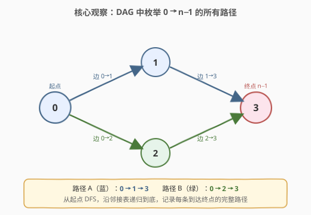
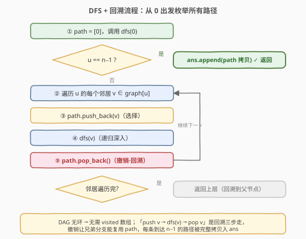
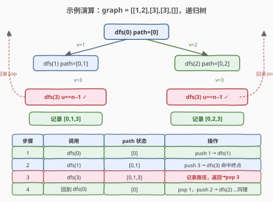

# LeetCode 所有可能的路径 题解

## 1. 题目概述

- **标题 / 题号**：所有可能的路径（#797，medium）
- **链接**：https://leetcode.cn/problems/all-paths-from-source-to-target/
- **难度**：中等
- **标签**：深度优先搜索、广度优先搜索、图、回溯

**题意**：给定一个有向无环图（DAG），图中有 `n` 个节点，标记为 `0` 到 `n - 1`。找到从节点 `0` 到节点 `n - 1` 的所有可能路径并返回（任意顺序）。

图以**邻接表**给出：`graph[i]` 是节点 `i` 能到达的所有节点列表（即存在从 `i` 指向 `j` 的有向边）。题目保证输入图是有向无环图。

**示例 1**：

```text
输入：graph = [[1,2],[3],[3],[]]
输出：[[0,1,3],[0,2,3]]
解释：节点 0 可到 1、2；节点 1、2 均可到 3（终点）。
      两条路径：0→1→3 与 0→2→3。
```

**示例 2**：

```text
输入：graph = [[4,3,1],[3,2,4],[3],[4],[]]
输出：[[0,4],[0,3,4],[0,1,3,4],[0,1,2,3,4],[0,1,4]]
```

**约束**：

- `n == graph.length`
- `2 <= n <= 15`
- `0 <= graph[i].length <= n - 1`
- `0 <= graph[i][j] <= n - 1`
- `graph[i]` 按严格递增顺序排列
- 图中可能包含自环，但题目保证**无环**（DAG）
- 给定图中两节点间最多一条边

> 💡 这是 **图上 DFS + 回溯枚举所有路径** 的招牌题。与 [79. 单词搜索](79_单词搜索.md) 的「网格回溯找单条路径」不同，本题在 **DAG 上枚举所有从源到汇的路径**。因为 DAG 无环，**不需要 visited 数组**——顺着邻接表递归到底，每条到达 `n-1` 的路径都是合法解。核心模板仍是回溯三步走「选择-递归-撤销」。

## 2. 解题思路

### 2.1 暴力思路：枚举所有路径

从节点 `0` 出发，沿每条出边递归深入，到达 `n-1` 时记录完整路径。朴素暴力即如此，但需要正确处理「路径的构建与撤销」——每深入一层 push 一个节点，每回退一层 pop 该节点，保证兄弟分支复用同一条 path。

### 2.2 核心观察：DAG + DFS 回溯



**关键思路**：

- 从源点 `0` 出发做 DFS，维护当前 `path`（已走过的节点序列）。
- 到达汇点 `n-1` 时，把 `path` 的**拷贝**加入答案（必须拷贝，否则后续回溯会改坏已记录的路径）。
- 否则，遍历当前节点 `u` 的每个邻居 `v`，执行回溯三步：**push `v` → dfs(`v`) → pop `v`**。

**为什么 DAG 不需要 visited？**

> ⚠️ DAG **无环**意味着从任一节点出发的简单路径不可能再次回到该节点。因此 DFS 自然终止于汇点或叶子，无需防止「走回头路」。这与 [200. 岛屿数量](../0101-0200/200_岛屿数量.md)（无向连通图需 visited 防重复感染）形成对照。若题目改为一般有向图（可能有环），则必须加 visited（或在 path 上判重）。

> 💡 **回溯的灵魂仍是「撤销」**：虽然 DAG 无环，但同一个节点 `v` 可能出现在多条不同路径中（如示例 1 的节点 3 出现在两条路径里）。回溯 pop 保证了：探索完一条分支后，path 恢复到分叉前的状态，兄弟分支从干净的 path 继续。这与 [46. 全排列](46_全排列.md)、[79. 单词搜索](79_单词搜索.md) 的回溯思想完全一致。

### 2.3 算法流程图



**完整步骤**：

1. **初始化**：`path = [0]`（源点已在路径中），调用 `dfs(0)`。
2. **DFS 函数** `dfs(u)`：
   - **终止（成功）**：`u == n - 1` → `ans.push_back(path)`（拷贝），返回。
   - **遍历邻居**：对每个 `v ∈ graph[u]`：
     - `path.push_back(v)`（选择）
     - `dfs(v)`（递归深入）
     - `path.pop_back()`（撤销·回溯）
3. `dfs(0)` 结束后，`ans` 即为所有路径。

> ⚠️ **拷贝而非引用**：记录时必须存 `path` 的副本（C++ 中 `ans.push_back(path)` 会触发拷贝构造，天然安全；Python 中需 `ans.append(path[:])` 或 `list(path)`）。若直接存引用，后续 pop 会把已记录的路径改坏。

### 2.4 示例演算

以 `graph = [[1,2],[3],[3],[]]`（示例 1）为例，DFS 递归树如下：



DFS 按邻接表顺序探索。先走 `0→1` 分支到终点记录 `[0,1,3]`，回溯到 `dfs(0)` 后 pop 掉 1，再走 `0→2` 分支记录 `[0,2,3]`：

| 步骤 | 调用 | path 状态 | 操作 | 结果 |
|------|------|----------|------|------|
| 1 | dfs(0) | [0] | 邻居 1：push 1 → dfs(1) | — |
| 2 | dfs(1) | [0,1] | 邻居 3：push 3 → dfs(3) | — |
| 3 | dfs(3) | [0,1,3] | `u==n-1` → 记录 [0,1,3]，返回 | ✓ 入 ans |
| 4 | 回到 dfs(1) | [0,1] | pop 3；邻居遍历完 → 返回 | — |
| 5 | 回到 dfs(0) | [0] | pop 1；邻居 2：push 2 → dfs(2) | — |
| 6 | dfs(2) | [0,2] | 邻居 3：push 3 → dfs(3) | — |
| 7 | dfs(3) | [0,2,3] | `u==n-1` → 记录 [0,2,3]，返回 | ✓ 入 ans |
| 8 | 回到 dfs(2) → dfs(0) | [0] | 依次 pop 3、pop 2；遍历完 | ans = [[0,1,3],[0,2,3]] |

最终 `ans = [[0,1,3],[0,2,3]]`，与示例 1 一致。

> 💡 **观察步骤 3 与 7**：两次 `dfs(3)` 是**独立的调用**，各自命中汇点记录路径。回溯让 `path` 在两次记录间恢复到 `[0]`，从而第二条路径不会带上第一条的残留。这正是回溯「撤销」的价值。

## 3. 参考代码

### C++

```cpp
// 所有可能的路径.cpp —— DAG 上 DFS + 回溯枚举所有路径
// 编译: g++ -O2 -std=c++17 所有可能的路径.cpp -o allpaths
class Solution {
    vector<vector<int>> ans;
    vector<int> path;
    int n;

public:
    vector<vector<int>> allPathsSourceTarget(vector<vector<int>>& graph) {
        n = graph.size();
        path.reserve(n);          // 路径最长 n 个节点
        path.push_back(0);        // 源点入路径
        dfs(0, graph);
        return ans;
    }

private:
    void dfs(int u, vector<vector<int>>& graph) {
        if (u == n - 1) {         // 到达汇点
            ans.push_back(path);  // 拷贝当前 path 入答案
            return;
        }
        for (int v : graph[u]) {
            path.push_back(v);    // 选择
            dfs(v, graph);        // 递归
            path.pop_back();      // 撤销·回溯
        }
    }
};
```

### Python

```python
class Solution:
    def allPathsSourceTarget(self, graph: List[List[int]]) -> List[List[int]]:
        n = len(graph)
        ans = []
        path = [0]               # 源点入路径

        def dfs(u: int) -> None:
            if u == n - 1:        # 到达汇点
                ans.append(path[:])  # 拷贝当前 path 入答案
                return
            for v in graph[u]:
                path.append(v)    # 选择
                dfs(v)            # 递归
                path.pop()        # 撤销·回溯

        dfs(0)
        return ans
```

> 💡 **两处细节**：① C++ 的 `ans.push_back(path)` 触发拷贝构造，天然存副本；Python 必须显式 `path[:]`，否则 ans 里全是同一个引用。② `path.reserve(n)` / 直接用 list 都是为了避免动态扩容开销，本题 `n ≤ 15` 影响微乎其微，写上更显意识。

## 4. 复杂度分析

| 维度 | 复杂度 | 说明 |
|------|--------|------|
| **时间** | $O(V \cdot 2^V)$ 上界，实际为 $O(\text{路径数} \cdot V)$ | DAG 中 0→n−1 路径数最坏指数级（最稠密 DAG 约半数子集可达汇点，路径数 $\sim 2^{V-2}$），每条路径拷贝需 $O(V)$ |
| **空间** | $O(V)$ 递归栈 + $O(\text{路径数} \cdot V)$ 输出 | 递归深度最深 $V$；输出不计入辅助空间时为 $O(V)$ |

> ⚠️ **为什么是指数级**：考虑节点 `0, 1, ..., V-2` 全部都有一条边指向 `V-1`，且节点 `0..V-2` 两两之间任取方向的边构成 DAG（如按编号从小到大的所有边）。则从 0 到 V-1 的路径数等于「0..V-2 中任一子集作为中间节点、按编号递增排列」的数量，约为 $2^{V-2}$。本题 `n ≤ 15`，最坏约 $2^{13} \approx 8192$ 条路径，每条至多 15 个节点，完全在时限内。**指数复杂度是输出本身决定的**，无法回避——任何算法都得把所有路径列出来。

## 5. 扩展：BFS 写法与有环图的应对（可选）

### 5.1 BFS 枚举所有路径

DFS 之外，也可用 BFS：队列里存「当前路径」（而非单个节点），每次弹出一条路径，看末节点是否为汇点，是则入答案；否则把「路径 + 每个邻居」逐条入队。

```python
from collections import deque

def allPathsSourceTarget(self, graph: List[List[int]]) -> List[List[int]]:
    n = len(graph)
    ans = []
    q = deque([[0]])
    while q:
        path = q.popleft()
        u = path[-1]
        if u == n - 1:
            ans.append(path)
            continue
        for v in graph[u]:
            q.append(path + [v])   # 拷贝并追加邻居
    return ans
```

> 💡 BFS 写法把「path 状态」显式存进队列，天然省去回溯的 push/pop，但每步都要 `path + [v]` 拷贝整条路径，空间开销更大。面试中 **DFS + 回溯是首选**——空间更省、与回溯模板一致、易迁移到其他枚举题。

### 5.2 若图有环怎么办？

题目保证 DAG，若去掉该保证（一般有向图）：

- **方案一**：在 `path` 上维护一个 `visited` 集合，push 时标记、pop 时清除，确保单条路径不重复访问同一节点（防止死循环）。
- **方案二**：传递 `visited` 数组沿递归栈传递，进入 `dfs(v)` 前判 `not visited[v]`。

这与 [79. 单词搜索](79_单词搜索.md) 的原地标记同源——「防同一路径重访」是回溯剪枝的核心一环。

## 6. 面试要点

1. **为什么 DAG 不需要 visited 数组？**

   > DAG 无环，DFS 沿出边递归不可能回到路径中已出现的节点，自然终止于汇点或叶子。加 visited 反而多余。若图可能有环，则必须防同一路径重访（方案：path 上判重或传 visited 栈）。

2. **回溯的 pop 为什么不能省？**

   > pop 保证兄弟分支从干净的 path 继续。示例 1 中探索完 `0→1→3` 后若不 pop 3 和 1，第二条路径会变成 `[0,1,3,2,3]`，错误。回溯三步走「push → dfs → pop」是所有「枚举所有方案」题的灵魂，与全排列、子集、单词搜索同模板。

3. **记录路径时为什么要拷贝？**

   > path 是贯穿整个 DFS 的单一容器，回溯会持续修改它。若直接存引用，ans 里的所有路径最终都会指向最后一次回溯后的状态（通常是 `[0]`）。C++ 的 `push_back(path)` 触发拷贝构造天然安全；Python 必须 `path[:]` 或 `list(path)`。

4. **时间复杂度为什么是指数级？能否优化？**

   > 路径数本身最坏 $O(2^{V-2})$，输出规模决定下界，无法低于指数。本题 `n ≤ 15` 保证了可行性。若只问路径数（不求具体路径），可用 DP：`f[u]` 表示 u 到汇点的路径数，按拓扑逆序转移 $f[u] = \sum_{v \in graph[u]} f[v]$，复杂度 $O(V+E)$。

5. **DFS 和 BFS 两种写法的取舍？**

   > DFS + 回溯空间 $O(V)$（递归栈 + 单条 path），代码与回溯模板一致，迁移性强，**面试首选**。BFS 把所有「部分路径」存进队列，空间最坏 $O(\text{路径数} \cdot V)$，更大且实现啰嗦，但思路直观，可作为「另一种解法」补充说明。

> 💡 **一句话总结**：797 是「图上回溯枚举所有路径」的招牌——DAG 无环免 visited，从源点 DFS 到汇点，回溯三步走 push/dfs/pop 让兄弟分支复用 path，到达汇点拷贝入 ans。时间 $O(\text{路径数} \cdot V)$（指数级，由输出规模决定），空间 $O(V)$。与 79 单词搜索、46 全排列共享同一套回溯骨架，区别仅在「图/网格/排列」的邻居定义。

## 同类练习题

| # | 题目 | 与本题的关联 |
|---|------|-------------|
| 79 | [单词搜索](https://leetcode.cn/problems/word-search/)（[题解](79_单词搜索.md)） | 网格 DFS + 回溯找单条匹配路径，原地标记防重访，同回溯三步走骨架 |
| 46 | [全排列](https://leetcode.cn/problems/permutations/)（[题解](46_全排列.md)） | 回溯枚举所有排列，push/dfs/pop 模板，本题的「排列版」 |
| 200 | [岛屿数量](https://leetcode.cn/problems/number-of-islands/)（[题解](../0101-0200/200_岛屿数量.md)） | 网格 DFS 连通块计数，对照「DAG 无环免 visited」与「无向图需 visited 防感染」 |
| 133 | [克隆图](https://leetcode.cn/problems/clone-graph/) | 图 DFS + 哈希防重访，对应「有环图需 visited」的扩展场景 |
| 1059 | [从始点到终点的所有路径](https://leetcode.cn/problems/all-paths-from-source-lead-to-destination/) | 本题变体，图**可能有环**，需 visited 栈判重 + 终点必须可终止，是 797 的进阶版 |
