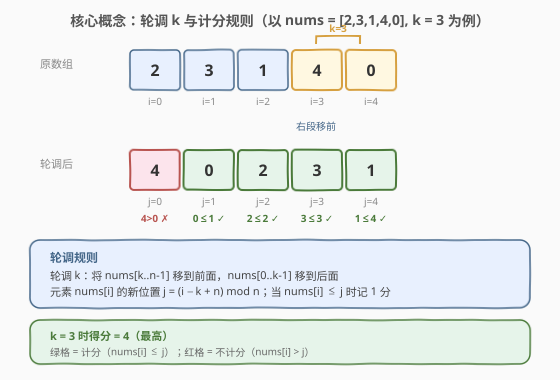
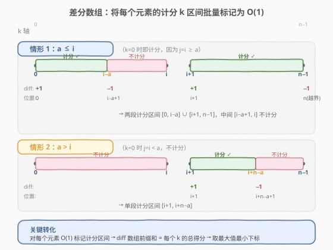
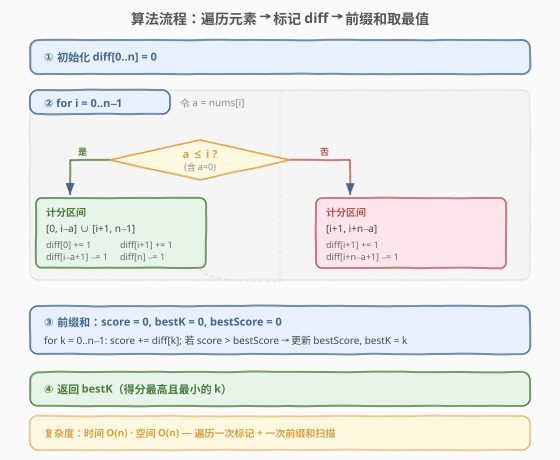

# LeetCode 得分最高的最小轮调 题解

## 1. 题目概述

- **标题 / 题号**：得分最高的最小轮调（#798，hard）
- **链接**：https://leetcode.cn/problems/smallest-rotation-with-highest-score/
- **难度**：困难
- **标签**：数组、差分数组、前缀和

**题意**：给定数组 `nums`（长度为 $n$），可以按非负整数 $k$ 进行**轮调**：将 `nums[k..n-1]` 移到前面，`nums[0..k-1]` 移到后面，得到

$$[\text{nums}[k],\; \text{nums}[k{+}1],\; \ldots,\; \text{nums}[n{-}1],\; \text{nums}[0],\; \ldots,\; \text{nums}[k{-}1]]$$

轮调后，任何**值小于或等于其索引**的项记 $1$ 分。在所有可能的轮调中，返回**得分最高**的 $k$；若有多个，返回**最小的** $k$。

**示例 1**：

```text
输入：nums = [2,3,1,4,0]
输出：3
解释：
k = 0,  [2,3,1,4,0],  score 2
k = 1,  [3,1,4,0,2],  score 3
k = 2,  [1,4,0,2,3],  score 3
k = 3,  [4,0,2,3,1],  score 4  ← 最高
k = 4,  [0,2,3,1,4],  score 3
```

**示例 2**：

```text
输入：nums = [1,3,0,2,4]
输出：0
解释：无论 k 取何值，得分始终为 3，返回最小 k = 0。
```

**约束**：

- $1 \le \text{nums.length} \le 10^5$
- $0 \le \text{nums}[i] < \text{nums.length}$

> 💡 $n \le 10^5$ 意味着暴力 $O(n^2)$ 必然超时（$10^{10}$ 量级）。突破口在于：不逐个 $k$ 去算得分，而是对**每个元素**找出它**在哪些 $k$ 下计分**，再用**差分数组** $O(1)$ 批量标记，最终一次前缀和还原所有 $k$ 的得分。

## 2. 解题思路

### 2.1 暴力思路

对每个 $k \in [0, n-1]$，构造轮调后的数组，逐位置检查 `nums_new[j] <= j` 并累加得分，取最大值。时间 $O(n^2)$，$n = 10^5$ 时约 $10^{10}$ 次操作，超时。

> 💡 转机：与其问「每个 $k$ 的得分是多少」，不如问「每个元素在哪些 $k$ 下计分」——后者把视角从「按 $k$ 聚合」翻转为「按元素贡献」，每个元素的贡献是一个 $k$ 上的**区间**，可用差分数组 $O(1)$ 标记。

### 2.2 核心观察：元素的新位置与计分条件



轮调 $k$ 后，原数组中索引为 $i$ 的元素 `nums[i]` 移到**新位置**

$$j = (i - k + n) \bmod n$$

该元素计分当且仅当 $\text{nums}[i] \le j$，即

$$\text{nums}[i] \le (i - k + n) \bmod n$$

令 $a = \text{nums}[i]$。随着 $k$ 从 $0$ 递增到 $n-1$，$j$ 从 $i$ 递减到 $0$，再跳到 $n-1$ 继续递减——**$j$ 遍历 $0 \sim n{-}1$ 的一个排列**。元素计分当 $j \ge a$，即 $j$ 落在 $[a,\, n{-}1]$ 区间内。

关键在于：$j$ 递减经过 $a$ 时会发生「计分 → 不计分」的翻转，而 $j$ 从 $0$ 跳回 $n{-}1$ 时会发生「不计分 → 计分」的翻转。因此每个元素的计分 $k$ 区间最多由**两段**构成，取决于 $a$ 与 $i$ 的相对大小：

| 情形 | 条件 | 计分 $k$ 区间 | 说明 |
|------|------|---------------|------|
| **情形 1** | $a \le i$ | $[0,\; i{-}a] \;\cup\; [i{+}1,\; n{-}1]$ | $k{=}0$ 时 $j{=}i \ge a$ 即计分；$k$ 增到 $i{-}a{+}1$ 时 $j$ 降到 $a{-}1$ 停止计分；$k{=}i{+}1$ 时 $j$ 跳回 $n{-}1$ 恢复计分直到末尾 |
| **情形 2** | $a > i$ | $[i{+}1,\; i{+}n{-}a]$ | $k{=}0$ 时 $j{=}i < a$ 不计分；$k{=}i{+}1$ 时 $j$ 跳回 $n{-}1$ 开始计分；$k{=}i{+}n{-}a{+}1$ 时 $j$ 降到 $a{-}1$ 停止 |

> ⚠️ **$a = 0$ 的特例**：$a = 0 \le i$ 恒成立（$i \ge 0$），归入情形 1。此时 $i - a = i$，区间 $[0, i] \cup [i{+}1, n{-}1] = [0, n{-}1]$，即**所有 $k$ 都计分**——因为 $j \ge 0$ 恒成立。代码无需特殊处理，自然兼容。

### 2.3 差分数组：批量标记计分区间



有了每个元素的计分 $k$ 区间，用**差分数组** `diff[0..n]` 批量标记：

- 区间 $[l, r]$ 计分 → `diff[l] += 1`，`diff[r+1] -= 1`
- 所有元素标记完毕后，对 `diff` 做前缀和即得每个 $k$ 的总得分

**情形 1**（$a \le i$）两段区间：

```
diff[0]      += 1    // [0, i-a] 开始
diff[i-a+1]  -= 1    // [0, i-a] 结束
diff[i+1]    += 1    // [i+1, n-1] 开始
diff[n]      -= 1    // [i+1, n-1] 结束（越界，可不写）
```

**情形 2**（$a > i$）一段区间：

```
diff[i+1]        += 1    // [i+1, i+n-a] 开始
diff[i+n-a+1]    -= 1    // [i+1, i+n-a] 结束
```

### 2.4 算法流程图



**完整步骤**：

1. **初始化** `diff[0..n] = 0`。
2. **遍历** $i = 0 \ldots n{-}1$，令 $a = \text{nums}[i]$：
   - 若 $a \le i$：`diff[0] += 1`，`diff[i-a+1] -= 1`，`diff[i+1] += 1`，`diff[n] -= 1`
   - 若 $a > i$：`diff[i+1] += 1`，`diff[i+n-a+1] -= 1`
3. **前缀和**：`score = 0`，`bestK = 0`，`bestScore = 0`；遍历 $k = 0 \ldots n{-}1$：`score += diff[k]`，若 `score > bestScore` 则更新 `bestScore = score`，`bestK = k`。
4. **返回** `bestK`。

> 💡 **为什么用 `>` 而非 `>=`**：题目要求「多个答案取最小 $k$」。从前向后扫描，遇到**严格更大**的得分才更新，保证相同得分时保留先出现（更小）的 $k$。

### 2.5 示例演算

以 `nums = [2, 3, 1, 4, 0]`，$n = 5$ 为例：

![示例演算：nums = [2,3,1,4,0]](../images/smallest_rotation_walkthrough.svg)

| $i$ | $a$ | 条件 | 计分 $k$ 区间 | diff 标记 |
|-----|-----|------|--------------|-----------|
| 0 | 2 | $a > i$ | $[1,\, 3]$ | `diff[1] += 1`，`diff[4] -= 1` |
| 1 | 3 | $a > i$ | $[2,\, 3]$ | `diff[2] += 1`，`diff[4] -= 1` |
| 2 | 1 | $a \le i$ | $[0,1] \cup [3,4]$ | `diff[0] += 1`，`diff[2] -= 1`，`diff[3] += 1`，`diff[5] -= 1` |
| 3 | 4 | $a > i$ | $[4,\, 4]$ | `diff[4] += 1`，`diff[5] -= 1` |
| 4 | 0 | $a \le i$ | $[0,\, 4]$（全计分） | `diff[0] += 1`，`diff[5] -= 1` |

累加后 `diff = [+2, +1, −2, +1, −1, −3]`，前缀和（得分序列）：

| $k$ | 0 | 1 | 2 | 3 | 4 |
|-----|---|---|---|---|---|
| score | 2 | 3 | 3 | **4** | 3 |

最高得分 $= 4$，对应 $k = 3$ ✓。

## 3. 参考代码

### C++

```cpp
class Solution {
  public:
    int bestRotation(vector<int>& nums) {
        int n = nums.size();
        vector<int> diff(n + 1, 0);
        for (int i = 0; i < n; ++i) {
            int a = nums[i];
            if (a <= i) {
                diff[0] += 1;
                diff[i - a + 1] -= 1;
                diff[i + 1] += 1;
                diff[n] -= 1;
            } else {
                diff[i + 1] += 1;
                diff[i + n - a + 1] -= 1;
            }
        }
        int bestK = 0, bestScore = 0, score = 0;
        for (int k = 0; k < n; ++k) {
            score += diff[k];
            if (score > bestScore) {
                bestScore = score;
                bestK = k;
            }
        }
        return bestK;
    }
};
```

### Python

```python
class Solution:
    def bestRotation(self, nums: List[int]) -> int:
        n = len(nums)
        diff = [0] * (n + 1)
        for i, a in enumerate(nums):
            if a <= i:
                diff[0] += 1
                diff[i - a + 1] -= 1
                diff[i + 1] += 1
                diff[n] -= 1
            else:
                diff[i + 1] += 1
                diff[i + n - a + 1] -= 1

        best_k = 0
        best_score = 0
        score = 0
        for k in range(n):
            score += diff[k]
            if score > best_score:
                best_score = score
                best_k = k
        return best_k
```

> 💡 **两个实现细节**：
> 1. **`diff` 数组大小为 $n+1$**：区间结束标记 `diff[r+1] -= 1` 中 $r+1$ 可能等于 $n$（如情形 1 的第二段 $[i{+}1, n{-}1]$，结束标记在 `diff[n]`）。多开一位避免越界，前缀和只扫描 $k \in [0, n{-}1]$，`diff[n]` 不参与最终得分。
> 2. **`diff[n] -= 1` 可省略**：由于前缀和循环只到 $k = n{-}1$，`diff[n]` 永远不会被累加到 `score` 中。但写上可使逻辑完整、便于理解区间边界，不影响正确性。

## 4. 复杂度分析

| 维度 | 复杂度 | 说明 |
|------|--------|------|
| 时间复杂度 | $O(n)$ | 遍历 $n$ 个元素各 $O(1)$ 标记 diff + 一次 $O(n)$ 前缀和扫描 |
| 空间复杂度 | $O(n)$ | diff 数组大小 $n+1$ |

> 💡 从暴力 $O(n^2)$ 降到 $O(n)$ 的关键：**视角翻转**——不逐 $k$ 计算得分，而是逐元素确定计分区间，用差分数组将「区间加 1」压缩为 $O(1)$ 的两端标记。

## 5. 扩展：区间更新的本质——差分数组

本题的核心技巧是**差分数组**（Difference Array），它是处理「批量区间加减」的通用工具：

- **场景**：对数组 `A` 的多个区间 $[l_j, r_j]$ 各加 $v_j$，最终求每个位置的值。
- **做法**：维护 `diff` 数组，对每个区间 `diff[l] += v`，`diff[r+1] -= v`；最后对 `diff` 做前缀和即得最终 `A`。
- **复杂度**：每次区间更新 $O(1)$，最终还原 $O(n)$，总计 $O(m + n)$（$m$ 为更新次数）。

> 💡 差分数组是树状数组/线段树的「退化版」——只支持**离线**批量区间更新 + 单点查询，不支持在线查询或区间查询。但当问题只需最终结果时，它以最低的代码复杂度和常数因子胜出。

**对比线段树**：

| 维度 | 差分数组 | 线段树 |
|------|----------|--------|
| 区间更新 | $O(1)$ | $O(\log n)$ |
| 最终还原 | $O(n)$ 一次性 | 无需还原，随时可查 |
| 在线查询 | ❌ 不支持 | ✅ 支持 |
| 代码复杂度 | 极低（几行） | 较高（模板代码） |
| 适用场景 | 离线批量更新 | 在线动态查询 |

当题目只需「所有更新完成后的最终状态」时，差分数组总是首选。

## 6. 面试要点

1. **为什么不能逐 $k$ 暴力计算？如何想到差分数组？**

   - $n \le 10^5$，暴力 $O(n^2) = 10^{10}$ 必然超时。关键转换：把「对每个 $k$ 求得分」翻转为「对每个元素求它在哪些 $k$ 下计分」。后者的答案是 $k$ 上的连续区间，而「对多个区间批量加 1 再求每个位置的值」正是差分数组的招牌场景。

2. **如何推导每个元素的计分 $k$ 区间？**

   - 元素 `nums[i]` 轮调 $k$ 后位于 $j = (i - k) \bmod n$，计分当 $a \le j$。随 $k$ 递增，$j$ 从 $i$ 递减到 $0$ 再跳回 $n{-}1$。$j \ge a$ 的 $k$ 构成连续区间（情形 1 两段，情形 2 一段），边界由 $j = a$ 和 $j$ 的跳变点 $k = i \to i{+}1$ 决定。

3. **$a = 0$ 时为什么不需要特判？**

   - $a = 0 \le i$ 恒成立（$i \ge 0$），走情形 1 的逻辑。此时 $i - a = i$，两段 $[0, i] \cup [i{+}1, n{-}1]$ 合并为 $[0, n{-}1]$，即所有 $k$ 都计分。`diff` 标记后 `diff[0] += 1` 与 `diff[i+1]` 的 `+1/−1` 抵消，净效果是对全部 $k$ 加 1，正确。

4. **`diff[n] -= 1` 为什么可以省略？**

   - 前缀和循环 `for k = 0 to n-1` 只累加 `diff[0..n-1]`，`diff[n]` 永远不被读取。它只是逻辑上标记区间 $[i{+}1, n{-}1]$ 的右端 $+1$ 位置，写上为了完整性，省略不影响结果。

5. **为什么更新条件是 `score > bestScore` 而非 `>=`？**

   - 题目要求多个最高分中取**最小** $k$。从前向后扫描，遇到严格更大的得分才更新，保证相同得分时保留先出现（更小）的 $k$。若用 `>=`，后面的相同得分会覆盖前面的，返回更大的 $k$，不合题意。

> 💡 **一句话总结**：本题的本质是「**视角翻转 + 差分数组**」——不逐 $k$ 算得分，而是逐元素找计分区间，用 diff 将 $n$ 个区间更新压缩到 $O(n)$，一次前缀和还原所有得分。差分数组是处理「离线批量区间加减」的终极工具。

## 同类练习题

| # | 题目 | 与本题的关联 |
|---|------|-------------|
| 1109 | [航班预订统计](https://leetcode.cn/problems/corporate-flight-bookings/) | 差分数组招牌题——每条预订是一个区间加，前缀和还原各航班座位数，与本题「区间标记 + 前缀和」完全同构 |
| 1094 | [拼车](https://leetcode.cn/problems/car-pooling/) | 差分数组判定容量——乘客上下车即区间加减，前缀和检查是否超载，本题 diff 的直接应用 |
| 189 | [轮转数组](https://leetcode.cn/problems/rotate-array/)（[题解](../0101-0200/189_轮转数组.md)） | 数组轮转的基本操作（三段反转 / 环状替换），本题轮调机制的底层操作 |
| 719 | [找出第 K 小的数对距离](https://leetcode.cn/problems/find-k-th-smallest-pair-distance/)（[题解](../0701-0800/719_找出第K小的数对距离.md)） | 二分答案 + 双指针计数，对照本题「将逐个枚举转化为批量处理」的降维思路 |
| 239 | [滑动窗口最大值](https://leetcode.cn/problems/sliding-window-max-value/)（[题解](../0201-0300/239_滑动窗口最大值.md)） | 单调队列处理滑动窗口，对照本题用 diff 处理「区间贡献」的不同批量技巧 |
