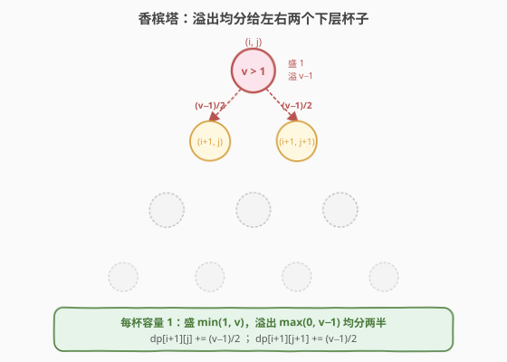
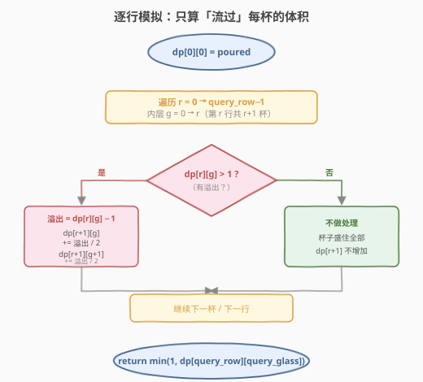
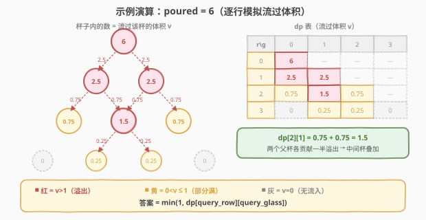

# 香槟塔

- **题目名称**：香槟塔
- **链接**：[799. 香槟塔](https://leetcode.cn/problems/champagne-tower/)
- **难度**：中等
- **标签**：动态规划、模拟

## 1. 题目概述

把玻璃杯摆成金字塔形：第 `0` 行有 1 个杯子，第 `1` 行有 2 个杯子，……，第 `i` 行有 `i + 1` 个杯子。从顶部杯子倒入 `poured` 体积的香槟。每个杯子容量为 1——当杯子里的香槟超过 1 时，多余的部分会**等量**流入下方左右两个杯子（各分一半）。如此层层下溢，直到所有超出的香槟都流出底层（底层杯子下方没有杯子，多余部分直接流到地上）。

返回第 `query_row` 行第 `query_glass` 个杯子中的香槟量。

**示例 1**：

```text
输入：poured = 1, query_row = 1, query_glass = 1
输出：0.00000
解释：顶部杯子恰好倒 1，无溢出，第二行杯子均为空。
```

**示例 2**：

```text
输入：poured = 2, query_row = 1, query_glass = 1
输出：0.50000
解释：顶部(0,0)倒 2，盛满 1 后溢出 1，均分给第二行两杯各 0.5。
```

**示例 3**：

```text
输入：poured = 100000009, query_row = 33, query_glass = 17
输出：1.00000
解释：倒入量极大，第 33 行所有杯子均被盛满。
```

**约束条件**：

- `0 <= poured <= 10^9`
- `0 <= query_row < 100`
- `0 <= query_glass <= query_row`

---

## 2. 解题思路

### 2.1 暴力思路：逐滴模拟？

最直白的想法：把 `poured` 体积看作许多「滴」，逐滴从顶部倒入，每滴满一杯就流向下方。但 `poured` 可达 $10^9$，逐滴模拟必然超时。而且杯子溢出是**连续**的——只要超过 1 就立刻分流，不存在「半滴」的概念。

> 💡 暴力法的失败提示我们：不要跟踪每一滴香槟，而要跟踪**流过每个杯子的总体积**。杯子对液体的处理是线性的（盛住 1，剩余均分两半），因此可以用一个 DP 数组逐行模拟总体积的流动。

### 2.2 核心观察：模拟「流过」每个杯子的体积

关键转换：令 `dp[i][j]` 表示**流经**第 `i` 行第 `j` 个杯子的香槟总体积（即从上方倒入该杯的总量，**尚未截断**）。则：

- 杯子实际盛住：$\min(1,\ \text{dp}[i][j])$
- 溢出量：$\max(0,\ \text{dp}[i][j] - 1)$
- 溢出**均分**给下方两个杯子：各得 $\frac{\max(0,\ \text{dp}[i][j] - 1)}{2}$



上图给出关键直觉：

- 每个杯子容量 1，收到体积 $v$ 后盛住 $\min(1, v)$，溢出 $\max(0, v-1)$。
- 溢出量**对半分**给左下 `dp[i+1][j]` 和右下 `dp[i+1][j+1]`。
- 中间杯会收到**两个父杯**的溢出（来自左上 `(i-1, j-1)` 和右上 `(i-1, j)`），需要累加。

> 💡 **为什么定义「流过体积」而非「盛住量」？** 因为溢出量取决于**流入总量**而非最终盛住量。若直接存盛住量，则无法判断该杯是否溢出过、溢出了多少。存流过体积 $v$，则溢出 $= \max(0, v-1)$ 一步可得，盛住量 $= \min(1, v)$ 也能 O(1) 还原。这是本题的核心状态定义技巧——**让 DP 值携带「是否溢出」的信息**。

### 2.3 算法流程图



算法三步：

1. **初始化**：`dp[0][0] = poured`（全部倒入顶部杯）。
2. **逐行推进**：对第 `r` 行的每个杯 `g`，若 `dp[r][g] > 1`，将溢出 `(dp[r][g] - 1) / 2` 分别加到 `dp[r+1][g]` 和 `dp[r+1][g+1]`。
3. **取答案**：`min(1, dp[query_row][query_glass])`。

> ⚠️ 只需模拟到第 `query_row` 行即可——因为答案只取决于该行的流过体积，更下方的流动不影响结果。

### 2.4 示例演算

以 `poured = 6` 为例，逐行模拟 4 行：



逐行推导：

| 行 r | 各杯流过体积 v | 溢出 / 分流 |
|------|----------------|-------------|
| 0 | `6` | 盛 1，溢 5 → 各 2.5 |
| 1 | `2.5, 2.5` | 各盛 1，溢 1.5 → 各 0.75 |
| 2 | `0.75, 1.5, 0.75` | 中间杯 0.75+0.75=1.5，盛 1 溢 0.5 → 各 0.25 |
| 3 | `0, 0.25, 0.25, 0` | 均不超过 1，无溢出 |

**关键看点——中间杯的累加**：第 2 行中间杯 `dp[2][1]` 同时收到左父杯 `(1,0)` 溢出的 0.75 和右父杯 `(1,1)` 溢出的 0.75，合计 $0.75 + 0.75 = 1.5$。这正是香槟塔结构与 [杨辉三角](../0001-0100/118_杨辉三角.md) 同构的体现——每个杯的流入量等于两个父杯贡献之和，如同帕斯卡三角形的递推。

> 💡 **对照示例 2**（`poured = 2`）：`dp[0][0]=2`，溢 1 → `dp[1][0]=0.5, dp[1][1]=0.5`。答案 `min(1, 0.5) = 0.5` ✓。

---

## 3. 参考代码

### 方法一：二维数组模拟

### C++

```cpp
class Solution {
  public:
    double champagneTower(int poured, int query_row, int query_glass) {
        vector<vector<double>> dp(query_row + 2, vector<double>(query_row + 2, 0.0));
        dp[0][0] = poured;
        for (int r = 0; r <= query_row; ++r) {
            for (int g = 0; g <= r; ++g) {
                if (dp[r][g] > 1.0) {
                    double half = (dp[r][g] - 1.0) / 2.0;
                    dp[r + 1][g] += half;
                    dp[r + 1][g + 1] += half;
                }
            }
        }
        return min(1.0, dp[query_row][query_glass]);
    }
};
```

### Python

```python
class Solution:
    def champagneTower(self, poured: int, query_row: int, query_glass: int) -> float:
        dp = [[0.0] * (query_row + 2) for _ in range(query_row + 2)]
        dp[0][0] = poured
        for r in range(query_row + 1):
            for g in range(r + 1):
                if dp[r][g] > 1.0:
                    half = (dp[r][g] - 1.0) / 2.0
                    dp[r + 1][g] += half
                    dp[r + 1][g + 1] += half
        return min(1.0, dp[query_row][query_glass])
```

### 方法二：滚动数组优化（O(n) 空间）

每行只依赖上一行，可用两个一维数组交替：

### C++

```cpp
class Solution {
  public:
    double champagneTower(int poured, int query_row, int query_glass) {
        vector<double> prev(1, poured);
        for (int r = 0; r < query_row; ++r) {
            vector<double> cur(r + 2, 0.0);
            for (int g = 0; g <= r; ++g) {
                if (prev[g] > 1.0) {
                    double half = (prev[g] - 1.0) / 2.0;
                    cur[g] += half;
                    cur[g + 1] += half;
                }
            }
            prev = move(cur);
        }
        return min(1.0, prev[query_glass]);
    }
};
```

### Python

```python
class Solution:
    def champagneTower(self, poured: int, query_row: int, query_glass: int) -> float:
        prev = [poured]
        for r in range(query_row):
            cur = [0.0] * (r + 2)
            for g in range(r + 1):
                if prev[g] > 1.0:
                    half = (prev[g] - 1.0) / 2.0
                    cur[g] += half
                    cur[g + 1] += half
            prev = cur
        return min(1.0, prev[query_glass])
```

> 💡 **注意循环次数**：方法一从 `r = 0` 遍历到 `query_row`（含），因为要在遍历中填充 `dp[query_row]`；方法二只循环 `query_row` 次（`r = 0` 到 `query_row - 1`），因为每轮把 `prev` 推进一行，循环结束后 `prev` 即第 `query_row` 行。两种写法等价，边界差一是常见易错点。

---

## 4. 复杂度分析

| 维度 | 复杂度 | 说明 |
|------|--------|------|
| 时间复杂度 | $O(R^2)$ | 双重循环遍历前 $R$ 行三角形，总杯数 $\sum_{r=0}^{R} (r+1) = \frac{(R+1)(R+2)}{2}$，$R =$ `query_row` |
| 空间复杂度（方法一） | $O(R^2)$ | 二维数组 $\approx R \times R$ |
| 空间复杂度（方法二） | $O(R)$ | 滚动数组只保留当前行与上一行 |

> ⚠️ `query_row < 100`，故 $R^2 < 10^4$，两种方法均远在时限内。`poured` 虽达 $10^9$，但溢出对半分使每层体积快速衰减，`double` 精度足够（最坏情况误差 $\ll 10^{-5}$，满足题目 $10^{-5}$ 精度要求）。

---

## 5. 扩展：与帕斯卡三角形的关系

若**取消容量上限**（假设杯子容量无限、永不溢出），则体积分布退化为经典的**二项分布**：

$$\text{dp}[i][j] = \text{poured} \times \frac{\binom{i}{j}}{2^i}$$

这正是 [杨辉三角](../0001-0100/118_杨辉三角.md) 的递推 $\binom{i}{j} = \binom{i-1}{j-1} + \binom{i-1}{j}$ 除以 2——每杯从两个父杯各收一半，等价于帕斯卡系数加权。

然而本题的**截断**（`v > 1` 时只溢出 `v - 1`）破坏了线性叠加，使分布不再是干净的二项分布：溢出的杯被「钳制」在 1，多余的体积被推往更深层。因此**无法用闭式公式直接求解**，必须逐行模拟截断后的非线性流动。这也解释了为什么 `poured` 极大时（示例 3），深层杯子仍能被盛满——体积在中间杯堆积溢出后，会持续向下方两侧扩散。

> 💡 **直觉**：中间杯最先溢出（二项分布使中间概率最大），溢出后向两侧「摊平」，最终整个塔趋于均匀盛满，从中间向两边扩散。

---

## 6. 面试要点

1. **为什么定义 `dp[i][j]` 为「流过体积」而非「盛住量」？**

   > 溢出量取决于流入总量。若存盛住量（已被 $\min(1, \cdot)$ 截断），则无法反推该杯是否溢出过、溢出了多少。存流过体积 $v$，溢出 $= \max(0, v-1)$ 一步可得，盛住量 $= \min(1, v)$ 也能 O(1) 还原。核心是让 DP 值携带「是否溢出」的信息。

2. **为什么只需模拟到第 `query_row` 行？**

   > 答案只取决于第 `query_row` 行的流过体积。该行一旦确定，更下方的流动不再影响结果。因此循环到 `query_row` 即可停止，无需模拟整个塔。

3. **中间杯为什么会收到两份贡献？如何处理？**

   > 杯 `(i, j)` 的左父杯 `(i-1, j-1)` 溢出流向 `(i, j)` 和 `(i, j-1)`；右父杯 `(i-1, j)` 溢出流向 `(i, j)` 和 `(i, j+1)`。因此 `(i, j)` 同时收到左右两个父杯的各一半溢出，需要**累加**（`dp[r+1][g] += half`，`dp[r+1][g+1] += half`）。这与杨辉三角的递推结构一致。

4. **`poured` 高达 $10^9$，会有精度问题吗？**

   > 溢出对半分使每层体积快速衰减，但 `poured` 极大时深层杯仍可能收到大量体积。`double` 有 52 位尾数（约 15-16 位有效数字），$10^9$ 量级的值精度仍优于 $10^{-6}$，满足题目 $10^{-5}$ 要求。无需用高精度。

5. **滚动数组方法的循环次数为什么比二维数组少一次？**

   > 二维数组方法遍历 `r = 0` 到 `query_row`（含），在循环体内填充 `dp[r+1]`，最后一次填充的就是 `query_row` 行。滚动数组方法每轮把 `prev` 推进一行，循环 `query_row` 次后 `prev` 已是第 `query_row` 行，故 `range(query_row)` 即可。边界差一极易出错，建议画图验证。

---

## 7. 同类练习题

- [118. 杨辉三角](https://leetcode.cn/problems/pascals-triangle/)（[题解](../0001-0100/118_杨辉三角.md)）：香槟塔的无截断版即为二项分布 $\binom{i}{j}/2^i$，结构同构于杨辉三角递推，每杯 = 两父杯之和
- [120. 三角形最小路径和](https://leetcode.cn/problems/triangle/)（[题解](../0101-0200/120_三角形最小路径和.md)）：同为三角形 DP，每个位置从上方两个父位置转移而来，骨架一致（取 min vs 取累加）
- [62. 不同路径](https://leetcode.cn/problems/unique-paths/)（[题解](../0001-0100/62_不同路径.md)）：2D 网格 DP，每个格子 = 上方 + 左方两路贡献之和，与香槟塔「两父杯累加」同构
- [64. 最小路径和](https://leetcode.cn/problems/minimum-path-sum/)（[题解](../0001-0100/64_最小路径和.md)）：2D 网格 DP，从两方向取最小累加，对比本题从两方向取求和累加
