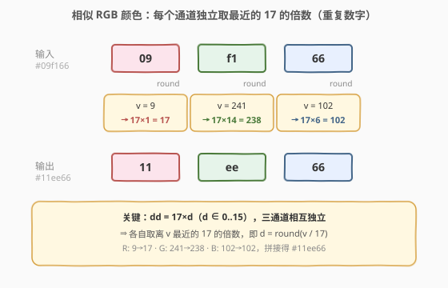
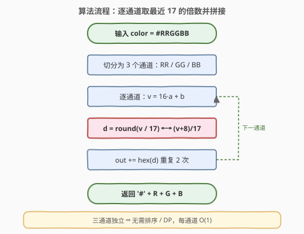
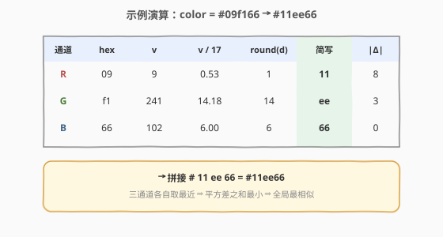

# LeetCode 相似 RGB 颜色 题解

## 1. 题目概述

- **标题 / 题号**：相似 RGB 颜色（#800，easy）
- **链接**：https://leetcode.cn/problems/similar-rgb-color/
- **难度**：简单
- **标签**：数学、字符串

**题意**：一个 RGB 颜色用 7 位字符串 `"#RRGGBB"` 表示，其中 `RR`、`GG`、`BB` 各是两位十六进制数，分别代表红、绿、蓝通道的值（$0 \sim 255$）。

这种颜色可以写成**简写形式** `"#XYZ"`（4 位）：它的含义是把每个数字**重复一次**，即 `"#XYZ"` 等价于 `"#XXYYZZ"`。例如 `"#15c"` 等价于 `"#1155cc"`。

> 💡 也就是说，「能写成简写」的颜色，其每个通道的两位十六进制数必须**相同**（形如 `"dd"`），数值上等于 $17 \times d$（$d \in \{0,1,\ldots,15\}$，因为 `dd` $= 16d + d = 17d$）。

定义两个颜色 `"#RRGGBB"` 与 `"#UUVVWW"` 的**相似度**为：

$$
\text{similarity} = -\big[(R-U)^2 + (G-V)^2 + (B-W)^2\big]
$$

给你一个颜色 `color`，求一个**能写成简写形式**的颜色，使它与 `color` 的相似度**最大**（等价于三通道平方差之和最小）。返回该颜色的 7 位字符串表示。答案唯一。

**示例 1**：

```text
输入：color = "#09f166"
输出："#11ee66"
解释：
  R 通道 "09" = 9，   最近的 17 的倍数是 17  = 0x11 → "11"
  G 通道 "f1" = 241， 最近的 17 的倍数是 238 = 0xee → "ee"
  B 通道 "66" = 102， 最近的 17 的倍数是 102 = 0x66 → "66"
  拼接得 "#11ee66"。
```

**示例 2**（自构造，用于演算边界）：

```text
输入：color = "#1a2b3c"
输出："#223344"
解释：
  "1a" = 26  → 17×2 = 34  = 0x22 → "22"（|26-34|=8 < |26-17|=9，向上取）
  "2b" = 43  → 17×3 = 51  = 0x33 → "33"
  "3c" = 60  → 17×4 = 68  = 0x44 → "44"
  拼接得 "#223344"。三个通道恰好都「向上」靠到下一个重复数字。
```

**示例 3**：

```text
输入：color = "#55aaee"
输出："#55aaee"
解释：每个通道本身已是重复数字（0x55=85=17×5, 0xaa=170=17×10, 0xee=238=17×14），无需改动。
```

**约束**：

- `color.length == 7`
- `color[0] == '#'`
- `color[1]` 到 `color[6]` 均为十六进制数字（`0-9`、`a-f`，小写）
- 答案唯一

> 💡 数据规模固定为 7 位、3 通道，任何解法都是常数时间；本题考点是**把「最相似」翻译成「每通道取最近 17 的倍数」**这一步建模，而非性能优化。

## 2. 解题思路

### 2.1 暴力思路

简写颜色一共 $16^3 = 4096$ 种（每个通道有 $16$ 个候选 `00, 11, 22, …, ff`）。暴力法枚举所有 $4096$ 种简写颜色，对每种计算与 `color` 的三通道平方差之和，取最小者。复杂度 $O(16^3 \times 3) = O(4096)$，常数不大、能通过，但完全没利用题目结构。

> ⚠️ 暴力法的根源：把「三通道」当成一个整体联合搜索，没注意到**目标函数与约束都能按通道拆开**。

### 2.2 核心观察：三通道独立，各取最近的 17 的倍数



关键洞察有两层：

1. **目标函数可分离**：相似度 $-\big[(R-U)^2 + (G-V)^2 + (B-W)^2\big]$ 是三个通道平方差的**和**。要让总和最小，只需让**每一项各自最小**——三者互不耦合。
2. **约束也可分离**：简写要求每个通道形如 `"dd"`，即通道值必须是 $17$ 的倍数 $\{0, 17, 34, \ldots, 255\}$。这条约束也是**逐通道独立**的，R 通道取什么 `dd` 并不影响 G、B。

于是原问题**瓦解为三个完全相同的一维子问题**：

> 给定通道值 $v \in [0, 255]$，在 $\{0, 17, 34, \ldots, 255\}$ 中找离 $v$ 最近者。

使 $(v - 17d)^2$ 最小 $\Leftrightarrow$ 使 $|v - 17d|$ 最小 $\Leftrightarrow$ $d = \mathrm{round}(v/17)$，结果通道值即为 $17d$，写作两位十六进制就是 `"dd"`（数字 $d$ 重复两次）。

> 💡 **为什么是 17？** 简写 `"dd"` 的数值 $= 16d + d = 17d$。所以「可简写通道值」全体恰为 $17$ 的倍数。$17$ 是奇数，$v/17$ 永远不会落在 $0.5$ 处（否则 $v = 17k + 8.5$，非整数），故 `round` 无四舍五入歧义，答案唯一（与题目保证一致）。

### 2.3 算法流程图



把 `color` 去掉首位 `#` 后按两位切分为 `RR / GG / BB`，对每段：解析为整数 $v$，令 $d = \mathrm{round}(v/17)$，输出十六进制数字 $d$ 重复两次；最后拼回 `#`。

### 2.4 示例演算



以示例 1 `color = "#09f166"` 逐通道演算：

| 通道 | hex | $v$ | $v/17$ | $d=\mathrm{round}$ | 简写 `dd` | $\lvert v-17d\rvert$ |
|------|-----|-----|--------|---------------------|-----------|----------------------|
| R | `09` | 9 | 0.53 | 1 | `11` | 8 |
| G | `f1` | 241 | 14.18 | 14 | `ee` | 3 |
| B | `66` | 102 | 6.00 | 6 | `66` | 0 |

三通道各自取最近 $\Rightarrow$ 平方差之和最小 $\Rightarrow$ 拼接得 `"#11ee66"`。

对照示例 2 `"#1a2b3c"`：$26/17{=}1.53{\to}2$、$43/17{=}2.53{\to}3$、$60/17{=}3.53{\to}4$，得 `"#223344"`——三个通道的余数都刚过半（$\ge 9$），故全部「向上」靠到下一个重复数字。

## 3. 参考代码

### C++

```cpp
class Solution {
  public:
    string similarRGB(string color) {
        auto nearest = [](const string& hex2) {
            int v = stoi(hex2, nullptr, 16);
            int d = (v + 8) / 17;                 // 等价 round(v / 17)
            static const char* digits = "0123456789abcdef";
            return string(2, digits[d]);          // 数字 d 重复两次成 "dd"
        };
        return "#" + nearest(color.substr(1, 2))
                     + nearest(color.substr(3, 2))
                     + nearest(color.substr(5, 2));
    }
};
```

### Python

```python
class Solution:
    def similarRGB(self, color: str) -> str:
        def nearest(hexc: str) -> str:
            v = int(hexc, 16)
            d = round(v / 17)                     # 也可写 (v + 8) // 17
            return f"{d:x}" * 2                   # 重复该十六进制数字
        return "#" + nearest(color[1:3]) + nearest(color[3:5]) + nearest(color[5:7])
```

> 💡 **`round(v/17)` 与 `(v+8)/17` 等价**：$(v+8)/17$ 是「最近邻四舍五入」的整数写法（被除数加 $\lfloor 17/2 \rfloor = 8$ 再整除）。如 $v=9$：$(9+8)/17=1$ → `"11"`（$|9-17|{=}8 < |9-0|{=}9$）；$v=8$：$(8+8)/17=0$ → `"00"`（$|8-0|{=}8 < |8-17|{=}9$）。Python 的 `round` 采用「四舍六入五凑偶」，但因 $v/17$ 不会出现 $.5$，结果与整数写法完全一致。

> ⚠️ **易错点**：输出必须**小写**。Python `f"{d:x}"` 与 C++ 中的小写 `digits` 表已保证小写；若误用 `%X` / `format(d,'X')` 会输出大写（如 `"EE"`），不符合题意。

## 4. 复杂度分析

| 维度 | 复杂度 | 说明 |
|------|--------|------|
| 时间 | $O(1)$ | 固定 3 个通道，每通道一次解析 + 一次整除 + 一次格式化，共常数次操作 |
| 空间 | $O(1)$ | 仅用常数个临时变量，输出字符串长度固定为 7 |

> ⚠️ 暴力枚举 $16^3$ 同为 $O(1)$，但常数大 $4096$ 倍且代码更绕；本题优化的是「思路清晰度」而非「能不能过」。

## 5. 扩展：不转整数，直接比较两位数字

把通道 `"ab"`（$a$ 高位、$b$ 低位，均为 $0\sim15$）的值改写：

$$
v = 16a + b = 17a + (b - a)
$$

于是

$$
d = \mathrm{round}\!\left(\frac{v}{17}\right) = a + \mathrm{round}\!\left(\frac{b-a}{17}\right)
$$

而 $b - a \in [-15, 15]$，$(b-a)/17 \in [-0.88, 0.88]$，故：

- $b - a \ge 9$ 时 $\mathrm{round}=1$，$d = a + 1$；
- $b - a \le -9$ 时 $\mathrm{round}=-1$，$d = a - 1$；
- 否则 $\mathrm{round}=0$，$d = a$。

也就是说，**只比较两位十六进制数字的差**就能定出 $d$，无需 `int` 转换与除法：

```python
class Solution:
    def similarRGB(self, color: str) -> str:
        def nearest(hexc: str) -> str:
            a, b = int(hexc[0], 16), int(hexc[1], 16)
            diff = b - a
            d = a + (diff >= 9) - (diff <= -9)     # bool 参与算术：True=1, False=0
            return f"{d:x}" * 2
        return "#" + nearest(color[1:3]) + nearest(color[3:5]) + nearest(color[5:7])
```

校验：`"09"`（$a{=}0,b{=}9$，diff$=9\ge9$）→ $d{=}1$ → `"11"`；`"f1"`（$a{=}15,b{=}1$，diff$={-}14\le{-}9$）→ $d{=}14$ → `"ee"`；`"66"`（diff$=0$）→ $d{=}6$ → `"66"`。与 `round(v/17)` 完全一致。

> 💡 这是「除法变比较」的常见面试变体：当候选值是等差数列（这里是 $17$ 的倍数）时，最近邻往往能用位值拆解化为简单的差值判定，省去除法/取整。思路与 [168. Excel表列名称](https://leetcode.cn/problems/excel-sheet-column-title/) 的 $1$-indexed 偏移技巧同源——都在「进制位值」上做文章。

## 6. 面试要点

1. **为什么三通道可以独立优化，而不必联合搜索 $16^3$？**

   目标函数是三通道平方差的**和**，且简写约束（每通道必须 `dd`）也**逐通道独立**。目标可分离 + 约束可分离 $\Rightarrow$ 联合最小化等于各通道分别最小化之积。这是「可分离优化」的典型范式：只要目标能拆成互不耦合的子项，就降维求解。

2. **`round(v/17)` 为什么等价于 `(v+8)/17`？四舍五入有歧义吗？**

   `(v+m)/m` 的整数除法是最近邻四舍五入的标准写法（加 $\lfloor m/2\rfloor$ 再整除）。此处 $m=17$，$\lfloor 17/2\rfloor=8$。因 $17$ 为奇数，$v/17$ 的余数 $r \in \{0,\ldots,16\}$，半点 $8.5$ 不是整数，故 $r=8$（取下）与 $r=9$（取上）都有唯一更近者，无歧义，答案唯一——与题目「答案唯一」的保证吻合。

3. **`17` 这个数从哪来？**

   简写 `"dd"` 的数值 $= 16d + d = 17d$。所以「可简写的通道值」全体恰为 $\{0, 17, 34, \ldots, 255\}$，即 $17$ 的倍数。把题意翻译成「最近 $17$ 的倍数」是本题最关键的一步建模。

4. **输入若含大写十六进制（如 `"#09F166"`）怎么办？**

   `int(hexc, 16)` 与 C++ `stoi(hex2, nullptr, 16)` 都**大小写不敏感**，解析无碍。输出需统一小写：Python 用 `f"{d:x}"`、C++ 用小写 `digits` 表，避免误用 `%X` 产出大写。

5. **能否不转整数、不用除法直接求 $d$？**

   可以。由 $v = 17a + (b-a)$ 得 $d = a + \mathrm{round}((b-a)/17)$，而 $b-a \in [-15,15]$，故 $d = a + (b{-}a\ge9) - (b{-}a\le{-}9)$，仅用一次差值比较。详见第 5 节，是「等差候选集最近邻 $\to$ 位值差判定」的通用技巧。

## 同类练习题

| # | 题目 | 与本题的关联 |
|---|------|-------------|
| 405 | [数字转换为十六进制数](https://leetcode.cn/problems/convert-a-number-to-hexadecimal/)（[题解](../0401-0500/405_数字转换为十六进制数.md)） | 十进制 ↔ 十六进制字符串转换，本题逆向上色（hex 解析为值、值再格式化回 hex），同为进制 / 位值操作 |
| 171 | [Excel表列序号](https://leetcode.cn/problems/excel-sheet-column-number/)（[题解](../0101-0200/171_Excel表列序号.md)） | 进制合成方向（字符串 → 数值），对照本题 `int(hexc, 16)` 解析通道值 |
| 168 | [Excel表列名称](https://leetcode.cn/problems/excel-sheet-column-title/) | 进制分解方向（数值 → 字符串），其 $1$-indexed 偏移技巧与第 5 节「位值拆解」同源 |
| 12 | [整数转罗马数字](https://leetcode.cn/problems/integer-to-roman/)（[题解](../0001-0100/12_整数转罗马数字.md)） | 把数值映射到符号串，本题把通道值映射到重复十六进制数字，同为「数值 → 符号编码」 |
| 13 | [罗马数字转整数](https://leetcode.cn/problems/roman-to-integer/)（[题解](../0001-0100/13_罗马数字转整数.md)） | 符号 → 数值的反向解码，对照本题 hex → int 方向 |
