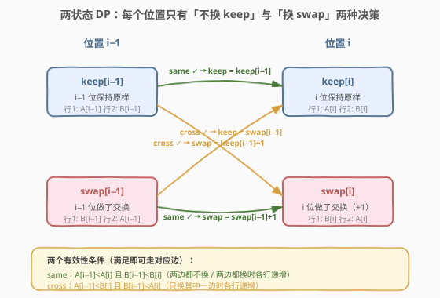

# 使序列递增的最小交换次数

- **题目名称**：使序列递增的最小交换次数
- **链接**：[801. 使序列递增的最小交换次数](https://leetcode.cn/problems/minimum-swaps-to-make-sequences-increasing/)
- **难度**：困难
- **标签**：数组、动态规划、状态机 DP

## 1. 题目概述

给定两个**长度相同**的整数数组 `nums1` 和 `nums2`。一次操作可以选择某个下标 `i`，**交换** `nums1[i]` 与 `nums2[i]`（同一列上下互换）。问最少需要多少次交换，才能使 `nums1` 和 `nums2` **都严格递增**。题目保证输入一定有解。

**示例 1**：

```text
输入：nums1 = [1,3,5,4], nums2 = [1,2,3,7]
输出：1
解释：交换下标 3：nums1 变 [1,3,5,7]，nums2 变 [1,2,3,4]，两者均严格递增。
```

**示例 2**：

```text
输入：nums1 = [0,3,5,8,9], nums2 = [2,1,4,6,9]
输出：1
解释：交换下标 0：nums1 变 [2,3,5,8,9]，nums2 变 [0,1,4,6,9]，两者均严格递增。
      （nums2 原始前两位 2,1 递减，必须换一个；换下标 0 或 1 均可，最少 1 次。）
```

**约束条件**：

- `2 <= nums1.length <= 10^5`
- `nums2.length == nums1.length`
- `0 <= nums1[i], nums2[i] <= 2 * 10^5`
- 输入保证存在使两数组严格递增的交换方案

> ⚠️ 关键在于「交换只发生在同一列」——选了某列换，该列两个值对调，但**不影响相邻列的原始值**。因此第 `i` 列是否换，只与第 `i−1` 列是否换有关，构成一个**逐列推进的状态机 DP**。

---

## 2. 解题思路

### 2.1 暴力思路

每列有「换」或「不换」两种选择，`n` 列共 $2^n$ 种组合，逐一枚举并检查两数组是否严格递增。`n` 可达 $10^5$，必然超时。但其中存在大量重叠子问题：前 `i` 列的最优决策只取决于「第 `i` 列换/不换」这一终态，与更早列的具体换法无关——天然适合 DP。

### 2.2 核心观察：每个位置只有两个状态



关键洞察是**状态极度稀疏**：对于第 `i` 列，我们只关心它最终处于两种状态中的哪一种——

> - `keep`：第 `i` 列**不换**（行 1 取 `A[i]`，行 2 取 `B[i]`）时，使前 `i+1` 列两行都严格递增的**最小交换次数**。
> - `swap`：第 `i` 列**换**（行 1 取 `B[i]`，行 2 取 `A[i]`）时，使前 `i+1` 列两行都严格递增的**最小交换次数**。

为什么只需要这两个状态？因为「严格递增」是**相邻约束**：第 `i` 列的值只需与第 `i−1` 列的值比较。第 `i−1` 列之前的列无论怎么换，对第 `i` 列的影响全部凝结在「第 `i−1` 列最终呈现的两组值」里——而这又只取决于第 `i−1` 列换不换。于是状态机只有两个节点，转移只看相邻两列。

#### 两个有效性条件

从第 `i−1` 列到第 `i` 列，能否合法过渡取决于两组比较：

$$
\text{same} = \bigl(A[i\!-\!1] < A[i]\bigr) \;\wedge\; \bigl(B[i\!-\!1] < B[i]\bigr)
$$

$$
\text{cross} = \bigl(A[i\!-\!1] < B[i]\bigr) \;\wedge\; \bigl(B[i\!-\!1] < A[i]\bigr)
$$

> 💡 **直觉解读**：
> - `same` 为真 ⇒ 第 `i−1` 列和第 `i` 列**保持相同决策**（都不换，或都换）时，两行各自递增。
> - `cross` 为真 ⇒ 第 `i−1` 列和第 `i` 列**做相反决策**（恰好换一个）时，两行各自递增。

#### 四条转移边

据此可画出状态机的四条边（见上图）：

| 起点状态 | 终点状态 | 生效条件 | 代价 |
|----------|----------|----------|------|
| `keep[i−1]` | `keep[i]` | `same` | `keep[i−1]` |
| `swap[i−1]` | `swap[i]` | `same` | `swap[i−1] + 1` |
| `keep[i−1]` | `swap[i]` | `cross` | `keep[i−1] + 1` |
| `swap[i−1]` | `keep[i]` | `cross` | `swap[i−1]` |

每条边的「+1」来自终点状态本身在第 `i` 列做了一次交换。对每个新状态取**所有入边的最小值**即得递推：

$$
\text{keep}[i] = \min\bigl(\text{same} ?\ \text{keep}[i\!-\!1] : \infty,\ \ \text{cross} ?\ \text{swap}[i\!-\!1] : \infty\bigr)
$$

$$
\text{swap}[i] = \min\bigl(\text{cross} ?\ \text{keep}[i\!-\!1]+1 : \infty,\ \ \text{same} ?\ \text{swap}[i\!-\!1]+1 : \infty\bigr)
$$

**边界**：`keep[0] = 0`（第 0 列不换，0 次操作），`swap[0] = 1`（第 0 列换，1 次操作）。第 0 列没有前驱，两个状态天然合法。

**答案**：`min(keep[n−1], swap[n−1])`。

> ⚠️ **为什么一定有解就保证每个状态至少有一条入边？** 题目保证存在一种全列合法方案。对任意相邻两列，该方案要么两边决策相同（`same` 必为真），要么相反（`cross` 必为真）——否则该方案在第 `i` 列就破坏了递增。因此 `same` 与 `cross` **至少有一个为真**，每个新状态至少能从一条边到达，DP 中不会出现「全 ∞」的死角。

### 2.3 算法流程图


由于 `keep[i]`、`swap[i]` 只依赖 `i−1` 的值，用两个变量滚动即可，空间压到 $O(1)$。每轮先算出 `same`、`cross`，再用**临时变量**暂存新值后统一赋值——因为 `keep` 和 `swap` 互相依赖对方**旧值**，若顺序赋值会覆盖。

### 2.4 示例演算

以 `nums1 = [1,3,5,4]`、`nums2 = [1,2,3,7]` 为例，逐列跟踪两个滚动变量：


| i | A[i−1]→A[i] | B[i−1]→B[i] | same | cross | keep | swap | 说明 |
|---|-------------|-------------|------|-------|------|------|------|
| 0 | — | — | — | — | 0 | 1 | 边界：不换 0 次，换 1 次 |
| 1 | 1→3 | 1→2 | ✓ | ✓ | 0 | 1 | 两条件都通，取最小；不换仍最优 |
| 2 | 3→5 | 2→3 | ✓ | ✗ | 0 | 2 | cross 不通；swap 只能从 swap[i−1]+1 继承 |
| 3 | 5→4 | 3→7 | ✗ | ✓ | 2 | 1 | same 不通；keep 从 swap[i−1] 来，swap 从 keep[i−1]+1 来 |

`min(keep[3], swap[3]) = min(2, 1) = 1`，即只在第 3 列交换一次。

> 💡 **第 3 列是关键转折**：`A[2]=5 > A[3]=4` 导致 `same` 失效——若第 2、3 列都不换，行 1 出现 `5,4` 递减，非法。只能让其中一列换：`cross` 告诉我们「换一个」可行。从代价看，`keep[i−1]+1 = 0+1 = 1`（前两列不动、第 3 列换）比 `swap[i−1] = 2`（第 2 列已换、第 3 列不换）更省，故选 swap。

---

## 3. 参考代码

### C++

```cpp
class Solution {
  public:
    int minSwap(vector<int>& nums1, vector<int>& nums2) {
        int keep = 0, swap = 1;          // 第 0 列：不换 0 次，换 1 次
        for (int i = 1; i < (int)nums1.size(); ++i) {
            bool same  = nums1[i - 1] < nums1[i] && nums2[i - 1] < nums2[i];
            bool cross = nums1[i - 1] < nums2[i] && nums2[i - 1] < nums1[i];
            int nk = min(same  ? keep : INT_MAX,
                         cross ? swap : INT_MAX);
            int ns = min(cross ? keep + 1 : INT_MAX,
                         same  ? swap + 1 : INT_MAX);
            keep = nk;
            swap = ns;
        }
        return min(keep, swap);
    }
};
```

### Python

```python
class Solution:
    def minSwap(self, nums1: List[int], nums2: List[int]) -> int:
        keep, swap = 0, 1
        for i in range(1, len(nums1)):
            same  = nums1[i - 1] < nums1[i] and nums2[i - 1] < nums2[i]
            cross = nums1[i - 1] < nums2[i] and nums2[i - 1] < nums1[i]
            nk = min(keep if same  else float('inf'),
                     swap if cross else float('inf'))
            ns = min(keep + 1 if cross else float('inf'),
                     swap + 1 if same  else float('inf'))
            keep, swap = nk, ns
        return min(keep, swap)
```

> ⚠️ **易错点**：必须用 `nk`、`ns` 暂存新值，**最后再统一赋值** `keep = nk; swap = ns`。若先写 `keep = ...` 再用它算 `swap`，会把新值当旧值用导致错误——这与 [152. 乘积最大子数组](https://leetcode.cn/problems/maximum-product-subarray/) 中 `maxP`/`minP` 互依更新的陷阱同源。

---

## 4. 复杂度分析

| 维度 | 复杂度 | 说明 |
|------|--------|------|
| 时间复杂度 | $O(n)$ | 只遍历一次数组，每步 4 次比较 + 2 次 min，均为 $O(1)$ |
| 空间复杂度 | $O(1)$ | 仅用 `keep`、`swap` 两个滚动变量（及两个临时变量） |

---

## 5. 扩展：贪心可行性讨论

有人会想：能否贪心地「能不换就不换」？答案是不行。考虑 `A = [3,3,8]`、`B = [1,3,7]`：

- 第 1 列 `same`（3<3）失效但 `cross`（3<3）也失效——看似无解，实则这是构造的反例片段。真实反例更隐蔽：某些位置「当下不换」虽合法，却把后续逼入必须多换的窘境；而「当下换一次」虽多花 1，却让后面省 2。

本质上，**第 `i` 列的决策影响第 `i+1` 列的可用边**（因为换/不换改变了呈现给下一列的值）。这种「当前代价小 ⇒ 后继代价大」的权衡正是 DP 最擅长处理的——局部贪心无法窥见后效性。所以本题必须用 DP 穷尽两个状态的最小代价，而非单链贪心。

> 💡 一个有趣的观察：若某步 `same` 与 `cross` 同时为真，则两条入边都通，状态机在此处「分叉」，DP 自然选代价小的；若只有一个为真，则该步决策被**强制**（只能走那条边），这正是题目保证有解的体现。

---

## 6. 面试要点

1. **为什么每个位置只需 keep/swap 两个状态？**
   - 严格递增是相邻约束：第 `i` 列只与第 `i−1` 列比较。第 `i−1` 列之前如何换，对第 `i` 列的影响全部凝结在「第 `i−1` 列最终呈现的两组值」里，而这又只取决于它换不换。两个状态足以刻画所有与未来相关的信息，无后效性。

2. **`same` 和 `cross` 两个条件各自对应哪类转移？**
   - `same` 对应「两列决策相同」的边：`keep→keep` 与 `swap→swap`（都不换或都换，各行原序递增）。
   - `cross` 对应「两列决策相反」的边：`keep→swap` 与 `swap→keep`（恰换一列，交叉后各行递增）。

3. **为什么更新时要用临时变量暂存？**
   - `keep` 和 `swap` 的新值都依赖对方**上一轮旧值**。若顺序赋值，先更新的会覆盖旧值，后更新的就拿到错值。用 `nk`/`ns` 暂存后统一赋值，可保证两者基于同一轮旧值。

4. **题目保证有解，对 DP 意味着什么？**
   - 意味着任意相邻两列 `same` 与 `cross` **至少有一个为真**（否则任何方案在此处都破坏递增）。因此每个新状态至少有一条入边可达，DP 不会出现 `∞` 死角，最终答案有限。

5. **能否把空间从 $O(n)$ 优化到 $O(1)$？**
   - 可以。`keep[i]`、`swap[i]` 只依赖 `i−1`，无需保留整张 DP 表，两个滚动变量即可。这也是状态机 DP 的常见优化，与 [198. 打家劫舍](https://leetcode.cn/problems/house-robber/)、[152. 乘积最大子数组](https://leetcode.cn/problems/maximum-product-subarray/) 的滚动手法一致。

---

## 7. 同类练习题

- [152. 乘积最大子数组](https://leetcode.cn/problems/maximum-product-subarray/)（[题解](../0101-0200/152_乘积最大子数组.md)）：同样「两状态互依 + 滚动变量暂存」的套路，maxP/minP 同步更新
- [198. 打家劫舍](https://leetcode.cn/problems/house-robber/)：一维状态机 DP，`rob`/`notRob` 两状态滚动，体会「当前决策依赖前一步终态」
- [213. 打家劫舍 II](https://leetcode.cn/problems/house-robber-ii/)：环形约束下的状态机 DP，拆环为线后套用两状态滚动
- [790. 多米诺和托米诺平铺](https://leetcode.cn/problems/domino-and-tromino-tiling/)（[题解](../0701-0800/790_多米诺和托米诺平铺.md)）：多状态转移 DP，状态间互依 + 滚动优化，结构同源
- [714. 买卖股票的最佳时机含手续费](https://leetcode.cn/problems/best-time-to-buy-and-sell-stock-with-transaction-fee/)：`hold`/`cash` 两状态机 DP，每日转移 + 滚动变量，与本题同框架
