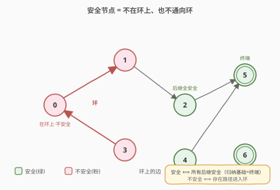
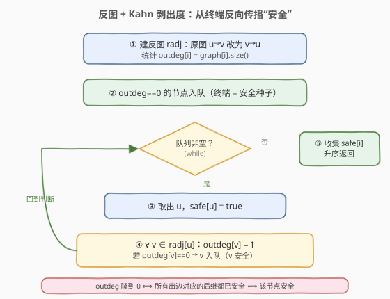
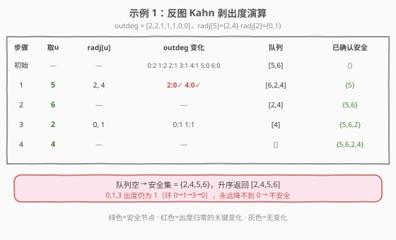

# 找到最终的安全状态

- **题目名称**：找到最终的安全状态
- **链接**：[802. 找到最终的安全状态](https://leetcode.cn/problems/find-eventual-safe-states/)
- **难度**：中等
- **标签**：深度优先搜索、广度优先搜索、图、拓扑排序

## 1. 题目概述

有一个有 `n` 个节点的有向图，节点按 `0` 到 `n-1` 编号。`graph[i]` 是节点 `i` 指向的所有邻居（出边列表）。如果一个节点**没有出边**，称为**终端节点**。如果从某节点出发的**所有可能路径都通向终端节点**（或另一个安全节点），则该节点为**安全节点**。返回图中所有安全节点，按升序排列。

**示例 1**：

```text
输入：graph = [[1,2],[2,3],[5],[0],[5],[],[]]
输出：[2,4,5,6]
解释：节点 5、6 是终端节点。2→5、4→5 都通向终端；而 0→1→3→0 构成环，
      0、1、3 出发可无限绕环，不是安全节点。
```

**示例 2**：

```text
输入：graph = [[1,2,3,4],[1,2],[3,4],[0,4],[]]
输出：[4]
```

**约束条件**：

- `n == graph.length`
- `1 <= n <= 10^4`
- `0 <= graph[i].length <= n`
- `0 <= graph[i][j] <= n-1`
- `graph[i]` 按严格递增顺序排列
- 图中可能包含自环
- 边数在 `[1, 4*10^4]` 内

---

## 2. 解题思路

> ⚠️ **安全节点的等价刻画**：一个节点不安全，当且仅当从它出发**存在一条路径进入环**（含自身在环上）。因此"找安全节点"="找所有不会进入环的节点"，本质仍是**有向图判环**的变体，承接 [207. 课程表](../0201-0300/207_课程表.md)。

### 2.1 暴力思路

对每个节点 `i` 单独做一次 DFS/BFS，看从 `i` 出发是否存在一条走不完（进入环）的路径。若所有路径都最终停在终端节点，则 `i` 安全。单点判定 `O(V+E)`，全部判定 `O(V·(V+E))`，`n=10^4` 时约 `10^8~10^9` 会超时——且大量子路径被重复搜索。

优化方向：**记忆化**——一旦确认某节点安全/不安全，后续搜到它直接复用结论。这引出两种线性做法：DFS 三色标记（自顶向下带记忆），或反图 Kahn 拓扑排序（自底向上剥出度）。

### 2.2 核心观察：安全 = 不在环上也不通向环



关键直觉：

- **终端节点**（出度为 0）天然安全：没有出边，"所有路径"为空，平凡满足。
- **安全节点**的**所有后继**都必须安全——只要有一条边指向不安全节点，从这条边走出去就再也回不到终端，该节点也不安全。
- 反过来，**不安全节点** = 从它出发**存在一条进入环的路径**。环上每个节点都不安全（可无限绕环）；指向环的节点也不安全。

> 💡 一句话：**安全是"全称"谓词——所有后继安全我才安全；不安全是"存在"谓词——有一条路进环就不安全**。这决定了两种线性解法：DFS 自顶向下传播"全安全"结论（三色标记），或反图自底向上剥"出度归零"（Kahn）。

### 2.3 算法一：反图 + Kahn 剥出度（推荐）



把 [207](../0201-0300/207_课程表.md) 的 Kahn"剥入度"反过来用：

1. 统计每个节点的**原图出度** `outdeg[i]`，并建**反图** `radj`（原图 `u→v` 变 `v→u`，于是 `radj[u]` = 原图中指向 `u` 的所有前驱）。
2. 把所有 `outdeg[i]==0` 的终端节点入队——它们是安全的"种子"。
3. Kahn 剥洋葱：取出 `u`（标记安全），对每个 `v ∈ radj[u]`（即原图中 `v→u`），把 `v` 的出度 `−1`（相当于"删掉 `v→u` 这条边"）。
4. 若 `outdeg[v]` 因此降到 0，说明 `v` 的**所有出边都被删光了**——它的所有后继都已确认安全，`v` 也安全，入队。
5. 队列空时，所有被处理过的节点即为安全节点，排序返回。

> 💡 **与 207 的对照**：207 在原图上剥**入度 0**（无前置依赖），判"能否全剥完"；802 在反图上剥**出度 0**（无后继/后继全安全），收集"被剥掉的节点"。前者判环存在性，后者枚举环外节点，同一套 Kahn 框架两种用法。

**为什么对？** `outdeg[v]` 降到 0 当且仅当 `v` 的**每一条**出边 `v→w` 都对应一个已被确认安全的 `w`（边被删除意味着 `w` 安全）。这正是"所有后继安全 → `v` 安全"的逐层归纳：终端节点是归纳基础，反图 Kahn 把安全性从终端沿边反向传播。

### 2.4 算法二：DFS 三色标记

承接 [207](../0201-0300/207_课程表.md) 方法二，三色标记：`0` 未访问、`1` 访问中（在当前递归栈）/ 不安全、`2` 已确认安全。

- `dfs(u)` 开头先查记忆：若 `color[u] > 0`，直接返回 `color[u] == 2`（已判定过，`2` 即安全、`1` 即不安全）。
- 否则置 `color[u] = 1`，遍历每条出边 `u→v` 调用 `dfs(v)`；任一 `dfs(v)` 返回 `false`，则 `u` 也不安全，立即返回 `false`。
- 所有后继都安全 → 置 `color[u] = 2`，返回 `true`。
- 最终 `dfs(i)` 返回 `true` 的节点即安全节点，按下标遍历天然升序。

`color==1` 既表示"在当前栈上"（遇到则构成回边 → 环），也表示"已判定不安全"（记忆化复用）——两者都使 `dfs` 返回 `false`，恰好对应"后继不安全则前驱不安全"。三色保证每点只完整搜索一次，总 `O(V+E)`。

> ⚠️ `n=10^4` 时链状图递归深度可达 `10^4`，Python 默认 `sys.getrecursionlimit()=1000` 会 `RecursionError`，需 `sys.setrecursionlimit(20000)` 或直接用反图 Kahn 规避。

### 2.5 示例演算



以 `graph = [[1,2],[2,3],[5],[0],[5],[],[]]` 为例，原图出度 `outdeg = [2,2,1,1,1,0,0]`，反图 `radj` 中 `radj[5]={2,4}`、`radj[2]={0,1}`（`radj[u]` = 原图指向 `u` 的前驱集合）：

| 步骤 | 取出 u | radj[u]（前驱） | outdeg 变化 | 队列 | 已确认安全 |
|------|--------|-----------------|-------------|------|-----------|
| 初始 | — | — | 0:2 1:2 2:1 3:1 4:1 5:0 6:0 | `[5,6]` | `{}` |
| 1 | 5 | 2, 4 | 2:0✓ 4:0✓ | `[6,2,4]` | `{5}` |
| 2 | 6 | — | — | `[2,4]` | `{5,6}` |
| 3 | 2 | 0, 1 | 0:1 1:1 | `[4]` | `{5,6,2}` |
| 4 | 4 | — | — | `[]` | `{5,6,2,4}` |

队列空，安全集 = `{2,4,5,6}`，升序返回 `[2,4,5,6]`。剩余 `0,1,3` 的 `outdeg` 仍为 1（彼此互指成环 `0→1→3→0`），出度永远降不到 0，正是不安全节点。

---

## 3. 参考代码

### 方法一：反图 + Kahn 剥出度（BFS，推荐）

### C++

```cpp
class Solution {
  public:
    vector<int> eventualSafeNodes(vector<vector<int>>& graph) {
        int n = graph.size();
        vector<vector<int>> radj(n);              // 反图：radj[u] = 原图指向 u 的前驱
        vector<int> outdeg(n, 0);
        for (int u = 0; u < n; ++u) {
            outdeg[u] = graph[u].size();
            for (int v : graph[u]) radj[v].push_back(u);  // 原图 u->v → 反图 v->u
        }

        queue<int> q;
        for (int i = 0; i < n; ++i)
            if (outdeg[i] == 0) q.push(i);        // 终端节点入队

        vector<bool> safe(n, false);
        while (!q.empty()) {
            int u = q.front(); q.pop();
            safe[u] = true;                        // u 安全
            for (int v : radj[u])                  // v 是原图中 v->u 的前驱
                if (--outdeg[v] == 0) q.push(v);   // v 出边删光 → 安全
        }

        vector<int> ans;
        for (int i = 0; i < n; ++i)
            if (safe[i]) ans.push_back(i);
        return ans;                                // 已天然升序
    }
};
```

### Python

```python
from collections import deque

class Solution:
    def eventualSafeNodes(self, graph: List[List[int]]) -> List[int]:
        n = len(graph)
        radj = [[] for _ in range(n)]              # 反图：radj[u] = 原图指向 u 的前驱
        outdeg = [0] * n
        for u in range(n):
            outdeg[u] = len(graph[u])
            for v in graph[u]:
                radj[v].append(u)                  # 原图 u->v → 反图 v->u

        q = deque([i for i in range(n) if outdeg[i] == 0])
        safe = [False] * n
        while q:
            u = q.popleft()
            safe[u] = True
            for v in radj[u]:                      # v 是原图中 v->u 的前驱
                outdeg[v] -= 1
                if outdeg[v] == 0:
                    q.append(v)

        return [i for i in range(n) if safe[i]]
```

### 方法二：DFS 三色标记

### C++

```cpp
class Solution {
    vector<vector<int>> g;
    vector<int> color;   // 0 未访问 / 1 访问中或不安全 / 2 安全
    bool dfs(int u) {
        if (color[u] > 0) return color[u] == 2;    // 记忆化：已判定过
        color[u] = 1;
        for (int v : g[u])
            if (!dfs(v)) return false;             // 任一后继不安全 → u 不安全
        color[u] = 2;                               // 所有后继安全 → u 安全
        return true;
    }
  public:
    vector<int> eventualSafeNodes(vector<vector<int>>& graph) {
        int n = graph.size();
        g = graph;
        color.assign(n, 0);
        vector<int> ans;
        for (int i = 0; i < n; ++i)
            if (dfs(i)) ans.push_back(i);          // i 升序遍历，ans 天然升序
        return ans;
    }
};
```

### Python

```python
class Solution:
    def eventualSafeNodes(self, graph: List[List[int]]) -> List[int]:
        n = len(graph)
        color = [0] * n    # 0 未访问 / 1 访问中或不安全 / 2 安全

        def dfs(u: int) -> bool:
            if color[u] > 0:
                return color[u] == 2               # 记忆化：已判定过
            color[u] = 1
            for v in graph[u]:
                if not dfs(v):
                    return False                   # 任一后继不安全 → u 不安全
            color[u] = 2                           # 所有后继安全 → u 安全
            return True

        return [i for i in range(n) if dfs(i)]
```

> 💡 注意三色版中 `dfs(i)` 返回 `true` 表示 `i` 安全，与 [207](../0201-0300/207_课程表.md) 里"返回 `false` 表示有环"恰好互补——同一套三色模板，207 关心"有没有环"，802 关心"哪些点不在环上"。`if color[u] > 0: return color[u] == 2` 一行同时承担了**回边判定**（栈上灰色节点返回 `false`）与**结果记忆化**（已判定节点直接复用）。

---

## 4. 复杂度分析

| 维度 | 方法 | 复杂度 | 说明 |
|------|------|--------|------|
| 时间复杂度 | 反图 Kahn | $O(V+E)$ | 建反图 $O(E)$；每点入队出队各一次 $O(V)$；每条边删边时访问一次 $O(E)$ |
| 空间复杂度 | 反图 Kahn | $O(V+E)$ | 反图邻接表 $O(V+E)$，出度数组/队列/safe 数组 $O(V)$ |
| 时间复杂度 | DFS 三色 | $O(V+E)$ | 每点完整搜索一次，每条出边沿递归遍历一次 |
| 空间复杂度 | DFS 三色 | $O(V+E)$ | 邻接表 $O(V+E)$，颜色数组 $O(V)$，递归栈最深 $O(V)$ |

> ⚠️ `n=10^4` 时 DFS 链状图递归深度可达 `10^4`，Python 默认递归上限 1000 会 `RecursionError`，需 `sys.setrecursionlimit(20000)` 或直接用反图 Kahn 规避。反图 Kahn 无递归，是大规模数据下的稳妥选择。

---

## 5. 扩展：两种方法的等价性与互推

反图 Kahn 与 DFS 三色本质是同一张图上**自底向上 vs 自顶向下**两种传播方向：

- **反图 Kahn**（自底向上）：从终端节点（出度 0）出发，沿反图边把"安全性"反向传播给前驱。一个节点入队 ⟺ 它的所有后继都已安全——这是"全称谓词"的归纳实现。
- **DFS 三色**（自顶向下）：从每个节点出发向下搜索，遇到环（灰色回边）则判定不安全；整棵子树无环则标记安全（黑色）。黑色节点 = 反图 Kahn 中被剥掉的节点，两者集合完全一致。

形式化地，`outdeg[v]` 在 Kahn 中降到 0，等价于 DFS 中 `v` 的所有后继最终都标记为黑色（安全）——两者都刻画"所有路径终止"。因此两种方法返回的安全集相同，只是求解顺序不同：Kahn 按拓扑逆序（从终端向外）确认，DFS 按深度优先序确认。

> 💡 若题目改为"判断单个节点 `start` 是否安全"，DFS 三色更直接（只从 `start` 搜一次）；若改为"输出所有安全节点"，反图 Kahn 一次 BFS 全收集，更高效且无栈溢出风险。

---

## 6. 面试要点

1. **安全节点的等价定义是什么？**
   - 安全 ⟺ 从该节点出发的所有路径都终止于终端节点 ⟺ 不存在从该节点出发进入环的路径。把"安全"转化为"不在环上且不通向环"，就归结为有向图判环。

2. **为什么要建反图？直接在原图 Kahn 不行吗？**
   - 原图 Kahn 剥的是**入度 0**（无前驱），与"后继是否安全"无关。安全性的传播方向是"后继安全 → 前驱安全"，与边方向相反，所以要在**反图**上做 Kahn，剥的是原图的**出度**。建反图后，原图前驱变成反图后继，Kahn 自然沿"安全→前驱"方向传播。

3. **`outdeg[v]` 降到 0 为什么就代表 v 安全？**
   - `outdeg[v]` 初始等于 `v` 的出边数。每条出边 `v→w` 只在 `w` 被确认安全时才被"删除"（`outdeg[v]−1`）。降到 0 意味着**每一条**出边对应的 `w` 都已安全，即所有后继安全，故 `v` 安全——这是对"安全=全称谓词"的精确归纳。

4. **DFS 三色和反图 Kahn 该用哪个？**
   - 大规模数据（`n` 到 `10^4`+）首选反图 Kahn：无递归栈溢出风险。小规模或需判断单个起点时 DFS 三色更直观。两者复杂度相同，面试写出任一即可，能讲清另一种更显功底。

5. **答案为什么要排序？代码里怎么保证升序？**
   - 题目要求升序返回。两种写法都按 `i = 0..n-1` 的顺序收集安全节点，天然升序，无需额外排序。反图 Kahn 中 BFS 出队顺序虽非升序，但收集时按下标遍历 `safe[]` 数组即得升序。

---

## 7. 同类练习题

- [207. 课程表](https://leetcode.cn/problems/course-schedule/)（[题解](../0201-0300/207_课程表.md)）：原图 Kahn 剥入度判环，802 在反图剥出度找环外节点，同一框架两种用法
- [210. 课程表 II](https://leetcode.cn/problems/course-schedule-ii/)：Kahn 出队顺序即拓扑序，对照 802 中"被剥掉的节点即安全集"
- [2360. 图中的最长环](https://leetcode.cn/problems/longest-cycle-in-a-graph/)：内向基环森林上求最长环，同为出度/反图拓扑思想
- [997. 找到小镇的法官](https://leetcode.cn/problems/find-the-town-judge/)：入度−出度判定信任关系，图上度数统计的简单应用
