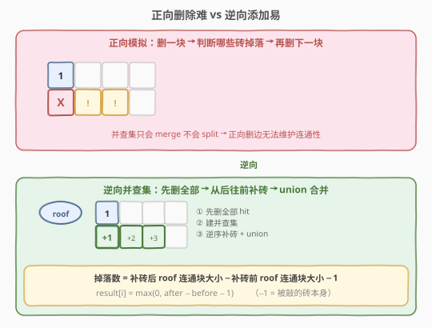
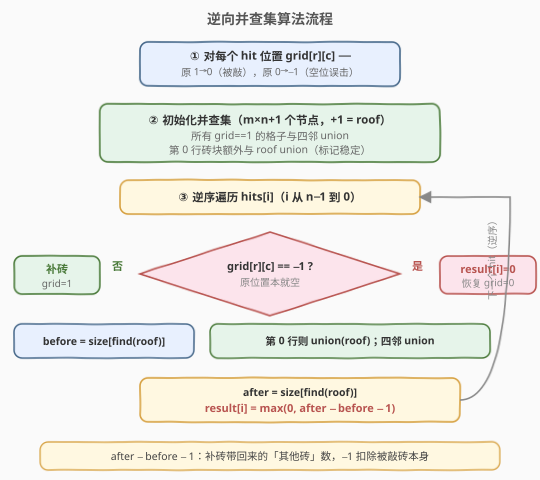
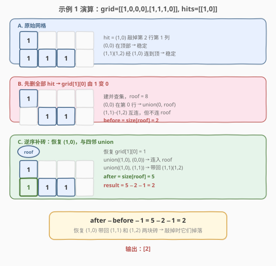

# LeetCode 打砖块 题解

## 1. 题目概述

- **标题 / 题号**：打砖块（#803，hard）
- **链接**：https://leetcode.cn/problems/bricks-falling-when-hit/
- **难度**：困难
- **标签**：并查集、图、逆向思维

**题意**：有一个 `m x n` 的二元网格 `grid`，其中 `1` 表示砖块，`0` 表示空白。砖块**稳定**（不会掉落）的前提是：

- 一块砖直接连接到网格的顶部（第 0 行），或者
- 至少有一块相邻（4 个方向之一）砖块**稳定**不会掉落时

给你一个数组 `hits`，这是需要**依次**消除砖块的位置。每当消除 `hits[i] = (row_i, col_i)` 位置上的砖块时，对应位置的砖块（若存在）会消失，然后其他的砖块可能因为这一消除操作而**掉落**。一旦砖块掉落，它会**立即**从网格中消失（不会落在其他稳定砖块上）。

返回一个数组 `result`，其中 `result[i]` 表示第 `i` 次消除操作对应掉落的砖块数目。

> ⚠️ 消除可能指向没有砖块的空白位置，此时没有砖块掉落，`result[i] = 0`。

**示例 1**：

```text
输入：grid = [[1,0,0,0],[1,1,1,0]], hits = [[1,0]]
输出：[2]
解释：网格开始为：
[[1,0,0,0],
 [1,1,1,0]]
消除 (1,0) 处的砖块，得到网格：
[[1,0,0,0],
 [0,1,1,0]]
两个砖不再稳定（不再与顶部相连），因此掉落。得到网格：
[[1,0,0,0],
 [0,0,0,0]]
因此结果为 [2]。
```

**示例 2**：

```text
输入：grid = [[1,0,0,0],[1,1,0,0]], hits = [[1,1],[1,0]]
输出：[0,0]
解释：消除 (1,1) → 剩余砖块仍稳定，不掉落。
      消除 (1,0) → 剩余砖块仍稳定，不掉落。
结果为 [0,0]。
```

**约束**：

- `m == grid.length`，`n == grid[i].length`
- `1 <= m, n <= 200`
- `grid[i][j]` 为 `0` 或 `1`
- `1 <= hits.length <= 4 * 10^4`
- `hits[i].length == 2`
- `0 <= x_i <= m - 1`，`0 <= y_i <= n - 1`
- 所有 `(x_i, y_i)` 互不相同

## 2. 解题思路

### 2.1 暴力思路

对每次消除操作，将该位置置 `0`，然后从第 0 行所有砖块出发做 BFS/DFS，标记所有仍连通到顶部的砖块。未被标记的砖块即为掉落砖块，置 `0` 并计数。单次消除 $O(mn)$，总共 $O(|hits| \times mn)$。当 $|hits|$ 和 $mn$ 都达到 $4 \times 10^4$ 量级时会超时，且每次都要重新遍历全图，**没有增量复用**。

更关键的是，并查集天生只会 `union`（合并）不会 `split`（分裂）——正向删边后无法高效维护连通性。这驱使我们换一个方向思考。

### 2.2 核心观察：逆向并查集



关键洞察是**翻转时间线**：与其正向「删一块、判掉落」，不如逆向「补一块、判稳回」。

> 并查集只支持合并、不支持分裂。删边难，但**加边易**。于是把问题反过来：先把所有 hit 位置都敲掉，建立初始并查集；再**从最后一个 hit 往前**逐个「补砖」，补砖时 `union` 四邻——补砖带回来的砖块数，就等于当初敲掉时掉落的砖块数。

**roof 节点**：引入一个虚拟节点 `roof = m * n`，让第 0 行所有砖块与它 `union`。一个砖块稳定 ⟺ 它与 `roof` 在同一集合。`size[find(roof)]` 就是当前稳定砖块总数（不含 `roof` 本身时减 1）。

> 💡 **掉落数公式**：补砖前记录 `before = size[find(roof)]`，补砖并 `union` 四邻后记录 `after = size[find(roof)]`。则：
>
> $$\text{result}[i] = \max(0,\ \text{after} - \text{before} - 1)$$
>
> 其中 $-1$ 扣除被敲砖本身（它被补回但不计为「掉落」）。

### 2.3 算法流程图



**详细步骤**：

1. **预先敲掉所有 hit 位置**：对每个 `hits[i]`，执行 `grid[r][c] -= 1`。原值 `1` → `0`（真敲掉），原值 `0` → `-1`（空位误击，后续识别为 no-op）。
2. **建立初始并查集**：初始化 `m*n + 1` 个节点（多 1 个为 `roof`）。对所有 `grid[r][c] == 1` 的格子，与右邻、下邻 `union`；第 0 行砖块额外与 `roof` `union`。
3. **逆序处理 hits**：`i` 从 `hits.size() - 1` 到 `0`：
   - 若 `grid[r][c] == -1`：原位置本就空白，`result[i] = 0`，恢复 `grid = 0`。
   - 否则 `grid[r][c] == 0`（真砖被敲）：
     - `before = size[find(roof)]`
     - 恢复 `grid[r][c] = 1`
     - 若 `r == 0`，`union(idx, roof)`
     - 对四邻中 `grid == 1` 的格子执行 `union(idx, neighbor)`
     - `after = size[find(roof)]`
     - `result[i] = max(0, after - before - 1)`

### 2.4 示例演算

以 `grid = [[1,0,0,0],[1,1,1,0]]`，`hits = [[1,0]]` 为例：



| 阶段 | 操作 | roof 连通块 | 说明 |
|------|------|------------|------|
| A | 原始网格 | — | (0,0) 在顶部稳定；(1,1)(1,2) 经 (1,0) 连到顶 |
| B | 敲掉 (1,0)，建并查集 | `before = 2` | (0,0) 与 roof 连通；(1,1)(1,2) 自成一组，不连 roof |
| C | 逆序补回 (1,0)，union 四邻 | `after = 5` | (1,0) 连 (0,0)→入 roof；(1,0) 连 (1,1)→带回 (1,1)(1,2) |
| D | 计算结果 | `5 − 2 − 1 = 2` | 恢复 (1,0) 额外带回 2 块砖 → 敲掉时它们掉落 |

> 💡 **为什么 `−1`？** `after` 比 `before` 多出的部分包含被敲砖本身（补回的 (1,0)），但它不是「掉落」的砖——它是被人为消除的。所以要减去 1，剩下的才是因它消失而失去支撑掉落的砖。

## 3. 参考代码

### C++（并查集 + 路径压缩 + 按秩合并 + 维护集合大小）

```cpp
class UnionFind {
  public:
    vector<int> parent;
    vector<int> sz;

    UnionFind(int n) : parent(n), sz(n, 1) {
        for (int i = 0; i < n; i++) parent[i] = i;
    }

    int find(int x) {
        if (parent[x] != x) parent[x] = find(parent[x]);   // 路径压缩
        return parent[x];
    }

    void unite(int x, int y) {
        int rx = find(x), ry = find(y);
        if (rx == ry) return;
        if (sz[rx] < sz[ry]) swap(rx, ry);                  // 小树挂大树下
        parent[ry] = rx;
        sz[rx] += sz[ry];
    }

    int getSize(int x) {
        return sz[find(x)];
    }
};

class Solution {
  public:
    vector<int> hitBricks(vector<vector<int>>& grid, vector<vector<int>>& hits) {
        int m = grid.size(), n = grid[0].size();
        int roof = m * n;                                    // 虚拟顶节点

        // ① 预先敲掉所有 hit 位置
        for (auto& h : hits) {
            grid[h[0]][h[1]]--;
        }

        // ② 建立初始并查集
        UnionFind uf(m * n + 1);
        int dirs[4][2] = {{0, 1}, {0, -1}, {1, 0}, {-1, 0}};

        for (int j = 0; j < n; j++) {                        // 第 0 行砖块连 roof
            if (grid[0][j] == 1) uf.unite(j, roof);
        }
        for (int i = 0; i < m; i++) {                        // 其余砖块连右邻/下邻
            for (int j = 0; j < n; j++) {
                if (grid[i][j] == 1) {
                    int idx = i * n + j;
                    if (j + 1 < n && grid[i][j + 1] == 1)
                        uf.unite(idx, i * n + j + 1);
                    if (i + 1 < m && grid[i + 1][j] == 1)
                        uf.unite(idx, (i + 1) * n + j);
                }
            }
        }

        // ③ 逆序补砖
        vector<int> result(hits.size(), 0);
        for (int i = hits.size() - 1; i >= 0; i--) {
            int r = hits[i][0], c = hits[i][1];
            if (grid[r][c] == -1) {                          // 原位置本就空 → no-op
                grid[r][c] = 0;
                continue;
            }
            grid[r][c] = 1;                                  // 补回砖块
            int before = uf.getSize(roof);
            int idx = r * n + c;
            if (r == 0) uf.unite(idx, roof);                 // 顶行连 roof
            for (auto& d : dirs) {                            // 连四邻
                int nr = r + d[0], nc = c + d[1];
                if (nr >= 0 && nr < m && nc >= 0 && nc < n && grid[nr][nc] == 1)
                    uf.unite(idx, nr * n + nc);
            }
            int after = uf.getSize(roof);
            result[i] = max(0, after - before - 1);
        }
        return result;
    }
};
```

### Python（并查集 + 隔代路径压缩 + 按大小合并）

```python
class Solution:
    def hitBricks(self, grid: List[List[int]], hits: List[List[int]]) -> List[int]:
        m, n = len(grid), len(grid[0])
        roof = m * n                                      # 虚拟顶节点

        # ① 预先敲掉所有 hit 位置
        for r, c in hits:
            grid[r][c] -= 1

        # ② 建立初始并查集
        parent = list(range(m * n + 1))
        size = [1] * (m * n + 1)

        def find(x):
            while parent[x] != x:
                parent[x] = parent[parent[x]]             # 隔代压缩
                x = parent[x]
            return x

        def union(x, y):
            rx, ry = find(x), find(y)
            if rx == ry:
                return
            if size[rx] < size[ry]:
                rx, ry = ry, rx
            parent[ry] = rx
            size[rx] += size[ry]

        dirs = [(0, 1), (0, -1), (1, 0), (-1, 0)]

        for j in range(n):                                # 第 0 行砖块连 roof
            if grid[0][j] == 1:
                union(j, roof)
        for i in range(m):                                # 其余砖块连右邻/下邻
            for j in range(n):
                if grid[i][j] == 1:
                    idx = i * n + j
                    if j + 1 < n and grid[i][j + 1] == 1:
                        union(idx, i * n + j + 1)
                    if i + 1 < m and grid[i + 1][j] == 1:
                        union(idx, (i + 1) * n + j)

        # ③ 逆序补砖
        result = [0] * len(hits)
        for k in range(len(hits) - 1, -1, -1):
            r, c = hits[k]
            if grid[r][c] == -1:                          # 原位置本就空 → no-op
                grid[r][c] = 0
                continue
            grid[r][c] = 1                                # 补回砖块
            before = size[find(roof)]
            idx = r * n + c
            if r == 0:
                union(idx, roof)                          # 顶行连 roof
            for dr, dc in dirs:                            # 连四邻
                nr, nc = r + dr, c + dc
                if 0 <= nr < m and 0 <= nc < n and grid[nr][nc] == 1:
                    union(idx, nr * n + nc)
            after = size[find(roof)]
            result[k] = max(0, after - before - 1)
        return result
```

> 💡 **细节：`grid[r][c] -= 1` 的妙用**。原值 `1`（砖）→ `0`（敲掉），原值 `0`（空）→ `−1`（误击）。逆序补砖时：`−1` 表示「这里本就没砖」，直接恢复 `0`、结果为 `0`；`0` 表示「这里原本有砖被敲掉了」，需要补回。一个减法同时区分了两种情况，无需额外数组。

## 4. 复杂度分析

| 维度 | 复杂度 | 说明 |
|------|--------|------|
| 时间复杂度 | $O\bigl((mn + \|hits\|) \cdot \alpha(mn)\bigr)$ | 初始建并查集遍历 $mn$ 格、每格 $O(\alpha)$；逆序处理 $\|hits\|$ 次、每次 4 次 `union`；$\alpha \le 5$ 视常数 |
| 空间复杂度 | $O(mn)$ | 并查集 `parent` 与 `size` 数组各 $mn + 1$ |

> 💡 本题 $m, n \le 200$（$mn \le 40000$）、$\|hits\| \le 40000$，总操作数约 $2 \times 10^5$ 量级，$\alpha$ 均摊近似常数，可在时限内轻松通过。

## 5. 扩展：为什么正向模拟不可行

并查集的本质是维护**等价关系的合并闭包**——只能 `union`，不能 `split`。正向删边相当于「把一个连通块一分为二」，这需要维护动态连通性（如 Link-Cut Tree / ET-Tree），复杂度和实现难度都远超本题所需。

逆向思维的核心优势在于：

1. **化分裂为合并**：把「敲掉 → 掉落」的因果链翻转成「补回 → 重新稳定」，每次操作都是 `union`，完美匹配并查集能力。
2. **增量复用**：补砖只需查 4 个邻居的连通性，$O(\alpha)$ 即可判定，无需重新遍历全图。而正向 BFS 每次都要 $O(mn)$。
3. **roof 虚拟节点**：把「是否连到顶部」这个全局判定，转化为「是否与 roof 同根」的局部查询，是图论题中常见的**虚拟节点技巧**。

> ⚠️ 这种「逆向并查集」模式适用于**操作序列已知、且操作为删除型**的问题。若操作是动态在线（实时询问、无法预知未来），则需更复杂的数据结构。

## 6. 面试要点

1. **为什么不能正向用并查集？**

   - 并查集只支持 `union`（合并集合），不支持 `split`（分裂集合）。正向删砖后，原本连通的砖块可能断开，需要把一个集合分成两个，并查集无法高效做到。逆向处理把「删除」翻转为「添加」，每次都是 `union`，完美匹配并查集能力。

2. **roof 虚拟节点的作用是什么？**

   - `roof` 是一个编号为 `m * n` 的虚拟节点，所有第 0 行的砖块都与它 `union`。这样「某砖块是否稳定」就等价于「该砖块与 `roof` 是否同根」，把「连到顶部」的全局判定转化为 $O(\alpha)$ 的局部查询。`size[find(roof)]` 直接给出稳定砖块总数。

3. **`after - before - 1` 中的 `-1` 是什么意思？**

   - `after` 比 `before` 多出的砖块数中，有 1 块是我们正在补回的**被敲砖本身**。它不是「掉落」的——它是被人为消除的。减去 1 后剩下的，才是因它消失而失去支撑、跟着掉落的其他砖块。

4. **如何处理「敲空位」的 no-op 情况？**

   - 预先对所有 hit 位置执行 `grid[r][c] -= 1`。原值 `1` 变 `0`（真敲掉），原值 `0` 变 `−1`（空位误击）。逆序补砖时，`−1` 表示这里本没砖，`result[i] = 0`，恢复 `grid = 0` 即可。一个减法统一了两种情况。

5. **为什么初始建并查集时只需连右邻和下邻？**

   - 每对相邻砖块只需 `union` 一次。遍历时只看右邻 `(i, j+1)` 和下邻 `(i+1, j)`，不会遗漏任何相邻对（左邻和上邻已在对应格子遍历时处理过），避免了重复 `union`。

## 同类练习题

| # | 题目 | 与本题的关联 |
|---|------|-------------|
| 684 | [冗余连接](https://leetcode.cn/problems/redundant-connection/)（[题解](../0601-0700/684_冗余连接.md)） | 并查集判环母题，对比「加边判环」与本题「加边判连通」两种用法 |
| 547 | [省份数量](https://leetcode.cn/problems/number-of-provinces/)（[题解](../0501-0600/547_省份数量.md)） | 并查集数连通分量，复习 `find` / `union` / 路径压缩基础模板 |
| 200 | [岛屿数量](https://leetcode.cn/problems/number-of-islands/) | DFS/BFS/并查集三种解法，对比「 Flood Fill 」与「并查集」在连通性问题上的取舍 |
| 305 | [岛屿数量 II](https://leetcode.cn/problems/number-of-islands-ii/) | 动态加岛的并查集，与本题同为「逆向思维 + 虚拟节点」范式，但操作是在线添加而非逆向 |
| 1102 | [得分最高的路径](https://leetcode.cn/problems/path-with-maximum-minimum-value/) | 并查集 + 逆向处理（按边权从大到小加边），体会「逆向加边」在最大瓶颈路径上的应用 |
