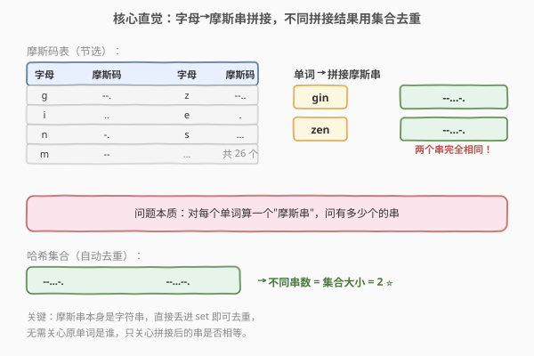
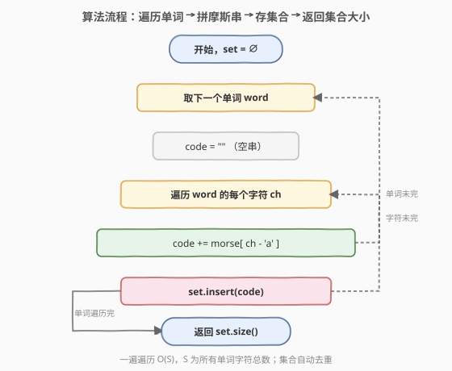
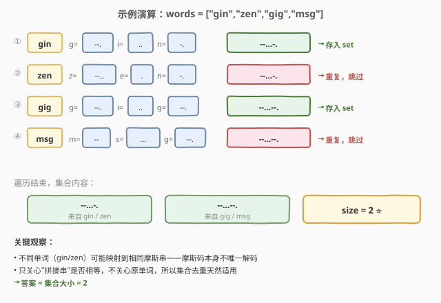

# 唯一摩尔斯密码词

- **题目名称**：唯一摩尔斯密码词
- **链接**：[804. 唯一摩尔斯密码词](https://leetcode.cn/problems/unique-morse-code-words/)
- **难度**：简单
- **标签**：数组、哈希表、字符串

## 1. 题目概述

摩斯密码定义了一种将英文字母编码为信号序列的标准：每个字母 `a` 到 `z` 对应一个由点 `.` 和短划线 `-` 组成的字符串。题目给出 26 个字母的摩斯码映射表 `morse`（按字母顺序，下标 `0` 对应 `'a'`，下标 `25` 对应 `'z'`）。

给定一个由**小写英文字母**组成的字符串数组 `words`，对其中**每个单词**：把每个字母替换成它对应的摩斯码，然后**按字母顺序拼接**成一个完整字符串，称为该单词的「摩斯变换」。

要求返回 `words` 中所有单词的摩斯变换里，**不同**变换的个数。

完整的 26 字母摩斯码表为：

```text
[".-","-...","-.-.","-..",".","..-.","--.","....","..",".---",
 "-.-",".-..","--","-.","---",".--.","--.-",".-.","...","-",
 "..-","...-",".--","-..-","-.--","--.."]
```

**示例 1**：

```text
输入：words = ["gin","zen","gig","msg"]
输出：2
解释：各单词的摩斯变换如下：
    "gin" → "--." + ".." + "-."     = "--...-."
    "zen" → "--.." + "." + "-."     = "--...-."
    "gig" → "--." + ".." + "--."    = "--...--."
    "msg" → "--" + "..." + "--."    = "--...--."
共有 2 种不同的变换："--...-." 和 "--...--."。
```

**示例 2**：

```text
输入：words = ["a"]
输出：1
```

**约束条件**：

- `1 <= words.length <= 100`
- `1 <= words[i].length <= 12`
- `words[i]` 由小写英文字母组成

> 💡 这是一道**哈希集合去重**的入门题，与 [1. 两数之和](../0001-0100/1_两数之和.md) 同属哈希表家族。核心套路：对每个单词算出它的摩斯变换串，丢进集合，集合天然去重，最后返回集合大小。一次遍历 `O(S)`、`O(S)` 空间（`S` 为所有单词字符总数），是面试中"统计不同结果数"的标配写法。

---

## 2. 解题思路

### 2.1 暴力思路：两两比较去重

最直观的做法是先把每个单词都转成摩斯串，存进一个数组 `codes`，然后对这个数组**去重统计**：对每个 `codes[i]`，检查它之前的所有 `codes[0..i-1]` 是否已经出现过，没出现过才把计数器加一。

```text
codes = [transform(w) for w in words]
ans = 0
for i in 0..n-1:
    seen = false
    for j in 0..i-1:
        if codes[j] == codes[i]: seen = true; break
    if not seen: ans += 1
return ans
```

时间复杂度 `O(n^2 * L)`（`n` 是单词数，`L` 是串比较长度），对 `n=100` 约 `10^4 * L` 次操作，虽能过但很慢。问题在于：判断"某串是否已出现过"用了 `O(n)` 线性扫描——这正是哈希集合能优化到 `O(1)` 的地方。

> ⚠️ 暴力法的问题不在能不能过，而在**判断重复用了线性查找**。字符串相等比较本身是 `O(L)`，叠加 `O(n)` 的扫描，整体偏慢。哈希集合把"是否已存在"降到平均 `O(1)`（忽略哈希串的成本），是统计不同结果数的标准武器。

### 2.2 核心观察：用哈希集合 O(1) 去重

**关键定义**：对每个单词 `word`，定义它的摩斯变换 `transform(word)` 为：遍历每个字符 `ch`，查表 `morse[ch - 'a']`，依次拼接成一个字符串。

**核心观察**：题目问的是「不同变换的个数」，这等价于「所有变换组成的**集合**的大小」。集合的本质就是去重——重复插入相同的串，集合大小不变。



于是算法极其简洁：

1. 建一个空哈希集合 `set`。
2. 对每个单词 `word`：算 `code = transform(word)`，执行 `set.insert(code)`。
3. 返回 `set.size()`。

> 💡 **为什么不需要关心原单词是谁？** 因为题目只问"不同的变换数"，不问每个变换来自哪个单词。我们关心的是变换后的串是否相等，而非变换前的输入。集合只存变换串，天然丢弃了"来自谁"这个无关信息——这正是抽象到"集合大小"的妙处。注意一个反直觉点：**不同单词可能映射到相同摩斯串**（如 `gin` 和 `zen` 都得到 `--...-.`），摩斯码本身并非唯一解码，所以不能拿原单词去重，必须拿变换后的串去重。

### 2.3 算法流程图



**完整步骤**：

1. **初始化**：`set = ∅`，准备好 26 字母摩斯码表。
2. **外层循环**：遍历 `words` 中每个 `word`：
   - 初始化 `code = ""`（空串）。
   - **内层循环**：遍历 `word` 的每个字符 `ch`：`code += morse[ch - 'a']`。
   - 把拼好的 `code` 插入 `set`。
3. **返回** `set.size()`。

> ⚠️ **字符到下标的转换**：小写字母 `ch` 对应摩斯表下标 `ch - 'a'`（`'a'`→`0`，`'z'`→`25`）。C++ 中 `ch - 'a'` 直接得 `int`；Python 中 `ord(ch) - ord('a')`。题目保证 `words[i]` 全为小写字母，无需额外校验非法字符。

### 2.4 示例演算

以 `words = ["gin","zen","gig","msg"]` 为例，逐步追踪每个单词的变换与集合变化：



| 步骤 | 单词 | 逐字母变换 | 拼接结果 | 是否新串？ | 集合大小 |
|------|------|-----------|----------|-----------|---------|
| ① | `gin` | `g=--.` `i=..` `n=-.` | `--...-.` | 是（新） | 1 |
| ② | `zen` | `z=--..` `e=.` `n=-.` | `--...-.` | 否（重复） | 1 |
| ③ | `gig` | `g=--.` `i=..` `g=--.` | `--...--.` | 是（新） | 2 |
| ④ | `msg` | `m=--` `s=...` `g=--.` | `--...--.` | 否（重复） | 2 |

遍历结束，集合内容为 `{ "--...-.", "--...--." }`，大小为 `2`，与示例 1 一致。

> 💡 注意第 ② 步：`zen` 变换出的 `--...-.` 与第 ① 步 `gin` 的结果**完全相同**，集合插入重复元素时不改变大小，所以计数不变。这是"不同单词可能撞码"的直接体现——也正是题目要求"统计不同变换"而非"统计不同单词"的原因。

---

## 3. 参考代码

### C++

```cpp
class Solution {
  public:
    int uniqueMorseRepresentations(vector<string>& words) {
        const vector<string> morse = {
            ".-",   "-...", "-.-.", "-..",  ".",   "..-.", "--.",
            "....", "..",   ".---", "-.-",  ".-..", "--",   "-.",
            "---",  ".--.", "--.-", ".-.",  "...",  "-",    "..-",
            "...-", ".--",  "-..-", "-.--", "--.."
        };
        unordered_set<string> seen;
        for (const string& w : words) {
            string code;
            for (char ch : w) {
                code += morse[ch - 'a'];   // 字母 -> 摩斯码下标，拼接
            }
            seen.insert(move(code));       // 丢进集合自动去重
        }
        return seen.size();
    }
};
```

### Python

```python
class Solution:
    def uniqueMorseRepresentations(self, words: List[str]) -> int:
        morse = [
            ".-", "-...", "-.-.", "-..", ".", "..-.", "--.",
            "....", "..", ".---", "-.-", ".-..", "--", "-.",
            "---", ".--.", "--.-", ".-.", "...", "-", "..-",
            "...-", ".--", "-..-", "-.--", "--.."
        ]
        seen = set()
        for w in words:
            code = "".join(morse[ord(ch) - ord('a')] for ch in w)
            seen.add(code)
        return len(seen)
```

> 💡 Python 版用生成器 + `"".join(...)` 一次拼好整个串，比循环里 `code += ...` 更地道（避免字符串反复重建）。C++ 版用 `move(code)` 把拼好的串移入集合，省一次拷贝。两版逻辑一致：算变换 → 存集合 → 返回大小。

---

## 4. 复杂度分析

| 维度 | 复杂度 | 说明 |
|------|--------|------|
| **时间复杂度** | `O(S)` | `S` 为所有单词字符总数；每个字符查表 `O(1)`、拼接 `O(1)` 摊还，集合插入平均 `O(L)`（`L` 为串长，哈希串的成本）；总体线性于总字符数 |
| **空间复杂度** | `O(S)` | 最坏情况所有变换两两不同，集合存 `n` 个串，总字符数 `O(S)` |

> ⚠️ 严格地说，哈希集合插入一个长度为 `L` 的串需要 `O(L)` 时间来计算哈希与比较，因此总时间为 `O(S)`（每个字符恰好被处理一次，串长之和等于总字符数）。约束里 `n ≤ 100`、`L ≤ 12*4 ≈ 48`，规模极小，任意解法都能过，但哈希集合是最干净的标准写法。

---

## 5. 扩展：为什么不同单词会撞码？

一个反直觉的现象：`gin` 和 `zen` 是完全不同的单词，却映射到了相同的摩斯串 `--...-.`。原因在于摩斯码是**变长编码且无分隔符**——拼接后无法唯一切分回原来的字母序列。

以 `--...-.` 为例，它至少有两种切分方式：

```text
--.  ..  -.    →  g  i  n  →  "gin"
--.. .   -.    →  z  e  n  →  "zen"
```

`--.` 既是 `g` 的编码，也是 `--..`(`z`) 的前缀；`.` 既是 `e` 的编码，也可能和前面的 `-` 组成 `-.`(`n`)。这种**前缀重叠**导致一个串对应多个字母切分，从而多个单词撞到同一变换。

> 💡 这正是真实摩斯码通信中要在字母之间留**短停顿**（分隔符）的原因——没有分隔符就会产生歧义。本题刻意不加分隔符，让"撞码"成为可能，才使得"统计不同变换数"成为一个有意义的问题（否则每个单词的变换都唯一，答案恒等于单词数）。如果你在面试中被问"加个分隔符会怎样"——答案会变成所有变换都唯一，集合大小恒等于 `min(n, 26^L)`，问题退化。

---

## 6. 面试要点

1. **为什么用哈希集合？它把哪一步从 O(n) 降到了 O(1)？**

   - 暴力法对每个变换串，线性扫描之前所有串判断是否重复，这一步是 `O(n)`。哈希集合把"是否已存在"优化到平均 `O(1)`（忽略哈希串成本），整体从 `O(n^2 * L)` 降到 `O(S)`。

2. **为什么不直接用原单词去重？**

   - 题目问的是"不同的**变换**数"，不是"不同的单词数"。不同单词可能撞到同一变换（如 `gin`/`zen` 都得 `--...-.`），所以必须拿变换后的串去重。若拿原单词去重，会漏掉这种撞码情况，答案偏大。

3. **集合里存的是字符串，比较和哈希的成本是多少？**

   - 字符串哈希与相等比较都是 `O(L)`（`L` 为串长，这里最多约 48）。但由于每个字符只被处理一次，总时间仍线性于总字符数 `O(S)`。约束规模极小，这点成本可忽略。

4. **如果不允许用额外空间（原地统计）呢？**

   - 可以先把所有变换串算出来存回 `words`，排序后用一次扫描数相邻不同的个数，做到 `O(1)` 额外空间（不计排序栈）、`O(S log n)` 时间。但这破坏了原数组，且排序常数更大，本题没必要——哈希集合是更自然的选择。

5. **摩斯码表的下标对应关系？**

   - `morse[0]` 对应 `'a'`，`morse[25]` 对应 `'z'`，按字母顺序排列。字符 `ch` 的下标是 `ch - 'a'`（C++）或 `ord(ch) - ord('a')`（Python）。题目保证输入全为小写字母，无需校验越界。

> 💡 **一句话总结**：804 是哈希集合去重的入门题——对每个单词算摩斯变换串，丢进集合，返回集合大小。一遍遍历 `O(S)`、`O(S)` 空间。关键反直觉点：不同单词可能撞到同一变换（摩斯码无分隔符导致前缀歧义），所以必须拿变换串而非原单词去重。这个"统计不同结果数"的模板会反复出现在各类去重统计题里。

---

## 7. 同类练习题

- [1. 两数之和](https://leetcode.cn/problems/two-sum/)（[题解](../0001-0100/1_两数之和.md)）：同属哈希表家族，用哈希把查找补数从 O(n) 降到 O(1)
- [349. 两个数组的交集](https://leetcode.cn/problems/intersection-of-two-arrays/)：哈希集合做交集/去重的直接应用
- [771. 宝石与石头](https://leetcode.cn/problems/jewels-and-stones/)：哈希集合统计匹配个数，思路同源
- [217. 存在重复元素](https://leetcode.cn/problems/contains-duplicate/)：哈希集合判重，本题"统计个数"的判定版
- [819. 最常见的单词](https://leetcode.cn/problems/most-common-word/)：哈希集合 + 字符串切分统计，字符串处理的综合练习
