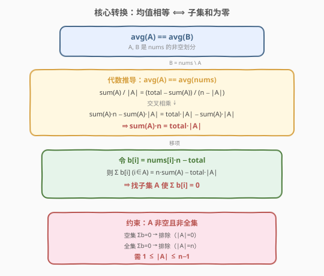
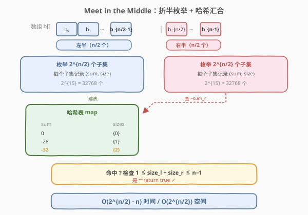
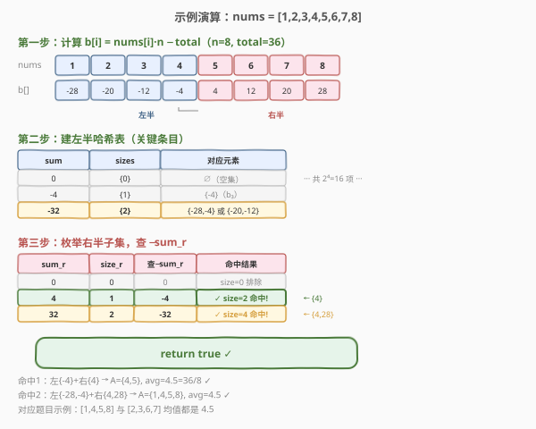

# 数组的均值分割

- **题目名称**：数组的均值分割
- **链接**：[805. 数组的均值分割](https://leetcode.cn/problems/split-array-with-same-average/)
- **难度**：困难
- **标签**：数组、数学、动态规划、Meet in the Middle

## 1. 题目概述

给定一个整数数组 `nums`，需要将每个元素移动到数组 `A` 或数组 `B` 中，使得 `A` 和 `B` 都不为空，并且 `average(A) == average(B)`。可以完成则返回 `true`，否则返回 `false`。

**示例 1**：

```text
输入：nums = [1,2,3,4,5,6,7,8]
输出：true
解释：分割为 [1,4,5,8] 和 [2,3,6,7]，它们的平均值都是 4.5。
```

**示例 2**：

```text
输入：nums = [3,1]
输出：false
```

**约束条件**：

- `1 <= nums.length <= 30`
- `0 <= nums[i] <= 10^4`

> ⚠️ `n ≤ 30` 是本题的关键约束——它暗示 $2^{30}$ 暴力不可行，但 $2^{15}$ 折半可行，正是 **Meet in the Middle** 的甜区。

---

## 2. 解题思路

### 2.1 暴力思路：枚举所有子集

对每个元素决定放入 `A` 还是 `B`，共 $2^n$ 种划分。对每种划分检查 `average(A) == average(B)`。$n = 30$ 时 $2^{30} \approx 10^9$，**超时**。

> ⚠️ 直接比较浮点均值会有精度问题。需要先做数学变换，把「均值相等」转化为整数运算。

### 2.2 核心观察：均值相等 ⟺ 子集和为零



**关键推导**：设 `A` 和 `B` 划分 `nums`，`B = nums \ A`。`average(A) == average(B)` 即：

$$
\frac{\text{sum}(A)}{|A|} = \frac{\text{total} - \text{sum}(A)}{n - |A|}
$$

交叉相乘后消去 $\text{sum}(A) \cdot |A|$：

$$
\text{sum}(A) \cdot n = \text{total} \cdot |A|
$$

这意味着 **`A` 的均值等于整个 `nums` 的均值**。为避免浮点，定义变换：

$$
b[i] = \text{nums}[i] \cdot n - \text{total}
$$

则条件变为：**存在非空真子集 $A$（$1 \leq |A| \leq n-1$），使 $\sum_{i \in A} b[i] = 0$**。

> 💡 两个天然排除的边界：空集 $\sum b = 0$（$|A|=0$，排除）和全集 $\sum b = n \cdot \text{total} - n \cdot \text{total} = 0$（$|A|=n$，排除）。我们要找的是介于两者之间的子集。

### 2.3 Meet in the Middle：折半枚举

$n \leq 30$ 时 $2^{30}$ 太大，但把数组从中间劈成两半（各约 15 个元素），每半 $2^{15} = 32768$ 个子集完全可枚举。



**算法步骤**：

1. **计算** `b[i] = nums[i] * n - total`，将数组分为左半 `b[0..n1-1]` 和右半 `b[n1..n-1]`（$n_1 = n/2$）。
2. **建表（左半）**：枚举左半所有 $2^{n_1}$ 个子集，记录每个子集的 `(sum, size)`。用哈希表存储 `sum → sizes`（该和可达的元素个数集合）。
3. **查表（右半）**：枚举右半所有 $2^{n_2}$ 个子集，对每个 `(sum_r, size_r)`，在哈希表中查 `-sum_r`。若命中且存在 `size_l` 使 $1 \leq \text{size\_l} + \text{size\_r} \leq n-1$，返回 `true`。
4. 全部枚举完未命中则返回 `false`。

> 💡 **为什么存 sizes 而不只是 sum？** 因为需要排除空集（$|A|=0$）和全集（$|A|=n$）。左半空子集 + 右半空子集 → $|A|=0$（排除）；左半全选 + 右半全选 → $|A|=n$（排除）。记录 size 才能在汇合时判断组合是否合法。

### 2.4 算法流程图

**完整流程**：

```text
1. 计算 total, b[i] = nums[i]*n - total
2. n1 = n/2, 左半 = b[0..n1-1], 右半 = b[n1..n-1]
3. for mask in 0 .. 2^n1 - 1:           # 左半建表
       s = sum(b[i] for i in mask)
       k = popcount(mask)
       leftMap[s].add(k)
4. for mask in 0 .. 2^n2 - 1:           # 右半查表
       s = sum(b[n1+i] for i in mask)
       k = popcount(mask)
       if -s in leftMap:
           for sl in leftMap[-s]:
               if 0 < sl + k < n: return true
5. return false
```

### 2.5 示例演算

以 `nums = [1,2,3,4,5,6,7,8]` 为例，$n=8$，$\text{total}=36$：



**第一步：计算 b 数组**

$b[i] = \text{nums}[i] \times 8 - 36$，得到 $b = [-28, -20, -12, -4, 4, 12, 20, 28]$。注意 $b$ 关于中心对称（因为 `nums` 是等差数列），天然存在和为零的子集对。

**第二步：建左半哈希表**（左半 $= [-28, -20, -12, -4]$，$2^4 = 16$ 个子集）

| sum | sizes | 对应元素 |
|-----|-------|----------|
| 0 | {0} | ∅（空集） |
| -4 | {1} | {-4}（$b_3$） |
| -32 | {2} | {-28,-4} 或 {-20,-12} |
| -64 | {4} | 全选（$b_0$~$b_3$） |
| ··· | ··· | 共 16 项 |

**第三步：枚举右半子集查表**（右半 $= [4, 12, 20, 28]$）

| sum_r | size_r | 查 −sum_r | 命中结果 |
|-------|--------|-----------|----------|
| 0 | 0 | 0 | size=0 排除 |
| **4** | **1** | **-4** | **✓ size_l=1, 合计 2, $0 < 2 < 8$ 命中!** |
| 32 | 2 | -32 | ✓ size_l=2, 合计 4, $0 < 4 < 8$ 命中! |

第一个命中：左半 $\{-4\}$ + 右半 $\{4\}$ → 子集 $A = \{\text{nums}[3], \text{nums}[4]\} = \{4, 5\}$，$\text{avg} = 4.5 = 36/8$ ✓

第二个命中（对应题目示例）：左半 $\{-28, -4\}$ + 右半 $\{4, 28\}$ → $A = \{1, 4, 5, 8\}$，$\text{avg} = 4.5$ ✓

---

## 3. 参考代码

### C++

```cpp
class Solution {
public:
    bool splitArraySameAverage(vector<int>& nums) {
        int n = nums.size();
        if (n == 1) return false;
        int total = accumulate(nums.begin(), nums.end(), 0);

        // 剪枝：若 gcd(total, n) == 1，无合法子集大小
        int g = gcd(total, n);
        if (n / g >= n) return false;

        // b[i] = nums[i]*n - total，找非空真子集使 sum(b) = 0
        vector<int> b(n);
        for (int i = 0; i < n; ++i)
            b[i] = nums[i] * n - total;

        int n1 = n / 2, n2 = n - n1;

        // 左半建表：sum -> sizes 的位掩码（bit k 表示 size=k 可达）
        unordered_map<int, int> leftMap;
        for (int mask = 0; mask < (1 << n1); ++mask) {
            int s = 0, cnt = 0;
            for (int i = 0; i < n1; ++i)
                if (mask & (1 << i)) { s += b[i]; ++cnt; }
            leftMap[s] |= (1 << cnt);
        }

        // 右半查表
        for (int mask = 0; mask < (1 << n2); ++mask) {
            int s = 0, cnt = 0;
            for (int i = 0; i < n2; ++i)
                if (mask & (1 << i)) { s += b[n1 + i]; ++cnt; }
            auto it = leftMap.find(-s);
            if (it != leftMap.end()) {
                int sizes = it->second;
                for (int sl = 0; sl <= n1; ++sl)
                    if ((sizes & (1 << sl)) && sl + cnt > 0 && sl + cnt < n)
                        return true;
            }
        }
        return false;
    }
};
```

### Python

```python
class Solution:
    def splitArraySameAverage(self, nums: List[int]) -> bool:
        n = len(nums)
        if n == 1:
            return False
        total = sum(nums)

        # 剪枝：gcd(total, n) == 1 时无合法子集大小
        from math import gcd
        if n // gcd(total, n) >= n:
            return False

        b = [x * n - total for x in nums]
        n1, n2 = n // 2, n - n1

        # 左半建表：sum -> set of sizes
        from collections import defaultdict
        left_map = defaultdict(set)
        for mask in range(1 << n1):
            s = cnt = 0
            for i in range(n1):
                if mask & (1 << i):
                    s += b[i]
                    cnt += 1
            left_map[s].add(cnt)

        # 右半查表
        for mask in range(1 << n2):
            s = cnt = 0
            for i in range(n2):
                if mask & (1 << i):
                    s += b[n1 + i]
                    cnt += 1
            if -s in left_map:
                for sl in left_map[-s]:
                    if 0 < sl + cnt < n:
                        return True
        return False
```

> ⚠️ **易错点**：必须检查 `0 < sl + cnt < n`，排除空集（$|A|=0$）和全集（$|A|=n$）两种平凡情况。漏掉这个检查会错误返回 `true`——因为空集和全集的 $b$ 之和天然为零。

---

## 4. 复杂度分析

| 维度 | 复杂度 | 说明 |
|------|--------|------|
| 时间复杂度 | $O(2^{n/2} \cdot n)$ | 左右各枚举 $2^{n/2}$ 个子集，每个子集求和 $O(n/2)$；查表 $O(2^{n/2})$ 次 |
| 空间复杂度 | $O(2^{n/2})$ | 左半哈希表最多存 $2^{n/2}$ 个条目 |

> 💡 $n = 30$ 时 $2^{15} = 32768$，枚举 + 查表约 $32768 \times 15 \times 2 \approx 10^6$ 次运算，完全在时限内。相比暴力 $2^{30} \approx 10^9$ 加速约 1000 倍。

---

## 5. 扩展：与 416 分割等和子集的对比

本题与 [416. 分割等和子集](../0401-0500/416_分割等和子集.md) 都是「数组划分」问题，但数据范围和转化方式不同：

| 维度 | 416. 分割等和子集 | 805. 数组的均值分割 |
|------|-------------------|---------------------|
| 划分条件 | 两子集**和相等** | 两子集**均值相等** |
| 等价转化 | 子集和 = total/2 | 子集 $b$ 和 = 0（$b[i] = \text{nums}[i] \cdot n - \text{total}$） |
| 数据范围 | $n \leq 200$，$\text{nums}[i] \leq 100$ | $n \leq 30$，$\text{nums}[i] \leq 10^4$ |
| 解法 | 0-1 背包 DP $O(n \cdot \text{target})$ | Meet in the Middle $O(2^{n/2} \cdot n)$ |
| 选择依据 | $n$ 大但 sum 小 → 伪多项式 DP | $n$ 小但 sum 大 → 折半枚举 |

> 💡 **选 DP 还是 Meet in the Middle？** 关键看 $n$ 和 $\text{sum}$ 的相对大小：$n$ 大、$\text{sum}$ 小 → DP（$O(n \cdot \text{sum})$）；$n$ 小、$\text{sum}$ 大 → Meet in the Middle（$O(2^{n/2})$）。本题 $n = 30$、$\text{sum}$ 可达 $3 \times 10^5$，DP 的 $O(n^2 \cdot \text{sum}) \approx 5 \times 10^8$ 偏大，而 $2^{15} \approx 3 \times 10^4$ 极快。

### gcd 剪枝

由 $\text{sum}(A) \cdot n = \text{total} \cdot |A|$ 可知 $\text{sum}(A) = \text{total} \cdot |A| / n$ 必为整数，即 $n \mid (\text{total} \cdot |A|)$。令 $g = \gcd(\text{total}, n)$，则合法的 $|A|$ 必是 $n/g$ 的倍数。若 $g = 1$（$\text{total}$ 与 $n$ 互质），则 $|A|$ 必是 $n$ 的倍数，在 $[1, n-1]$ 内无解，直接返回 `false`。

---

## 6. 面试要点

1. **为什么 avg(A) == avg(B) 等价于 avg(A) == avg(nums)？**
   - 因为 A、B 划分 nums，$\text{sum}(B) = \text{total} - \text{sum}(A)$，$|B| = n - |A|$。由 $\text{sum}(A)/|A| = \text{sum}(B)/|B|$ 交叉相乘化简，得到 $\text{sum}(A) \cdot n = \text{total} \cdot |A|$，即 $\text{avg}(A) = \text{total}/n = \text{avg}(\text{nums})$。

2. **为什么要做 b[i] = nums[i]*n - total 变换？**
   - 直接比较浮点均值有精度风险。变换后条件变为「子集的 $b$ 之和为零」，全整数运算，无精度问题。且 $\sum b[i] = 0$ 恒成立（全集），使得 Meet in the Middle 的两侧互补结构自然成立。

3. **为什么要记录子集大小 size，不能只记 sum？**
   - 空集（$|A|=0$）和全集（$|A|=n$）的 $b$ 之和都为零，但它们不合法（A 或 B 为空）。记录 size 才能在左右汇合时判断 $1 \leq |A| \leq n-1$。

4. **为什么用 Meet in the Middle 而不是 DP？**
   - $n \leq 30$ 时 $2^{15}$ 枚举极快，而 $\text{sum}$ 可达 $3 \times 10^5$，DP 表 $O(n^2 \cdot \text{sum})$ 偏大。$n$ 小 + sum 大的场景正是 Meet in the Middle 的甜区。若 $n$ 更大（如 200）但 sum 更小，则 DP 更优（参见 416 题）。

5. **gcd 剪枝的原理是什么？**
   - $\text{sum}(A) = \text{total} \cdot |A| / n$ 须为整数，故 $|A|$ 必是 $n / \gcd(\text{total}, n)$ 的倍数。若 $\gcd(\text{total}, n) = 1$，$|A|$ 须是 $n$ 的倍数，$[1, n-1]$ 内无解，直接 `false`。这个剪枝能快速排除互质情况。

---

## 7. 同类练习题

- [416. 分割等和子集](https://leetcode.cn/problems/partition-equal-subset-sum/)（[题解](../0401-0500/416_分割等和子集.md)）：同样是数组划分，但条件为「和相等」，$n$ 大 sum 小用 0-1 背包 DP，对照本题的解法选择
- [454. 四数相加 II](https://leetcode.cn/problems/4sum-ii/)（[题解](../0401-0500/454_四数相加%20II.md)）：Meet in the Middle 的经典入门题，分组 + 哈希预计算 + 查补数
- [1049. 最后一块石头的重量 II](https://leetcode.cn/problems/last-stone-weight-ii/)（[题解](../1001-1100/1049_最后一块石头的重量II.md)）：转化为子集和最小化两组差，0-1 背包求最值
- [2035. 将数组分成两个数组并最小化数组和的差](https://leetcode.cn/problems/partition-array-into-two-arrays-to-minimize-sum-difference/)：$2n \leq 60$ 的数组划分，Meet in the Middle 的直接进阶（$n$ 更大需折半）
- [1755. 最接近目标值的子序列和](https://leetcode.cn/problems/closest-subsequence-sum/)：折半枚举子集和 + 排序双指针汇合，Meet in the Middle 的另一变体
