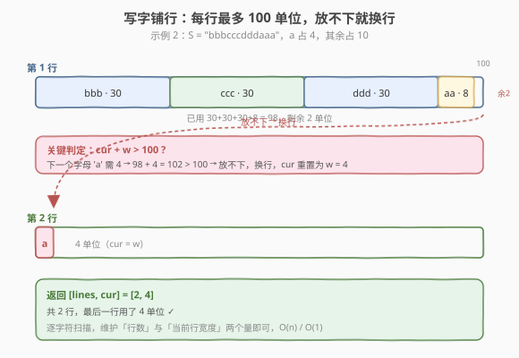
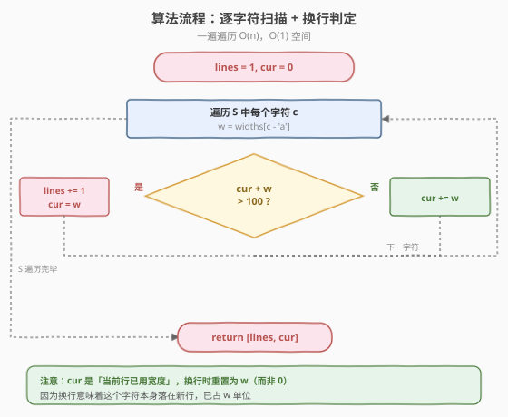
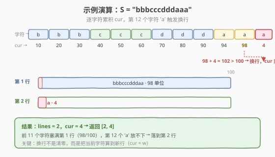

# LeetCode 写字符串需要的行数 题解

## 1. 题目概述

- **标题 / 题号**：写字符串需要的行数（#806，easy）
- **链接**：https://leetcode.cn/problems/number-of-lines-to-write-string/
- **难度**：简单
- **标签**：数组、字符串、模拟

**题意**：给定字符串 `S` 与长度为 26 的数组 `widths`，其中 `widths[0]` 代表 `'a'` 占用的单位数、`widths[1]` 代表 `'b'`……`widths[25]` 代表 `'z'`。把 `S` 从左到右写到每一行上，**每行最大宽度为 100 单位**：若写某个字母时会使当前行超过 100，就把这个字母写到**下一行**。返回长度为 2 的列表 `[行数, 最后一行使用的宽度]`。

**示例 1**：

```text
输入：widths = [10,10,10,10,10,10,10,10,10,10,10,10,10,10,10,10,10,10,10,10,10,10,10,10,10,10]
     S = "abcdefghijklmnopqrstuvwxyz"
输出：[3, 60]
解释：每个字母占 10 单位，26 个字母共 260 单位。每行 100 单位放 10 个字母，
     前 2 行放满 20 个字母，第 3 行放 6 个字母 = 60 单位。
```

**示例 2**：

```text
输入：widths = [4,10,10,10,10,10,10,10,10,10,10,10,10,10,10,10,10,10,10,10,10,10,10,10,10,10]
     S = "bbbcccdddaaa"
输出：[2, 4]
解释：除 'a' 外都占 10。"bbbcccdddaa" 共 9*10 + 2*4 = 98 单位塞满第 1 行；
     最后一个 'a' 需 4 单位，98+4=102 > 100，落到第 2 行，第 2 行用 4 单位。
```

**约束**：

- 字符串 `S` 的长度范围 `[1, 1000]`
- `S` 只包含小写字母
- `widths` 长度为 26，`widths[i]` 值范围 `[2, 10]`

> 💡 这是一道**线性扫描模拟**题：维护「当前行数」和「当前行已用宽度」两个量，逐字符决定**累加**还是**换行**。没有复杂算法，考的是把题意里的"放不下就换行"翻译成清晰的判定与状态更新——`O(n)`、`O(1)`，是面试中"流式数据按容量装箱"的最朴素版本（对比 [1011. 在 D 天内送达包裹的能力](../1001-1100/1011_在D天内送达包裹的能力.md) 用二分答案求最优容量）。

## 2. 解题思路

### 2.1 暴力思路：逐字符累加 + 超限即换行

最直观的做法就是**照着题意模拟**：从左到右扫描 `S`，对每个字符查表得到宽度 `w`，看它能否塞进当前行：

1. 若 `cur + w <= 100`：塞进当前行，`cur += w`。
2. 若 `cur + w > 100`：当前行放不下，`lines += 1`，并把该字符作为新行的第一个字符，`cur = w`。

```text
lines, cur = 1, 0
for c in S:
    w = widths[ord(c) - ord('a')]
    if cur + w > 100:
        lines += 1
        cur = w
    else:
        cur += w
return [lines, cur]
```

> ⚠️ 注意这其实**就是最优解**——本题没有比模拟更巧的做法。容易出错的不是思路而是细节：换行时 `cur` 应重置为 `w`（当前字符已落在新行），**不是 0**；初始 `lines = 1`（至少一行），`cur = 0`。

### 2.2 核心观察：维护两个状态量，一次扫描定胜负

**关键定义**：整个过程中只需维护两个量：

- `lines`：目前已用的行数（至少为 1）
- `cur`：**当前行**已占用的宽度（范围 `0..100`）

**核心观察**：每个字符的处置只依赖 `cur` 与该字符宽度 `w` 的关系——**局部判定、即时更新**，无需回看历史，也无需预计算。这正是"流式/在线"处理的特点：来一个处理一个，状态空间只有 `(lines, cur)` 两个标量。



**判定分支**：

| 条件 | 动作 | 含义 |
|------|------|------|
| `cur + w <= 100` | `cur += w` | 当前字符塞进当前行 |
| `cur + w > 100` | `lines += 1; cur = w` | 当前行放不下，开新行并把字符算进去 |

> 💡 **为什么换行后 `cur = w` 而不是 `cur = 0`？** 因为"放不下就换行"指的是把**这个字符**写到下一行——它本身已经占用了新行的 `w` 单位。若误写成 `cur = 0`，就等于把这个字符"丢了"，最后 `cur` 也会少算一个字母的宽度。这个细节是本题最常见的 off-by-one 错误来源。

### 2.3 算法流程图



**完整步骤**：

1. **初始化**：`lines = 1`，`cur = 0`（字符串非空，至少 1 行）。
2. **遍历** `S` 中每个字符 `c`：
   - 查表 `w = widths[c - 'a']`
   - 若 `cur + w > 100`：`lines += 1`，`cur = w`（换行，当前字符落新行）
   - 否则：`cur += w`（塞进当前行）
3. **返回** `[lines, cur]`。

> ⚠️ 由于 `widths[i] <= 10`，单个字符最多占 10 单位，绝不会出现"一个字符比一整行（100）还宽"的情况，所以换行后 `cur = w <= 10 <= 100` 恒成立，无需再判第二次换行。约束保证了状态转移的简洁性。

### 2.4 示例演算

以示例 2 `S = "bbbcccdddaaa"`（`a=4`，其余 `=10`）为例，逐字符追踪 `cur` 的变化，重点看第 12 个字符 `'a'` 触发换行的瞬间：



| 步骤 | 字符 | w | cur（处理前） | cur + w | 动作 | cur（处理后） | lines |
|------|------|----|--------------|---------|------|--------------|-------|
| 1 | b | 10 | 0 | 10 | 累加 | 10 | 1 |
| 2 | b | 10 | 10 | 20 | 累加 | 20 | 1 |
| 3 | b | 10 | 20 | 30 | 累加 | 30 | 1 |
| 4 | c | 10 | 30 | 40 | 累加 | 40 | 1 |
| 5 | c | 10 | 40 | 50 | 累加 | 50 | 1 |
| 6 | c | 10 | 50 | 60 | 累加 | 60 | 1 |
| 7 | d | 10 | 60 | 70 | 累加 | 70 | 1 |
| 8 | d | 10 | 70 | 80 | 累加 | 80 | 1 |
| 9 | d | 10 | 80 | 90 | 累加 | 90 | 1 |
| 10 | a | 4 | 90 | 94 | 累加 | 94 | 1 |
| 11 | a | 4 | 94 | 98 | 累加 | 98 | 1 |
| 12 | a | 4 | 98 | 102 | **换行** | **4** | **2** |

第 12 步：`cur=98`，`w=4`，`98+4=102 > 100` → 换行，`lines` 升到 2，`cur` 重置为 `w=4`。最终返回 `[2, 4]`，与示例一致。

> 💡 对比示例 1：所有字母都占 10，每行恰好放 10 个字母（`10*10=100`）。第 11 个字母时 `cur=100`，第 11 个字母 `cur+10=110>100` 换行……实际上由于"**超过** 100 才换"（`>100`，非 `>=100`），第 10 个字母时 `cur` 恰为 100 仍可塞下，第 11 个才换。所以 26 个字母 → 2 整行（20 个）+ 第 3 行 6 个 = 60 单位，`[3, 60]`。

## 3. 参考代码

### C++

```cpp
class Solution {
public:
    vector<int> numberOfLines(vector<int>& widths, string s) {
        int lines = 1, cur = 0;
        for (char c : s) {
            int w = widths[c - 'a'];
            if (cur + w > 100) {       // 放不下，换行
                ++lines;
                cur = w;               // 当前字符落到新行，已占 w
            } else {
                cur += w;              // 塞进当前行
            }
        }
        return {lines, cur};
    }
};
```

### Python

```python
class Solution:
    def numberOfLines(self, widths: List[int], s: str) -> List[int]:
        lines, cur = 1, 0
        for c in s:
            w = widths[ord(c) - ord('a')]
            if cur + w > 100:          # 放不下，换行
                lines += 1
                cur = w                # 当前字符落到新行，已占 w
            else:
                cur += w               # 塞进当前行
        return [lines, cur]
```

> 💡 两版逻辑完全一致。`c - 'a'`（C++）与 `ord(c) - ord('a')`（Python）都是把小写字母映射到 `0..25` 的下标。返回值 C++ 用 `{lines, cur}` 列表初始化 `vector<int>`，Python 直接返回列表。

## 4. 复杂度分析

| 维度 | 复杂度 | 说明 |
|------|--------|------|
| **时间复杂度** | `O(n)` | `n = len(S)`，逐字符扫描一遍，每字符 `O(1)` 查表 + 判定 |
| **空间复杂度** | `O(1)` | 只用 `lines`、`cur`、`w` 三个变量，常数额外空间 |

> ⚠️ 本题已是模拟类的最优复杂度，无法再优化——必须至少看一遍每个字符。可能的"优化"只在不改变大 O 的常数因子上（如 C++ 用 `range-based for`、提前 `reserve` 等），对面试意义不大，把代码写对、写清晰才是重点。

## 5. 扩展：若单个字符可能超过一行宽度？

题目约束 `widths[i] <= 10`，所以一个字符绝不会比一行（100）还宽，换行后 `cur = w` 必然 `<= 100`。若放宽约束（比如 `widths[i]` 可达 200），则换行后仍可能 `cur > 100`，需要**在换行分支内再加一次判定**：若单个字符本身就超行宽，要么报错，要么让它独占一行并把溢出截断/记到下一行——具体语义取决于业务定义。

```python
# 约束放宽后的健壮版本（语义：单字符超行宽时独占一行）
if cur + w > 100:
    lines += 1
    cur = w if w <= 100 else 100   # 溢出处理视需求而定
else:
    cur += w
```

> 💡 这类"边界单元素超过容量"的情况在 [1011. 在 D 天内送达包裹的能力](https://leetcode.cn/problems/capacity-to-ship-packages-within-d-days/) 里也会出现：二分答案求最小船载时，下界必须取 `max(weights)`，否则单个超重包裹永远运不走。两题共享"流式按容量装箱"的底层模型，只是 806 是给定容量的正向模拟、1011 是求最小容量的反向二分。

## 6. 面试要点

1. **换行后 `cur` 为什么是 `w` 而不是 0？**

   - "放不下就换行"指把**当前这个字符**写到下一行，它本身已占新行 `w` 单位。写成 `cur = 0` 会丢掉这个字符的宽度，导致最后一行 `cur` 偏小。这是本题最高频的 bug。

2. **判定条件是 `> 100` 还是 `>= 100`？**

   - 题目说"会使这行**超过** 100"才换行，即严格大于。`cur + w == 100` 时仍可塞下（恰好填满）。示例 1 中每行恰好放 10 个字母（`10*10=100`）正是依赖这一点。写成 `>=` 会导致提前换行、行数偏多。

3. **初始 `lines` 为什么是 1 而不是 0？**

   - `S` 非空（约束 `len >= 1`），至少需要 1 行。从 1 开始可避免最后返回时再 `+1` 的特判，代码更直接。若 `S` 可能为空（本题不会），才需要 `lines = 0` 并在返回前处理。

4. **能不能用前缀和或二分优化？**

   - 不能。虽然"按容量切分一段序列"在 [1011](https://leetcode.cn/problems/capacity-to-ship-packages-within-days/) 中用前缀和 + 二分加速判定，但本题**容量固定为 100、只需输出一次结果**，且每个字符宽度由查表决定、不可累加预计算（行宽边界会打断累加）。模拟一遍 `O(n)` 已是最优，前缀和反而多此一举。

5. **这题和"文本排版"类问题的区别？**

   - 806 只**统计**行数与末行宽度，不实际排版，也不在行内插空格对齐。真正的排版题如 [68. 文本左右对齐](../0001-0100/68_文本左右对齐.md) 还需在每行内分配多余空格、处理最后一行左对齐等，复杂得多。806 是其"只计数、不排版"的极简前置版。

> 💡 **一句话总结**：806 是线性扫描模拟——维护 `lines` 和 `cur`，逐字符判 `cur + w > 100` 决定累加或换行，换行时 `cur = w`（不是 0）。`O(n)` / `O(1)`，难点全在边界细节而非算法本身。

## 同类练习题

| # | 题目 | 与本题的关联 |
|---|------|-------------|
| 68 | [文本左右对齐](https://leetcode.cn/problems/text-justification/)（[题解](../0001-0100/68_文本左右对齐.md)） | 同为"按行宽排版字符串"的模拟，但需在行内补空格对齐（806 只统计行数/末行宽，不实际排版） |
| 8 | [字符串转换整数（atoi）](https://leetcode.cn/problems/string-to-integer-atoi/)（[题解](../0001-0100/8_字符串转换整数atoi.md)） | 逐字符扫描 + 状态机模拟，对比 806 的单变量累积 |
| 58 | [最后一个单词的长度](https://leetcode.cn/problems/length-of-last-word/)（[题解](../0001-0100/58_最后一个单词的长度.md)） | 字符串线性扫描，从右向左定位末单词 |
| 1011 | [在 D 天内送达包裹的能力](https://leetcode.cn/problems/capacity-to-ship-packages-within-d-days/)（[题解](../1001-1100/1011_在D天内送达包裹的能力.md)） | 按容量贪心切分流式数据，806 的"装箱"姐妹题（用二分答案求最小容量） |
