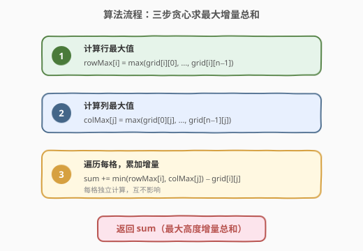
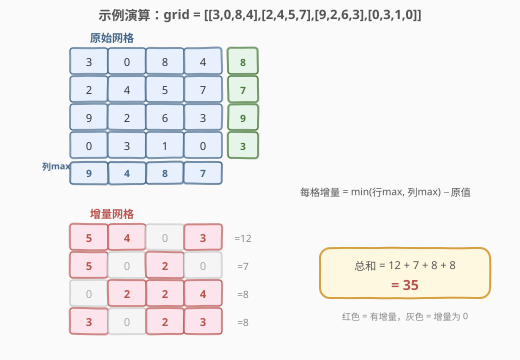

# 保持城市天际线

- **题目名称**：保持城市天际线
- **链接**：[807. 保持城市天际线](https://leetcode.cn/problems/max-increase-to-keep-city-skyline/)
- **难度**：中等
- **标签**：数组、贪心、矩阵

## 1. 题目概述

给定一个 $n \times n$ 的矩阵 `grid`，其中 `grid[r][c]` 表示位于第 `r` 行第 `c` 列的建筑物高度。城市的**天际线**是从东、南、西、北四个主要方向观察时所有建筑物形成的外部轮廓。

允许为**任意数量的建筑物**增加**任意高度**（增量可以不同），但增加后**不能改变**从任何主要方向观测到的天际线。返回建筑物可以增加的**最大高度增量总和**。

> 💡 **天际线的本质**：从东/西方向看，天际线由**每行的最大值**决定（行天际线）；从南/北方向看，天际线由**每列的最大值**决定（列天际线）。不改变天际线 = 不改变任何行最大值和列最大值。

**示例 1**：

```text
输入：grid = [[3,0,8,4],[2,4,5,7],[9,2,6,3],[0,3,1,0]]
输出：35
解释：增高后的网格为
  gridNew = [ [8, 4, 8, 7],
              [7, 4, 7, 7],
              [9, 4, 8, 7],
              [3, 3, 3, 3] ]
行最大值保持 [8,7,9,3]，列最大值保持 [9,4,8,7]，天际线不变。
```

**示例 2**：

```text
输入：grid = [[0,0,0],[0,0,0],[0,0,0]]
输出：0
解释：任何增高都会改变天际线（当前行/列最大值均为 0）。
```

**约束条件**：

- `n == grid.length`
- `n == grid[r].length`
- `2 <= n <= 50`
- `0 <= grid[r][c] <= 100`

---

## 2. 解题思路

### 2.1 暴力思路

直觉上可能需要回溯枚举每栋楼增高多少、再逐个验证天际线是否被破坏——但这是指数级的，完全不可行。

关键观察是：**天际线约束对每栋楼独立生效**。一栋楼能长多高，只取决于它所在行的最大值和所在列的最大值，与其他楼无关。因此无需搜索，直接对每格贪心取上限即可。

### 2.2 核心观察：贪心——min(行最大, 列最大)


对于建筑物 `(i, j)`：

- **行方向约束**：增高后 `grid[i][j]` 不能超过 `rowMax[i]`（否则第 `i` 行最大值变大，东西方向天际线改变）。
- **列方向约束**：增高后 `grid[i][j]` 不能超过 `colMax[j]`（否则第 `j` 列最大值变大，南北方向天际线改变）。

两个约束同时满足，故该楼最多可增高至：

$$
\text{newHeight}(i, j) = \min\bigl(\text{rowMax}[i],\ \ \text{colMax}[j]\bigr)
$$

该楼的增量为：

$$
\text{increase}(i, j) = \min\bigl(\text{rowMax}[i],\ \ \text{colMax}[j]\bigr) - \text{grid}[i][j]
$$

> ⚠️ **为什么增高不会破坏天际线？** 增高只会让某格的值**变大或不变**，但永远不会超过该行/列的当前最大值。因此 `rowMax[i]` 和 `colMax[j]` 均保持不变，天际线不受影响。每格独立取上限即为全局最优——这是贪心正确性的基础。

### 2.3 算法流程图



三步走：

1. **求行最大值**：遍历每行，`rowMax[i] = max(grid[i])`。
2. **求列最大值**：遍历每列，`colMax[j] = max(grid[*][j])`。
3. **累加增量**：对每格 `(i, j)`，`sum += min(rowMax[i], colMax[j]) - grid[i][j]`。

### 2.4 示例演算

以 `grid = [[3,0,8,4],[2,4,5,7],[9,2,6,3],[0,3,1,0]]` 为例：



**预处理**：

- `rowMax = [8, 7, 9, 3]`（每行最大值）
- `colMax = [9, 4, 8, 7]`（每列最大值）

**逐格计算增量**：

| 位置 | 原值 | min(行max, 列max) | 增量 | | 位置 | 原值 | min(行max, 列max) | 增量 |
|------|------|--------------------|------|---|------|------|--------------------|------|
| (0,0) | 3 | min(8,9)=8 | 5 | | (2,0) | 9 | min(9,9)=9 | 0 |
| (0,1) | 0 | min(8,4)=4 | 4 | | (2,1) | 2 | min(9,4)=4 | 2 |
| (0,2) | 8 | min(8,8)=8 | 0 | | (2,2) | 6 | min(9,8)=8 | 2 |
| (0,3) | 4 | min(8,7)=7 | 3 | | (2,3) | 3 | min(9,7)=7 | 4 |
| (1,0) | 2 | min(7,9)=7 | 5 | | (3,0) | 0 | min(3,9)=3 | 3 |
| (1,1) | 4 | min(7,4)=4 | 0 | | (3,1) | 3 | min(3,4)=3 | 0 |
| (1,2) | 5 | min(7,8)=7 | 2 | | (3,2) | 1 | min(3,8)=3 | 2 |
| (1,3) | 7 | min(7,7)=7 | 0 | | (3,3) | 0 | min(3,7)=3 | 3 |

**按行求和**：$12 + 7 + 8 + 8 = 35$。

---

## 3. 参考代码

### C++

```cpp
class Solution {
  public:
    int maxIncreaseKeepingSkyline(vector<vector<int>>& grid) {
        int n = grid.size();
        vector<int> rowMax(n, 0);
        vector<int> colMax(n, 0);
        for (int i = 0; i < n; i++) {
            for (int j = 0; j < n; j++) {
                rowMax[i] = max(rowMax[i], grid[i][j]);
                colMax[j] = max(colMax[j], grid[i][j]);
            }
        }
        int sum = 0;
        for (int i = 0; i < n; i++) {
            for (int j = 0; j < n; j++) {
                sum += min(rowMax[i], colMax[j]) - grid[i][j];
            }
        }
        return sum;
    }
};
```

### Python

```python
class Solution:
    def maxIncreaseKeepingSkyline(self, grid: List[List[int]]) -> int:
        n = len(grid)
        rowMax = [max(row) for row in grid]
        colMax = [max(grid[i][j] for i in range(n)) for j in range(n)]
        return sum(min(rowMax[i], colMax[j]) - grid[i][j]
                   for i in range(n) for j in range(n))
```

> 💡 **Python 简化**：`colMax` 也可用 `zip(*grid)` 转置后取每列最大值：`colMax = [max(col) for col in zip(*grid)]`，更简洁。

---

## 4. 复杂度分析

| 维度 | 复杂度 | 说明 |
|------|--------|------|
| 时间复杂度 | $O(n^2)$ | 两次遍历 $n \times n$ 矩阵：一次预处理 rowMax/colMax，一次累加增量 |
| 空间复杂度 | $O(n)$ | 两个长度为 $n$ 的一维数组存储 rowMax 和 colMax |

---

## 5. 扩展：贪心正确性证明

为什么每格取 `min(rowMax[i], colMax[j])` 就是最优解？

**证明思路（交换反证法）**：

假设最优解中某格 `(i, j)` 的高度 $h < \min(\text{rowMax}[i], \text{colMax}[j])$，即没有取到上限。由于该格的高度只影响 `rowMax[i]` 和 `colMax[j]`，而 $h < \min(\text{rowMax}[i], \text{colMax}[j])$ 时两者均不会因增高而改变，我们可以**安全地将该格再增高 1**，天际线仍然不变，但总增量增加了 1——与「最优」矛盾。

因此最优解中每格必须取到上限 $\min(\text{rowMax}[i], \text{colMax}[j])$，贪心即为最优。

> 💡 **本质**：每格的约束互相独立——`(i,j)` 的上限只由第 `i` 行和第 `j` 列的最大值决定，与其他格的选择无关。约束解耦使得贪心直接成立，无需全局协调。

---

## 6. 面试要点

1. **天际线的本质是什么？**
   - 从东/西看，天际线 = 每行的最大值序列；从南/北看，天际线 = 每列的最大值序列。不改变天际线 = 保持所有 rowMax 和 colMax 不变。

2. **为什么每格的上限是 min(rowMax, colMax) 而非 rowMax 或 colMax 单独？**
   - 一栋楼同时处于某行和某列中。超过 rowMax 会改变东西方向天际线，超过 colMax 会改变南北方向天际线。两个约束取交集（min）才能同时满足。

3. **增高是否会影响其他楼的上限？**
   - 不会。增高后该格值 $\leq \min(\text{rowMax}, \text{colMax})$，不会改变任何行/列最大值，因此其他楼的上限不受影响。这正是贪心成立的根本原因。

4. **能否原地修改 grid 来省空间？**
   - 可以不存 rowMax/colMax 数组而原地计算，但需要两次遍历（先算行最大存入临时数组，再边算列最大边累加），代码可读性下降。$n \leq 50$ 时 $O(n)$ 额外空间完全可接受，优先保持清晰。

5. **如果允许降低建筑物高度呢？**
   - 降低不影响天际线（最大值不变），但本题要求**只增加**不减少，所以降低不在考虑范围内。若改为「调整高度使总和最大且天际线不变」，则每格可取 `min(rowMax[i], colMax[j])`（无需减原值约束），但本题限定增量非负。

---

## 7. 同类练习题

- [73. 矩阵置零](https://leetcode.cn/problems/set-matrix-zeroes/)（[题解](../0001-0100/73_矩阵置零.md)）：同样利用行/列标记的思想——记录含 0 的行和列，再统一处理，体会行列独立操作的范式
- [2352. 相等行列对](https://leetcode.cn/problems/equal-row-and-column-pairs/)：行列交叉统计——将行和列分别视为序列进行比较计数，训练行列转换思维
- [566. 重塑矩阵](https://leetcode.cn/problems/reshape-the-matrix/)：矩阵变换基础——行列索引的一维/二维映射，巩固矩阵下标操作
- [1329. 将矩阵按对角线排序](https://leetcode.cn/problems/sort-the-matrix-diagonally/)：矩阵按对角线（`i−j` 相同）分组操作，体会矩阵中不同维度的分组模式
