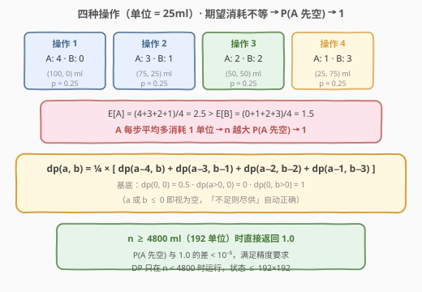
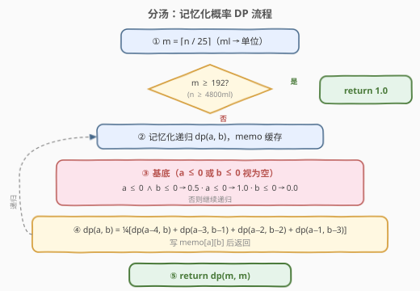
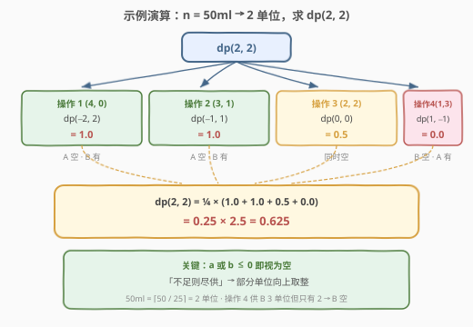

# 分汤

- **题目名称**：分汤
- **链接**：[808. 分汤](https://leetcode.cn/problems/soup-servings/)
- **难度**：中等
- **标签**：动态规划、记忆化搜索、概率 DP

## 1. 题目概述

有 A、B 两种汤，初始各有 `n` 毫升。每次等概率（各 0.25）执行以下四种分配之一：

| 操作 | 分配 A | 分配 B |
|------|--------|--------|
| 1 | 100 ml | 0 ml |
| 2 | 75 ml | 25 ml |
| 3 | 50 ml | 50 ml |
| 4 | 25 ml | 75 ml |

当某一种汤不足以完成分配时，**尽可能多地分配**（即全部倒出）。重复分配直到两种汤都分完。返回：**汤 A 先分完的概率** 加上 **A 和 B 同时分完的概率的一半**。

**示例 1**：

```text
输入：n = 50
输出：0.62500
解释：50ml = 2 个单位（25ml/单位）。四种操作各 0.25 概率：
  操作1(4,0)：A 空、B 有 → A 先空，贡献 1.0
  操作2(3,1)：A 空、B 有 → A 先空，贡献 1.0
  操作3(2,2)：A、B 同时空 → 贡献 0.5
  操作4(1,3)：B 空、A 有 → B 先空，贡献 0.0
  期望 = 0.25 × (1+1+0.5+0) = 0.625
```

**示例 2**：

```text
输入：n = 100
输出：0.71875
```

**约束条件**：

- `0 <= n <= 10^9`
- 返回结果与实际答案误差在 `10^-5` 以内即视为正确

> ⚠️ `n` 可达 $10^9$，直接 DP 状态空间爆炸。核心突破口在于发现**当 `n` 足够大时答案趋近于 1**，只需对小规模 `n` 做 DP。

---

## 2. 解题思路

### 2.1 暴力思路

从 `(n, n)` 出发递归：每一步等概率选四种操作之一，将 A、B 分别减去对应量（不足则归零），直到至少一种汤分完。四叉递归树的深度约 $n/25$，分支因子 4，朴素搜索 $O(4^{n/25})$ 完全不可行。

关键观察：**同一个 `(剩余A, 剩余B)` 状态会被不同操作序列重复到达**，存在大量重叠子问题——天然适合记忆化 DP。

### 2.2 核心观察：记忆化概率 DP + 阈值截断



**单位化**：四种操作的分配量都是 25 的倍数，因此以 25ml 为一个单位，将 `n` 转换为单位数 $m = \lceil n / 25 \rceil$。四种操作变为 `(4,0)`、`(3,1)`、`(2,2)`、`(1,3)`。

> 💡 **向上取整的正确性**：若剩余量不是 25 的整数倍（如 55ml = 2.2 单位），任何一次分配 ≥ 25ml 都会将余数部分一次性倒尽。因此一个"部分单位"和一个"完整单位"在消耗行为上完全等价——都只需一次命中即空。`⌈n/25⌉` 精确刻画了这一行为。

**状态定义**：

$$\text{dp}(a, b) = \text{剩余 } a \text{ 单位 A、} b \text{ 单位 B 时，A 先空的概率 + 同时空概率的一半}$$

**基底（a 或 b ≤ 0 即视为空，自动处理"不足则尽供"）**：

| 条件 | 返回值 | 含义 |
|------|--------|------|
| $a \le 0 \wedge b \le 0$ | $0.5$ | A、B 同时分完 |
| $a \le 0$（$b > 0$） | $1.0$ | A 先分完 |
| $b \le 0$（$a > 0$） | $0.0$ | B 先分完，A 未空 |

**转移**：四种操作等概率，取平均：

$$\text{dp}(a, b) = \frac{1}{4}\bigl[\text{dp}(a{-}4, b) + \text{dp}(a{-}3, b{-}1) + \text{dp}(a{-}2, b{-}2) + \text{dp}(a{-}1, b{-}3)\bigr]$$

> 💡 **基底中 ≤ 0 的妙处**：当 $a < 4$ 时执行操作 1（分配 4 单位 A），实际只能倒尽剩余的 A，对应 $a - 4 < 0$。基底直接判 $a \le 0$ 返回 1.0（A 空、B 有），恰好等价于"不足则尽供"的语义，无需额外 `max` 裁剪。

**阈值截断**：四种操作每步总分配量恒为 4 单位（100ml），但 A 的期望消耗 $= (4{+}3{+}2{+}1)/4 = 2.5$ 单位 > B 的 $= (0{+}1{+}2{+}3)/4 = 1.5$ 单位。A 每步平均多消耗 1 单位，因此 $n$ 越大，A 先空的概率越接近 1。经计算，当 $n \ge 4800$ ml（192 单位）时，$\text{dp}$ 与 1.0 的差值已小于 $10^{-5}$，直接返回 1.0 即可满足精度。

### 2.3 算法流程图



### 2.4 示例演算

以 `n = 50`（$m = 2$）为例，展开 $\text{dp}(2, 2)$ 的四棵子树：



| 操作 | 子调用 | 结果 | 原因 |
|------|--------|------|------|
| 1 (4, 0) | dp(−2, 2) | 1.0 | A 空（−2 ≤ 0），B 仍有 → A 先空 |
| 2 (3, 1) | dp(−1, 1) | 1.0 | A 空（−1 ≤ 0），B 仍有 → A 先空 |
| 3 (2, 2) | dp(0, 0) | 0.5 | A、B 同时空 |
| 4 (1, 3) | dp(1, −1) | 0.0 | B 空（−1 ≤ 0），A 仍有 → B 先空 |

$$\text{dp}(2, 2) = \frac{1}{4}(1.0 + 1.0 + 0.5 + 0.0) = \frac{2.5}{4} = 0.625$$

---

## 3. 参考代码

### 方法一：记忆化搜索（自顶向下，最直观）

### Python

```python
from functools import lru_cache

class Solution:
    def soupServings(self, n: int) -> float:
        if n >= 4800:                  # 阈值截断：P 与 1.0 差 < 1e-5
            return 1.0
        m = (n + 24) // 25             # ⌈n / 25⌉，ml → 单位

        @lru_cache(None)
        def dp(a: int, b: int) -> float:
            if a <= 0 and b <= 0:
                return 0.5             # 同时空
            if a <= 0:
                return 1.0             # A 先空
            if b <= 0:
                return 0.0             # B 先空
            return 0.25 * (dp(a - 4, b) + dp(a - 3, b - 1) +
                          dp(a - 2, b - 2) + dp(a - 1, b - 3))

        return dp(m, m)
```

### C++

```cpp
class Solution {
  public:
    double soupServings(int n) {
        if (n >= 4800) return 1.0;               // 阈值截断
        int m = (n + 24) / 25;                   // ⌈n / 25⌉
        vector<vector<double>> memo(m + 1, vector<double>(m + 1, -1));

        function<double(int, int)> dp = [&](int a, int b) -> double {
            if (a <= 0 && b <= 0) return 0.5;    // 同时空
            if (a <= 0) return 1.0;              // A 先空
            if (b <= 0) return 0.0;              // B 先空
            if (memo[a][b] >= 0) return memo[a][b];
            return memo[a][b] = 0.25 * (dp(a - 4, b) + dp(a - 3, b - 1) +
                                         dp(a - 2, b - 2) + dp(a - 1, b - 3));
        };

        return dp(m, m);
    }
};
```

> 💡 **记忆化判据**：`memo` 初始化为 $-1$，而所有有效概率值 $\in [0, 1]$，`memo[a][b] >= 0` 即可区分"已算"与"未算"，无需额外标志位。

### 方法二：递推（自底向上，无递归栈）

将基底填入 `dp[0][*]` 与 `dp[*][0]`，然后按 `a`、`b` 从小到大递推。负数下标用 `max(·, 0)` 裁剪到基底行/列（值恰好正确）。

### Python

```python
class Solution:
    def soupServings(self, n: int) -> float:
        if n >= 4800:
            return 1.0
        m = (n + 24) // 25
        dp = [[0.0] * (m + 1) for _ in range(m + 1)]
        dp[0][0] = 0.5
        for b in range(1, m + 1):
            dp[0][b] = 1.0                      # A 空、B 有
        # dp[a>0][0] = 0.0 已由初始化保证

        for a in range(1, m + 1):
            for b in range(1, m + 1):
                dp[a][b] = 0.25 * (
                    dp[max(a - 4, 0)][b] +
                    dp[max(a - 3, 0)][max(b - 1, 0)] +
                    dp[max(a - 2, 0)][max(b - 2, 0)] +
                    dp[max(a - 1, 0)][max(b - 3, 0)]
                )
        return dp[m][m]
```

### C++

```cpp
class Solution {
  public:
    double soupServings(int n) {
        if (n >= 4800) return 1.0;
        int m = (n + 24) / 25;
        vector<vector<double>> dp(m + 1, vector<double>(m + 1, 0));
        dp[0][0] = 0.5;
        for (int b = 1; b <= m; b++) dp[0][b] = 1.0;

        for (int a = 1; a <= m; a++)
            for (int b = 1; b <= m; b++)
                dp[a][b] = 0.25 * (dp[max(a - 4, 0)][b] +
                                    dp[max(a - 3, 0)][max(b - 1, 0)] +
                                    dp[max(a - 2, 0)][max(b - 2, 0)] +
                                    dp[max(a - 1, 0)][max(b - 3, 0)]);
        return dp[m][m];
    }
};
```

> 💡 **裁剪等价性**：递推版用 `max(a-4, 0)` 将负下标映射到第 0 行。由于 `dp[0][b>0] = 1.0`（A 空）、`dp[0][0] = 0.5`（同时空）、`dp[a>0][0] = 0.0`（B 空），与记忆化版基底完全一致，两种写法等价。

---

## 4. 复杂度分析

| 维度 | 复杂度 | 说明 |
|------|--------|------|
| 时间复杂度 | $O(m^2)$ | $m = \lceil n/25 \rceil$，阈值截断后 $m \le 192$，状态数 $\le 192^2 \approx 3.7 \times 10^4$，每个 $O(1)$ 转移 |
| 空间复杂度 | $O(m^2)$ | 记忆化表 / 递推表；$m \le 192$ 时约 $37000$ 个 double，不足 300KB |

阈值截断前 $n$ 可达 $10^9$，截断后 DP 规模恒定 $\le 192 \times 192$，毫秒级完成。

---

## 5. 扩展：阈值截断的数学直觉

四种操作每步总分配量恒为 100ml（4 单位），但 A、B 的期望消耗不对称：

$$E[\Delta A] = \frac{4+3+2+1}{4} = 2.5 \text{ 单位/步}, \quad E[\Delta B] = \frac{0+1+2+3}{4} = 1.5 \text{ 单位/步}$$

每步 A 比 B 多消耗 1 单位。将 A、B 消耗差 $D = \Delta A - \Delta B$ 视为随机游走，每步取值 $\{4, 2, 0, -2\}$（单位），均值 1、方差 5。经过约 $m/2.5$ 步后 A 耗尽，此时 $D$ 的均值为 $m/2.5$、标准差为 $\sqrt{5 \cdot m/2.5} = \sqrt{2m}$。B 先空等价于 $D < 0$，由中心极限定理：

$$P(\text{B 先空}) \approx \Phi\!\left(-\sqrt{\frac{m}{2 \times 5}}\right) = \Phi\!\left(-\sqrt{\frac{m}{10}}\right)$$

当 $m = 192$（$n = 4800$ ml）时，$P \approx \Phi(-4.38) \approx 6 \times 10^{-6} < 10^{-5}$，故返回 1.0 满足精度要求。

> ⚠️ 上述为粗略估计（CLT 近似 + 固定步数），实际阈值由精确 DP 验证。4800 是社区广泛采用的保守值，可安全通过 LeetCode 判题。

---

## 6. 面试要点

1. **为什么以 25ml 为单位，且要向上取整？**
   - 四种操作的分配量都是 25 的倍数，单位化后操作变为 `(4,0)`/`(3,1)`/`(2,2)`/`(1,3)`，整数运算更简洁。向上取整是因为"不足则尽供"：一个不足 25ml 的余量只需一次分配即被倒尽，行为上等价于一个完整单位。

2. **基底用 `a ≤ 0` 而非 `a == 0`，为什么？**
   - 操作可能使 a 或 b 减到负数（如 `a=2` 执行操作 1 减 4 → `a=-2`），负值意味着"分配量超过剩余量，已倒尽"。`≤ 0` 统一处理了"恰好空"与"超额倒尽"两种情况，无需 `max` 裁剪，代码最干净。

3. **`n` 高达 $10^9$ 怎么办？**
   - 期望消耗不对称（A 比 B 每步多消耗 1 单位），$n$ 越大 A 先空概率越接近 1。阈值 $n \ge 4800$ 时 $1 - P < 10^{-5}$，直接返回 1.0。DP 只在 $n < 4800$（$m < 192$）时运行，状态空间 $\le 192^2$，恒定毫秒级。

4. **记忆化 vs 递推怎么选？**
   - 记忆化顺着"从 `(m, m)` 出发倒推"的自然思路，代码最直观；递推无递归栈、显式控制填表顺序。本题 $m \le 192$ 两者都轻松通过，面试先写记忆化版讲清状态与基底，再口述可改递推即可。

5. **`n = 0` 时答案是多少？**
   - $0.5$：两种汤初始即为空，同时分完。代码中 $m = 0$，`dp(0, 0)` 命中基底 `a ≤ 0 ∧ b ≤ 0 → 0.5`，天然正确。

---

## 7. 同类练习题

- [837. 新 21 点](https://leetcode.cn/problems/new-21-game/)：同为概率 DP + 阈值截断（窗口和优化），对比"操作序列概率"与"抽牌概率"的状态设计异同
- [688. 骑士在棋盘上的概率](https://leetcode.cn/problems/knight-probability-in-chessboard/)：概率型 DP + 记忆化搜索，按步数分层、多方向转移，与本题结构高度相似
- [576. 出界的路径数](https://leetcode.cn/problems/out-of-boundary-paths/)（[站内题解](../0501-0600/576_出界的路径数.md)）：计数/概率型 DP 母题，"越界即终止"与本题"空即终止"的基底设计如出一辙
- [1269. 停在原地的方案数](https://leetcode.cn/problems/number-of-ways-to-stay-in-the-same-place-after-some-steps/)：步数型 DP + 位置维度，对比"概率期望"与"方案计数"的转移差异
