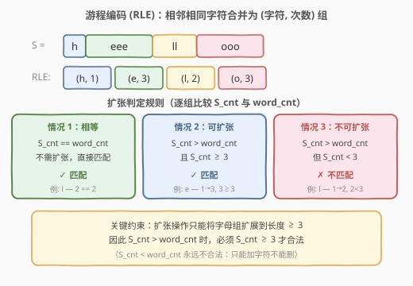
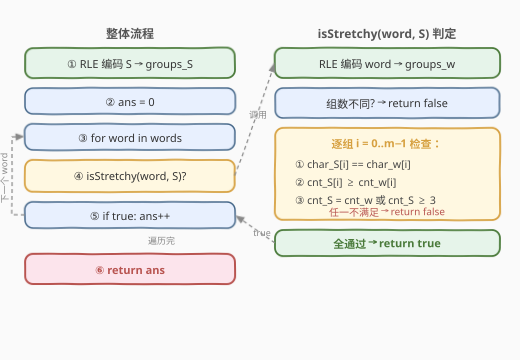
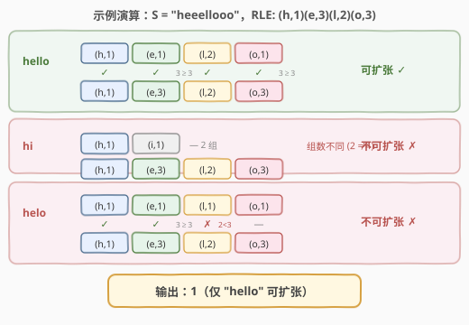

# 情感丰富的文字

- **题目名称**：情感丰富的文字
- **链接**：[809. 情感丰富的文字](https://leetcode.cn/problems/expressive-words/)
- **难度**：中等
- **标签**：数组、双指针、字符串

## 1. 题目概述

有时候人们会用重复写一些字母来表示额外的感受，比如 `"hello" -> "heeellooo"`, `"hi" -> "hiii"`。将相邻字母都相同的一串字符定义为**相同字母组**，例如 `"h", "eee", "ll", "ooo"`。

**扩张操作**：选择一个字母组（包含字母 `c`），往其中添加相同的字母 `c` 使其长度达到 **3 或以上**。注意：只能添加字符使其变长到 ≥ 3，不能缩短，也不能扩张到长度 2。

给定字符串 `s` 和一组查询单词 `words`，统计其中**可扩张**的单词数量——即能通过若干次扩张操作使该单词等于 `s`。

**示例**：

```text
输入：s = "heeellooo", words = ["hello", "hi", "helo"]
输出：1
解释：
- "hello"：扩张 "e"（1→3）和 "o"（1→3）可得 "heeellooo" ✓
- "hi"：字符序列与 s 不同（i vs e），无法匹配 ✗
- "helo"：s 中 "ll" 长度为 2 < 3，无法将 "l"（1个）扩张到 2 个 ✗
```

**约束条件**：

- `1 <= s.length, words.length <= 100`
- `1 <= words[i].length <= 100`
- `s` 和所有 `words[i]` 都只由小写字母组成

---

## 2. 解题思路

### 2.1 暴力思路

对每个 word，尝试所有可能的扩张方式（每个字母组选择扩张或不扩张、扩张到多少），看是否能得到 s。但扩张方式是指数级的，且 s 的长度最多 100，暴力搜索完全不可行。

### 2.2 核心观察：游程编码（RLE）+ 逐组判定



关键观察：**问题的基本单元是「字母组」而非单个字符**。将 s 和 word 分别做**游程编码**（Run-Length Encoding），拆成 `(字符, 连续次数)` 序列，然后逐组比较即可。

对 s 和 word 的 RLE 序列，每组 `(char_S, cnt_S)` 与 `(char_W, cnt_W)` 需满足：

1. **字符相同**：`char_S == char_W`（否则结构不同，无法匹配）
2. **只增不减**：`cnt_S >= cnt_W`（扩张只能加字符，不能删）
3. **扩张约束**：若 `cnt_S != cnt_W`（需要扩张），则必须 `cnt_S >= 3`（扩张操作要求结果长度 ≥ 3）

> 💡 **为什么 `cnt_S == cnt_W` 时不检查 ≥ 3？** 因为此时不需要扩张，组长度无论是 1、2 还是 100 都可以直接匹配。扩张约束只在「长度不等、需要改变」时才生效。

> ⚠️ **常见陷阱**：`cnt_S == 2` 时，无论 `cnt_W` 是 1 还是 2，都**不能扩张**。若 `cnt_W == 1`，需要扩张到 2，但 2 < 3 不合法；若 `cnt_W == 2`，则不需扩张，直接匹配。所以 `cnt_S == 2` 只能与 `cnt_W == 2` 匹配。

### 2.3 算法流程图



整体流程分两步：
1. **预处理**：对 s 做 RLE，得到 `groups_S`
2. **逐词判定**：对每个 word 做 RLE 得到 `groups_W`，检查组数、字符、计数三重条件

### 2.4 示例演算



以 `s = "heeellooo"`（RLE: `(h,1)(e,3)(l,2)(o,3)`）为例：

| word | RLE | 逐组判定 | 结果 |
|------|-----|----------|------|
| "hello" | `(h,1)(e,1)(l,2)(o,1)` | h: 1=1✓ e: 1→3(3≥3)✓ l: 2=2✓ o: 1→3(3≥3)✓ | 可扩张 ✓ |
| "hi" | `(h,1)(i,1)` | 组数 2≠4 | 不可扩张 ✗ |
| "helo" | `(h,1)(e,1)(l,1)(o,1)` | h: 1=1✓ e: 1→3(3≥3)✓ l: 1→2(2<3)✗ | 不可扩张 ✗ |

输出 `1`（仅 "hello" 可扩张）。

---

## 3. 参考代码

### C++

```cpp
class Solution {
public:
    vector<pair<char, int>> rle(const string& s) {
        vector<pair<char, int>> groups;
        int i = 0, n = s.size();
        while (i < n) {
            int j = i;
            while (j < n && s[j] == s[i]) j++;
            groups.push_back({s[i], j - i});
            i = j;
        }
        return groups;
    }

    int expressiveWords(string s, vector<string>& words) {
        auto sg = rle(s);
        int ans = 0;
        for (const string& w : words) {
            auto wg = rle(w);
            if (wg.size() != sg.size()) continue;
            bool ok = true;
            for (size_t k = 0; k < sg.size() && ok; k++) {
                if (sg[k].first != wg[k].first || sg[k].second < wg[k].second)
                    ok = false;
                else if (sg[k].second != wg[k].second && sg[k].second < 3)
                    ok = false;
            }
            if (ok) ans++;
        }
        return ans;
    }
};
```

### Python

```python
class Solution:
    def expressiveWords(self, s: str, words: List[str]) -> int:
        def rle(st):
            groups = []
            i = 0
            while i < len(st):
                j = i
                while j < len(st) and st[j] == st[i]:
                    j += 1
                groups.append((st[i], j - i))
                i = j
            return groups

        s_groups = rle(s)
        ans = 0
        for w in words:
            w_groups = rle(w)
            if len(w_groups) != len(s_groups):
                continue
            ok = True
            for (sc, scnt), (wc, wcnt) in zip(s_groups, w_groups):
                if sc != wc or scnt < wcnt:
                    ok = False
                    break
                if scnt != wcnt and scnt < 3:
                    ok = False
                    break
            if ok:
                ans += 1
        return ans
```

---

## 4. 复杂度分析

| 维度 | 复杂度 | 说明 |
|------|--------|------|
| 时间复杂度 | $O(|S| + \sum|word_i|)$ | 对 s 做一次 RLE（$O(|S|)$），每个 word 做一次 RLE 并逐组比较（$O(|word_i|)$） |
| 空间复杂度 | $O(|S|)$ | 存储 s 的 RLE 结果；双指针可优化至 $O(1)$（见第 5 节） |

---

## 5. 扩展：双指针原地比较（O(1) 空间）

不显式构建 RLE 数组，而是用**双指针**在 s 和 word 上同步扫描，边走边统计当前字符组的长度：

```python
class Solution:
    def expressiveWords(self, s: str, words: List[str]) -> int:
        def is_stretchy(word):
            i = j = 0
            n, m = len(s), len(word)
            while i < n and j < m:
                if s[i] != word[j]:
                    return False
                si = i
                while i < n and s[i] == s[si]:
                    i += 1
                sj = j
                while j < m and word[j] == word[sj]:
                    j += 1
                s_cnt, w_cnt = i - si, j - sj
                if s_cnt < w_cnt or (s_cnt != w_cnt and s_cnt < 3):
                    return False
            return i == n and j == m

        return sum(1 for w in words if is_stretchy(w))
```

> 💡 **双指针的关键**：`i` 和 `j` 同步推进，每次跳过一个完整的字符组。两组必须在同一位置开始（字符相同），否则直接返回 `false`。最终需要 `i == n and j == m` 确保两串都完整消费。

---

## 6. 面试要点

1. **为什么扩张操作要求长度达到 3？**
   - 题目语义：扩张操作模拟「人为重复」——人们打字时会重复字母表达情绪（如 `"hello"` → `"heeellooo"`），重复至少 3 次才算有意为之。长度 1 或 2 视为「原本就是这么多」，不构成扩张。这区分了 `cnt_S == cnt_W`（不需扩张，天然匹配）与 `cnt_S > cnt_W`（需要扩张，必须 ≥ 3）。

2. **为什么用 RLE 而不是逐字符比较？**
   - 问题的判定单元是「字母组」：扩张操作针对的是整组而非单个字符。RLE 把字符串压缩为 `(字符, 次数)` 序列，使逐组比较自然且高效。逐字符比较需在每次字符变化时处理组边界，逻辑分散。

3. **`cnt_S < cnt_W` 时为什么直接判否？**
   - 扩张只能「加」字符不能「删」。若 s 中某组比 word 对应组短，说明 word 有多余字符无法消除，必然不匹配。

4. **如何处理 word 和 s 的组数不同？**
   - 组数不同意味着字符序列的结构不同——某处有 word 没有的字符或反之，无法通过扩张对齐。这是 $O(1)$ 快速剪枝，避免逐组比较。

5. **`cnt_S == 2` 时能匹配哪些 `cnt_W`？**
   - 只能匹配 `cnt_W == 2`（不需扩张，直接相等）。`cnt_W == 1` 时需扩张到 2，但 2 < 3 不合法；`cnt_W >= 3` 时 `cnt_S < cnt_W` 不满足只增不减。所以 `cnt_S == 2` 是一个「死区」，只能精确匹配。

---

## 7. 同类练习题

- [38. 外观数列](https://leetcode.cn/problems/count-and-say/)（[题解](../0001-0100/38_外观数列.md)）：RLE 的递归生成变体，每轮对上一轮结果做「读出」描述，本质是 RLE 的口语化输出
- [443. 压缩字符串](https://leetcode.cn/problems/string-compression/)（[题解](../0401-0500/443_压缩字符串.md)）：RLE 的原地写入变体，同样需统计连续字符组，但要求原地修改数组
- [1446. 连续字符](https://leetcode.cn/problems/consecutive-characters/)：求最长连续字符组的长度，RLE 的最简化版——只需 max 不需存储全部组
- [1750. 删除字符串两端相同字符后的最小长度](https://leetcode.cn/problems/minimum-length-of-string-after-deleting-similar-ends/)：双指针处理连续字符组的变体，从两端向内收缩删除相同前缀后缀
