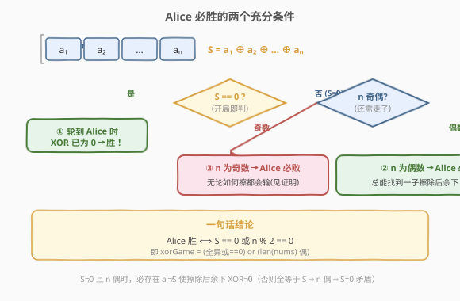
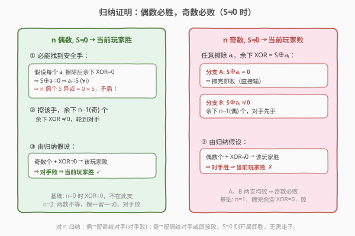
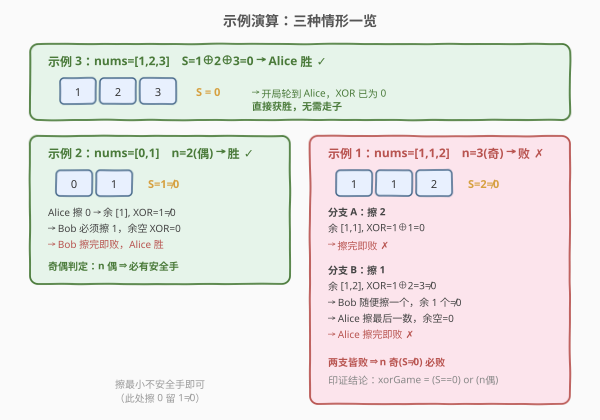

# LeetCode 黑板异或游戏 题解

## 1. 题目概述

- **标题 / 题号**：黑板异或游戏（#810，hard）
- **链接**：https://leetcode.cn/problems/chalkboard-xor-game/
- **难度**：困难
- **标签**：位运算、数学、博弈、脑筋急转弯

**题意**：黑板上写着一个非负整数数组 `nums`。Alice 和 Bob 轮流从中擦掉一个数字，**Alice 先手**。规则有两条：

- **擦完即判**：擦除一个数字后，若**剩余数字**的异或为 `0`，则**当前擦数的玩家失败**；
- **开局即判**：轮到某玩家时，若**当前黑板上全部数字**的异或已为 `0`，则该玩家**直接获胜**。

补充约定：只剩一个数字时异或即它本身；无数字剩余时异或为 `0`。两人都采取最优策略，**当且仅当 Alice 获胜**返回 `true`。

**示例 1**：

```text
输入：nums = [1,1,2]
输出：false
解释：S = 1⊕1⊕2 = 2 ≠ 0，n = 3 为奇数。
  Alice 擦 2 → 余 [1,1]，1⊕1=0 → Alice 擦完即败；
  Alice 擦 1 → 余 [1,2]，1⊕2=3≠0 → Bob 随便擦一个，Alice 擦最后一数，余空 XOR=0 → 败。
两支皆败，返回 false。
```

**示例 2**：

```text
输入：nums = [0,1]
输出：true
解释：S = 0⊕1 = 1 ≠ 0，n = 2 为偶数。Alice 擦 0，余 [1] XOR=1≠0；
  Bob 只能擦 1，余空 XOR=0 → Bob 败，Alice 胜。
```

**示例 3**：

```text
输入：nums = [1,2,3]
输出：true
解释：S = 1⊕2⊕3 = 0。Alice 开局即判，XOR 已为 0，直接获胜。
```

**约束**：

- `1 <= nums.length <= 1000`
- `0 <= nums[i] < 2^16`

> ⚠️ 本题是典型的「代码一行、证明一页」的**数学博弈题**。面试官真正想考察的是能否把博弈规则抽象为**奇偶性 + 全局异或**的不变量，并给出严谨的归纳证明。暴力博弈 DP 虽能写但状态爆炸，见第 5 节。

## 2. 解题思路

### 2.1 暴力思路

把「黑板上剩余的多重集」当作状态，用 Minimax 递归：当前玩家枚举擦除每一个数，擦后余下异或为 `0` 则本步判负；否则递归到对手。状态总数是多重组合数，`n=1000` 时指数级爆炸，完全不可行。

即便是「异或值 + 剩余个数」做记忆化也远远不够——同样异或值下不同元素组合的安全手集合不同。需要换一个角度：**全局异或 $S$ 与元素个数 $n$ 的奇偶，已经足够决定胜负**。

### 2.2 核心观察：奇偶性 + 全局异或



记 $S = a_1 \oplus a_2 \oplus \dots \oplus a_n$ 为开局时全部数字的异或。关键观察有两条：

**观察 ①（开局即胜）**：若 $S = 0$，Alice 在自己的第一个回合就发现黑板上 XOR 已为 `0`，按「开局即判」规则**直接获胜**。

**观察 ②（走子阶段的奇偶不变量）**：若 $S \ne 0$，玩家必须走子。擦除 $a_i$ 后剩余异或为 $S \oplus a_i$。本题的核心定理是：

> **定理**：当 $S \ne 0$ 时，**当前玩家胜 $\iff$ 剩余个数 $n$ 为偶数**。

把两条合并，就得到一行结论：

$$
\text{Alice 胜} \iff S = 0 \ \text{或}\ n \bmod 2 = 0
$$

> 💡 **为什么偶数必胜的直觉**：偶数个数字时，Alice 总能找到「擦掉它之后剩余异或仍非 0」的安全手——因为若所有数字擦掉后都使剩余异或变 0，则每个 $a_i = S$，而偶数个 $S$ 异或必为 0，与 $S \ne 0$ 矛盾。于是 Alice 把**奇数个**数字、异或非 0 的局面甩给 Bob，而奇数局面下 Bob 怎么走都会输（见证明）。

### 2.3 归纳证明流程图



对 $n$（剩余个数）做数学归纳，前提始终是 $S \ne 0$：

- **偶数 $n$ → 胜**：必能找到安全手 $a_i \ne S$（反证：全等于 $S$ 则偶数个 $S$ 异或为 0，矛盾）。擦它，余下 $n-1$（奇）个、异或非 0，轮到对手。由归纳假设「奇数 → 败」，对手败，故当前玩家胜。
- **奇数 $n$ → 败**：任意擦 $a_i$，余下异或 $= S \oplus a_i$。要么为 0（擦完即败），要么非 0 且个数 $n-1$ 为偶、轮到对手（由归纳假设「偶数 → 胜」，对手胜）。两支皆败。
- **基础**：$n=1$（奇），擦完余空异或为 0，败；$n=0$ 时异或为 0，属 $S=0$ 支，开局即胜。

### 2.4 示例演算



三个示例分别覆盖三种判定：

| 示例 | nums | $S$ | $n$ 奇偶 | 判定 | 触发条件 |
|------|------|-----|----------|------|----------|
| 3 | `[1,2,3]` | $0$ | — | `true` | $S=0$，开局即胜 |
| 2 | `[0,1]` | $1\ne0$ | 偶 | `true` | $n$ 偶，必有安全手（擦 0 留 1） |
| 1 | `[1,1,2]` | $2\ne0$ | 奇 | `false` | $n$ 奇，擦 2 余 0 即败 / 擦 1 留偶给 Bob 必败 |

示例 1 的两个分支正好对应证明里「奇数 → 败」的 A、B 两支：擦 2 直接触发「擦完即败」（分支 A）；擦 1 留下偶数个非 0 局面给 Bob，Bob 走子后 Alice 擦最后一数即败（分支 B）。

## 3. 参考代码

### C++

```cpp
class Solution {
  public:
    bool xorGame(vector<int>& nums) {
        int x = 0;
        for (int v : nums) x ^= v;
        return x == 0 || (nums.size() & 1) == 0;
    }
};
```

### Python

```python
class Solution:
    def xorGame(self, nums: List[int]) -> bool:
        x = 0
        for v in nums:
            x ^= v
        return x == 0 or len(nums) % 2 == 0
```

> 💡 Python 也可用 `reduce(lambda a, b: a ^ b, nums)` 或直接 `xor(*nums)`（Python 3.8+ 的 `math.prod` 同族无 `xor`，需 `functools.reduce`）。但显式循环最直观且无额外导入，推荐面试手写。

## 4. 复杂度分析

| 维度 | 复杂度 | 说明 |
|------|--------|------|
| 时间复杂度 | $O(n)$ | 单次遍历求全局异或，$n$ 为数组长度 |
| 空间复杂度 | $O(1)$ | 仅维护一个异或累加变量 |

> 💡 难度「困难」全在证明上，代码本身是 $O(n)$/$O(1)$ 的脑筋急转弯。若面试中只甩一行代码不讲证明，基本会被追问到崩——务必把第 2.3 节的归纳证明讲清楚。

## 5. 扩展：记忆化博弈 DP（理解规则用，不推荐提交）

若想用 DP 验证小规模结论，状态需刻画「剩余元素的多重集」。由于 $n \le 1000$、$0 \le \text{nums}[i] < 2^{16}$，无法直接建表，但可用「排序后的元组」做记忆化键在小规模上跑：

```python
from functools import lru_cache

def aliceWinsNaive(nums):
    @lru_cache(None)
    def win(state):              # state: 排序后的剩余数元组
        x = 0
        for v in state:
            x ^= v
        if x == 0:               # 开局即判：当前玩家直接胜
            return True
        n = len(state)
        # 当前玩家枚举擦一个
        for i in range(n):
            if i > 0 and state[i] == state[i-1]:
                continue         # 同值剪枝
            nxt = state[:i] + state[i+1:]
            rem = 0
            for v in nxt:
                rem ^= v
            if rem == 0:         # 擦完即败，跳过
                continue
            if not win(nxt):     # 对手在剩余局面败 → 当前玩家胜
                return True
        return False             # 无安全手或对手全胜 → 败
    return win(tuple(sorted(nums)))
```

> ⚠️ 该写法仅用于**理解规则与小规模对拍**，$n$ 稍大即超时/超内存。其递归结构恰好印证定理：`x == 0` 直接返回 `True`（对应观察 ①）；否则若存在一个安全手使对手必败则胜，否则败——这等价于「奇偶判定」。可用它对随机小数据与一行公式做对拍验证正确性。

**对拍脚本**（小规模随机验证定理）：

```python
import random

def formula(nums):
    x = 0
    for v in nums:
        x ^= v
    return x == 0 or len(nums) % 2 == 0

for _ in range(20000):
    n = random.randint(1, 7)
    nums = [random.randint(0, 7) for _ in range(n)]
    assert aliceWinsNaive(nums) == formula(nums)
print("对拍通过")
```

## 6. 面试要点

1. **为什么 $S = 0$ 时 Alice 直接胜，而不是要走到某个状态？**

   - 规则明确「轮到某玩家时，若黑板上全部数字异或为 0，该玩家获胜」。Alice 先手第一回合就检查这一条，$S=0$ 即命中，无需走子。注意不要与「擦完即判」混淆——后者判的是**剩余**异或，前者判的是**当前全部**异或。

2. **偶数必胜里「必有安全手」的证明核心是什么？**

   - 反证。若每个 $a_i$ 擦除后剩余异或都为 0，则 $S \oplus a_i = 0$ 对所有 $i$ 成立，即所有 $a_i = S$。偶数个相同值 $S$ 的异或为 0，与 $S \ne 0$ 矛盾。故至少存在一个 $a_i \ne S$，擦它后剩余异或非 0，是安全手。

3. **奇数必败的「两支皆败」分别指什么？**

   - 任意擦一个 $a_i$：若 $S \oplus a_i = 0$ → 触发「擦完即败」直接输（分支 A）；若 $S \oplus a_i \ne 0$ → 余下偶数个、异或非 0 局面交给对手，由归纳假设对手必胜，故仍输（分支 B）。两支无逃路。

4. **归纳的基础情形怎么处理？**

   - $n=1$（奇）：该数非 0（否则 $S=0$ 走另一支），擦完余空异或为 0，败。$n=0$ 时异或为 0，归入 $S=0$ 开局即胜支。归纳从 $n=1,2$ 起步，对 $n$ 递增成立。

5. **能否把条件合并成「$n$ 为偶数就胜」？为什么还要单独判 $S=0$？**

   - 不能省。$S=0$ 时无论 $n$ 奇偶 Alice 都直接胜（如示例 3，$n=3$ 奇但 $S=0$ 仍胜）。若只判 $n$ 偶会漏掉「奇数个但异或恰为 0」的胜局。完整条件是两者取或：$S=0$ 或 $n$ 偶。

## 同类练习题

| # | 题目 | 与本题的关联 |
|---|------|-------------|
| 877 | [石子游戏](../0801-0900/877_石子游戏.md) | 同为博弈型「先手必胜」结论题，但靠区间 DP 求净赚；本题靠异或与奇偶不变量，体会两类博弈的不同分析工具 |
| 486 | [预测赢家](https://leetcode.cn/problems/predict-the-winner/) | 877 的无特殊约束版（允许平局、奇数长度），区间 DP 判定净赚 $\ge 0$，与本题「数学结论失效时回归 DP」呼应 |
| 292 | [Nim 游戏](https://leetcode.cn/problems/nim-game/) | 经典博弈数学结论（$n \bmod 4 \ne 0$ 则先手胜），同为「一行代码 + 归纳证明」的脑筋急转弯博弈 |
| 190 | [颠倒二进制位](https://leetcode.cn/problems/reverse-bits/)/ [191. 位 1 的个数](https | //leetcode.cn/problems/number-of-1-bits/)：位运算基本功，巩固异或性质 $a \oplus a = 0$、$a \oplus 0 = a$（本题证明反复用到） |
| 144 | [二叉树的前序遍历](https://leetcode.cn/problems/binary-tree-preorder-traversal/) | 看似一行递归但需讲清「不变量与归纳」，与本题「结论简单、证明需严谨」同属思维训练型题 |
