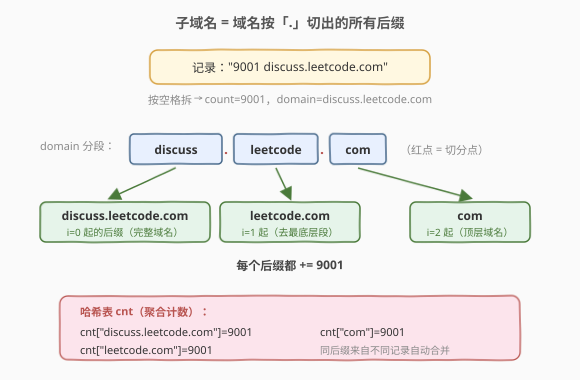
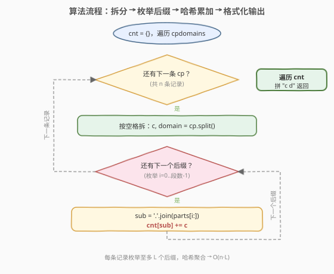
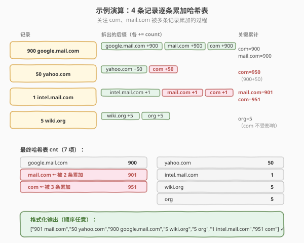

# LeetCode 子域名访问计数 题解

## 1. 题目概述

- **标题 / 题号**：子域名访问计数（#811，medium）
- **链接**：https://leetcode.cn/problems/subdomain-visit-count/
- **难度**：中等
- **标签**：数组、哈希表、字符串

**题意**：一个网站域名如 `"discuss.leetcode.com"` 包含多个子域名：顶层是 `"com"`，下一层是 `"leetcode.com"`，最底层是 `"discuss.leetcode.com"`。当我们访问 `"discuss.leetcode.com"` 时，也会**隐式访问**它的所有父级域名 `"leetcode.com"` 和 `"com"`。

现给定一组**计数配对域名** `cpdomains`，每条形如 `"9001 discuss.leetcode.com"`（前半是访问次数，后半是域名）。要求统计**每个子域名**（含完整域名及其各级父域名）被访问的总次数，以 `"次数 域名"` 格式返回，顺序任意。

**示例 1**：

```text
输入：cpdomains = ["9001 discuss.leetcode.com"]
输出：["9001 discuss.leetcode.com","9001 leetcode.com","9001 com"]
解释：只有一条记录。完整域名 discuss.leetcode.com 访问 9001 次，
      其父级 leetcode.com、com 也各被访问 9001 次。
```

**示例 2**：

```text
输入：cpdomains = ["900 google.mail.com","50 yahoo.com","1 intel.mail.com","5 wiki.org"]
输出：["901 mail.com","50 yahoo.com","900 google.mail.com","5 wiki.org","5 org","1 intel.mail.com","951 com"]
解释：
      google.mail.com 900 次 → mail.com +900、com +900
      yahoo.com        50 次 → com +50
      intel.mail.com    1 次 → mail.com +1、com +1
      wiki.org          5 次 → org +5
      汇总后 mail.com=901、com=951（被三条记录累加）。
```

**约束**：

- `1 <= cpdomains.length <= 100`
- `1 <= cpdomains[i].length <= 100`
- 每条 `cpdomains[i]` 形如 `"count domain"`，`count` 在 `[1, 10^4]` 之间。
- 域名由小写英文字母和 `.` 组成，每段非空，至少含一个 `.`。

> 💡 这是一道**字符串切分 + 哈希表计数**的招牌题。核心套路：把每条 `cpdomains[i]` 先按空格拆出「次数 + 域名」，再把域名按 `.` 拆成若干段，**枚举所有后缀子域名**累加次数。哈希表把「按域名聚合」从暴力 `O(n^2)` 降到 `O(n)`，是"拆分 + 聚合计数"模式的最小可用范例。

## 2. 解题思路

### 2.1 暴力思路：逐条全量扫描去重

最朴素的写法：把所有 `(子域名, 次数)` 二元组先收集到一个列表里，再对列表排序、扫描相邻同域名合并。或者对每个新出现的子域名，回头遍历整个列表求和。

```text
pairs = []
for cp in cpdomains:
    c, domain = split(cp)
    for sub in suffixes(domain):
        pairs.append((sub, c))
sort pairs by domain
scan & merge adjacent
```

这种做法能过，但**排序 + 合并**写起来繁琐，且 `O(m log m)`（`m` 为二元组总数）多了一层不必要的对数因子。问题在于：我们需要的是"按域名聚合计数"，这恰恰是**哈希表**的看家本领——`map[domain] += count` 一行搞定聚合，无需排序去重。

### 2.2 核心观察：子域名 = 域名按 `.` 切出的所有后缀

**关键定义**：一个域名 `a.b.c` 的所有子域名，就是它按 `.` 分段后，从每个分段起点开始取到末尾的**后缀串**：

| 起点 | 后缀子域名 | 说明 |
|------|-----------|------|
| 第 1 段 | `a.b.c` | 完整域名本身 |
| 第 2 段 | `b.c` | 去掉最底层一段 |
| 第 3 段 | `c` | 顶层域名 |



**核心观察**：访问 `a.b.c` 一次，等同于同时访问 `a.b.c`、`b.c`、`c` 各一次。因此对每条记录，只需**枚举所有后缀**，把 `count` 累加到哈希表 `map[后缀]` 上即可。

> 💡 **后缀枚举的两种等价写法**：① 按 `.` split 成段后，`'.'.join(parts[i:])` 拼出第 `i` 段起的后缀；② 不 split，直接在原串里扫描每个 `.` 位置，`substr(点位置+1)` 取后缀。两者等价，前者直观、后者省一次拼接。本题规模小，选哪种都行，面试中讲清"后缀 = 从某点截到末尾"即可。

### 2.3 算法流程图



**完整步骤**：

1. **建哈希表** `cnt`：键为子域名，值为累计访问次数。
2. **遍历每条** `cpdomains[i]`：
   - 按空格拆出 `count`（转整数）和 `domain`。
   - 把 `domain` 按 `.` 切成 `parts`。
   - 对 `i` 从 `0` 到 `len(parts)-1`：后缀 `sub = '.'.join(parts[i:])`，执行 `cnt[sub] += count`。
3. **格式化输出**：遍历 `cnt`，每项拼成 `"<count> <domain>"` 加入结果列表。

> ⚠️ **易错点**：① 别忘了把**完整域名本身**（`i=0` 的后缀）也算进去——它是"最底层"的子域名；② `count` 必须先转整数再累加，字符串拼接会出错；③ 输出顺序题目允许任意，无需排序。

### 2.4 示例演算

以示例 2 `["900 google.mail.com","50 yahoo.com","1 intel.mail.com","5 wiki.org"]` 为例，逐条追踪哈希表的变化：



| 记录 | 拆出的后缀 | 哈希表增量 | 关键累计 |
|------|-----------|-----------|----------|
| `900 google.mail.com` | `google.mail.com` / `mail.com` / `com` | 各 +900 | `com=900`, `mail.com=900` |
| `50 yahoo.com` | `yahoo.com` / `com` | 各 +50 | `com=950` |
| `1 intel.mail.com` | `intel.mail.com` / `mail.com` / `com` | 各 +1 | `mail.com=901`, `com=951` |
| `5 wiki.org` | `wiki.org` / `org` | 各 +5 | `org=5` |

最终哈希表：`com=951`、`mail.com=901`、`google.mail.com=900`、`yahoo.com=50`、`intel.mail.com=1`、`wiki.org=5`、`org=5`，共 7 项，格式化后即得输出。

> 💡 **关键观察**：`com` 作为顶层域名被 3 条不同记录（`google.mail.com`、`yahoo.com`、`intel.mail.com`）累加，最终 951 次。这正是哈希表聚合的威力——**同一后缀来自不同记录的次数自动合并**，无需手动去重。

## 3. 参考代码

### C++

```cpp
class Solution {
  public:
    vector<string> subdomainVisits(vector<string>& cpdomains) {
        unordered_map<string, int> cnt;
        for (const string& cp : cpdomains) {
            int space = cp.find(' ');
            int c = stoi(cp.substr(0, space));        // 次数转整数
            string domain = cp.substr(space + 1);     // 域名
            // 枚举每个后缀子域名：遇到 '.' 就取其后到末尾
            cnt[domain] += c;                          // 完整域名本身
            for (int i = 0; i < (int)domain.size(); ++i) {
                if (domain[i] == '.') {
                    cnt[domain.substr(i + 1)] += c;   // 去掉最底层一段的后缀
                }
            }
        }
        vector<string> ans;
        for (auto& [d, c] : cnt) {
            ans.push_back(to_string(c) + " " + d);
        }
        return ans;
    }
};
```

### Python

```python
class Solution:
    def subdomainVisits(self, cpdomains: List[str]) -> List[str]:
        cnt = collections.Counter()
        for cp in cpdomains:
            c, domain = cp.split()                    # 按空格拆：次数 + 域名
            c = int(c)
            parts = domain.split('.')                 # 按 . 切段
            for i in range(len(parts)):
                sub = '.'.join(parts[i:])             # 第 i 段起的后缀子域名
                cnt[sub] += c
        return [f"{c} {d}" for d, c in cnt.items()]   # 格式化输出
```

> 💡 两版代码思路一致，区别在后缀枚举方式：C++ 版在原串上扫描每个 `.`，`substr(i+1)` 直接取后缀，省一次 `join`；Python 版用 `split('.')` 后 `'.'.join(parts[i:])`，更直观可读。`collections.Counter` 是 `dict` 的计数特化版，`cnt[sub] += c` 对不存在的键自动以 0 起算。

## 4. 复杂度分析

| 维度 | 复杂度 | 说明 |
|------|--------|------|
| **时间复杂度** | `O(n * L)` | `n` 为记录条数，`L` 为单条域名的平均长度；每条需 `O(L)` 切分 + 枚举至多 `L` 个后缀，每个后缀哈希操作 `O(L)`（键长）。总段数有界，规模小 |
| **空间复杂度** | `O(n * L)` | 哈希表最多存 `n * (段数)` 个不同子域名，每个键长 `O(L)`；输出列表同阶 |

> ⚠️ 严格说哈希表单次操作是 `O(键长)` 而非 `O(1)`（因为要哈希并比较整个字符串），但域名总段数受 `n * L` 上界控制，整体仍是线性于输入规模。本题 `n ≤ 100`、`L ≤ 100`，实际开销可忽略。

## 5. 扩展：输出按访问次数降序？

题目允许任意顺序返回。若面试官追问"按访问次数降序、同次数按域名字典序升序输出"，只需在收集结果后排序：

```python
result = [f"{c} {d}" for d, c in cnt.items()]
result.sort(key=lambda s: (-int(s.split()[0]), s.split()[1]))
return result
```

**思路**：把"按值排序哈希表"的需求转化为对结果列表排序，`key` 用 `(-count, domain)` 一次性表达"次数降序 + 域名升序"两个准则。这与 [692. 前 K 个高频单词](https://leetcode.cn/problems/top-k-frequent-words/) 的排序方向完全一致——后者要 Top-K，本题要全量，排序键设计是共通的。

> 💡 若只要 Top-K 而非全量排序，用**最小堆**维护 K 个最大值更高效（`O(n log k)`），正是 692 题的标准解法。本题 `k = 全部`，所以直接排序更简单。

## 6. 面试要点

1. **为什么要枚举"所有后缀"而不只是各级父域名？**

   - 访问 `a.b.c` 一次，会同时访问 `a.b.c`、`b.c`、`c` 三个域名。这三者恰好是 `a.b.c` 按 `.` 切分后从每个分段起点取到末尾的后缀。枚举后缀 = 枚举所有被隐式访问的域名，一个不漏。

2. **为什么用哈希表而不是排序合并？**

   - 哈希表的 `map[domain] += count` 一行完成"按域名聚合"，自动合并相同键，无需排序去重。排序合并要多一次 `O(m log m)` 排序 + 相邻扫描，写法更繁琐。聚合计数是哈希表的看家本领。

3. **C++ 版扫描 `.` 取 `substr` 和 Python 版 `split` + `join` 哪种更好？**

   - 各有取舍。C++ 版在原串上原地扫描，每个 `.` 处 `substr(i+1)` 取后缀，省去 `join`，但 `substr` 本身是 `O(L)` 复制。Python 版 `split('.')` 后 `'.'.join(parts[i:])` 更直观，但 `join` 也是 `O(L)`。两者复杂度相同，本题规模下无差异，选可读性更好的 Python 版讲思路即可。

4. **如果域名层级很深（如 `a.b.c.d.e.com`），算法还高效吗？**

   - 依然高效。每条记录产生"段数"个后缀（深度 `D` 则 `D` 个后缀），每个后缀哈希操作 `O(L)`。总时间 `O(n * D * L)`，而 `D ≤ L`，所以上界仍是 `O(n * L^2)`。但实际域名层级有限（通常 ≤ 5），可视为 `O(n * L)`。

5. **`count` 为什么要先转整数再累加？**

   - 哈希表存的是数值用于累加，若以字符串拼接（如 `"900" + "50" = "90050"`）会得到错误结果。必须 `stoi` / `int()` 转成数值后 `+=`，输出时再 `to_string` / `f-string` 拼回字符串。

> 💡 **一句话总结**：811 是"拆分 + 聚合计数"模式的最小范例——按空格拆次数与域名、按 `.` 拆出所有后缀子域名、哈希表 `+= count` 聚合、格式化输出。哈希表把聚合从 `O(m log m)` 排序降到 `O(m)`，是处理"按键累计"类问题的第一选择。

## 同类练习题

| # | 题目 | 与本题的关联 |
|---|------|-------------|
| 692 | [前 K 个高频单词](https://leetcode.cn/problems/top-k-frequent-words/)（[题解](../0601-0700/692_前K个高频单词.md)） | 同款哈希计数，进阶求 Top-K 用最小堆 |
| 451 | [根据字符出现频率排序](https://leetcode.cn/problems/sort-characters-by-frequency/)（[题解](../0401-0500/451_根据字符出现频率排序.md)） | 哈希计数 + 按频率排序输出 |
| 648 | [单词替换](https://leetcode.cn/problems/replace-words/)（[题解](../0601-0700/648_单词替换.md)） | 字符串拆分 + 前缀匹配（Trie 视角，对照后缀枚举） |
| 819 | [最常见的单词](https://leetcode.cn/problems/most-common-word/) | 最接近本题——拆分段落为单词 + 哈希计数 + 排除停用词，求最高频词 |
