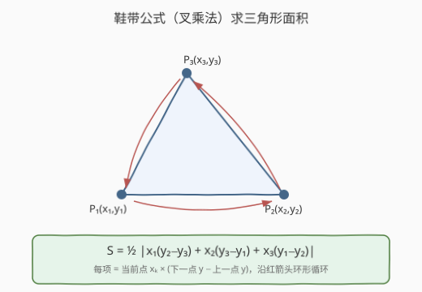
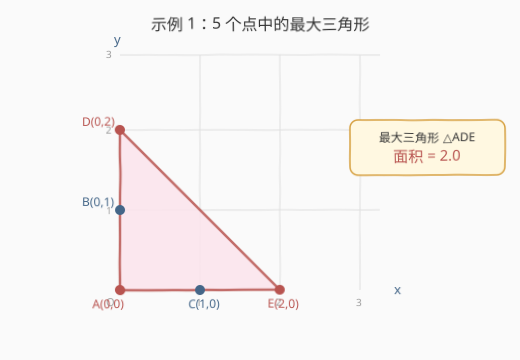
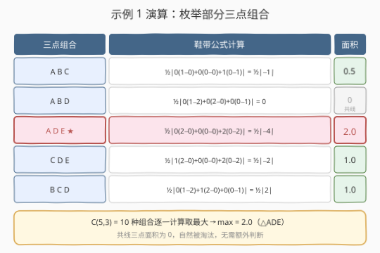
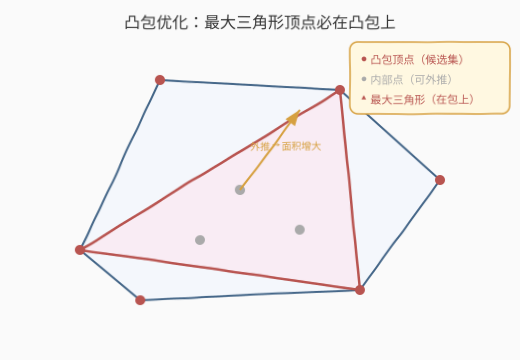

# LeetCode 最大三角形面积 题解

## 1. 题目概述

- **标题 / 题号**：最大三角形面积（#812，easy）
- **链接**：https://leetcode.cn/problems/largest-triangle-area/
- **难度**：简单
- **标签**：几何、数组、数学

**题意**：给定 X-Y 平面上的点集 `points`，其中 `points[i] = [xi, yi]`。从中任取**三个不同的点**组成三角形，返回能组成的**最大三角形面积**。与真实值误差在 $10^{-5}$ 内的答案视为正确。

**示例 1**：

```text
输入：points = [[0,0],[0,1],[1,0],[0,2],[2,0]]
输出：2.00000
解释：5 个点中，由 (0,0)、(0,2)、(2,0) 构成的红色三角形面积最大，为 2。
```

**示例 2**：

```text
输入：points = [[1,0],[0,0],[0,1]]
输出：0.50000
```

**约束**：

- $3 \le \text{points.length} \le 50$
- $-50 \le x_i, y_i \le 50$
- 给出的所有点**互不相同**

## 2. 解题思路

> ⚠️ **数据规模极小**（$n \le 50$），$C(50,3) = 19600$ 种组合，暴力枚举三重循环即可。核心在于用**鞋带公式**（叉乘法）高效计算三角形面积，避免海伦公式带来的平方根精度损失。

### 2.1 暴力思路

枚举所有 $\binom{n}{3}$ 种三点组合，逐一计算三角形面积，取最大值。由于 $n \le 50$，三重循环 $O(n^3)$ 最多约 $1.25 \times 10^5$ 次计算，完全可行。

面积怎么算？最直觉的方法是**海伦公式**：先算三边长 $a, b, c$，再 $S = \sqrt{p(p-a)(p-b)(p-c)}$（$p = (a+b+c)/2$）。但这需要三次距离计算（各含一次 `sqrt`）和一次 `sqrt`，浮点误差大、代码也繁琐。

更优雅的做法是**鞋带公式**（也叫叉乘法 / 行列式法），一次计算搞定，无 `sqrt`、精度高。

### 2.2 核心观察：鞋带公式（叉乘法）



给定三角形三个顶点 $P_1(x_1,y_1)$、$P_2(x_2,y_2)$、$P_3(x_3,y_3)$，面积为：

$$S = \frac{1}{2} \left| x_1(y_2 - y_3) + x_2(y_3 - y_1) + x_3(y_1 - y_2) \right|$$

**直觉理解**：每个顶点贡献一项 $x_k \cdot (y_{\text{下一}} - y_{\text{上一}})$，沿三角形顶点环形循环求和，取绝对值再除以 2。这就是**2D 叉乘**的行列式展开——三角形面积等于两条边向量叉乘的绝对值的一半：

$$S = \frac{1}{2} \left| \vec{P_1P_2} \times \vec{P_1P_3} \right| = \frac{1}{2} \left| (x_2-x_1)(y_3-y_1) - (x_3-x_1)(y_2-y_1) \right|$$

两种写法等价（展开后相同），前者按顶点循环更对称、代码更简洁。

> 💡 **为什么鞋带公式优于海伦公式？**
> - **无 `sqrt`**：整条计算链只有乘法、加法和一次 `abs`，浮点误差小。
> - **一行算完**：不需先求三边长，直接用坐标计算。
> - **天然处理共线**：三点共线时叉乘为 0，面积为 0，自动淘汰，无需额外判断。

### 2.3 算法流程图



算法极其直接：

1. 三重循环枚举所有 $(i, j, k)$，其中 $i < j < k$（避免重复组合）。
2. 对每组三点用鞋带公式计算面积。
3. 维护最大值，遍历完毕返回。

### 2.4 示例演算



以 `points = [[0,0],[0,1],[1,0],[0,2],[2,0]]` 为例，5 个点记为 $A(0,0)$、$B(0,1)$、$C(1,0)$、$D(0,2)$、$E(2,0)$，共 $C(5,3)=10$ 种组合。选取几组代表性组合：

| 三点组合 | 鞋带公式计算 | 面积 |
|---------|-------------|------|
| $A,B,C$ | $\frac{1}{2}\|0(1{-}0)+0(0{-}0)+1(0{-}1)\| = \frac{1}{2}\|-1\|$ | $0.5$ |
| $A,B,D$ | $\frac{1}{2}\|0(1{-}2)+0(2{-}0)+0(0{-}1)\| = 0$ | $0$（共线） |
| $A,D,E$ | $\frac{1}{2}\|0(2{-}0)+0(0{-}0)+2(0{-}2)\| = \frac{1}{2}\|-4\|$ | $2.0$ ★ |
| $C,D,E$ | $\frac{1}{2}\|1(2{-}0)+0(0{-}0)+2(0{-}2)\| = \frac{1}{2}\|-2\|$ | $1.0$ |

最大面积为 $2.0$（$\triangle ADE$）。$A,B,D$ 三点都在 $x=0$ 的直线上，叉乘为 0，面积为 0，自然被淘汰。

## 3. 参考代码

### C++

```cpp
class Solution {
  public:
    double largestTriangleArea(vector<vector<int>>& points) {
        int n = points.size();
        double maxArea = 0.0;
        for (int i = 0; i < n; ++i)
            for (int j = i + 1; j < n; ++j)
                for (int k = j + 1; k < n; ++k)
                    maxArea = max(maxArea, area(points[i], points[j], points[k]));
        return maxArea;
    }
  private:
    double area(const vector<int>& a, const vector<int>& b, const vector<int>& c) {
        return 0.5 * abs(a[0] * (b[1] - c[1]) +
                         b[0] * (c[1] - a[1]) +
                         c[0] * (a[1] - b[1]));
    }
};
```

### Python

```python
class Solution:
    def largestTriangleArea(self, points: List[List[int]]) -> float:
        def area(a, b, c):
            return 0.5 * abs(a[0] * (b[1] - c[1]) +
                             b[0] * (c[1] - a[1]) +
                             c[0] * (a[1] - b[1]))

        n = len(points)
        return max(area(points[i], points[j], points[k])
                   for i in range(n)
                   for j in range(i + 1, n)
                   for k in range(j + 1, n))
```

> 💡 Python 版用生成器表达式一行搞定三重循环，`area` 闭包内联鞋带公式。`i < j < k` 的索引约束保证每种组合只算一次，不重复不遗漏。

## 4. 复杂度分析

| 维度 | 复杂度 | 说明 |
|------|--------|------|
| 时间复杂度 | $O(n^3)$ | 三重循环枚举 $C(n,3)$ 种组合，每组 $O(1)$ 计算面积 |
| 空间复杂度 | $O(1)$ | 只用常数个变量（`maxArea`、循环索引），无额外数据结构 |

$n \le 50$ 时 $C(50,3) = 19600$，远在时限内。

## 5. 扩展：凸包优化（大规模数据）



> 💡 **核心结论**：最大面积三角形的三个顶点**必定是凸包的顶点**。

**证明**：假设最大三角形 $\triangle PQR$ 的某个顶点 $P$ 在凸包**内部**。固定 $Q, R$，三角形面积 $S = \frac{1}{2} \cdot |QR| \cdot h$，其中 $h$ 是 $P$ 到直线 $QR$ 的距离。由于 $P$ 在凸包内部，沿垂直于 $QR$ 且远离 $QR$ 的方向移动 $P$ 可以增大 $h$，直到 $P$ 碰到凸包边界——此时面积严格增大，与最大性矛盾。因此 $P$ 必在凸包边界上。若 $P$ 落在凸包的一条边上（非顶点），则将其滑到该边的某个端点不会使面积减小（端点是边界上的极值点），故 $P$ 是凸包顶点。

**优化算法**：

1. 用 **Andrew 单调链**求凸包，$O(n \log n)$。
2. 在凸包顶点集（设共 $h$ 个）上三重循环枚举，$O(h^3)$。

当点集随机分布时 $h \ll n$（期望 $O(\log n)$），总复杂度从 $O(n^3)$ 降为 $O(n \log n + h^3)$。本题 $n \le 50$ 无需此优化，但面试中若被追问"点数到 $10^5$ 怎么办"，凸包归约是标准回答。

> ⚠️ 进一步可用**旋转卡壳**在凸多边形上 $O(h^2)$ 或 $O(h)$ 求最大三角形，但实现复杂、面试极少要求，了解思路即可。

## 6. 面试要点

1. **为什么用鞋带公式而不是海伦公式？**
   - 鞋带公式直接用坐标计算，无 `sqrt`，精度高、代码简洁。海伦公式需先算三边长（各含 `sqrt`）再套公式，浮点误差累积、代码繁琐。两者数学等价，工程上鞋带公式全面更优。

2. **鞋带公式如何处理共线三点？**
   - 三点共线时，两条边向量平行，叉乘为 0，面积为 0。鞋带公式自然返回 0，无需额外判断——共线组合自动被"淘汰"（不可能成为最大值，除非所有点共线，但题目保证至少有面积非零的三角形，因为 $n \ge 3$ 且点互不相同时仍可能全共线——此时答案为 0 也是正确的）。

3. **三重循环的 $i < j < k$ 约束有什么作用？**
   - 保证每种三点组合只枚举一次，避免重复计算。若不约束顺序，$3! = 6$ 种排列都会算到同一组点，浪费 6 倍时间。$i < j < k$ 是组合枚举的标准写法。

4. **点数到 $10^5$ 怎么优化？**
   - 先求凸包（Andrew 单调链 $O(n \log n)$），再在凸包顶点上三重循环。最大三角形顶点必在凸包上（证明见第 5 节），随机点集凸包大小期望 $O(\log n)$，总复杂度 $O(n \log n + \log^3 n)$。进一步可用旋转卡壳优化到 $O(h^2)$。

5. **鞋带公式与叉乘的关系是什么？**
   - 鞋带公式就是 2D 叉乘的行列式展开。$\vec{P_1P_2} \times \vec{P_1P_3} = (x_2{-}x_1)(y_3{-}y_1) - (x_3{-}x_1)(y_2{-}y_1)$，展开后与 $x_1(y_2{-}y_3) + x_2(y_3{-}y_1) + x_3(y_1{-}y_2)$ 完全相同。叉乘的几何意义就是平行四边形面积，三角形面积取一半。

## 同类练习题

| # | 题目 | 与本题的关联 |
|---|------|-------------|
| 1037 | [有效的 boomerang](https://leetcode.cn/problems/valid-boomerang/) | 判定三点不共线，即叉乘不为零——鞋带公式的退化判定 |
| 149 | [直线上最多的点数](https://leetcode.cn/problems/max-points-on-a-line/)（[题解](../0101-0200/149_直线上最多的点数.md)） | 几何 + 斜率哈希，同为平面点集几何题 |
| 1039 | [多边形中的最小得分](https://leetcode.cn/problems/minimum-score-triangulation-of-polygon/) | 三角剖分区间 DP，鞋带公式算子三角形面积 |
| 587 | [安装栅栏](https://leetcode.cn/problems/erect-the-fence/) | 凸包模板（Andrew 单调链），第 5 节凸包优化的基础 |
