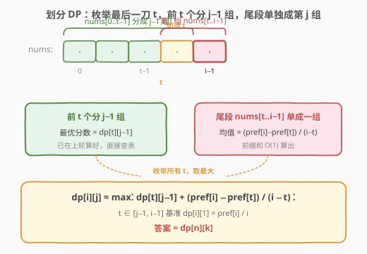
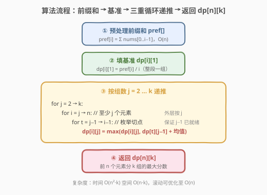
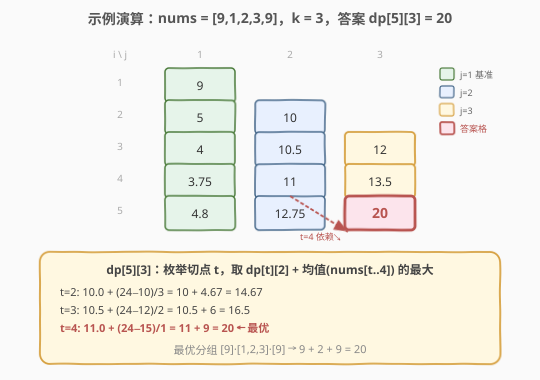

# 最大平均值和的分组

- **题目名称**：最大平均值和的分组
- **链接**：[813. 最大平均值和的分组](https://leetcode.cn/problems/largest-sum-of-averages/)
- **难度**：中等
- **标签**：数组、动态规划、前缀和、划分型 DP

## 1. 题目概述

给定数组 `nums` 和整数 `k`，将 `nums` 分成**最多** `k` 个**非空且连续**的子数组。**分数** = 各子数组平均值之和。要求用到 `nums` 中每一个数，返回能得到的最大分数（误差在 $10^{-6}$ 内即正确）。

**示例 1**：

```text
输入：nums = [9,1,2,3,9], k = 3
输出：20.00000
解释：最优分组 [9], [1,2,3], [9] → 9 + (1+2+3)/3 + 9 = 9 + 2 + 9 = 20。
      若分成 [9,1],[2],[3,9] → 5 + 2 + 6 = 13，不是最大。
```

**示例 2**：

```text
输入：nums = [1,2,3,4,5,6,7], k = 4
输出：20.50000
解释：最优分组 [1,2,3,4],[5],[6],[7] → 10/4 + 5 + 6 + 7 = 2.5 + 18 = 20.5。
```

**约束条件**：

- `1 <= nums.length <= 100`
- `1 <= nums[i] <= 10^4`
- `1 <= k <= nums.length`

> 💡 关键约束：`nums[i] >= 1` 全为正数，这让「最多 k 组」退化为「恰好 k 组」（见 2.2 节证明），简化了状态定义。

---

## 2. 解题思路

### 2.1 暴力思路

枚举所有把 `n` 个数切成至多 `k` 段的方式——即在 `n−1` 个间隙中选至多 `k−1` 个切点，组合数 $C(n-1, k-1)$。`n=100, k=50` 时约 $10^{28}$，必爆。但其中存在大量重叠子问题（前缀段的最优分组会被反复求解），天然适合 DP。

### 2.2 核心观察：划分型 DP（枚举最后一刀）



**状态定义**：

> `dp[i][j]` = 把 `nums` 前 `i` 个元素（即 `nums[0..i-1]`）分成 **恰好 j 组** 时能获得的最大分数。

**转移**——枚举「最后一刀」的位置 `t`：前 `t` 个元素分成 `j−1` 组（最优值 `dp[t][j-1]`），尾段 `nums[t..i-1]` 单独作为第 `j` 组，其均值为 $\frac{\text{pref}[i] - \text{pref}[t]}{i - t}$（`pref` 为前缀和）。取所有 `t` 中的最大：

$$
\text{dp}[i][j] = \max_{t \in [j-1,\ i-1]} \left( \text{dp}[t][j-1] + \frac{\text{pref}[i] - \text{pref}[t]}{i - t} \right)
$$

> 💡 **为什么「最后一刀」而非「第一刀」？** 划分型 DP 的通式是「按最后一段切」——这样前缀是一个规模更小的同构子问题（前 `t` 个分 `j−1` 组），状态天然归约。若按「第一刀」切，剩余部分是 `nums[t..n-1]` 分 `j−1` 组，需要额外参数记录起点，状态变成三维。**「按尾段切」是划分型 DP 的招牌套路**，与 [410. 分割数组的最大值](https://leetcode.cn/problems/split-array-largest-sum/)、[132. 分割回文串 II](https://leetcode.cn/problems/palindrome-partitioning-ii/) 一脉相承。

**基准**：`dp[i][1] = pref[i] / i`（整段 `nums[0..i-1]` 作为一个组，均值即前缀均值）。

**关于「最多 k 组」=「恰好 k 组」**：由于 `nums[i] >= 1 > 0`，把任意一段 `[a, b]`（均值 $(a+b)/2$）切成 `[a]`、`[b]` 两段（分数 $a+b$），因 $a+b \ge (a+b)/2$（$a+b \ge 0$），分数**不降**。故组数越多越好，最优解必用满 `k` 组，答案即 `dp[n][k]`。

### 2.3 算法流程图



1. 预处理前缀和 `pref`，$O(n)$；
2. 填基准 `dp[i][1] = pref[i] / i`；
3. **外层按组数 `j = 2 … k` 递推**（保证算 `j` 时 `j−1` 已就绪），内层枚举元素数 `i` 与切点 `t`；
4. 返回 `dp[n][k]`。

> ⚠️ **循环顺序**：必须**外层 `j`、内层 `i`**。因为 `dp[i][j]` 依赖 `dp[t][j-1]`（`t < i`），只有整列 `j−1` 全部算完后才能算 `j`。若外层 `i` 内层 `j`，会用到尚未计算的同行 `j−1`。

### 2.4 示例演算

以 `nums = [9,1,2,3,9], k = 3` 为例（`pref = [0,9,10,12,15,24]`），填 `6×3` 的 dp 表：



| `i\j` | 1（基准） | 2 | 3 |
|-------|-----------|------|------|
| 1 | 9 | — | — |
| 2 | 5 | 10 | — |
| 3 | 4 | 10.5 | 12 |
| 4 | 3.75 | 11 | 13.5 |
| 5 | 4.8 | 12.75 | **20** |

聚焦答案格 `dp[5][3]`，枚举切点 `t`（前 `t` 个分 2 组 + 尾段均值）：

- `t=2`：`dp[2][2] + (24−10)/3 = 10 + 4.67 = 14.67`
- `t=3`：`dp[3][2] + (24−12)/2 = 10.5 + 6 = 16.5`
- `t=4`：`dp[4][2] + (24−15)/1 = 11 + 9 = 20` ← 最优

`t=4` 对应分组 `[9],[1,2,3],[9]`（前 4 个 `dp[4][2]=11` 即 `[9],[1,2,3]` 得 `9+2`，尾段 `[9]` 得 `9`），合计 `20`。

---

## 3. 参考代码

### C++

```cpp
class Solution {
  public:
    double largestSumOfAverages(vector<int>& nums, int k) {
        int n = nums.size();
        vector<double> pref(n + 1, 0.0);
        for (int i = 0; i < n; i++) pref[i + 1] = pref[i] + nums[i];
        // dp[i][j] = 前 i 个元素分成恰好 j 组的最大分数
        vector<vector<double>> dp(n + 1, vector<double>(k + 1, 0.0));
        for (int i = 1; i <= n; i++) dp[i][1] = pref[i] / i; // 整段一组
        for (int j = 2; j <= k; j++) {
            for (int i = j; i <= n; i++) {          // 至少 j 个元素才能分 j 组
                for (int t = j - 1; t < i; t++) {   // 枚举切点，前 t 个至少 j-1 个
                    double avg = (pref[i] - pref[t]) / (i - t);
                    dp[i][j] = max(dp[i][j], dp[t][j - 1] + avg);
                }
            }
        }
        return dp[n][k];
    }
};
```

### Python

```python
class Solution:
    def largestSumOfAverages(self, nums: List[int], k: int) -> float:
        n = len(nums)
        pref = [0.0] * (n + 1)
        for i in range(n):
            pref[i + 1] = pref[i] + nums[i]
        # dp[i][j] = 前 i 个元素分成恰好 j 组的最大分数
        dp = [[0.0] * (k + 1) for _ in range(n + 1)]
        for i in range(1, n + 1):
            dp[i][1] = pref[i] / i                 # 整段一组
        for j in range(2, k + 1):
            for i in range(j, n + 1):              # 至少 j 个元素才能分 j 组
                for t in range(j - 1, i):          # 枚举切点
                    avg = (pref[i] - pref[t]) / (i - t)
                    dp[i][j] = max(dp[i][j], dp[t][j - 1] + avg)
        return dp[n][k]
```

> 💡 **空间优化**：`dp[i][j]` 只依赖上一组数 `dp[t][j-1]`，与 `j` 同列无关。用一维数组滚动——每轮 `j` 用新数组 `new_dp` 从旧的 `dp`（代表 `j−1`）转移，空间降到 $O(n)$：

```python
class Solution:
    def largestSumOfAverages(self, nums: List[int], k: int) -> float:
        n = len(nums)
        pref = [0.0] * (n + 1)
        for i in range(n):
            pref[i + 1] = pref[i] + nums[i]
        dp = [0.0] * (n + 1)                       # dp[i] 暂存 j-1 组的结果
        for i in range(1, n + 1):
            dp[i] = pref[i] / i                    # j = 1 基准
        for j in range(2, k + 1):
            new_dp = [0.0] * (n + 1)
            for i in range(j, n + 1):
                for t in range(j - 1, i):
                    avg = (pref[i] - pref[t]) / (i - t)
                    new_dp[i] = max(new_dp[i], dp[t] + avg)
            dp = new_dp
        return dp[n]
```

---

## 4. 复杂度分析

| 维度 | 复杂度 | 说明 |
|------|--------|------|
| 时间复杂度 | $O(n^2 \cdot k)$ | 三重循环：组数 $k$ × 元素数 $n$ × 切点 $n$，每个状态 $O(1)$ 转移（前缀和算均值） |
| 空间复杂度 | $O(n \cdot k)$ | 二维 dp 表；一维滚动可优化至 $O(n)$ |

$n \le 100, k \le 100$，最坏约 $10^6$ 次运算，轻松通过。

---

## 5. 扩展：前缀和优化与「恰好」vs「至多」

**前缀和的作用**：尾段 `nums[t..i-1]` 的和需要 $O(n)$ 累加，三重循环会退化到 $O(n^3 \cdot k)$。引入前缀和 `pref` 后，`sum(nums[t..i-1]) = pref[i] - pref[t]`，$O(1)$ 取得，总复杂度稳定在 $O(n^2 k)$。这是**区间型 DP 配前缀和**的标准加速手法。

**若 `nums` 含负数会怎样？** 「至多 k 组 = 恰好 k 组」的结论失效——切分一段含负数的区间可能让分数下降。此时需把状态改为 `dp[i][j]` = 前 `i` 个分成**至多 j 组**，转移时额外允许「不切」（即 `dp[i][j] = max(dp[i][j], dp[i][j-1])`），答案仍取 `dp[n][k]`。本题因 `nums[i] >= 1` 免去了这一步。

---

## 6. 面试要点

1. **为什么状态定义为「恰好 j 组」而非「至多 j 组」？**
   - 本题 `nums[i] >= 1` 全正，切分任意一段都使分数不降（$a+b \ge (a+b)/2$），故组数越多越好，最优解必用满 `k` 组。「恰好 j 组」的状态更简洁，转移只需一个 `max`。若含负数则需改「至多」并加不切分支。

2. **转移为什么枚举「最后一刀」而不是「第一刀」？**
   - 按尾段切，前缀 `nums[0..t-1]` 分 `j−1` 组是与原问题同构的子问题，状态 `dp[t][j-1]` 自然归约。按首段切则剩余 `nums[t..n-1]` 需要额外记起点，状态升维。「按尾切」是划分型 DP 的通用范式。

3. **三重循环的顺序能换吗？**
   - 不能。必须**外层 `j`、中层 `i`、内层 `t`**。`dp[i][j]` 依赖 `dp[t][j-1]`（`t < i`），只有整个 `j−1` 列算完才能算 `j`。若外层 `i`，会引用同行未算的 `j−1` 值。

4. **前缀和在这里解决什么问题？**
   - 尾段均值需要段内求和。朴素累加使内层变 $O(n)$，总复杂度 $O(n^3 k)$。前缀和把求和降到 $O(1)$，总复杂度 $O(n^2 k)$。任何频繁求区间和的 DP 都应配前缀和。

5. **如何还原具体的最优分组方案？**
   - 记录 `argmax` 的切点 `t` 到 `cut[i][j]`，填完表后从 `dp[n][k]` 回溯：`t = cut[n][k]` 给出最后一刀，尾段 `nums[t..n-1]` 是一组；再对 `dp[t][k-1]` 同样回溯，直到 `j=1`。

---

## 7. 同类练习题

- [410. 分割数组的最大值](https://leetcode.cn/problems/split-array-largest-sum/)（[题解](../0401-0500/410_分割数组的最大值.md)）：同为划分型 DP，但目标是「最小化最大段和」，可用二分答案或 DP；对比「最大化段均值和」体会目标函数变化对解法的影响
- [132. 分割回文串 II](https://leetcode.cn/problems/palindrome-partitioning-ii/)（[题解](../0101-0200/132_分割回文串II.md)）：划分型 DP 招牌题，按尾段切 + 预处理回文表，与本题「按尾切 + 前缀和」结构完全平行
- [1278. 分割回文串 III](https://leetcode.cn/problems/palindrome-partition-iii/)：划分型 DP，按尾段切 + 预处理段内替换代价，状态转移同构 `dp[i][j] = min(dp[t][j-1] + cost)`
- [1043. 分隔数组以得到最大和](https://leetcode.cn/problems/partition-array-for-maximum-sum/)：划分型 DP，按尾段切但尾段长度限制为 `K`，转移枚举尾段长度而非切点，体会切法维度变化
- [174. 地下城游戏](https://leetcode.cn/problems/dungeon-game/)：反向网格 DP，对比「正向无后效性」与「需反向定义状态」的边界选择差异
