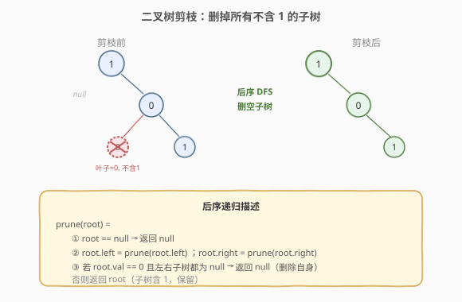
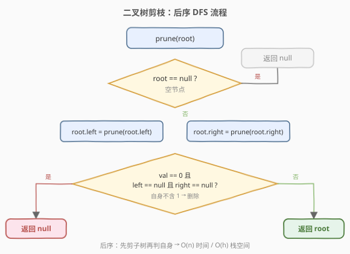
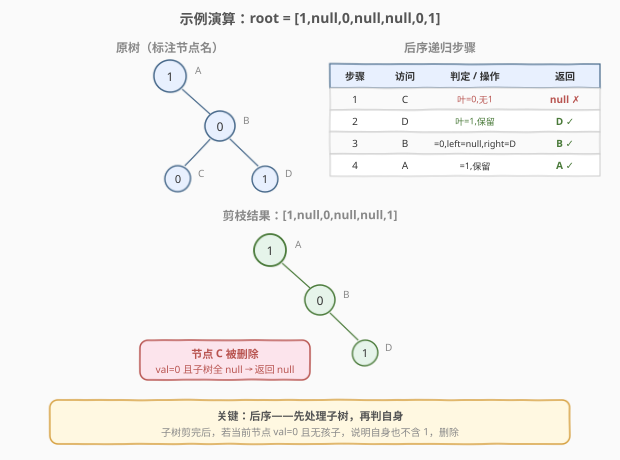

# 二叉树剪枝

- **题目名称**：二叉树剪枝
- **链接**：[814. 二叉树剪枝](https://leetcode.cn/problems/binary-tree-pruning/)
- **难度**：中等
- **标签**：树、二叉树、递归、后序遍历、DFS

## 1. 题目概述

给定一棵二叉树的根节点 `root`，树中每个节点的值要么是 `0` 要么是 `1`。要求**剪除所有不包含 `1` 的子树**，返回剪枝后的根节点。

> **子树定义**：一个节点 `node` 的子树包括 `node` 本身及其所有后代。

**示例 1**：

```text
输入：root = [1,null,0,null,null,0,1]
输出：[1,null,0,null,null,1]
解释：节点 0 的左子树（值为 0 的叶子）不含 1，被剪除。
     节点 0 自身虽值为 0，但右子树含 1，保留。
```

**示例 2**：

```text
输入：root = [1,0,1,0,0,0,1]
输出：[1,null,1,null,1]
解释：所有值为 0 的叶子被剪除；
     根的左子节点 0 剪完子树后无 1，被剪除；
     根的右子节点 1 保留，其右子 1 保留。
```

**示例 3**：

```text
输入：root = [1,1,0,1,1,0,0,1,1,null,1,null,null,null,null]
输出：[1,1,0,1,1,null,1,null,null,null,1]
```

**约束条件**：

- 树中节点数目范围 `[1, 200]`
- `Node.val` 只能是 `0` 或 `1`
- 输入保证是一棵合法二叉树

---

## 2. 解题思路

### 2.1 暴力思路：自顶向下逐层判定

对每个节点，先检查它的子树是否包含 `1`（额外一次 DFS 扫描），不含则删除。问题在于：删除一个节点后，其父节点可能也需要重新判定——导致**反复扫描**，最坏 $O(n^2)$。

更自然的做法是**自底向上**：先处理子树，子树剪完后，当前节点是否保留只看自身值 + 剩余孩子。

### 2.2 核心观察：后序 DFS——先剪子树，再判自身



「剪枝」是一个**自底向上**的过程：

> 一个节点应被删除 ⟺ 它的值是 `0` **且**它的左右子树（剪枝后）都为 `null`。

这恰好是**后序遍历**的天然描述——先递归处理左右子树，再根据子树结果和自身值做决策：

| 步骤 | 操作 | 说明 |
|------|------|------|
| ① 递归左子树 | `root.left = prune(root.left)` | 返回剪枝后的左子树（可能为 `null`） |
| ② 递归右子树 | `root.right = prune(root.right)` | 返回剪枝后的右子树（可能为 `null`） |
| ③ 判定自身 | `val == 0 && left == null && right == null` | 若是，返回 `null`（删除自身）；否则返回 `root` |

> 💡 **为什么必须后序？** 如果先判自身再递归子树，子树后续被剪空后，当前节点的状态会改变——原本「右子非空」可能变成「右子空」，需要重新判定。后序天然避免了这种「先判后变」的矛盾。

> ⚠️ 注意空节点的处理：`root == null` 时直接返回 `null`，这是递归的终止条件，也是「空子树不含 1」的自然体现。

### 2.3 算法流程图



### 2.4 示例演算

以 `root = [1,null,0,null,null,0,1]` 为例，原树结构（标注节点名）：

```text
    A(1)
      \
      B(0)
      / \
   C(0)  D(1)
```



后序递归执行过程：

| 步骤 | 访问节点 | 判定 / 操作 | 返回值 |
|------|----------|-------------|--------|
| 1 | C（叶子） | `val=0`，无孩子 → 不含 1 → 删除 | `null` ✗ |
| 2 | D（叶子） | `val=1` → 保留 | D ✓ |
| 3 | B | `val=0`，`left=null`（C 被删），`right=D` → 右子非空 → 保留 | B ✓ |
| 4 | A | `val=1` → 保留 | A ✓ |

最终剪枝结果：`[1,null,0,null,null,1]`，即 `A → B → D` 的右链。

---

## 3. 参考代码

### C++

```cpp
class Solution {
  public:
    TreeNode* pruneTree(TreeNode* root) {
        if (root == nullptr) return nullptr;
        root->left = pruneTree(root->left);
        root->right = pruneTree(root->right);
        if (root->val == 0 && root->left == nullptr && root->right == nullptr)
            return nullptr;
        return root;
    }
};
```

### Python

```python
class Solution:
    def pruneTree(self, root: Optional[TreeNode]) -> Optional[TreeNode]:
        if not root:
            return None
        root.left = self.pruneTree(root.left)
        root.right = self.pruneTree(root.right)
        if root.val == 0 and not root.left and not root.right:
            return None
        return root
```

> 💡 代码只有三步：递归左 → 递归右 → 判自身。删除操作不是显式 `delete`，而是**返回 `null` 让父指针自然断开**——被剪掉的子树不再有引用指向，由 GC 回收。

---

## 4. 复杂度分析

| 维度 | 复杂度 | 说明 |
|------|--------|------|
| 时间复杂度 | $O(n)$ | 每个节点恰好访问一次，每次做 $O(1)$ 判定 |
| 空间复杂度 | $O(h)$ | 递归栈深度 = 树高 $h$；最坏链状 $O(n)$，平衡 $O(\log n)$ |

> ⚠️ 本题节点数 $n \leq 200$，递归栈最深 200 层，不存在溢出风险。若节点数极大，可改用迭代后序遍历。

---

## 5. 扩展：迭代后序遍历

用栈模拟后序遍历，避免递归栈溢出。关键是**先压右再压左**，并在节点第二次出栈时（左右子树已处理）执行剪枝判定：

```python
class Solution:
    def pruneTree(self, root: Optional[TreeNode]) -> Optional[TreeNode]:
        if not root:
            return None
        stack = [(root, False)]
        while stack:
            node, visited = stack.pop()
            if visited:
                # 左右子树已处理完毕，判定自身
                if node.val == 0 and not node.left and not node.right:
                    # 用 None 占位标记删除，父节点引用会在其 visited 阶段读取
                    node._pruned = True
            else:
                stack.append((node, True))
                if node.right:
                    stack.append((node.right, False))
                if node.left:
                    stack.append((node.left, False))
        # 二次遍历清理被标记节点
        # （简洁起见，递归版更推荐；迭代版仅在 n 极大时考虑）
        return self._cleanup(root)

    def _cleanup(self, node):
        if not node:
            return None
        node.left = self._cleanup(node.left)
        node.right = self._cleanup(node.right)
        if getattr(node, '_pruned', False):
            return None
        return node
```

> 💡 迭代后序较为繁琐，面试中**递归版是首选**——简洁且 $n \leq 200$ 完全安全。迭代版仅在面试官追问「递归栈溢出怎么办」时展示。

---

## 6. 面试要点

1. **为什么用后序遍历而不是前序？**
   - 前序（先判自身再递归）会漏判：一个节点此刻右子非空，但右子随后被剪空，该节点的状态就从「保留」变成「应删」。后序先处理子树，子树稳定后再判自身，**一次到位**无需回头。

2. **删除节点的具体机制是什么？**
   - 不显式 `delete`，而是返回 `null`。父节点执行 `root->left = prune(root->left)` 时，被返回 `null` 的子树引用自动断开。C++ 中若需手动释放内存，在返回 `null` 前 `delete root` 即可。

3. **如果一个节点 val=0 但只有一个孩子为 null，另一个非空，保留吗？**
   - 保留。判定条件是 `val == 0 && left == null && right == null`——只要有一个孩子非空（哪怕那个孩子 val=0 但它自身含 1 的后代），就说明当前子树包含 1，不能删。

4. **这题和「删点成林」（1110）有什么区别？**
   - 814 的删除标准是「子树不含 1」，是**值驱动的递归删除**；1110 是给定一个删除节点集合，删除后形成的**森林**需要收集所有子树根。两者都用后序 DFS，但 1110 额外需要收集被删节点的子节点作为新树根。

5. **能不能用返回布尔值「子树是否含 1」的方式写？**
   - 可以。让 `prune` 返回 `(root, contains_one)`，根据子树返回的布尔值和自身 `val` 决定是否删除。但直接返回剪枝后的 `root`（可能为 `null`）更简洁——`null` 本身就隐含了「不含 1」的语义，无需额外布尔值。

---

## 7. 同类练习题

- [1325. 删除给定值的叶子节点](https://leetcode.cn/problems/delete-leaves-with-a-given-value/)：同样后序 DFS + 删除叶子，删的是指定值叶子而非「不含 1」子树，递归骨架几乎一致
- [1110. 删点成林](https://leetcode.cn/problems/delete-nodes-and-return-forest/)：后序删除 + 收集森林，814 的进阶版（需额外收集被删节点的子树根）
- [1080. 根到叶路径上的不足节点](https://leetcode.cn/problems/root-to-leaf-path-insufficient-nodes/)：后序删除不满足路径和条件的节点，同样「先处理子树再判自身」
- [226. 翻转二叉树](https://leetcode.cn/problems/invert-binary-tree/)（[题解](../0201-0300/226_翻转二叉树.md)）：同为「修改树结构」的递归，对比「后序判删」与「前序交换」的不同递归序选择
- [236. 二叉树的最近公共祖先](https://leetcode.cn/problems/lowest-common-ancestor-of-a-binary-tree/)（[题解](../0201-0300/236_二叉树的最近公共祖先.md)）：后序 DFS 骨架，子树信息向上传递的范式
