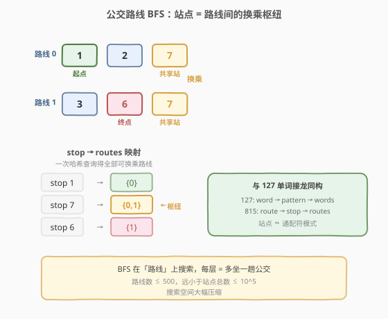
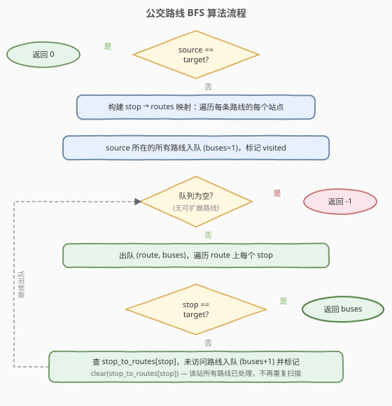
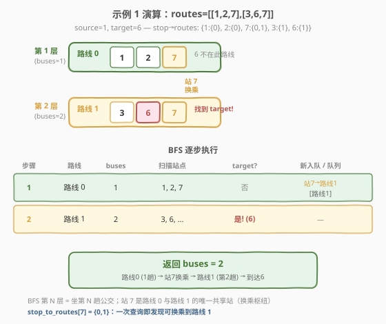

# LeetCode 公交路线 题解

## 1. 题目概述

- **标题 / 题号**：公交路线（#815，hard）
- **链接**：https://leetcode.cn/problems/bus-routes/
- **难度**：困难
- **标签**：广度优先搜索、图、哈希表

**题意**：给你一个数组 `routes` 表示若干公交线路，`routes[i]` 是第 `i` 辆公交的循环路线（反复循环行驶）。例如 `routes = [[1,2,7],[3,6,7]]` 表示 0 号公交走 `1→2→7→1→…`，1 号公交走 `3→6→7→3→…`。

你从 `source` 站出发，要到 `target` 站。每次上车算坐 **1 趟**公交（同一趟车经过的所有站之间移动不再计次）。可在任意站点换乘。返回从 `source` 到 `target` **最少需要乘坐的公交趟数**；无法到达返回 `-1`。

**示例 1**：

```text
输入：routes = [[1,2,7],[3,6,7]], source = 1, target = 6
输出：2
解释：坐 0 号公交 1→2→7（第 1 趟），在 7 站换乘 1 号公交到 6（第 2 趟），共 2 趟。
```

**示例 2**：

```text
输入：routes = [[7,12],[4,5,15],[6],[15,19],[9,12,13]], source = 15, target = 12
输出：-1
解释：15 在 1 号、3 号路线上；12 在 0 号、4 号路线上。
      但 {1,3} 与 {0,4} 无共享站点，无法换乘。
```

**约束**：

- `1 <= routes.length <= 500`
- `1 <= routes[i].length <= 10^5`
- `routes[i]` 中的值互不相同
- 所有路线的站点总数之和 `<= 10^5`
- `0 <= source, target <= 10^6`

## 2. 解题思路

### 2.1 暴力思路：在站点上 BFS

直接以"站点"为节点做 BFS：从 `source` 出发，对当前站点 `stop`，找到所有经过 `stop` 的路线，每条路线上**所有站点**都是 `stop` 的邻居（同趟公交可达，代价 1）。

问题在于：站点总数可达 $10^5$，每个站点的邻居可能极多（一条路线最多 $10^5$ 站），且同一站点会被从不同路线反复扫描。更关键的是——**同一路线内的所有站点互相可达且代价相同（都是 1 趟）**，逐站 BFS 会产生大量冗余。

优化方向：既然同一路线内移动"免费"（不增加趟数），真正需要搜索的不是站点而是**路线**——换路线才增加代价。

### 2.2 核心观察：在路线上 BFS（站为枢纽）



关键洞察：**把每条公交路线视为图中的一个节点**，两条路线若共享至少一个站点则有一条边（可在该站换乘）。BFS 的层数 = 乘坐的公交趟数。

这与 [127. 单词接龙](../0101-0200/127_单词接龙.md) 的思路完全同构：

| | 单词接龙 (127) | 公交路线 (815) |
|---|---|---|
| **搜索节点** | 单词 | 路线 |
| **中间枢纽** | 通配符模式 `*ot` | 共享站点 `7` |
| **枢纽连接** | 同模式的单词差一个字母 | 同站点的路线可换乘 |
| **代价** | 转换次数 +1 | 上车趟数 +1 |

> 💡 一句话：**站点扮演了单词接龙中通配符模式的角色**——它是连接多条路线的"中间枢纽"。用 `stop→routes` 哈希表一次查询即可获得所有可换乘路线，无需 $O(N^2)$ 逐对比较路线交集。

**建图与搜索**：

1. 构建 `stop → routes` 映射：遍历每条路线，把路线编号加入该路线上每个站点对应的集合
2. BFS 从 `source` 所在的**所有路线**出发（第 1 层，因为上第一趟车 = 1 趟）
3. 取出一条路线 `route`（当前 `buses` 趟），遍历 `route` 上的每个站点 `stop`：
   - 若 `stop == target` → 返回 `buses`
   - 否则通过 `stop_to_routes[stop]` 查到所有经过 `stop` 的路线，将未访问的路线入队（`buses + 1` 趟）
   - **清空** `stop_to_routes[stop]`——该站点的所有路线已入队，后续无需再查
4. 队列空仍未找到 → 返回 `-1`

### 2.3 算法流程图



### 2.4 示例演算

以 `routes = [[1,2,7],[3,6,7]], source = 1, target = 6` 为例：



构建 `stop→routes`：`{1:{0}, 2:{0}, 7:{0,1}, 3:{1}, 6:{1}}`

`source=1` 在路线 0 中 → BFS 第 1 层：路线 0（`buses=1`）

| 步骤 | 取出路线 | buses | 遍历站点 | target=6? | 经共享站发现新路线 | 队列 |
|------|---------|-------|---------|----------|-------------------|------|
| 1 | 路线 0 | 1 | 1, 2, 7 | 否 | 站 7 → 路线 1（未访问） | `[路线1]` |
| 2 | 路线 1 | 2 | 3, **6** | **是！** | — | — |

路线 1 遍历到站点 6 == target，返回 `buses=2`。

> 💡 关键：路线 0 和路线 1 通过共享站点 7 "相连"——BFS 第 2 层才到达路线 1，恰对应"换乘 1 次 = 共坐 2 趟"。

## 3. 参考代码

### C++

```cpp
class Solution {
  public:
    int numBusesToDestination(vector<vector<int>>& routes, int source, int target) {
        if (source == target) return 0;

        // stop -> 经过该站的路线编号列表
        unordered_map<int, vector<int>> stopToRoutes;
        for (int i = 0; i < (int)routes.size(); ++i) {
            for (int stop : routes[i]) {
                stopToRoutes[stop].push_back(i);
            }
        }

        // BFS on routes
        queue<pair<int,int>> q;                 // {路线编号, 已坐趟数}
        vector<bool> visited(routes.size(), false);
        for (int r : stopToRoutes[source]) {   // source 所在路线入队（第 1 趟）
            q.push({r, 1});
            visited[r] = true;
        }

        while (!q.empty()) {
            int route = q.front().first;
            int buses = q.front().second;
            q.pop();
            for (int stop : routes[route]) {
                if (stop == target) return buses;
                for (int nxt : stopToRoutes[stop]) {
                    if (!visited[nxt]) {
                        visited[nxt] = true;
                        q.push({nxt, buses + 1});
                    }
                }
                stopToRoutes[stop].clear();     // 标记站点已处理
            }
        }
        return -1;
    }
};
```

### Python

```python
from collections import deque, defaultdict

class Solution:
    def numBusesToDestination(self, routes: List[List[int]], source: int, target: int) -> int:
        if source == target:
            return 0

        stop_to_routes = defaultdict(set)      # stop -> 经过该站的路线编号
        for i, route in enumerate(routes):
            for stop in route:
                stop_to_routes[stop].add(i)

        q = deque()
        visited = set()                        # 已访问的路线编号
        for r in stop_to_routes[source]:       # source 所在路线入队（第 1 趟）
            q.append((r, 1))
            visited.add(r)

        while q:
            route, buses = q.popleft()
            for stop in routes[route]:
                if stop == target:
                    return buses
                for nxt in stop_to_routes[stop]:
                    if nxt not in visited:
                        visited.add(nxt)
                        q.append((nxt, buses + 1))
                stop_to_routes[stop].clear()    # 标记站点已处理，避免重复扫描

        return -1
```

> 💡 **`stop_to_routes[stop].clear()` 的作用**：处理完一个站点的所有路线后清空该站对应集合，使后续路线扫描到同一站点时内层循环为空——等价于标记"该站已处理"，避免重复展开。与 `visited` 路线集合双保险：`visited` 防止路线重复入队，`clear` 防止站点重复扫描。

## 4. 复杂度分析

| 维度 | 复杂度 | 说明 |
|------|--------|------|
| 时间复杂度 | $O(N + S)$ | $N$ = 路线数（$\le 500$），$S$ = 所有路线站点总数（$\le 10^5$）。建 `stop→routes` 映射 $O(S)$；BFS 每条路线入队一次，每条路线的每个站点被扫描一次（`clear` 保证站点不重复展开），总计 $O(S)$ |
| 空间复杂度 | $O(N + S)$ | `stop→routes` 映射 $O(S)$；`visited` 路线集合 $O(N)$；BFS 队列最多 $O(N)$ |

> ⚠️ 若不在 `clear` 处标记站点已处理，同一站点会被多条路线重复扫描，内层循环虽因 `visited` 不会重复入队路线，但仍产生 $O(N \times S)$ 的冗余查找。`clear` 把这部分降到 $O(S)$。

## 5. 扩展：与单词接龙的同构

[127. 单词接龙](../0101-0200/127_单词接龙.md) 与本题是同一套"**枢纽式 BFS**"范式的两个实例：

- **127**：单词为节点，通配符模式为枢纽。对当前单词生成 $L$ 个模式（`hit → *it, h*t, hi*`），每个模式一次哈希查询即得所有差一个字母的邻居。省去 $O(N^2)$ 逐对比较。
- **815**：路线为节点，站点为枢纽。对当前路线遍历其站点，每个站点一次哈希查询即得所有可换乘路线。同样省去 $O(N^2)$ 逐对求路线交集。

两者的共性是：**直接建图需要 $O(N^2)$ 比较节点对，但通过引入"中间枢纽"（模式 / 站点），将建图与搜索合并为 $O(\text{总元素数})$ 的一次遍历**。这是处理"隐式图最短路"的经典技巧——当图的边由某种共享关系隐式定义时，把共享关系显式化为哈希表即可高效搜索。

> 💡 其他同构实例：[399. 除法求值](https://leetcode.cn/problems/evaluate-division/)（变量为节点，等式为隐式边）、[1926. 迷宫的最短路径](https://leetcode.cn/problems/nearest-exit-from-entrance-in-maze/)（格点为节点，四邻为隐式边）。

## 6. 面试要点

1. **为什么 BFS 在路线上而不是站点上？**
   - 同一路线内所有站点互相可达且代价相同（都算 1 趟），逐站 BFS 会在同一路线内做大量冗余搜索。把路线作为节点，BFS 层数直接对应趟数，路线数（$\le 500$）远小于站点数（$\le 10^5$），搜索空间大幅压缩。

2. **`stop→routes` 映射解决了什么问题？**
   - 暴力建图需要 $O(N^2)$ 逐对检查路线是否有交集。`stop→routes` 把"共享站点"关系显式化：遍历所有路线的所有站点 $O(S)$ 即完成建图，BFS 中每个站点一次哈希查询即得全部可换乘路线。

3. **为什么要从 source 所有的路线同时入队？**
   - `source` 可能同时属于多条路线（多路公交经过同一站）。上车时可选任意一条，它们都是"第 1 趟"，BFS 第 1 层应包含所有这些路线。这相当于多源 BFS 的初始种子集。

4. **`clear` 和 `visited` 各防什么重复？**
   - `visited`（路线集合）防止同一路线被重复入队。`stop_to_routes[stop].clear()` 防止同一站点被多条路线重复扫描——处理过一次后，该站所有路线已入队，后续路线扫到此站时内层循环直接为空。两者互补，缺一不可。

5. **`source == target` 时为什么返回 0？**
   - 已在目的地，无需乘车。即使该站不在任何路线上也成立——你不需要上任何公交。这是 BFS 层数为 0 的边界情况，必须在建图前单独处理。

## 同类练习题

| # | 题目 | 与本题的关联 |
|---|------|-------------|
| 127 | [单词接龙](https://leetcode.cn/problems/word-ladder/)（[题解](../0101-0200/127_单词接龙.md)） | 同构范式——通配符模式为枢纽连接单词，BFS 求最短转换序列。对比"路线↔站点"与"单词↔模式"的映射关系 |
| 994 | [腐烂的橘子](https://leetcode.cn/problems/rotting-oranges/)（[题解](../0901-1000/994_腐烂的橘子.md)） | 多源 BFS，初始多个腐烂橘子同时入队，对应本题 source 所在多条路线同时入队 |
| 743 | [网络延迟时间](https://leetcode.cn/problems/network-delay-time/)（[题解](../0701-0800/743_网络延迟时间.md)） | 单源最短路，对比 BFS（边权为 1）与 Dijkstra（边权不等）的适用场景 |
| 1926 | [迷宫的最短路径](https://leetcode.cn/problems/nearest-exit-from-entrance-in-maze/) | 网格 BFS 求最短出口距离，同为"最少步数"型 BFS |
| 399 | [除法求值](https://leetcode.cn/problems/evaluate-division/) | 隐式图最短路，以变量为节点、等式关系为隐式边，可用 BFS 或 Floyd 求解 |
