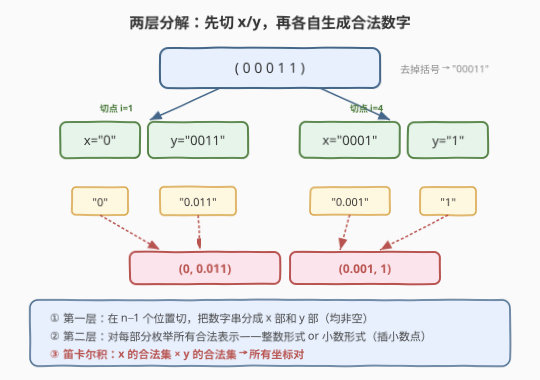
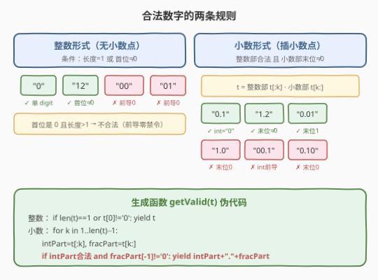
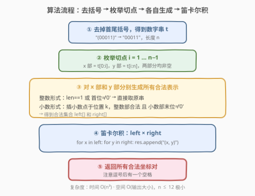
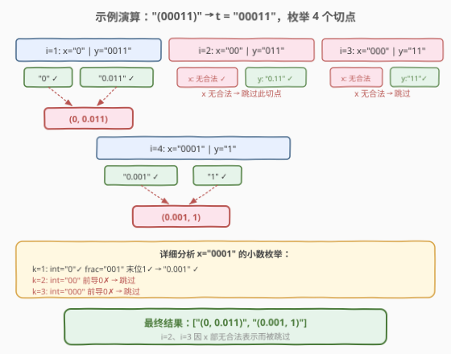

# LeetCode 模糊坐标 题解

## 1. 题目概述

- **标题 / 题号**：模糊坐标（#816，medium）
- **链接**：https://leetcode.cn/problems/ambiguous-coordinates/
- **难度**：中等
- **标签**：字符串、枚举、回溯

**题意**：我们有一些二维坐标，如 `"(1, 3)"` 或 `"(2, 0.5)"`，然后移除所有逗号、小数点和空格，得到一个字符串 `S`。返回所有可能的原始字符串到一个列表中。

原始的坐标表示法不会存在多余的零，所以不会出现 `"00"`、`"0.0"`、`"0.00"`、`"1.0"`、`"001"`、`"00.01"` 等形式。此外，一个小数点前至少存在一个数，所以也不会出现 `".1"` 形式的数字。最后返回的列表可以是任意顺序，且两个数字中间（逗号之后）都有一个空格。

**示例 1**：

```text
输入："(123)"
输出：["(1, 23)", "(12, 3)", "(1.2, 3)", "(1, 2.3)"]
```

**示例 2**：

```text
输入："(00011)"
输出：["(0.001, 1)", "(0, 0.011)"]
解释：0.0, 00, 0001 或 00.01 是不被允许的。
```

**示例 3**：

```text
输入："(0123)"
输出：["(0, 123)", "(0, 12.3)", "(0, 1.23)", "(0.1, 23)", "(0.1, 2.3)", "(0.12, 3)"]
```

**示例 4**：

```text
输入："(100)"
输出：["(10, 0)"]
解释：1.0 是不被允许的。
```

**约束**：

- `4 <= S.length <= 12`
- `S[0] == "("`，`S[S.length - 1] == ")"`，且字符串 `S` 中的其他元素都是数字。

> 💡 **关键约束**：去掉括号后数字串长度 $n \le 10$，枚举空间极小。难点不在规模而在**合法数字的判定规则**——前导零禁令与小数尾零禁令需要精准处理。

## 2. 解题思路

### 2.1 暴力思路

最朴素的直觉：对于数字串 `t`（去掉括号后的内容），我们需要恢复出 `(x, y)` 的形式。这涉及两个独立的决策：

1. **在哪里切分** `t` 为 `x` 部和 `y` 部（逗号位置）；
2. **每部数字如何表示**——纯整数还是带小数点，小数点插在哪里。

由于 $n \le 10$，切分位置最多 9 种，每部最多 10 位、小数点位置最多 9 种，总的枚举量不超过 $9 \times 9 \times 9 \approx 729$，完全可以暴力。关键在于正确判定每种表示是否合法。

### 2.2 核心观察：两层分解 + 合法数字生成



将问题分解为两层独立的子问题：

**第一层——切分**：在 `t` 的 $n-1$ 个间隙中选一个位置 `i`，将 `t` 分成 `x = t[0:i]` 和 `y = t[i:n]`（两部分均非空）。

**第二层——合法数字生成**：对每个数字子串，枚举所有合法的表示形式（整数或小数），核心是两条规则：



> **规则一（整数形式）**：无小数点，直接取原串。合法当且仅当**长度为 1**（单个数字 `"0"`~`"9"` 均合法）或**首位不为 `'0'`**（禁止 `"01"`、`"00"` 等前导零）。
>
> **规则二（小数形式）**：在小数点位置 `k`（$1 \le k \le L-1$）处将 `t` 拆成整数部 `t[:k]` 和小数部 `t[k:]`。合法当且仅当：
> - **整数部合法**：`"0"` 或首位不为 `'0'`（禁止 `"00.1"`）；
> - **小数部末位不为 `'0'`**（禁止 `"1.0"`、`"0.10"` 等尾随零）。

> ⚠️ **易错点**：小数点前必须有数字（禁止 `".1"`），这已由 $k \ge 1$ 保证。小数点后也必须有数字，由 $k \le L-1$ 保证。两条边界自动满足。

**第三层——笛卡尔积**：对每个切点 `i`，将 `x` 部的合法集合与 `y` 部的合法集合做笛卡尔积，每组 `(x_repr, y_repr)` 拼成 `"(x_repr, y_repr)"` 加入结果。

### 2.3 算法流程图



1. 去掉首尾括号，得到数字串 `t`，长度为 $n$；
2. 枚举切点 $i = 1 \ldots n-1$，将 `t` 分成 `x = t[0:i]`、`y = t[i:n]`；
3. 对 `x` 和 `y` 分别调用 `getValid()` 生成所有合法表示；
4. 笛卡尔积：遍历 `left × right`，拼接 `"(x, y)"`；
5. 返回所有合法坐标对。

### 2.4 示例演算

以 `"(00011)"` 为例，`t = "00011"`（$n=5$），枚举 4 个切点：



| 切点 | x 部 | x 合法集 | y 部 | y 合法集 | 结果 |
|------|------|---------|------|---------|------|
| $i=1$ | `"0"` | `["0"]` | `"0011"` | `["0.011"]` | `"(0, 0.011)"` |
| $i=2$ | `"00"` | `[]`（无合法） | `"011"` | `["0.11"]` | 跳过（x 为空） |
| $i=3$ | `"000"` | `[]`（无合法） | `"11"` | `["11"]` | 跳过（x 为空） |
| $i=4$ | `"0001"` | `["0.001"]` | `"1"` | `["1"]` | `"(0.001, 1)"` |

**聚焦 $i=2$ 为何 x 部 `"00"` 无合法表示**：
- 整数形式：首位 `'0'` 且长度 $> 1$ → 不合法；
- 小数形式 $k=1$：整数部 `"0"` 合法，但小数部 `"0"` 末位为 `'0'` → 不合法。

故 `"00"` 无法表示为任何合法数字，该切点整体跳过。

> 💡 **规律**：以 `'0'` 开头的数字串，唯一可能合法的小数表示是 `k=1`（整数部恰为 `"0"`），且要求小数部末位非零。若小数部也以 `'0'` 结尾则彻底无解。

## 3. 参考代码

### C++

```cpp
class Solution {
  public:
    vector<string> ambiguousCoordinates(string s) {
        vector<string> res;
        string t = s.substr(1, s.size() - 2); // 去掉首尾括号
        int n = t.size();
        for (int i = 1; i < n; i++) {
            auto left = getValid(t.substr(0, i));
            auto right = getValid(t.substr(i));
            for (auto& x : left)
                for (auto& y : right)
                    res.push_back("(" + x + ", " + y + ")");
        }
        return res;
    }
  private:
    // 生成数字串 t 的所有合法表示（整数形式 + 小数形式）
    vector<string> getValid(string t) {
        vector<string> res;
        int n = t.size();
        // 整数形式：长度为 1 或首位不为 '0'
        if (n == 1 || t[0] != '0')
            res.push_back(t);
        // 小数形式：在位置 k 插小数点（1 <= k <= n-1）
        for (int k = 1; k < n; k++) {
            string intPart = t.substr(0, k);
            string fracPart = t.substr(k);
            // 整数部合法（"0" 或首位非 '0'）且小数部末位非 '0'
            if ((intPart == "0" || intPart[0] != '0') && fracPart.back() != '0')
                res.push_back(intPart + "." + fracPart);
        }
        return res;
    }
};
```

### Python

```python
class Solution:
    def ambiguousCoordinates(self, s: str) -> List[str]:
        t = s[1:-1]  # 去掉首尾括号
        n = len(t)
        res = []
        for i in range(1, n):
            for x in self._get_valid(t[:i]):
                for y in self._get_valid(t[i:]):
                    res.append(f"({x}, {y})")
        return res

    def _get_valid(self, t: str) -> List[str]:
        res = []
        n = len(t)
        # 整数形式：长度为 1 或首位不为 '0'
        if n == 1 or t[0] != '0':
            res.append(t)
        # 小数形式：在位置 k 插小数点（1 <= k <= n-1）
        for k in range(1, n):
            int_part = t[:k]
            frac_part = t[k:]
            if (int_part == '0' or int_part[0] != '0') and frac_part[-1] != '0':
                res.append(int_part + '.' + frac_part)
        return res
```

> 💡 **代码要点**：`getValid` 是本题的灵魂——整数和小数两种形式用两个独立的 `if` 判断，互不干扰。小数枚举中 `intPart == "0"` 是特殊情况（整数部恰好为单个零），与 `intPart[0] != '0'` 用 `||` 合并，简洁地覆盖「整数部合法」的全部条件。

## 4. 复杂度分析

| 维度 | 复杂度 | 说明 |
|------|--------|------|
| 时间复杂度 | $O(n^3)$ | 切点 $O(n)$ × 每部生成 $O(n)$ 种表示 × 每种构造字符串 $O(n)$；笛卡尔积的输出总量不超过 $O(n^2)$ |
| 空间复杂度 | $O(n^2)$ | 每部最多 $O(n)$ 种合法表示，存储需要 $O(n^2)$；输出列表大小同阶 |

$n \le 10$，最坏约 $10^3$ 次操作，远在时限内。

## 5. 扩展：合法数字计数公式

对于一个长度为 $L$ 的数字串 `t`，合法表示的数量取决于首位和末位：

- **整数形式**：1 种（若首位非 `'0'` 或 $L=1$），否则 0 种。
- **小数形式**：枚举 $k = 1 \ldots L-1$，整数部 `t[:k]` 合法且小数部 `t[k:]` 末位非零。
  - 若 `t[0] == '0'`：只有 $k=1$ 时整数部 `"0"` 合法，还需 `t[L-1] != '0'`，故最多 1 种。
  - 若 `t[0] != '0'`：整数部对任意 $k$ 均合法，合法小数数 = 小数部末位非零的 $k$ 值个数。

最坏情况（如 `"12345"`，所有位非零）：整数 1 种 + 小数 $L-1$ 种 = $L$ 种。两部笛卡尔积最多 $L^2$ 个坐标对，总输出 $O(n \cdot n^2) = O(n^3)$。

## 6. 面试要点

1. **合法数字的两条规则分别是什么？**
   - 整数形式：长度为 1 或首位非 `'0'`（禁止前导零）。小数形式：在位置 $k$ 拆分，整数部合法（`"0"` 或首位非 `'0'`）且小数部末位非 `'0'`（禁止尾随零）。两条规则独立判断，互不干扰。

2. **为什么 `"00"` 没有任何合法表示？**
   - 整数形式：首位 `'0'` 且长度 $> 1$，不合法。小数形式 $k=1$：整数部 `"0"` 合法，但小数部 `"0"` 末位为 `'0'`，不合法。$k$ 无其他取值（$L=2$ 时只有 $k=1$），故无解。

3. **为什么以 `'0'` 开头的串最多只有一种合法小数表示？**
   - 小数形式要求整数部合法。若 `t[0] == '0'`，整数部 `t[:k]` 只有在 $k=1$（即整数部恰为 `"0"`）时才合法。$k \ge 2$ 时整数部以 `'0'` 开头且长度 $> 1$，不合法。故最多 $k=1$ 这一种。

4. **切点枚举的范围是什么？为什么不能切在两端？**
   - 切点 $i \in [1, n-1]$，保证 `x = t[0:i]` 和 `y = t[i:n]` 均非空。$i=0$ 使 x 为空串，$i=n$ 使 y 为空串，都不能构成合法坐标。

5. **如何处理输出格式？**
   - 每个坐标对格式为 `"(x, y)"`，注意**逗号后有一个空格**。C++ 用 `"(" + x + ", " + y + ")"`，Python 用 `f"({x}, {y})"`。

## 同类练习题

| # | 题目 | 与本题的关联 |
|---|------|-------------|
| 93 | [复原 IP 地址](https://leetcode.cn/problems/restore-ip-addresses/)（[题解](../0001-0100/93_复原IP地址.md)） | 同样是字符串分段 + 合法性判定，回溯枚举 4 段 IP，每段 0–255 无前导零，与本题「枚举切点 + 逐段生成合法表示」结构平行 |
| 131 | [分割回文串](https://leetcode.cn/problems/palindrome-partitioning/)（[题解](../0101-0200/131_分割回文串.md)） | 字符串切分型回溯，每段需满足「回文」约束，对应本题每段需满足「合法数字」约束 |
| 842 | [将数组拆分成斐波那契序列](https://leetcode.cn/problems/split-array-into-fibonacci-sequence/) | 字符串切分 + 每段合法数字判定（无前导零、不溢出），回溯枚举切点，与本题的合法数字规则一脉相承 |
| 306 | [累加数](https://leetcode.cn/problems/additive-number/) | 字符串切分为累加数列，每段同样需处理前导零禁令，回溯验证递推关系 |
