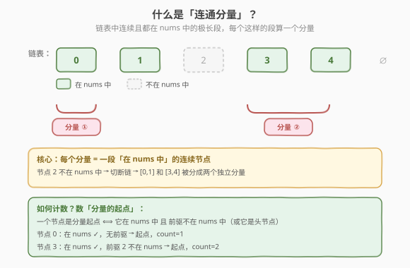
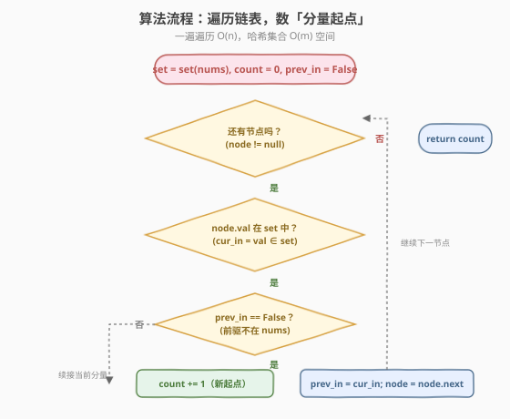
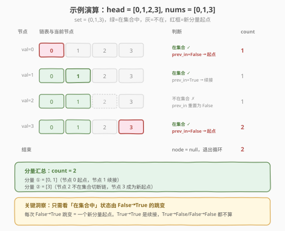

# LeetCode 链表组件 题解

## 1. 题目概述

- **标题 / 题号**：链表组件（#817，medium）
- **链接**：https://leetcode.cn/problems/linked-list-components/
- **难度**：中等
- **标签**：链表、哈希表

**题意**：给定一个**值互不相同**的单链表头节点 `head`，以及一个整数数组 `nums`，`nums` 是链表节点值的**子集**。返回 `nums` 在链表中的**连通分量**个数。

**连通分量**的定义：链表中一段**连续**的节点序列，其中每个节点的值都在 `nums` 中，且该序列是**极大**的（不能再向左右扩展）。

**示例 1**：

```text
输入：head = [0,1,2,3], nums = [0,1,3]
输出：2
解释：[0, 1] 是一个连通分量（0、1 连续且都在 nums 中）；
      [3] 是另一个连通分量（3 在 nums 中，但前驱 2 不在，后继为空，无法扩展）。
```

**示例 2**：

```text
输入：head = [0,1,2,3,4], nums = [0,3,1,4]
输出：2
解释：[0, 1] 和 [3, 4] 是两个连通分量，节点 2 不在 nums 中，把链表切成两段。
```

**约束**：

- 链表节点数目范围 `[1, 10^4]`
- `0 <= Node.val < Node 数目`（节点值互不相同）
- `nums` 中的值互不相同
- `1 <= nums.length <= 链表节点数目`

> 💡 本题是**链表遍历 + 哈希集合**的经典组合。核心只问一件事：链表中「在 nums 里」的节点被「不在 nums 里」的节点切成了几段？一段就是一个连通分量。一次遍历、一个哈希集合即可搞定。

## 2. 解题思路

### 2.1 暴力思路：对 nums 中每个值找链表位置再合并

最直白的做法：把 `nums` 里每个值在链表中找到对应节点位置（下标），按位置排序，然后把**相邻位置**（下标差恰好为 1）的值合并成一段，统计段数。

```text
positions = []
for v in nums:
    走一遍链表找到 v 的下标 idx
    positions.append(idx)
sort(positions)
count = len(positions)
for i in 1..len-1:
    if positions[i] == positions[i-1] + 1:
        count -= 1   # 相邻，合并
return count
```

时间 $O(n \cdot m + m \log m)$（`n` 链表长度、`m` nums 长度），多次遍历链表效率差，还要排序合并。方向对但绕了远路——其实**顺着链表走一遍**就能直接数出段数。

> ⚠️ 暴力法的问题在于**多次遍历链表**（每个 nums 值找一次位置）。链表不支持随机访问，与其反复定位，不如**顺着链表走一次**，边走边判断当前节点是否属于某个分量。这就是哈希集合 + 单次遍历的思路来源。

### 2.2 核心观察：数「分量起点」



**关键定义**：先把 `nums` 存入**哈希集合** `set`，使任意值的查询变为 $O(1)$。然后从头到尾遍历链表，对每个节点判断它是否在 `set` 中。

**核心观察**：一个节点是某个连通分量的**起点**，当且仅当：

1. **当前节点在 `set` 中**（值属于 `nums`），且
2. **前驱节点不在 `set` 中**（或它是链表头节点，没有前驱）。

> 条件 2 的含义：前驱不在 `nums` 中意味着链表在这里「断裂」，当前节点开启了一段新的连续段。如果前驱也在 `nums` 中，当前节点只是**续接**已有分量，不算新起点。

因此，**连通分量的个数 = 链表中「在集合中」状态由 False 跳变为 True 的次数**。

| 当前在 set 中 | 前驱在 set 中 | 动作 | 说明 |
|:-:|:-:|------|------|
| ✓ | ✗（或无前驱） | `count += 1` | 新分量起点 |
| ✓ | ✓ | 不计数 | 续接当前分量 |
| ✗ | 任意 | 不计数 | 不在集合中，跳过 |

> 💡 **为什么这样数是对的？** 每个连通分量恰有一个起点——它的第一个节点。该节点在 `set` 中而其前驱不在（或无前驱）。反之，每个满足「在 set 中且前驱不在」的节点也恰是一个分量的起点。一一对应，数起点即数分量。

### 2.3 算法流程图



**完整步骤**：

1. **预处理**：`s = set(nums)`，初始化 `count = 0`，`prev_in = False`（记录前驱是否在集合中）。
2. **遍历**：`node = head`，当 `node != null`：
   - 判断 `cur_in = (node.val in s)`
   - 若 `cur_in == True` 且 `prev_in == False`：`count += 1`（新分量起点）
   - 更新 `prev_in = cur_in`
   - `node = node.next`
3. **返回** `count`。

> ⚠️ 用一个布尔变量 `prev_in` 记录前驱状态，避免显式保存前驱节点——我们只关心「前驱在不在集合里」，不关心前驱是谁。这是状态机思维：只需一个 bit 就能跟踪「是否正处在某个分量内部」。

### 2.4 示例演算

以 `head = [0,1,2,3]`、`nums = [0,1,3]`（`s = {0,1,3}`）为例：



| 节点值 | 在 set 中？ | prev_in（前驱状态） | 是否新起点 | count |
|:------:|:-----------:|:-------------------:|:----------:|:-----:|
| 0 | ✓ | False | **是**（False→True 跳变） | 1 |
| 1 | ✓ | True | 否（True→True，续接） | 1 |
| 2 | ✗ | — | 否（不在集合） | 1 |
| 3 | ✓ | False | **是**（False→True 跳变） | 2 |

遍历结束，`count = 2`。分量 ① = `[0,1]`，分量 ② = `[3]`，与示例一致。

> 💡 注意节点 2：它不在集合中，`prev_in` 被更新为 `False`。这为节点 3 的「False→True 跳变」铺好了路——正是因为前驱 2 不在集合，节点 3 才成为新起点。若节点 2 也在集合中，则 `[0,1,2,3]` 整段是一个分量，`count = 1`。

## 3. 参考代码

### C++

```cpp
/**
 * Definition for singly-linked list.
 * struct ListNode {
 *     int val;
 *     ListNode *next;
 *     ListNode() : val(0), next(nullptr) {}
 *     ListNode(int x) : val(x), next(nullptr) {}
 *     ListNode(int x, ListNode *next) : val(x), next(next) {}
 * };
 */
class Solution {
  public:
    int numComponents(ListNode* head, vector<int>& nums) {
        unordered_set<int> s(nums.begin(), nums.end());
        int count = 0;
        bool prev_in = false;          // 前驱节点是否在集合中
        for (ListNode* node = head; node != nullptr; node = node->next) {
            bool cur_in = s.count(node->val) > 0;
            if (cur_in && !prev_in) {  // 在集合中且前驱不在 → 新分量起点
                count++;
            }
            prev_in = cur_in;
        }
        return count;
    }
};
```

### Python

```python
# Definition for singly-linked list.
# class ListNode:
#     def __init__(self, val=0, next=None):
#         self.val = val
#         self.next = next
class Solution:
    def numComponents(self, head: Optional[ListNode], nums: List[int]) -> int:
        s = set(nums)
        count = 0
        prev_in = False              # 前驱节点是否在集合中
        node = head
        while node:
            cur_in = node.val in s
            if cur_in and not prev_in:  # 在集合中且前驱不在 → 新分量起点
                count += 1
            prev_in = cur_in
            node = node.next
        return count
```

> 💡 两版代码逻辑一致：用 `prev_in` 这个布尔量把链表遍历变成了一个**状态机**——状态为「是否正处在某个分量内部」。`cur_in && !prev_in` 就是状态从「外部」跳入「内部」的瞬间，每跳入一次就多一个分量。代码极简，没有额外数据结构，只有一个集合和一个布尔。

## 4. 复杂度分析

| 维度 | 复杂度 | 说明 |
|------|--------|------|
| **时间复杂度** | $O(n + m)$ | 建 `set` 遍历 `nums` 耗 $O(m)$；遍历链表 $n$ 个节点每步 $O(1)$ 哈希查询，共 $O(n)$ |
| **空间复杂度** | $O(m)$ | 哈希集合存 `nums` 的 $m$ 个值；链表遍历只用常数额外空间 |

> ⚠️ $n$ 为链表节点数，$m$ 为 `nums` 长度。由于 `nums` 是链表值的子集，$m \le n$，因此时间复杂度可简化为 $O(n)$。哈希集合是必须的——没有它每次查询退化为 $O(m)$，总时间 $O(n \cdot m)$，当 $n = 10^4$ 时可能超时。

## 5. 扩展：另一种计数方式——相邻对抵消

除了「数起点」，还有一种等价但视角不同的计数方法：

> **连通分量数 = nums 中的节点总数 − 链表中相邻且都在 nums 中的节点对数**

**直觉**：初始时把 `nums` 中每个值看作一个独立分量（共 $m$ 个）。链表中每出现一对「相邻且都在 `nums` 中」的节点，就把两个本该独立的分量**合并**成一个，分量数减 1。最终：

$$
\text{count} = m - \bigl|\{(i,\, i+1) : \text{val}_i \in s \;\land\; \text{val}_{i+1} \in s\}\bigr|
$$

```python
class Solution:
    def numComponents(self, head: Optional[ListNode], nums: List[int]) -> int:
        s = set(nums)
        count = len(nums)            # 初始：每个值一个分量
        prev_in = False
        node = head
        while node:
            cur_in = node.val in s
            if cur_in and prev_in:   # 相邻且都在集合中 → 合并，减 1
                count -= 1
            prev_in = cur_in
            node = node.next
        return count
```

**对比**：
- 「数起点」：`cur_in && !prev_in` → `count++`（从 0 开始加）。
- 「相邻对抵消」：`cur_in && prev_in` → `count--`（从 $m$ 开始减）。

两者互为对偶——前者数「跳入」，后者数「续接」，殊途同归。

> 💡 这个公式揭示了分量的本质：$m$ 个散点是上限，链表的连续性让相邻的散点「粘」在一起，每粘一对减一个。数学上这等价于图论中「连通块数 = 顶点数 − 边数」（当边构成森林时），链表中的相邻关系就是这棵「森林」的边。

## 6. 面试要点

1. **为什么用哈希集合而不是数组/排序？**

   - 链表遍历中对每个节点都要查询「值是否在 `nums` 中」。哈希集合单次查询 $O(1)$，总 $O(n)$；若用数组线性查找则 $O(n \cdot m)$；排序 + 二分虽是 $O(n \log m)$，但有额外排序开销且代码更复杂。集合是本题的最优选择。

2. **`prev_in` 布尔变量的作用是什么？**

   - 它记录**前驱节点是否在集合中**，相当于一个状态位：`True` 表示「当前正处在某个分量内部」，`False` 表示「当前在分量外部」。只需跟踪这一个 bit，就能判断当前节点是「新起点」还是「续接」，无需保存前驱节点本身。

3. **为什么「在集合中且前驱不在」就一定是新分量起点？**

   - 前驱不在集合意味着链表在这里断裂，当前节点是新连续段的第一个元素。而连通分量的定义正是「极大的连续在集合中的段」，第一个元素即起点。每个分量有且仅有一个起点，一一对应。

4. **如果 `nums` 不是子集（含链表中没有的值）会怎样？**

   - 建集合时多出的值不影响——遍历链表时根本遇不到它们，查询永远返回 `False`。算法依然正确，只是集合里有些「无用」的条目。题目保证 `nums` 是子集，所以无需特殊处理。

5. **两种计数方法（数起点 vs 相邻对抵消）哪个更好？**

   - 「数起点」更直观，从 0 开始累加，面试时更容易讲清楚；「相邻对抵消」揭示了「分量数 = 顶点数 − 边数」的图论本质，适合作为扩展讨论加分。两者复杂度完全相同，面试中写出任一种即可，能讲清另一种则锦上添花。

> 💡 **一句话总结**：817 的核心是「数链表中在 nums 里的连续段数」。把 `nums` 存入哈希集合后遍历链表，每次遇到「在集合中且前驱不在」的节点就 `count++`——一次遍历 $O(n)$、$O(m)$ 空间。关键是 `prev_in` 这个状态位把问题变成了简单的跳变计数。

## 同类练习题

| # | 题目 | 与本题的关联 |
|---|------|-------------|
| 83 | [删除排序链表中的重复元素](https://leetcode.cn/problems/remove-duplicates-from-sorted-list/)（[题解](../0001-0100/83_删除排序链表中的重复元素.md)） | 同样遍历链表 + 比较相邻节点，用前驱状态决定动作 |
| 82 | [删除排序链表中的重复元素 II](https://leetcode.cn/problems/remove-duplicates-from-sorted-list-ii/)（[题解](../0001-0100/82_删除排序链表中的重复元素II.md)） | 相邻节点比较的进阶版，需要整段跳过重复组 |
| 234 | [回文链表](https://leetcode.cn/problems/palindrome-linked-list/) | 链表遍历 + 状态判断的经典组合，快慢指针找中点后比较 |
| 707 | [设计链表](https://leetcode.cn/problems/design-linked-list/) | 链表基础操作练习，熟悉遍历与边界处理 |
| 1290 | [二进制链表转整数](https://leetcode.cn/problems/convert-binary-number-in-a-linked-list-to-integer/) | 链表单次遍历 + 累积状态，同样靠一遍遍历边走边算 |
