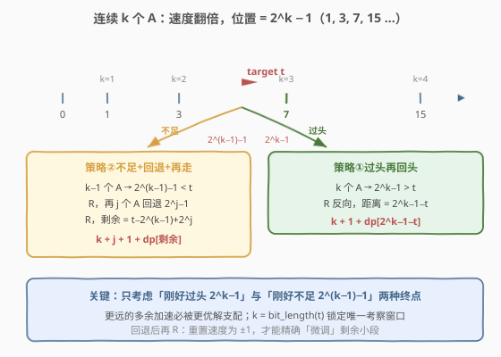
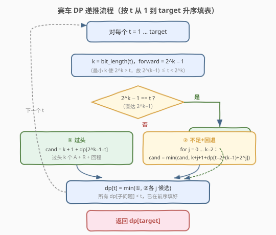
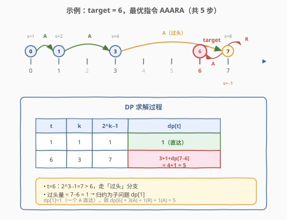

# LeetCode 赛车 题解

## 1. 题目概述

- **标题 / 题号**：赛车（#818，hard）
- **链接**：https://leetcode.cn/problems/race-car/
- **难度**：困难
- **标签**：动态规划、记忆化搜索、位运算

**题意**：赛车在无限数轴上从位置 `0` 出发，初始速度 `+1`。可执行两种指令：

- **`A`（加速）**：`position += speed`，随后 `speed *= 2`（速度翻倍）。
- **`R`（倒车）**：位置不变；速度为正则变 `-1`，为负则变 `+1`（即重置速度方向、模长归 1）。

求到达目标位置 `target` 的**最短指令序列长度**。

**示例 1**：

```text
输入：target = 3
输出：2
解释："AA"。位置 0 --> 1 --> 3，速度 1 --> 2 --> 4。
```

**示例 2**：

```text
输入：target = 6
输出：5
解释："AAARA"。位置 0 --> 1 --> 3 --> 7 --> 7 --> 6，
      速度 1 --> 2 --> 4 --> 8 --> -1 --> -2。
```

**约束**：

- `1 <= target <= 10000`

> ⚠️ 本题难点在于状态空间「位置 + 速度」中速度会指数增长，朴素 BFS 状态爆炸。突破口是观察到**连续 `A` 的落点构成 $2^k-1$ 的等比序列**，从而把问题归约为子问题、用 DP 求解。

## 2. 解题思路

### 2.1 暴力思路：BFS 状态搜索

最直觉的做法是把 `(position, speed)` 当作状态做 BFS：每个状态可发出 `A` 或 `R` 两条边，逐层扩展直到首次到达 `target`。

问题在于**速度会指数膨胀**——连续 `k` 个 `A` 后速度变成 $2^k$，位置可达 $2^k-1$。若不加剪枝，状态空间上界要开到约 `2 * target` 的位置与若干速度档，BFS 虽可过但常数大、且难看透结构。更好的思路是抓住「`A` 序列的落点规律」做归约。

### 2.2 核心观察：连续 A 的落点 = $2^k-1$，只需考虑两种终点



从位置 0、速度 1 出发，**连续执行 $k$ 个 `A`**（中途不 `R`），位置依次为 $1, 3, 7, 15, \dots$，即第 $k$ 步落点恰为

$$
\text{forward}_k = 2^k - 1
$$

> 💡 这是因为速度按 $1, 2, 4, \dots, 2^{k-1}$ 累加，和为 $2^k - 1$。

设 $k = \text{bit\_length}(t)$，即**最小的使 $2^k > t$ 的整数**（故 $2^{k-1} \le t < 2^k$）。于是落点 $\text{forward}_k = 2^k-1 \ge t$，而 $\text{forward}_{k-1} = 2^{k-1}-1 < t$。最优解只在这两个落点处考虑**首次 `R`**——更远的加速必被更优解支配：

- **策略①　过头再回头（overshoot）**：连续 $k$ 个 `A` 冲到 $2^k-1 > t$，执行 `R`，此时位置 $2^k-1$、速度 $-1$。还需往回走 $2^k-1-t$，由**对称性**这等价于子问题 $dp[2^k-1-t]$。

  $$
  \text{cand}_1 = k + 1 + dp[2^k - 1 - t]
  $$

- **策略②　不足 + 回退 + 再走（undershoot）**：先 $k-1$ 个 `A` 到 $2^{k-1}-1 < t$，`R`（速度 $-1$），再 $j$ 个 `A` **往回退** $2^j-1$（$j \in [0, k-2]$），再 `R` 重置速度为 $+1$。此时位置 $= 2^{k-1} - 2^j$，剩余距离 $= t - 2^{k-1} + 2^j$，归约为子问题。

  $$
  \text{cand}_2(j) = (k-1) + 1 + j + 1 + dp\bigl[t - 2^{k-1} + 2^j\bigr] = k + j + 1 + dp\bigl[t - 2^{k-1} + 2^j\bigr]
  $$

> ⚠️ **`j=0` 不是废话**：连发两次 `R`（中间不 `A`）虽位置不变，但把速度**重置回 $\pm 1$**，从而能在大幅加速后做精确的「微调」。例如 $t=4$ 的最优解 `AARRA` 正是靠 `j=0` 的双重 `R` 把速度从 4 复位为 1，再一步 `A` 走到 4。这正是本题区别于普通贪心的精妙之处。

**边界**：$dp[0] = 0$；若 $2^k-1 = t$（直达），$dp[t] = k$。

**答案**：$dp[\text{target}]$。

### 2.3 算法流程图



按 $t$ 从小到大递推：每个 $dp[t]$ 的所有子问题参数均严格小于 $t$（过头量 $2^k-1-t < 2^{k-1} \le t$；回退后剩余 $< t$），依赖天然已就绪，无需记忆化递归的栈开销。

### 2.4 示例演算

以 `target = 6` 为例，最优指令 `AAARA` 的轨迹与 DP 求解过程如下：



- $t=6$，$k = \text{bit\_length}(6) = 3$，$\text{forward}_3 = 2^3-1 = 7 > 6$，走「过头」分支。
- 过头量 $= 7 - 6 = 1$，归约为 $dp[1]$；而 $dp[1] = 1$（$2^1-1=1$ 直达）。
- 故 $dp[6] = 3 + 1 + dp[1] = 4 + 1 = 5$，对应指令 `A A A R A`：$0\to1\to3\to7\to7\to6$。

| $t$ | $k$ | $2^k-1$ | $dp[t]$ |
|-----|-----|---------|---------|
| 1 | 1 | 1 | 1（直达） |
| 6 | 3 | 7 | $3+1+dp[1] = 5$ |

## 3. 参考代码

### C++

```cpp
class Solution {
  public:
    int racecar(int target) {
        vector<int> dp(target + 1, 0);
        for (int t = 1; t <= target; t++) {
            int k = 32 - __builtin_clz(t);      // bit_length: 最小 k 使 2^k > t
            int forward = (1 << k) - 1;          // 2^k - 1
            if (forward == t) {
                dp[t] = k;                       // k 个 A 直达
            } else {
                // 策略① 过头：k 个 A + R + 子问题
                dp[t] = k + 1 + dp[forward - t];
                // 策略② 不足 + 回退：(k-1) 个 A + R + j 个 A 回退 + R + 子问题
                int prev = (1 << (k - 1)) - 1;   // 2^(k-1) - 1
                for (int j = 0; j < k - 1; j++) {
                    int back = (1 << j) - 1;     // 回退距离 2^j - 1
                    int remain = t - prev + back; // = t - 2^(k-1) + 2^j
                    dp[t] = min(dp[t], k + j + 1 + dp[remain]);
                }
            }
        }
        return dp[target];
    }
};
```

### Python

```python
class Solution:
    def racecar(self, target: int) -> int:
        dp = [0] * (target + 1)
        for t in range(1, target + 1):
            k = t.bit_length()                 # 最小 k 使 2^k > t
            forward = (1 << k) - 1             # 2^k - 1
            if forward == t:
                dp[t] = k                      # k 个 A 直达
            else:
                # 策略① 过头
                dp[t] = k + 1 + dp[forward - t]
                # 策略② 不足 + 回退
                prev = (1 << (k - 1)) - 1      # 2^(k-1) - 1
                for j in range(k - 1):
                    back = (1 << j) - 1        # 回退距离
                    remain = t - prev + back   # = t - 2^(k-1) + 2^j
                    dp[t] = min(dp[t], k + j + 1 + dp[remain])
        return dp[target]
```

> 💡 **为何只需考察 $k = \text{bit\_length}(t)$？** 更大的 $k$ 意味着过头更远、回程更长，必然劣于「刚好过头」的 $2^k-1$；更小的 $k$ 已被「不足 + 回退」分支中的 $k-1$ 覆盖。一个固定 $k$ 即枚尽所有有效终点，这是把朴素 BFS 的指数状态压缩到 $O(\log t)$ 转移的关键。

## 4. 复杂度分析

| 维度 | 复杂度 | 说明 |
|------|--------|------|
| 时间复杂度 | $O(T \log T)$ | 每个 $t$ 枚举 $k = O(\log t)$ 个回退档 $j$，求和 $\sum_{t=1}^{T} O(\log t) = O(T \log T)$ |
| 空间复杂度 | $O(T)$ | 一维 dp 数组，$T = \text{target}$ |

## 5. 扩展：BFS 写法与正确性直觉

若不放心 DP 的归约是否完备，可用 BFS 兜底验证（状态 `(pos, speed)`，位置上界 $2 \cdot \text{target}$）：

```python
from collections import deque

class Solution:
    def racecar(self, target: int) -> int:
        start = (0, 1)
        seen = {start}
        q = deque([(0, 1, 0)])          # (pos, speed, steps)
        while q:
            pos, speed, steps = q.popleft()
            if pos == target:
                return steps
            # A
            p2, s2 = pos + speed, speed * 2
            if (p2, s2) not in seen and 0 < p2 < 2 * target:
                seen.add((p2, s2))
                q.append((p2, s2, steps + 1))
            # R
            s3 = -1 if speed > 0 else 1
            if (pos, s3) not in seen:
                seen.add((pos, s3))
                q.append((pos, s3, steps + 1))
```

**剪枝依据**：位置超过 $2 \cdot \text{target}$ 后再回头不可能更优（过头量已超过全程）；位置为负对称同理。BFS 与 DP 答案一致，可作为正解的交叉验证。

> 💡 DP 解法本质是 BFS 的「结构压缩版」：BFS 把每个 `(pos, speed)` 当独立状态，而 DP 发现**所有有意义的首次 `R` 只发生在落点 $2^k-1$ 处**，从而把无穷速度档折叠成 $O(\log t)$ 个转移。

## 6. 面试要点

1. **为什么用 DP 而不是直接 BFS？**
   - BFS 状态 `(pos, speed)` 中 speed 指数增长，状态空间巨大（虽可剪枝到 $O(\text{target})$ 但常数大）。观察到连续 `A` 落点为 $2^k-1$ 后，可把问题归约为更小的子问题，用一维 DP 在 $O(T \log T)$ 内解决，且无需去重判重。

2. **为什么只考察 $k = \text{bit\_length}(t)$ 这一个 $k$？**
   - $2^k-1$ 是「不小于 $t$ 的最近加速落点」，更远的多余加速只会增加回程成本，被支配；而 $2^{k-1}-1$ 是「小于 $t$ 的最近落点」，由「不足 + 回退」分支覆盖。其他 $k$ 都被这两种情形包含，故固定一个 $k$ 即可。

3. **回退分支里 $j$ 的范围为什么是 $[0, k-2]$？**
   - 回退 $j$ 个 `A` 走过 $2^j-1$。$j \le k-2$ 保证回退量 $2^j-1 < 2^{k-1}-1$，即不会退到出发点的另一侧，剩余距离恒为正且严格小于 $t$，确保子问题规模缩小、DP 依赖已就绪。$j = k-1$ 会使剩余 $= t$，陷入自环。

4. **`j=0`（连发两次 `R`）的意义是什么？**
   - 两次 `R` 间不插 `A`，位置不变但速度被重置为 $\pm 1$。这用于在大幅加速后做「微调」：例如 $t=4$ 的最优解 `AARRA` 靠它把速度从 4 复位为 1，再一步 `A` 精确走到 4。忽略 $j=0$ 会漏解。

5. **子问题为何严格小于 $t$？如何保证 DP 顺序正确？**
   - 过头分支：$2^k-1-t < 2^{k-1} \le t$；回退分支：剩余 $= t - 2^{k-1} + 2^j < t$（因 $2^j < 2^{k-1}$）。两者均 $< t$，按 $t$ 升序填表即可保证依赖先就绪。

## 同类练习题

| # | 题目 | 与本题的关联 |
|---|------|-------------|
| 991 | [坏了的计算器](https://leetcode.cn/problems/broken-calculator/) | `×2` 或 `−1` 两种操作达目标的最少步数，逆向贪心（从 target 倒推到 startValue），与 818 的「加速倍增 + 反向归约」思路互为镜像 |
| 397 | [整数替换](https://leetcode.cn/problems/integer-replacement/) | 对 $n$ 做 `±1` 或 `/2` 的最少操作，奇偶分治 + 记忆化，体会「倍增/减半」类状态归约 |
| 45 | [跳跃游戏 II](https://leetcode.cn/problems/jump-game-ii/)（[题解](../0001-0100/45_跳跃游戏II.md)） | 贪心最短跳跃，对比本题带「速度」维度的状态与重置操作 |
| 753 | [破解保险箱](https://leetcode.cn/problems/cracking-the-safe/)（[题解](../0701-0800/753_破解保险箱.md)） | de Bruijn 图 + 欧拉回路，另一类「状态 = 上次若干步」的最短序列构造问题 |
