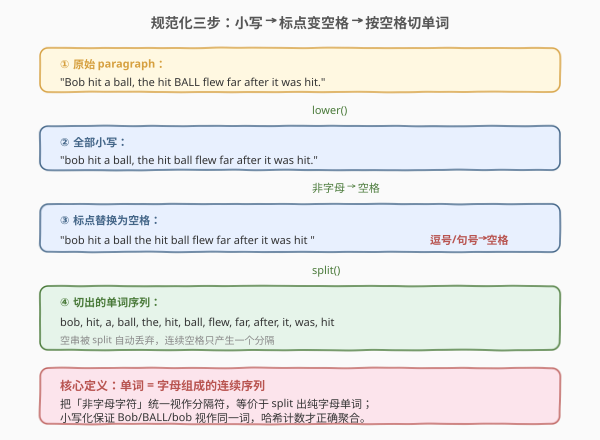
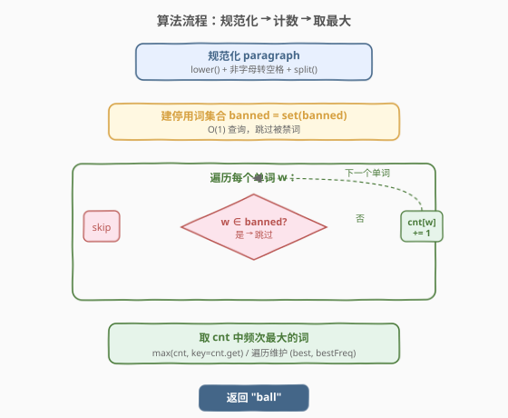
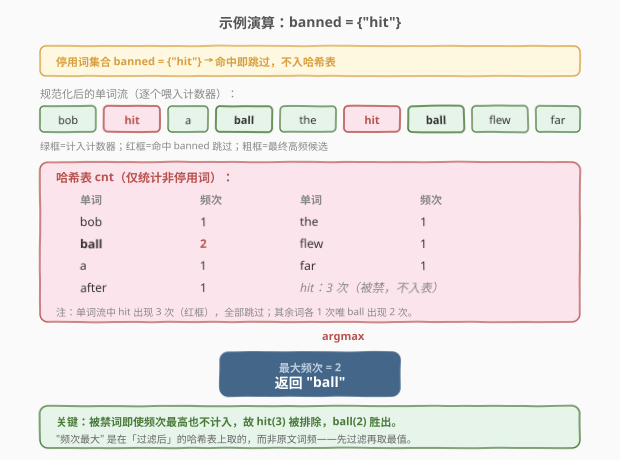

# 最常见的单词

- **题目名称**：最常见的单词
- **链接**：[819. 最常见的单词](https://leetcode.cn/problems/most-common-word/)
- **难度**：简单
- **标签**：哈希表、字符串

## 1. 题目概述

给定一个段落 `paragraph` 和一个**禁用词数组** `banned`，返回段落中出现次数最多且**不在禁用列表**中的单词。题目保证至少存在一个非禁用词。

**单词**定义为**由字母组成的连续序列**：段落中的 `!?',;.` 等标点与空格一样视作分隔符；大小写**不敏感**，比较与返回均用**小写**形式。

**示例 1**：

```text
输入：paragraph = "Bob hit a ball, the hit BALL flew far after it was hit.", banned = ["hit"]
输出："ball"
解释：
      规范化后单词序列：bob, hit, a, ball, the, hit, ball, flew, far, after, it, was, hit
      hit 出现 3 次但被禁用；
      ball 出现 2 次（其余词均 1 次），故返回 "ball"。
```

**示例 2**：

```text
输入：paragraph = "a.", banned = []
输出："a"
解释：标点 "." 作分隔符，唯一单词为 "a"。
```

**约束条件**：

- `1 <= paragraph.length <= 1000`
- `paragraph` 由英文字母、空格 `' '` 和符号 `!?',;.` 组成
- `0 <= banned.length <= 100`
- `1 <= banned[i].length <= 10`
- `banned[i]` 仅由小写英文字母组成

> 💡 这是一道**字符串规范化 + 哈希表计数**的招牌题。核心套路：把段落统一小写、把非字母字符当分隔符切出单词、用哈希表统计**非禁用词**频次、最后取频次最大者。与 [811. 子域名访问计数](https://leetcode.cn/problems/subdomain-visit-count/) 同属「拆分 + 聚合计数」家族，区别仅在于多了一道**停用词过滤**。

---

## 2. 解题思路

### 2.1 暴力思路：逐词扫描 + 反复查找

最朴素的写法：对段落里每个候选单词，先确认它不在 `banned` 中（线性扫描 `banned` 数组），再用一次遍历统计它在整个单词列表里出现的次数，最后比较所有候选词的频次取最大。

这种做法的问题在于**重复统计**与**线性查禁用表**：对 $n$ 个单词、禁用表长 $m$，整体退化为 $O(n^2 + n \cdot m)$。问题本质仍是「按词聚合 + 过滤」，这正是**哈希表**的看家本领——`set` 做 $O(1)$ 过滤、`map` 做 $O(1)$ 聚合，一次遍历即可。

### 2.2 核心观察：规范化三步 + 哈希聚合

解题可拆为两段：**规范化**（把段落变成可比对的纯小写单词序列）与**过滤计数**（跳过禁用词、聚合频次、取最大）。



**规范化的关键定义**：单词 = 字母组成的连续序列。把所有「非字母字符」统一视作分隔符，等价于 `split` 出纯字母单词；小写化保证 `Bob`/`BALL`/`bob` 视作同一词，哈希计数才能正确聚合。实现上有两种等价写法：

| 写法 | 做法 | 适用 |
|------|------|------|
| **字符扫描** | 逐字符判断 `isalpha`，是字母就累积（顺便 `tolower`），非字母就把累积串作为一个单词提交 | 任意语言，最贴近定义 |
| **正则提取** | 先 `lower()` 再用正则 `[a-z]+` 一次性 `findall` 所有单词 | Python 等正则便捷的语言 |

> 💡 **为什么不用 `split(' ')` 按空格切？** 因为标点紧贴单词（如 `ball,`、`was hit.`）时，按空格切出的片段仍带标点，还需二次清洗。直接用「非字母 = 分隔符」一步到位，省去逐片段剥标点的繁琐。

**过滤计数**：把 `banned` 转成哈希集合 `set`，遍历规范化后的单词流，命中集合就跳过，否则 `cnt[word] += 1`。最后在 `cnt` 上取频次最大者即为答案。

### 2.3 算法流程图



**完整步骤**：

1. **规范化段落**：小写化 + 把非字母字符当分隔符，切出纯小写单词序列。
2. **建停用词集合**：`ban = set(banned)`，提供 $O(1)$ 查询。
3. **遍历计数**：对每个单词 `w`，若 `w ∈ ban` 则跳过，否则 `cnt[w] += 1`。
4. **取最大**：在 `cnt` 中找频次最大的单词返回（`max(cnt, key=cnt.get)` 或遍历维护 `best/bestFreq`）。

> ⚠️ **易错点**：① 别忘了段落**末尾单词**——若以字母结尾，字符扫描法需在循环外再提交一次累积串；② 必须先**小写化再比较**，`banned` 本身就是小写，未小写化的 `Bob` 不会匹配；③ 「频次最大」是在**过滤后**的哈希表上取的，被禁词即便频次最高也不参与比较。

### 2.4 示例演算

以示例 1 为例，`banned = ["hit"]`，逐词追踪哈希表的变化：



| 单词 | 是否禁用 | 哈希表动作 | 关键状态 |
|------|---------|-----------|----------|
| `bob` | 否 | `cnt["bob"]=1` | — |
| `hit` | **是** | 跳过 | 不入表 |
| `a` | 否 | `cnt["a"]=1` | — |
| `ball` | 否 | `cnt["ball"]=1` | — |
| `the` | 否 | `cnt["the"]=1` | — |
| `hit` | **是** | 跳过 | — |
| `ball` | 否 | `cnt["ball"]=2` | **ball 追平到 2** |
| `flew` / `far` / `after` / `it` / `was` | 否 | 各 +1 | 均 1 次 |
| `hit` | **是** | 跳过 | — |

最终哈希表中 `ball=2` 最高（其余均 1），返回 `"ball"`。注意 `hit` 在原文出现 3 次本是最多，但因被禁用完全不计入。

> 💡 **关键观察**：被禁词即使频次最高也不入表，所以「取最大」一定作用在**过滤后**的计数结果上——先过滤再取最值，顺序不能颠倒。

---

## 3. 参考代码

### C++

```cpp
class Solution {
  public:
    string mostCommonWord(string paragraph, vector<string>& banned) {
        unordered_set<string> ban(banned.begin(), banned.end());
        unordered_map<string, int> cnt;
        string word, ans;
        int best = 0;
        for (char& ch : paragraph) {
            if (isalpha(ch)) {
                word += tolower(ch);          // 累积小写字母
            } else if (!word.empty()) {
                if (!ban.count(word)) cnt[word]++;
                word.clear();
            }
        }
        if (!word.empty() && !ban.count(word)) cnt[word]++;   // 末尾单词
        for (auto& [w, c] : cnt) {
            if (c > best) { best = c; ans = w; }              // 取频次最大
        }
        return ans;
    }
};
```

### Python

```python
class Solution:
    def mostCommonWord(self, paragraph: str, banned: List[str]) -> str:
        ban = set(banned)
        words = re.findall(r'[a-z]+', paragraph.lower())   # 规范化：小写 + 提取纯字母单词
        cnt = collections.Counter(w for w in words if w not in ban)
        return cnt.most_common(1)[0][0]                     # 频次最大者
```

> 💡 两版思路一致，区别在规范化方式：C++ 用 `isalpha`/`tolower` 逐字符扫描，避免引入正则库；Python 用 `re.findall(r'[a-z]+', ...)` 一行完成小写化 + 切词，配合 `Counter.most_common(1)` 取最大，写法最简洁。若面试限制不用正则，Python 也可改成与 C++ 同款的逐字符扫描版。

---

## 4. 复杂度分析

| 维度 | 复杂度 | 说明 |
|------|--------|------|
| **时间复杂度** | $O(n + m)$ | $n$ 为 `paragraph` 长度，单次扫描规范化 + 计数；$m$ 为 `banned` 总长度，建集合一次。取最大需遍历哈希表，键数 $\le n$ |
| **空间复杂度** | $O(n + m)$ | 停用词集合存 $m$ 量级；哈希表最多存 $n$ 量级的不同单词（含其字符串键） |

> ⚠️ 严格说哈希表单次操作是 $O(\text{键长})$ 而非 $O(1)$（需哈希并比较整个字符串），但单词平均长度有界，整体仍线性于输入规模。本题 $n \le 1000$，实际开销可忽略。

---

## 5. 扩展：不用正则的 Python 版与平局处理

### 5.1 逐字符扫描版（禁用正则时）

把 C++ 的 `isalpha` 思路搬到 Python，用一个临时列表累积字母：

```python
class Solution:
    def mostCommonWord(self, paragraph: str, banned: List[str]) -> str:
        ban = set(banned)
        cnt = collections.Counter()
        buf = []
        for ch in paragraph:
            if ch.isalpha():
                buf.append(ch.lower())
            elif buf:
                w = ''.join(buf)
                if w not in ban:
                    cnt[w] += 1
                buf = []
        if buf:                                        # 末尾单词
            w = ''.join(buf)
            if w not in ban:
                cnt[w] += 1
        return cnt.most_common(1)[0][0]
```

**思路**：`buf` 累积连续字母，遇非字母即「落笔」提交一个单词并清空缓冲；循环外再补提交一次末尾单词。与正则版完全等价，仅是手写了一遍 `[a-z]+` 的语义。

### 5.2 频次相同时谁胜出？

题目保证答案唯一（隐含给定输入下最值不并列）。若面试官追问「平局时取字典序最小的」，把 `most_common` 换成显式排序：

```python
return min(cnt, key=lambda w: (-cnt[w], w))   # 频次降序，同频字典序升序
```

这与 [692. 前 K 个高频单词](https://leetcode.cn/problems/top-k-frequent-words/) 的排序键方向一致——`(-freq, word)` 一键表达「频次降序 + 字典序升序」两个准则。

> 💡 若只要 Top-K 而非单个最大值，用**最小堆**维护 K 个最大值更高效（$O(n \log k)$），正是 692 题的标准解法。本题 $k=1$，`Counter.most_common(1)` 内部即用堆，直接调用即可。

---

## 6. 面试要点

1. **为什么「非字母字符」统一当分隔符，而不是按空格切再剥标点？**

   - 标点常紧贴单词（`ball,`、`was hit.`），按空格切出的片段仍带标点，需对每个片段二次清洗，繁琐且易漏（如 `don't` 中的 `'`）。直接定义「单词 = 连续字母序列」，把所有非字母视作分隔符，一步切出纯字母单词，与单词定义严格吻合。

2. **为什么必须先小写化再比较？**

   - 题目大小写不敏感：`Bob`、`BOB`、`bob` 是同一个词。`banned` 数组本身全小写，若不把段落单词也小写化，`Bob` 既不会匹配禁用词 `bob`，也不会与 `bob` 的计数合并，导致结果错误。小写化是规范化的必要一环。

3. **C++ 字符扫描版为什么要在循环外再提交一次 `word`？**

   - 若段落以字母结尾（如 `"was hit"`，无尾随标点），循环结束时 `word` 里还积着最后一个单词 `hit`，但没遇到非字母触发提交。必须在循环外补一次 `if (!word.empty())` 把它落笔，否则漏掉末尾词。

4. **为什么用集合存 `banned` 而不是数组/列表？**

   - 每个单词都要查一次「是否被禁用」，用集合是 $O(1)$，用数组是 $O(m)$。$n$ 个单词总查询从 $O(n \cdot m)$ 降到 $O(n)$。这是「以空间换时间」把线性查找转哈希查找的标准操作。

5. **如果 `banned` 为空、段落只有一个重复词，算法正确吗？**

   - 正确。`ban` 为空集，任何词都不命中跳过；该词频次累加到最大值，`most_common` 返回它。无需对空 `banned` 特判，`set([])` 即空集，逻辑自然成立。

> 💡 **一句话总结**：819 是「拆分 + 聚合计数」家族的过滤变体——规范化段落为纯小写单词、停用词集合 $O(1)$ 过滤、哈希表聚合频次、取最大。与 811 仅差一道过滤工序，是哈希表处理「按键累计 + 条件筛选」类问题的最小范例。

---

## 7. 同类练习题

- [811. 子域名访问计数](https://leetcode.cn/problems/subdomain-visit-count/)（[题解](811_子域名访问计数.md)）：同款拆分 + 哈希聚合计数，无过滤工序，本题的基础版
- [692. 前 K 个高频单词](https://leetcode.cn/problems/top-k-frequent-words/)（[题解](../0601-0700/692_前K个高频单词.md)）：哈希计数 + Top-K 最小堆，进阶求前 K 而非单个最大
- [451. 根据字符出现频率排序](https://leetcode.cn/problems/sort-characters-by-frequency/)（[题解](../0401-0500/451_根据字符出现频率排序.md)）：哈希计数 + 按频率排序输出，字符级而非单词级
- [648. 单词替换](https://leetcode.cn/problems/replace-words/)（[题解](../0601-0700/648_单词替换.md)）：字符串拆分 + 前缀匹配（Trie 视角，对照本题的切词 + 集合过滤）
- [290. 单词规律](https://leetcode.cn/problems/word-pattern/)（[题解](../0201-0300/290_单词规律.md)）：字符串 `split` + 哈希双射判定，同为「先切词再哈希」模式
