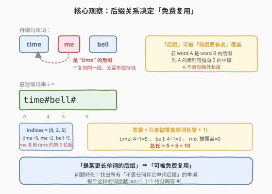
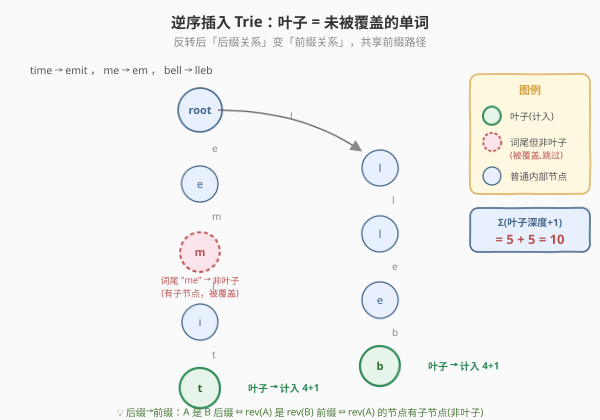
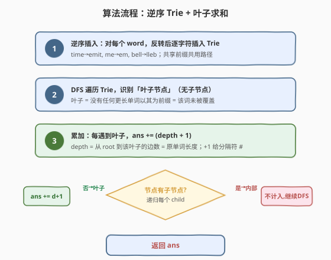
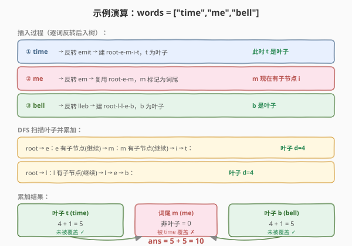

# 单词的压缩编码

- **题目名称**：单词的压缩编码
- **链接**：[820. 单词的压缩编码](https://leetcode.cn/problems/short-encoding-of-words/)
- **难度**：中等
- **标签**：字典树、数组、哈希表、字符串

## 1. 题目概述

给定一组单词 `words`，要把它编码成一个**最短的参考字符串** `s`。编码规则：

- `s` 以 `'#'` 字符结尾，且每个单词后都跟一个 `'#'` 作为分隔；
- 对每个单词 `words[i]`，存在一个起始下标 `indices[i]`，使得 `s` 从 `indices[i]` 开始、到**下一个 `'#'`**（不含）为止的子串恰好等于 `words[i]`。

目标是让 `s` 尽量短，返回 `s` 的最短长度。

**示例 1**：

```text
输入：words = ["time", "me", "bell"]
输出：10
解释：s = "time#bell#"，indices = [0, 2, 5]。
      word[0] = "time" → s[0..4)  = "time"
      word[1] = "me"   → s[2..4)  = "me"   （复用 time 的尾段）
      word[2] = "bell" → s[5..9)  = "bell"
      总长 = 4+1 + 4+1 = 10。
```

**示例 2**：

```text
输入：words = ["t"]
输出：2
解释：s = "t#"，总长 2。
```

**约束条件**：

- `1 <= words.length <= 2000`
- `1 <= words[i].length <= 7`
- `words[i]` 仅由小写英文字母组成

> 💡 关键约束：单词长度 $\le 7$ 很短，但单词数可达 2000；且「同一单词多次出现只需编码一次」。这意味着任何 $O(n \cdot L^2)$ 甚至 $O(n^2 \cdot L)$ 的做法都跑得动，核心在于把「能否复用」判定清楚。

---

## 2. 解题思路

### 2.1 暴力思路

对每个单词 `w`，检查它是否是**另一个更长单词的后缀**：若是，则 `w` 可挂在该更长单词的尾段「免费复用」，无需单独存储；若不是，则 `w` 必须独占一段 `len(w) + 1`（`+1` 给分隔符 `'#'`）。

朴素实现：双层循环，对每个 `w` 遍历所有其它单词 `v`，判断 `v.endswith(w)` 且 `len(v) > len(w)`。复杂度 $O(n^2 \cdot L)$，$n=2000$ 时约 $2000^2 \times 7 \approx 2.8 \times 10^7$，勉强可过但不够优雅，且重复单词需额外去重。

### 2.2 核心观察：后缀关系 → 逆序 Trie（叶子求和）



关键转化有两步：

**第一步：后缀可复用。** 若单词 `A` 是单词 `B` 的后缀，则 `A` 的下标可指向 `B` 在 `s` 中的起始位置向右偏移 `len(B) - len(A)` 处——即 `A` 完全嵌在 `B` 的尾段里，`A` 不贡献任何额外长度。因此**只有「不是任何其它单词后缀」的单词才需要独占一段**，答案 $= \sum_{\text{未被覆盖的 } w} (\text{len}(w) + 1)$。

**第二步：后缀关系 → 前缀关系。** 把每个单词**反转**后插入 Trie。于是「`A` 是 `B` 的后缀」等价于「`rev(A)` 是 `rev(B)` 的前缀」——在 Trie 中表现为 `rev(A)` 对应的路径是 `rev(B)` 路径的一段前缀，即 `rev(A)` 的终点节点**有子节点**（被更长的 `rev(B)` 延伸出去）。

> 💡 **叶子 = 未被覆盖**：在「逆序 Trie」中，一个节点是**叶子**（无子节点），当且仅当没有任何更长单词以其对应反转串为前缀，即原单词**不是任何其它单词的后缀**——它必须独占一段。内部节点（有子节点）对应的单词都被更长单词覆盖，无需计入。答案 = $\sum_{\text{叶子}} (\text{depth} + 1)$，其中 `depth` = 从 root 到叶子的边数 = 原单词长度。



> ⚠️ **重复单词天然处理**：同一个单词插入两次走同一条 Trie 路径，终点是同一个节点；DFS 数叶子时每个节点只数一次，因此重复单词不会重复计入，无需预先去重。

### 2.3 算法流程图



1. 建 Trie，对每个 `word` **逆序**逐字符插入；
2. 从 root 开始 DFS：若当前节点无子节点（叶子），则 `ans += depth + 1`；
3. 否则递归每个子节点，`depth + 1` 下传；
4. DFS 结束即得答案。

### 2.4 示例演算

以 `words = ["time","me","bell"]` 为例，反转后分别为 `emit`、`em`、`lleb`：



- 插入 `time` → `emit`：建 `root-e-m-i-t`，`t` 为叶子（depth 4）；
- 插入 `me` → `em`：复用已有 `root-e-m`，在 `m` 处标记词尾；此时 `m` **有了子节点 `i`**，不再是叶子——`me` 被 `time` 覆盖；
- 插入 `bell` → `lleb`：建 `root-l-l-e-b`，`b` 为叶子（depth 4）；
- DFS：叶子 `t` 贡献 $4+1=5$，词尾 `m` 非叶子跳过，叶子 `b` 贡献 $4+1=5$，合计 $10$。

---

## 3. 参考代码

### C++

```cpp
struct TrieNode {
    unordered_map<char, TrieNode*> children;
};

class Solution {
  public:
    int minimumLengthEncoding(vector<string>& words) {
        TrieNode* root = new TrieNode();
        for (const string& w : words) {
            TrieNode* cur = root;
            for (int i = (int)w.size() - 1; i >= 0; i--) {   // 逆序插入
                char c = w[i];
                if (!cur->children.count(c))
                    cur->children[c] = new TrieNode();
                cur = cur->children[c];
            }
        }
        int ans = 0;
        dfs(root, 0, ans);
        return ans;
    }

  private:
    void dfs(TrieNode* node, int depth, int& ans) {
        if (node->children.empty()) {        // 叶子 = 未被覆盖的单词
            ans += depth + 1;                // +1 给分隔符 '#'
            return;
        }
        for (auto& [c, child] : node->children)
            dfs(child, depth + 1, ans);
    }
};
```

### Python

```python
class TrieNode:
    __slots__ = ("children",)

    def __init__(self):
        self.children = {}


class Solution:
    def minimumLengthEncoding(self, words: List[str]) -> int:
        root = TrieNode()
        for w in words:
            cur = root
            for c in reversed(w):                 # 逆序插入
                if c not in cur.children:
                    cur.children[c] = TrieNode()
                cur = cur.children[c]

        ans = 0

        def dfs(node: TrieNode, depth: int) -> None:
            nonlocal ans
            if not node.children:                 # 叶子 = 未被覆盖的单词
                ans += depth + 1                  # +1 给分隔符 '#'
                return
            for child in node.children.values():
                dfs(child, depth + 1)

        dfs(root, 0)
        return ans
```

> 💡 **无需 `is_end` 标记**：本题只关心「节点是否有子节点」，不关心某节点是否为某单词的终点——因为只要一个单词的终点节点有子节点，它就必然被一个更长单词覆盖。因此 Trie 节点连 `is_end` 字段都不需要，比 [208. 实现 Trie](../0201-0300/208_实现Trie.md) 的标准结构更精简。

---

## 4. 复杂度分析

| 维度 | 复杂度 | 说明 |
|------|--------|------|
| 时间复杂度 | $O(\sum_i |w_i|)$ | 每个字符插入一次 $O(1)$；DFS 访问每个节点一次，节点总数 $\le \sum_i |w_i|$ |
| 空间复杂度 | $O(\sum_i |w_i|)$ | Trie 节点总数上限为所有单词字符总数；极端情况无共享前缀时取满 |

$n \le 2000$，$|w_i| \le 7$，字符总量上限约 $1.4 \times 10^4$，非常轻松。

---

## 5. 扩展：哈希集合 + 后缀剔除（更简洁的等价做法）

逆序 Trie 把「后缀关系」转成「前缀关系」用树结构管理；但题目 $|w_i| \le 7$ 极短，可直接用**哈希集合**暴力剔除后缀，无需建树：

> 把所有单词放入集合 `good`。对每个单词 `w`，把它所有**真后缀** `w[1:]`、`w[2:]`、… 从 `good` 中删除。处理完后，`good` 里剩下的恰好是「不是任何其它单词后缀」的单词，答案 $= \sum_{w \in \text{good}} (\text{len}(w) + 1)$。

```python
class Solution:
    def minimumLengthEncoding(self, words: List[str]) -> int:
        good = set(words)
        for w in words:
            for k in range(1, len(w)):        # 真后缀 w[1:], w[2:], ...
                good.discard(w[k:])
        return sum(len(w) + 1 for w in good)
```

**正确性**：`x` 被删除，当且仅当存在某单词 `v` 使 `x = v[k:]`（$k \ge 1$），即 `x` 是 `v` 的真后缀——这正是「`x` 可被 `v` 覆盖」的充要条件。自身不会被误删（$k$ 从 1 起，不生成 `v` 本身）。复杂度 $O(n \cdot L^2)$，本题 $L \le 7$ 完全够用。

> ⚠️ **何时该用 Trie 而非集合？** 当 $L$ 较大（如 $L \le 1000$）时，集合法的 $O(n \cdot L^2)$ 会退化，而 Trie 法仍是 $O(\sum |w|)$。本题数据规模小，两种方法都行；面试中讲清「后缀→前缀」的转化思想（即 Trie 解法）更能体现结构性思维，集合法作为简洁补充。

---

## 6. 面试要点

1. **为什么反转单词再建 Trie？**
   - 因为「`A` 是 `B` 的后缀」反转后变成「`rev(A)` 是 `rev(B)` 的前缀」，而 Trie 天然管理前缀共享关系。这样 `A` 能否被 `B` 覆盖，就转化为 `rev(A)` 的终点节点是否被 `rev(B)` 进一步延伸（有无子节点）。

2. **为什么答案只数叶子节点？**
   - 叶子节点（无子节点）意味着没有任何更长单词以其反转串为前缀，即原单词不是任何单词的后缀，必须独占一段。内部节点对应的单词都被更长单词覆盖，复用即可，不计入。`+1` 是给每个独占段尾的分隔符 `'#'`。

3. **重复单词怎么处理？要不要先去重？**
   - 不必。同一单词插入 Trie 走同一路径、到达同一终点节点，DFS 数叶子时每节点只数一次，重复单词天然只计一次。集合法中 `set(words)` 也自动去重。

4. **Trie 节点需要 `is_end` 标记吗？**
   - 不需要。本题只问「节点是否有子节点」，不问「某节点是否为单词终点」。只要终点节点有子节点，该单词就必然被更长单词覆盖——这是「后缀被前缀延伸」的直接推论，无需显式标记。

5. **集合法和 Trie 法各自的适用场景？**
   - 集合法 $O(n \cdot L^2)$ 简洁直观，适合 $L$ 小（如本题 $L \le 7$）；Trie 法 $O(\sum |w|)$ 与 $L$ 线性相关，$L$ 大时显著优于集合法。两者思想等价（都是剔除后缀），只是数据结构不同。

---

## 7. 同类练习题

- [208. 实现 Trie (前缀树)](https://leetcode.cn/problems/implement-trie-prefix-tree/)（[题解](../0201-0300/208_实现Trie.md)）：Trie 的基础模板，`insert/search/startsWith` 三件套，是本题逆序 Trie 的前置知识
- [212. 单词搜索 II](https://leetcode.cn/problems/word-search-ii/)（[题解](../0201-0300/212_单词搜索II.md)）：Trie + DFS 回溯招牌题，体会 Trie 在「共享前缀批量匹配」中的威力
- [14. 最长公共前缀](https://leetcode.cn/problems/longest-common-prefix/)（[题解](../0001-0100/14_最长公共前缀.md)）：前缀关系的最简形态，对比本题「后缀关系→反转→前缀关系」的转化手法
- [720. 词典中最长的单词](https://leetcode.cn/problems/longest-word-in-dictionary/)：Trie 判定「前缀完整性」（每个前缀都须是完整单词），与本题「叶子即答案」形成对照
- [745. 前缀和后缀搜索](https://leetcode.cn/problems/prefix-and-suffix-search/)：同时处理前缀与后缀查询，可把后缀也插入 Trie（本题反转技巧的进阶应用）
