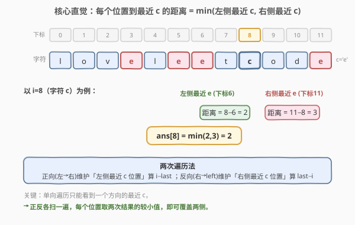
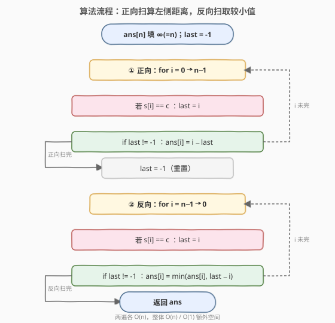
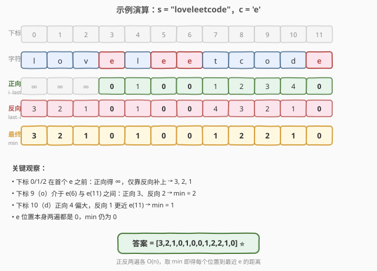

# 字符的最短距离

- **题目名称**：字符的最短距离
- **链接**：[821. 字符的最短距离](https://leetcode.cn/problems/shortest-distance-to-a-character/)
- **难度**：简单
- **标签**：数组、两次遍历

## 1. 题目概述

给定一个字符串 `s` 和一个字符 `c`，且 `c` 在 `s` 中**至少出现一次**。要求返回一个长度与 `s` 相同的整数数组 `answer`，其中 `answer[i]` 表示下标 `i` 到 `s` 中**任意一个** `c` 的**最短距离**。两个下标 `i`、`j` 之间的距离定义为 `abs(i - j)`。

**示例 1**：

```text
输入：s = "loveleetcode", c = "e"
输出：[3,2,1,0,1,0,0,1,2,2,1,0]
解释：'e' 出现在下标 3、5、6、11。
     下标 0 到最近的 'e'(下标3) 距离为 3；
     下标 8 到最近的 'e'(下标6) 距离为 2（右侧 'e' 在下标11，距离 3，取较小）。
```

**示例 2**：

```text
输入：s = "aaab", c = "b"
输出：[3,2,1,0]
解释：'b' 仅出现在下标 3，各下标到它的距离依次为 3、2、1、0。
```

**约束条件**：

- `1 <= s.length <= 10^4`
- `s[i]` 和 `c` 都是小写英文字母
- 题目保证 `c` 在 `s` 中至少出现一次

> 💡 这是一道**两次遍历**的入门题：单向扫描只能看到「一侧」的最近 `c`，正反各扫一遍就能覆盖左右两侧，每个位置取两次结果的较小值即为答案。`O(n)` 时间、`O(1)` 额外空间（不计输出数组），是「最近邻下标」类问题的通用模板（对比 [739. 每日温度](../0701-0800/739_每日温度.md) 用单调栈求「下一个更大」）。

---

## 2. 解题思路

### 2.1 暴力思路：对每个下标枚举所有 c 的位置

最直观的做法是先收集 `c` 在 `s` 中的所有下标 `pos`，然后对每个下标 `i`，遍历 `pos` 取 `abs(i - p)` 的最小值：

```text
pos = [i for i in range(n) if s[i] == c]
ans = []
for i in range(n):
    ans.append(min(abs(i - p) for p in pos))
return ans
```

时间复杂度 `O(n * k)`，`k` 为 `c` 出现次数。最坏情况 `c` 只出现一次时 `k = 1`，每个下标都要和这一个位置算距离，整体 `O(n)`；但若 `c` 频繁出现（如 `s = "eeee..."`），`k` 可达 `O(n)`，整体退化到 `O(n^2)`，对 `n = 10^4` 约 `10^8` 次操作，偏慢。

> ⚠️ 暴力法的问题在于：对每个 `i` 都「重新扫描一遍所有 `c` 的位置」来求最小值，存在大量重复计算。实际上 `c` 的位置是有序的，每个 `i` 的最近 `c` 一定是其**左侧最近的 `c`** 或**右侧最近的 `c`** 之一——这正是两次遍历要利用的结构。

### 2.2 核心观察：两次遍历——左扫维护左侧最近 c，右扫维护右侧最近 c

**关键定义**：对每个下标 `i`，记：

- `left[i]`：`i` 及其**左侧**最近的 `c` 的下标（若左侧没有则记为「未见到」）
- `right[i]`：`i` 及其**右侧**最近的 `c` 的下标（若右侧没有则记为「未见到」）

**核心观察**：`answer[i] = min(i - left[i], right[i] - i)`。而 `left`、`right` 都能在**一次单向扫描**中得到——

- **正向扫描**（`i` 从 `0` 到 `n-1`）：用一个变量 `last` 记录「最近见到的 `c` 的下标」。每到一个 `i`，若 `s[i] == c` 就更新 `last = i`；此时 `i - last` 即为「到左侧最近 `c` 的距离」（`last` 未见到时记为 `∞`）。
- **反向扫描**（`i` 从 `n-1` 到 `0`）：同样维护 `last`，但这次 `last` 是「右侧最近 `c` 的下标」，`last - i` 即为「到右侧最近 `c` 的距离」。

两次结果取较小值即可，**无需真的存 `left`、`right` 两个数组**——正向结果直接写进 `ans`，反向结果与 `ans[i]` 取 `min` 原地更新。



**为什么单向不够、必须两次？** 因为单向扫描时 `last` 只能反映「已经走过的方向」上最近的 `c`。比如正向扫描到下标 `8` 时，`last = 6`（左侧的 `e`），但它看不到右侧下标 `11` 还有一个更近或更远的 `e`——需要反向扫描来补全。下标 `0/1/2` 这种「在首个 `c` 之前」的位置更明显：正向扫完全是 `∞`，全靠反向扫补上真实距离。

> 💡 **初始化技巧**：`ans` 初始化为 `n`（一个比任何真实距离都大的数，因为最大距离 `≤ n-1`），充当「`∞`」语义。正向扫描时若 `last` 还未见到（`-1`）就跳过不写，保留 `n`；反向扫描时若 `last` 未见到也跳过。这样 `min` 操作天然把 `n` 替换成真实距离，无需特判。

### 2.3 算法流程图



**完整步骤**：

1. **初始化**：`ans` 长度 `n`，全部填 `n`（充当 `∞`）；`last = -1`（表示「尚未见到 `c`」）。
2. **正向扫描** `i = 0 → n-1`：
   - 若 `s[i] == c`：`last = i`。
   - 若 `last != -1`：`ans[i] = i - last`（到左侧最近 `c` 的距离）。
3. **重置** `last = -1`。
4. **反向扫描** `i = n-1 → 0`：
   - 若 `s[i] == c`：`last = i`。
   - 若 `last != -1`：`ans[i] = min(ans[i], last - i)`（到右侧最近 `c` 的距离，取较小）。
5. **返回** `ans`。

> ⚠️ **两个易错点**：(1) 反向扫描前**必须重置** `last = -1`，否则会沿用正向扫描的残留值导致右侧距离算错；(2) 判断 `last != -1` 不能省——首个 `c` 之前（正向）或末个 `c` 之后（反向）的位置，`last` 还是 `-1`，此时不应写入负数距离。

### 2.4 示例演算

以示例 1 `s = "loveleetcode"`、`c = 'e'` 为例，`'e'` 出现在下标 `3、5、6、11`。下表分三行展示正向结果、反向结果与最终 `min`（`∞` 表示该方向尚未见到 `c`，保留初始值 `n`）：



| 下标 | 0 | 1 | 2 | 3 | 4 | 5 | 6 | 7 | 8 | 9 | 10 | 11 |
|------|---|---|---|---|---|---|---|---|---|---|----|----|
| 字符 | l | o | v | **e** | l | **e** | **e** | t | c | o | d | **e** |
| 正向 `i-last` | ∞ | ∞ | ∞ | 0 | 1 | 0 | 0 | 1 | 2 | 3 | 4 | 0 |
| 反向 `last-i` | 3 | 2 | 1 | 0 | 1 | 0 | 0 | 4 | 3 | 2 | 1 | 0 |
| **最终 min** | **3** | **2** | **1** | **0** | **1** | **0** | **0** | **1** | **2** | **2** | **1** | **0** |

逐行解读：

- **下标 0/1/2**（`l/o/v`，在首个 `e` 之前）：正向扫描时 `last` 还是 `-1`，得 `∞`；反向扫描从右往左，先在下标 `11` 遇到 `e`，一路向左传递，分别得 `3/2/1`。`min(∞, 3) = 3` 等。
- **下标 9**（`o`，夹在 `e(6)` 与 `e(11)` 之间）：正向得 `3`（距左侧 `e(6)`），反向得 `2`（距右侧 `e(11)`），`min = 2`——这正是「两侧取近」的体现。
- **下标 10**（`d`）：正向得 `4`（距 `e(6)` 较远），反向得 `1`（距 `e(11)` 更近），`min = 1`。若只做正向扫描会错误地填 `4`。
- **`e` 位置本身**（3/5/6/11）：两遍都是 `0`，`min` 仍为 `0`。

最终答案 `[3,2,1,0,1,0,0,1,2,2,1,0]`，与示例一致。

> 💡 **对比示例 2** `s = "aaab"`、`c = 'b'`：`'b'` 仅在下标 `3`。正向扫到下标 `3` 才见到 `b`，故 `0/1/2` 正向均为 `∞`；反向从右往左，下标 `3` 见到 `b` 后向左传递 `1/2/3`。最终 `[3,2,1,0]`。可见 `c` 只出现一次时，答案完全由反向扫描决定——这也说明「两次扫描」对极端情形是必需的。

---

## 3. 参考代码

### C++

```cpp
class Solution {
public:
    vector<int> shortestToChar(string s, char c) {
        int n = s.size();
        vector<int> ans(n, n);          // 初始化为 n，充当 ∞
        int last = -1;                  // 尚未见到 c
        for (int i = 0; i < n; ++i) {   // 正向：维护左侧最近 c
            if (s[i] == c) last = i;
            if (last != -1) ans[i] = i - last;
        }
        last = -1;                      // 重置
        for (int i = n - 1; i >= 0; --i) { // 反向：维护右侧最近 c
            if (s[i] == c) last = i;
            if (last != -1) ans[i] = min(ans[i], last - i);
        }
        return ans;
    }
};
```

### Python

```python
class Solution:
    def shortestToChar(self, s: str, c: str) -> List[int]:
        n = len(s)
        ans = [n] * n                   # 初始化为 n，充当 ∞
        last = -1                       # 尚未见到 c
        for i in range(n):              # 正向：维护左侧最近 c
            if s[i] == c:
                last = i
            if last != -1:
                ans[i] = i - last
        last = -1                       # 重置
        for i in range(n - 1, -1, -1):  # 反向：维护右侧最近 c
            if s[i] == c:
                last = i
            if last != -1:
                ans[i] = min(ans[i], last - i)
        return ans
```

> 💡 两版逻辑完全一致。`ans` 初始化为 `n`（比最大真实距离 `n-1` 大，充当 `∞`），`last = -1` 表示「尚未见到 `c`」。正向扫描写入「到左侧最近 `c` 的距离」，反向扫描用 `min` 原地更新「到右侧最近 `c` 的距离」。`last != -1` 的守卫保证首个 `c` 之前（正向）/ 末个 `c` 之后（反向）的位置不被错误写入。

---

## 4. 复杂度分析

| 维度 | 复杂度 | 说明 |
|------|--------|------|
| **时间复杂度** | `O(n)` | 正向、反向各扫一遍，每位置 `O(1)` 判定与更新 |
| **空间复杂度** | `O(1)` | 只用 `last`、`i` 等常数变量；`ans` 是输出数组，不计入额外空间 |

> ⚠️ 本题已是该模型的最优复杂度——必须至少看每个位置一遍才能确定其最近 `c`。两次遍历相比暴力的 `O(n*k)` 把「对每个 `i` 重新枚举所有 `c`」优化为「一次扫描传递最近 `c` 位置」，关键在于利用了 `c` 出现位置的有序性：相邻 `c` 之间的位置，其左侧最近 `c` 在正向扫描时已确定，无需重复查找。

---

## 5. 扩展：与单调栈「下一个更大元素」的对照

本题的「两次遍历求最近邻下标」与单调栈类问题（如 [739. 每日温度](../0701-0800/739_每日温度.md) 求「下一个更大元素的距离」）形异神似——都是在为每个位置找「满足某条件的最近邻居」。区别在于：

- **821**：找的是「最近的出现 `c` 的下标」，条件是**等值匹配**（`s[i] == c`），与值的大小无关。由于 `c` 的位置天然有序，一次扫描维护 `last` 即可，**无需栈**。
- **739**：找的是「下一个更大的元素」，条件是**大小比较**（`s[j] > s[i]`）。此时「左侧已扫过的元素」未必能确定右侧的答案——一个较小的元素可能被更后面更大的元素「挡住」——所以需要单调栈来暂存「尚未找到答案」的元素，遇到更大值时弹栈结算。

换句话说：**等值匹配的最近邻用两次遍历，大小比较的最近邻用单调栈**。若把 821 改成「到下一个比 `s[i]` 大的元素的距离」，就退化成 739 的单调栈题。理解这一对照，能帮助你在面试中快速判断「最近邻」类问题该选哪种工具。

> 💡 还有一类「两侧最小/最大」的题（如 [2016. 增量元素之间的最大差值](https://leetcode.cn/problems/maximum-difference-between-increasing-elements/)）也用两次遍历维护「前缀最小值」——思想与 821 完全同源，只是把「最近 `c` 下标」换成「前缀最小值」。

---

## 6. 面试要点

1. **为什么需要两次扫描，一次不行吗？**

   - 单向扫描时 `last` 只反映「已走过方向」上最近的 `c`。比如正向扫到下标 `8` 只知道左侧 `e(6)`，看不到右侧 `e(11)`；下标 `0/1/2` 在首个 `e` 之前，正向完全得 `∞`。必须反向再扫一遍补全另一侧，取 `min` 才能得到两侧的最近距离。

2. **`ans` 为什么初始化为 `n` 而不是 `0` 或 `-1`？**

   - `n` 比任何真实距离（最大 `n-1`）都大，充当「`∞`」语义。这样反向扫描的 `min(ans[i], last - i)` 会自动用真实距离替换掉 `n`，无需特判。若初始化为 `0` 或 `-1`，`min` 会取到错误的小值。

3. **反向扫描前为什么要重置 `last = -1`？**

   - 正向扫描结束后 `last` 停在最后一个 `c` 的下标（一个非负数）。若不重置，反向扫描一开始 `last` 就是个错误值，`last - i` 会算出错误的「右侧距离」。重置为 `-1` 表示「反向方向尚未见到 `c`」，配合 `last != -1` 守卫保证只在真正见到 `c` 后才写入。

4. **`last != -1` 的守卫能省掉吗？**

   - 不能。在首个 `c` 之前（正向）或末个 `c` 之后（反向），`last` 还是 `-1`。若省掉守卫直接写 `ans[i] = i - last`，会得到 `i - (-1) = i + 1` 这种无意义的正值，污染结果。守卫确保这些位置保留 `∞`（即 `n`），由另一侧扫描来填补。

5. **能不能用 BFS 或二分优化？**

   - BFS（多源最短路）也能做：把所有 `c` 的下标入队，距离初始化 `0`，向外扩散——本质是把 `c` 当源点求最短路，`O(n)` 但常数和空间都更大。二分则不适用：`c` 的位置虽有序，但每个 `i` 的最近 `c` 不一定是二分能直接定位的（左右各一个候选，取近即可，但两次遍历比二分更简单且同为 `O(n)`）。两次遍历是本题最简洁的最优解。

> 💡 **一句话总结**：821 是两次遍历求「最近邻下标」的入门题——正向维护左侧最近 `c`、反向维护右侧最近 `c`，每个位置取 `min`。`O(n)` / `O(1)`，关键在初始化 `∞`、重置 `last`、守卫 `last != -1` 三个细节。

---

## 7. 同类练习题

- [739. 每日温度](https://leetcode.cn/problems/daily-temperatures/)（[题解](../0701-0800/739_每日温度.md)）：同为「每个位置找最近邻居」，但条件是大小比较，需用单调栈而非两次遍历——与 821 形成「等值匹配 vs 大小比较」的对照
- [2016. 增量元素之间的最大差值](https://leetcode.cn/problems/maximum-difference-between-increasing-elements/)：两次遍历维护前缀最小值，思想与 821 同源（把「最近 `c` 下标」换成「前缀最小值」）
- [503. 下一个更大元素 II](https://leetcode.cn/problems/next-greater-element-ii/)：循环数组上求「下一个更大」，单调栈 + 两倍长度技巧，739 的环形进阶
- [876. 链表的中间结点](https://leetcode.cn/problems/middle-of-the-linked-list/)（[题解](../0801-0900/876_链表的中间结点.md)）：快慢双指针一次遍历定位中点，对比 821 的「两次遍历定位最近邻」，体会「单次扫描 + 多状态变量」与「多次扫描各管一侧」的取舍
