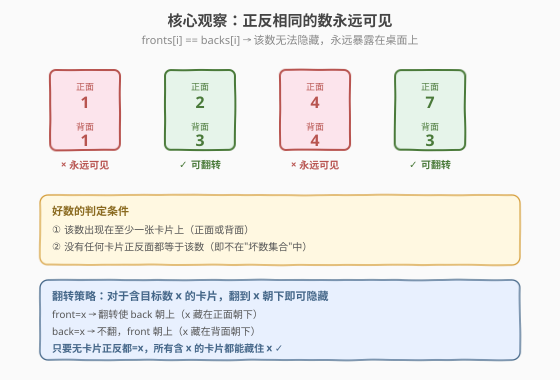
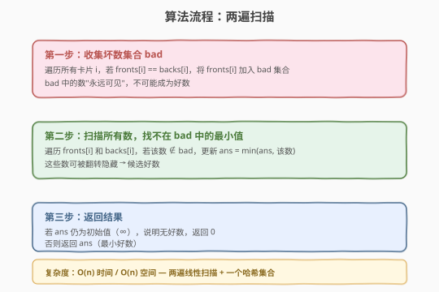
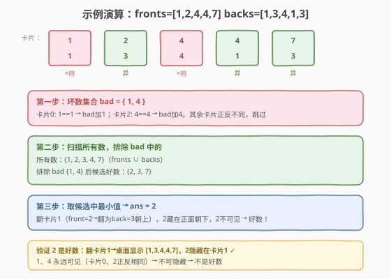

# 翻转卡片游戏

- **题目名称**：翻转卡片游戏
- **链接**：[822. 翻转卡片游戏](https://leetcode.cn/problems/card-flipping-game/)
- **难度**：中等
- **标签**：数组、哈希表

## 1. 题目概述

桌上有 `n` 张卡片，第 `i` 张**正面**写 `fronts[i]`、**背面**写 `backs[i]`（均为正数，正反可能相同也可能不同）。初始每张卡片正面朝上（`fronts[i]` 可见，`backs[i]` 隐藏）。

你可以翻转任意数量的卡片（可能不翻）。翻转后卡片显示另一面的数字。

翻转后，若数字 `x` 满足：

- `x` 出现在**至少一张卡片的朝下面**（隐藏面）
- `x` 不出现在**任何卡片的朝上面**（可见面）

则 `x` 是**好数**。返回最小好数；若无好数返回 `0`。

**示例 1**：

```text
输入：fronts = [1,2,4,4,7], backs = [1,3,4,1,3]
输出：2
解释：翻转卡片 1（front=2, back=3），桌面显示 [1,3,4,4,7]。
      2 藏在卡片 1 的朝下面，且不出现在任何朝上面 → 好数。
      1 和 4 因卡片 0、2 正反同值，永远可见 → 不是好数。
```

**示例 2**：

```text
输入：fronts = [1], backs = [1]
输出：0
解释：唯一卡片正反都是 1，1 永远可见，无好数。
```

**示例 3**：

```text
输入：fronts = [1,1], backs = [2,2]
输出：1
解释：翻转两张卡片，桌面显示 [2,2]，1 全部藏在朝下面 → 好数。
```

**约束条件**：

- `n == fronts.length == backs.length`
- `1 <= n <= 1000`
- `1 <= fronts[i], backs[i] <= 2000`

> 💡 关键约束：数值范围仅到 `2000`，即使暴力枚举所有数值也只需 `O(2000·n)`。但更优的做法只需 `O(n)` 一遍扫描——核心在于识别哪些数**永远不可能**成为好数。

---

## 2. 解题思路

### 2.1 暴力思路：枚举每个数 + 枚举翻转方案

对每个候选数 `x`（所有 `fronts[i]` 和 `backs[i]` 的并集），检查是否存在一种翻转方案使 `x` 成为好数。对每张卡片有翻/不翻两种选择，共 $2^n$ 种方案，逐一验证。`n=1000` 时必爆。

> ⚠️ 暴力法的根本问题在于**没有抓住决定性好坏的唯一因素**——其实不需要枚举翻转方案，只需判断一个条件就能确定 `x` 是否可行为好数。

### 2.2 核心观察：正反同值的数永远可见



**关键定义**：一张卡片若 `fronts[i] == backs[i] == x`，则无论翻不翻，`x` 始终在朝上面（可见面）——翻过来是 `backs[i] = x`，不翻是 `fronts[i] = x`，两面都是 `x`，无处可藏。

**核心推论**：

| 情形 | 结论 | 原因 |
|------|------|------|
| `fronts[i] == backs[i] == x` | `x` **永远可见** → **坏数** | 该卡片无论如何翻转，朝上面都是 `x`，无法隐藏 |
| `fronts[i] != backs[i]`（含 `x`） | `x` **可隐藏** → **候选好数** | 翻到 `x` 朝下即可：若 `front=x` 则翻转，若 `back=x` 则不翻 |

**充分性证明**：若 `x` 不被任何卡片"正反同值"困住，则对每张含 `x` 的卡片，总能把 `x` 翻到朝下面（因为另一面一定 `≠ x`）。翻完后 `x` 藏在所有含它的卡片上（至少一张），且不出现在任何朝上面 → `x` 是好数。

> 💡 **一句话总结**：`x` 是好数 ⟺ `x` 出现在至少一张卡片上 **且** 没有任何卡片 `fronts[i] == backs[i] == x`。不需要枚举翻转方案——只需收集"坏数集合"，再排除即可。

### 2.3 算法流程图



**完整步骤**：

1. **第一遍扫描**：遍历所有卡片，若 `fronts[i] == backs[i]`，将 `fronts[i]` 加入哈希集合 `bad`（坏数集合）。
2. **第二遍扫描**：遍历所有 `fronts[i]` 和 `backs[i]`，若该数 `∉ bad`，更新 `ans = min(ans, 该数)`。
3. **返回**：若 `ans` 仍为初始值（`∞`），说明无好数，返回 `0`；否则返回 `ans`。

> ⚠️ **为什么两遍而非一遍？** 第一遍需要完整扫描才能确定 `bad` 集合——后面的卡片可能让前面的某个数变成"坏数"。例如 `fronts=[2,...]`，`backs=[3,...]`，若后续某张卡片 `front=back=2`，则 `2` 变坏。所以必须先完整收集 `bad`，再据此筛选。

### 2.4 示例演算

以 `fronts = [1,2,4,4,7]`, `backs = [1,3,4,1,3]` 为例：



**第一遍——收集坏数**：

| 卡片 | fronts[i] | backs[i] | 正反同值？ | 加入 bad |
|------|-----------|----------|-----------|----------|
| 0 | 1 | 1 | ✓ | 1 |
| 1 | 2 | 3 | ✗ | — |
| 2 | 4 | 4 | ✓ | 4 |
| 3 | 4 | 1 | ✗ | — |
| 4 | 7 | 3 | ✗ | — |

→ `bad = {1, 4}`

**第二遍——筛选候选**：

| 数值 | 来源 | ∈ bad？ | 候选？ |
|------|------|---------|--------|
| 1 | 卡片0正/反, 卡片3反 | ✓ | ✗ |
| 2 | 卡片1正 | ✗ | ✓ |
| 3 | 卡片1反, 卡片4反 | ✗ | ✓ |
| 4 | 卡片2正/反, 卡片3正 | ✓ | ✗ |
| 7 | 卡片4正 | ✗ | ✓ |

→ 候选好数 `{2, 3, 7}`，最小值 `ans = 2`。

**验证**：翻转卡片 1（`front=2 → back=3` 朝上），桌面显示 `[1,3,4,4,7]`。`2` 藏在卡片 1 朝下面，不出现在任何朝上面 → `2` 是好数 ✓

---

## 3. 参考代码

### C++

```cpp
class Solution {
  public:
    int flipgame(vector<int>& fronts, vector<int>& backs) {
        unordered_set<int> bad;
        int n = fronts.size();
        for (int i = 0; i < n; i++) {
            if (fronts[i] == backs[i]) {
                bad.insert(fronts[i]);
            }
        }
        int ans = INT_MAX;
        for (int i = 0; i < n; i++) {
            if (!bad.count(fronts[i])) ans = min(ans, fronts[i]);
            if (!bad.count(backs[i]))  ans = min(ans, backs[i]);
        }
        return ans == INT_MAX ? 0 : ans;
    }
};
```

### Python

```python
class Solution:
    def flipgame(self, fronts: List[int], backs: List[int]) -> int:
        bad = {f for f, b in zip(fronts, backs) if f == b}
        ans = float('inf')
        for x in fronts + backs:
            if x not in bad:
                ans = min(ans, x)
        return 0 if ans == float('inf') else ans
```

> 💡 Python 版用集合推导式一行收集 `bad`，再用 `fronts + backs` 拼接遍历所有数。两版逻辑完全一致：**第一遍收集坏数，第二遍找不在坏数中的最小值**。`INT_MAX / float('inf')` 作为哨兵值，若未被更新则返回 `0`。

---

## 4. 复杂度分析

| 维度 | 复杂度 | 说明 |
|------|--------|------|
| **时间复杂度** | $O(n)$ | 两遍线性扫描，每张卡片 $O(1)$ 哈希集合操作 |
| **空间复杂度** | $O(n)$ | `bad` 哈希集合最坏存 $n$ 个元素（每张卡片正反同值且互不相同） |

$n \le 1000$，两次扫描约 $2000$ 次操作，轻松通过。

> ⚠️ 虽然数值范围 $\le 2000$，可以用布尔数组代替哈希集合（空间 $O(2000)$ = $O(1)$），但 $n \le 1000$ 时哈希集合已足够快，且代码更通用。若数值范围很大（如 $10^9$），哈希集合是唯一选择。

---

## 5. 扩展：数值范围极大时的优化

若 `fronts[i]` 和 `backs[i]` 的范围扩展到 $10^9$，哈希集合仍然适用（$O(n)$ 空间）。但若进一步要求 $O(1)$ 空间，可改为：

1. 排序所有 `(fronts[i], backs[i])` 对，按值分组的同值卡片。
2. 对每个候选值 `x`，检查是否存在某张卡片 `fronts[i] == backs[i] == x`。

排序 $O(n \log n)$，空间 $O(1)$（原地排序），但代码复杂度显著增加，实际面试中哈希集合方案已是标准答案。

---

## 6. 面试要点

1. **为什么正反同值的数永远不可能是好数？**

   - 若 `fronts[i] == backs[i] == x`，该卡片无论翻不翻，朝上面都是 `x`（翻则 `backs[i]=x` 朝上，不翻则 `fronts[i]=x` 朝上）。`x` 始终可见，无法满足"不出现在任何朝上面"的条件 → 永远不是好数。

2. **为什么正反不同的数一定是好数（如果它出现在某张卡片上）？**

   - 若没有卡片困住 `x`（即无 `fronts[i]==backs[i]==x`），则每张含 `x` 的卡片另一面都 `≠ x`。把含 `x` 的卡片翻到 `x` 朝下：若 `front=x` 则翻转（`back≠x` 朝上），若 `back=x` 则不翻（`front≠x` 朝上）。翻完后 `x` 全部藏在朝下面，且至少藏在一张卡上 → 好数。

3. **为什么不需要枚举翻转方案？**

   - 好数的判定只取决于一个条件：`x` 是否被某张"正反同值"卡片困住。这是卡片的**固有属性**，与翻转无关。所以只需收集坏数集合、排除即可，无需搜索 $2^n$ 种翻转组合。

4. **为什么要两遍扫描而不是一遍？**

   - `bad` 集合需要完整扫描所有卡片才能确定——后面的卡片可能让前面的某个数变坏。一遍扫描时无法预知后面的卡片是否会让当前候选数变成坏数，所以必须先完整收集 `bad`，再据此筛选。

5. **返回 0 而非 -1 的原因？**

   - 题目约定数值均为正数（`≥ 1`），`0` 不会出现在任何卡片上，用 `0` 表示"无好数"天然不会与任何合法好数冲突。这是算法题中常见的哨兵值约定。

> 💡 **一句话总结**：822 的核心是**识别"永远不可隐藏"的坏数**（正反同值），再用集合排除找最小候选。$O(n)$ 两遍扫描 + 哈希集合，无需枚举翻转方案——问题的本质是属性判定而非搜索。

---

## 7. 同类练习题

- [448. 找到所有数组中消失的数字](https://leetcode.cn/problems/find-all-numbers-disappeared-in-an-array/)（[题解](../0401-0500/448_找到所有数组中消失的数字.md)）：集合差集思想——找不在某集合中的元素，与本题"排除坏数找候选"结构平行
- [217. 存在重复元素](https://leetcode.cn/problems/contains-duplicate/)（[题解](../0201-0300/217_存在重复元素.md)）：哈希集合检测重复——本题用集合检测 `fronts[i]==backs[i]` 的同值卡片
- [349. 两个数组的交集](https://leetcode.cn/problems/intersection-of-two-arrays/)（[题解](../0301-0400/349_两个数组的交集.md)）：哈希集合运算——交集/差集对照，体会集合操作在数组题中的通用性
- [414. 第三大的数](https://leetcode.cn/problems/third-maximum-number/)（[题解](../0401-0500/414_第三大的数.md)）：维护候选最值——本题维护"不在坏数中的最小值"，对照"第三大的数"的候选维护思路
