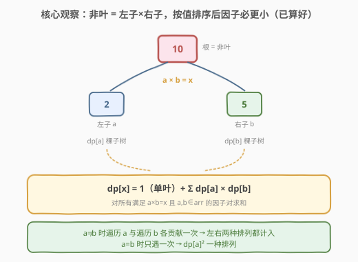
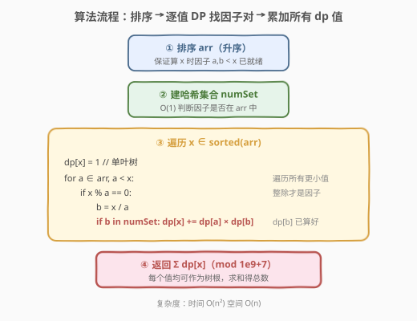
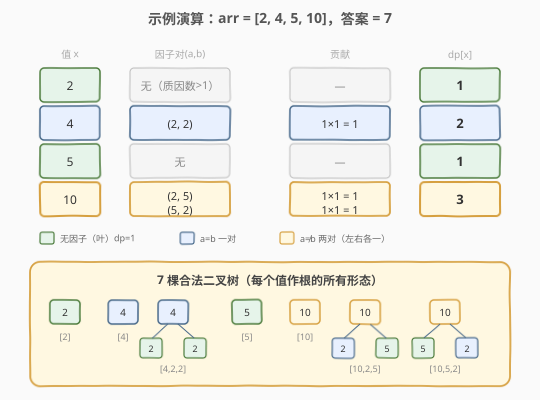

# 带因子的二叉树

- **题目名称**：带因子的二叉树
- **链接**：[823. 带因子的二叉树](https://leetcode.cn/problems/binary-trees-with-factors/)
- **难度**：中等
- **标签**：数组、动态规划、哈希表、排序

## 1. 题目概述

给出一个含有不重复整数元素的数组 `arr`，每个整数 `arr[i]` 均大于 1。用这些整数来构建二叉树，每个整数可以使用任意次数。其中：**每个非叶结点的值应等于它的两个子结点的值的乘积**。满足条件的二叉树一共有多少个？答案对 $10^9 + 7$ 取余。

**示例 1**：

```text
输入：arr = [2, 4]
输出：3
解释：可以得到这些二叉树: [2], [4], [4, 2, 2]
```

**示例 2**：

```text
输入：arr = [2, 4, 5, 10]
输出：7
解释：可以得到这些二叉树: [2], [4], [5], [10], [4, 2, 2], [10, 2, 5], [10, 5, 2]
```

**约束条件**：

- `1 <= arr.length <= 1000`
- `2 <= arr[i] <= 10^9`
- `arr` 中的所有值**互不相同**

> 💡 关键约束：元素互不相同 → 哈希表 O(1) 查因子；`arr[i] >= 2` → 因子 `a, b` 严格小于 `x`（`a × b = x` 且 `a, b >= 2`），排序后天然满足「算 `x` 时因子已就绪」。

---

## 2. 解题思路

### 2.1 暴力思路

枚举所有可能的二叉树结构——根选谁、左右子树选谁、递归到底。树深度无界、分支因子不定，组合爆炸，完全不可行。

但注意到：**以某个值 `x` 为根的合法树数，只取决于它的因子对 `(a, b)` 各自为根的合法树数**——这是标准的重叠子问题结构，天然适合 DP。

### 2.2 核心观察：按值 DP，枚举因子对



**状态定义**：

> `dp[x]` = 以值 `x` 为根的合法二叉树数量。

**转移**——对 `x` 的每个因子对 `(a, b)`（满足 $a \times b = x$，且 $a, b \in \text{arr}$），左子选 `a`、右子选 `b` 的方案数为 $dp[a] \times dp[b]$：

$$
\text{dp}[x] = 1 + \sum_{\substack{a \times b = x \\ a, b \in \text{arr}}} \text{dp}[a] \times \text{dp}[b]
$$

其中 `1` 代表 `x` 作为单叶树（无子节点）。

> 💡 **左右有序**：二叉树的左子树与右子树是不同的位置。当 $a \neq b$ 时，遍历到 `a` 会得到 `(a, b)` 排列（左 `a` 右 `b`），遍历到 `b` 会得到 `(b, a)` 排列（左 `b` 右 `a`），两种各贡献 $dp[a] \times dp[b]$，**天然都计入**。当 $a = b$（即 $a = \sqrt{x}$）时只遍历到一次，贡献 $dp[a]^2$，也只有一种排列。因此「遍历所有更小的 `a`」无需额外处理去重。

**为何排序是前提**：因 $a, b \ge 2$ 且 $a \times b = x$，故 $a, b < x$。将 `arr` 升序排序后，按序处理 `x` 时所有可能的因子 `a, b` 都已算好 `dp` 值，可直接查表。

### 2.3 算法流程图



1. 将 `arr` 升序排序；
2. 建哈希集合 `numSet`，O(1) 判断某值是否在 `arr` 中；
3. 遍历 `x ∈ sorted(arr)`：`dp[x] = 1`（单叶），再遍历所有 `a < x`，若 `x % a == 0` 且 `b = x / a ∈ numSet`，则 `dp[x] += dp[a] × dp[b]`；
4. 返回所有 `dp[x]` 之和（取模）。

> ⚠️ **取模**：每步加法后立即 `% MOD`，避免溢出。最终求和也要取模。

### 2.4 示例演算

以 `arr = [2, 4, 5, 10]` 为例：



| 值 `x` | 因子对 `(a, b)` | 贡献 | `dp[x]` |
|--------|-----------------|------|---------|
| 2 | 无 | — | 1 |
| 4 | (2, 2) | $1 \times 1 = 1$ | 2 |
| 5 | 无 | — | 1 |
| 10 | (2, 5), (5, 2) | $1 \times 1 + 1 \times 1 = 2$ | 3 |

- `dp[4] = 1 + dp[2]×dp[2] = 1 + 1 = 2`：叶树 `[4]` + 因子树 `[4, 2, 2]`
- `dp[10] = 1 + dp[2]×dp[5] + dp[5]×dp[2] = 1 + 1 + 1 = 3`：叶树 `[10]` + `[10, 2, 5]` + `[10, 5, 2]`

答案 $= dp[2] + dp[4] + dp[5] + dp[10] = 1 + 2 + 1 + 3 = 7$ ✓

---

## 3. 参考代码

### C++

```cpp
class Solution {
  public:
    int numFactoredBinaryTrees(vector<int>& arr) {
        const long long MOD = 1e9 + 7;
        sort(arr.begin(), arr.end());
        unordered_map<int, long long> dp;
        unordered_set<int> numSet(arr.begin(), arr.end());

        long long ans = 0;
        for (int x : arr) {
            dp[x] = 1;                          // 单叶树
            for (int a : arr) {
                if (a >= x) break;              // 因子必小于 x
                if (x % a == 0) {
                    int b = x / a;
                    if (numSet.count(b)) {
                        dp[x] = (dp[x] + dp[a] * dp[b]) % MOD;
                    }
                }
            }
            ans = (ans + dp[x]) % MOD;
        }
        return ans;
    }
};
```

### Python

```python
class Solution:
    def numFactoredBinaryTrees(self, arr: List[int]) -> int:
        MOD = 10**9 + 7
        arr.sort()
        num_set = set(arr)
        dp = {}

        ans = 0
        for x in arr:
            dp[x] = 1                          # 单叶树
            for a in arr:
                if a >= x:
                    break                      # 因子必小于 x
                if x % a == 0:
                    b = x // a
                    if b in num_set:
                        dp[x] = (dp[x] + dp[a] * dp[b]) % MOD
            ans = (ans + dp[x]) % MOD
        return ans
```

> 💡 **`a >= x` 时 break 而非 continue**：`arr` 已排序，`a` 单调递增，一旦 `a >= x` 后续所有 `a` 都不可能是因子（因子必 `>= 2` 故 `< x`），直接跳出内层循环，省去无效迭代。

---

## 4. 复杂度分析

| 维度 | 复杂度 | 说明 |
|------|--------|------|
| 时间复杂度 | $O(n^2)$ | 排序 $O(n \log n)$；外层遍历 $n$ 个值，内层遍历至多 $n$ 个更小值，每次 $O(1)$ 取模与哈希查表 |
| 空间复杂度 | $O(n)$ | `dp` 哈希表与 `numSet` 各存 $n$ 个条目 |

$n \le 1000$，最坏约 $10^6$ 次内层迭代，轻松通过。

---

## 5. 扩展：因子枚举的优化

内层循环遍历整个 `arr` 找 `a`，最坏 $O(n^2)$。若 $n$ 很大但值域有限，可改为**枚举 $\le \sqrt{x}$ 的因子**：对每个 `a ∈ arr` 且 `a × a <= x`，检查 `x % a == 0` 且 `b = x / a ∈ numSet`。此时：

- 若 $a = b$：贡献 $dp[a]^2$（一对）；
- 若 $a \neq b$：贡献 $2 \times dp[a] \times dp[b]$（左右两种排列）。

只遍历到 $\sqrt{x}$，内层迭代减半，但需手动乘 2 区分 $a = b$ 与 $a \neq b$。本题 $n \le 1000$，朴素 $O(n^2)$ 已足够，无需此优化。

---

## 6. 面试要点

1. **为什么排序后就能保证 DP 的正确顺序？**
   - 因 $a, b \ge 2$ 且 $a \times b = x$，故 $a < x$ 且 $b < x$。升序排序后处理 `x` 时，所有比它小的因子 `a, b` 都已算好 `dp` 值，转移无后效性。

2. **`a ≠ b` 时左右两种排列是如何被自然计入的？**
   - 内层遍历所有 `a < x`，当 `a` 遍历到较小因子时计入 `(a, b)`（左 `a` 右 `b`），当 `a` 遍历到较大因子 `b` 时计入 `(b, a)`（左 `b` 右 `a`）。两次各贡献 $dp[a] \times dp[b]$，无需手动乘 2。`a = b` 时只遍历到一次，也只贡献一次。

3. **为什么用哈希集合而不是数组存 `dp`？**
   - `arr[i]` 可达 $10^9$，无法用数组下标直接索引。哈希表 `dp[x]` 以值为键，$O(1)$ 存取。`numSet` 同理，$O(1)$ 判断因子是否在 `arr` 中。

4. **取模有哪些注意事项？**
   - `dp[a] * dp[b]` 在 C++ 中可能溢出 `int`，需用 `long long` 存 `dp` 值并在每次加法后取模。最终求和也要取模。Python 无溢出问题但仍需取模控制返回值范围。

5. **单叶树为什么算一棵合法树？**
   - 题目条件只约束「非叶结点」等于子结点乘积。单叶树没有非叶结点，条件空真成立（vacuously true），故每个值至少贡献 1 棵树，即 `dp[x]` 的初始值。

---

## 7. 同类练习题

- [96. 不同的二叉搜索树](https://leetcode.cn/problems/unique-binary-search-trees/)（[题解](../0001-0100/96_不同的二叉搜索树.md)）：同为「以 i 为根的树数 = 左子树数 × 右子树数」的 DP 结构，对比「按节点数递推」与「按值递推找因子」的状态设计差异
- [343. 整数拆分](https://leetcode.cn/problems/integer-break/)（[题解](../0301-0400/343_整数拆分.md)）：整数拆分求最大积，同样枚举因子/拆分点，对比「求最值」与「求计数」的目标函数差异
- [264. 丑数 II](https://leetcode.cn/problems/ugly-number-ii/)：多路归并生成丑数序列，对比「按因子生成序列」的归并思路与本题「按因子累加计数」的 DP 思路
- [377. 组合总和 IV](https://leetcode.cn/problems/combination-sum-iv/)（[题解](../0301-0400/377_组合总和IV.md)）：完全背包求排列数，对比「枚举末位元素」与「枚举因子对」的转移维度差异
