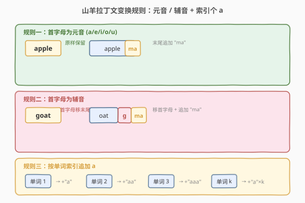
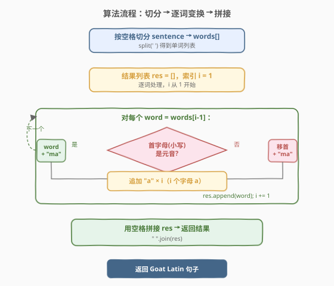
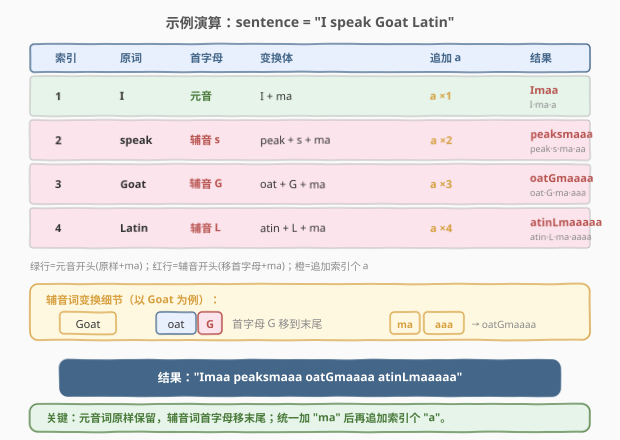

# LeetCode 山羊拉丁文 题解

## 1. 题目概述

- **标题 / 题号**：山羊拉丁文（#824，easy）
- **链接**：https://leetcode.cn/problems/goat-latin/
- **难度**：简单
- **标签**：字符串

**题意**：给定一个由若干单词组成的句子 `sentence`，单词间由**单个空格**分隔，每个单词仅由大写和小写英文字母组成。请将其转换为「山羊拉丁文（Goat Latin）」，规则如下：

1. **元音开头**：若单词首字母为元音（`a`/`e`/`i`/`o`/`u`，大小写不敏感），在单词末尾添加 `"ma"`。例如 `"apple"` → `"applema"`。
2. **辅音开头**：若单词首字母为辅音（非元音），移除第一个字母并放到末尾，再添加 `"ma"`。例如 `"goat"` → `"oatgma"`。
3. **索引追加 a**：根据单词在句子中的索引（从 `1` 开始），在末尾追加与索引相同数量的字母 `'a'`。第 1 个词追加 `"a"`，第 2 个追加 `"aa"`，依此类推。

**示例 1**：

```text
输入：sentence = "I speak Goat Latin"
输出："Imaa peaksmaaa oatGmaaaa atinLmaaaaa"
解释：
      I    → 元音开头 → "I" + "ma" + "a"     = "Imaa"
      speak → 辅音开头 → "peak" + "s" + "ma" + "aa" = "peaksmaaa"
      Goat → 辅音开头 → "oat" + "G" + "ma" + "aaa" = "oatGmaaaa"
      Latin → 辅音开头 → "atin" + "L" + "ma" + "aaaa" = "atinLmaaaaa"
```

**示例 2**：

```text
输入：sentence = "The quick brown fox jumped over the lazy dog"
输出："heTmaa uickqmaaa rownbmaaaa oxfmaaaaa umpedjmaaaaaa overmaaaaaaa hetmaaaaaaaa azylmaaaaaaaaa ogdmaaaaaaaaaa"
```

**约束**：

- `1 <= sentence.length <= 150`
- `sentence` 由英文字母和空格 `' '` 组成
- `sentence` 不含前导或尾随空格
- `sentence` 中的所有单词由单个空格分隔

> 💡 这是一道**字符串规则变换**的入门题。核心套路：按空格切分出单词、逐词套用三条变换规则、重新拼接。与 [819. 最常见的单词](819_最常见的单词.md) 同属「切分 + 逐词处理 + 拼接」家族，区别在于本题不做聚合统计，而是对每个词做确定性变换。

## 2. 解题思路

### 2.1 暴力思路：逐词按规则拼接

题目本身已经是「暴力」解法——规则清晰、无优化空间。唯一需要注意的是三条规则的**执行顺序**：先判断首字母（元音/辅音）决定词体变换，再统一加 `"ma"`，最后追加索引个 `'a'`。

朴素写法：`split` 切分句子 → 遍历每个单词 → 判断首字母 → 变换 → 追加 `'a'` → `join` 拼回。时间 $O(n)$、空间 $O(n)$（$n$ 为句子长度），没有更优解法，因为输出本身就需要 $O(n)$ 空间。

> ⚠️ 唯一容易踩的坑是**元音判断的大小写**：题目说大小写不敏感，即 `'A'` 和 `'a'` 都算元音。判断时要么把首字母 `tolower` 后再查集合，要么把大小写元音都放进集合。漏掉大写元音会导致 `"Apple"` 被误判为辅音词。

### 2.2 核心观察：三步变换 + 索引追加 a

变换可拆为两段：**词体变换**（规则一/二）与**后缀追加**（规则三）。



**词体变换的关键**：元音词保持原样，辅音词把首字母「搬到末尾」。两种情况最终都要加 `"ma"`，区别仅在词体本身是否需要搬字母。

| 首字母 | 词体变换 | 统一后缀 |
|--------|----------|----------|
| 元音 | `word`（原样） | `+ "ma"` |
| 辅音 | `word[1:] + word[0]`（首字母移末尾） | `+ "ma"` |

**后缀追加**：在 `"ma"` 之后，追加 `'a' × i`（$i$ 为单词索引，从 1 开始）。即第 $i$ 个词的完整后缀为 `"ma" + "a" * i`。

> 💡 **为什么辅音词要移首字母而非删除？** 因为山羊拉丁文是一种可逆变换——把末尾的首字母移回开头即可还原。移而非删，保留了原词信息。这与「猪拉丁文（Pig Latin）」的规则完全一致，山羊拉丁文只是多了索引个 `'a'` 的后缀。

### 2.3 算法流程图



**完整步骤**：

1. **切分**：按空格 `split` 得到单词列表 `words`。
2. **遍历**：对每个 `word`，索引 $i$ 从 1 开始：
   - 判断 `word[0]`（小写化后）是否为元音 `a/e/i/o/u`。
   - **是元音**：`w = word + "ma"`。
   - **是辅音**：`w = word[1:] + word[0] + "ma"`。
   - 追加后缀：`w += "a" * i`。
   - 将 `w` 加入结果列表。
3. **拼接**：用空格 `join` 结果列表，返回。

> ⚠️ **易错点**：① 元音集合要包含大小写共 10 个字母，或统一 `lower()` 后查小写集合；② 索引从 **1** 开始而非 0，第 1 个词追加 1 个 `'a'`；③ 题目保证单词由单个空格分隔、无前导/尾随空格，直接 `split(' ')` 或 `split()` 均可。

### 2.4 示例演算

以示例 1 `sentence = "I speak Goat Latin"` 为例，逐词追踪变换过程：



| 索引 | 原词 | 首字母 | 词体变换 | 追加 a | 结果 |
|------|------|--------|----------|--------|------|
| 1 | `I` | 元音 | `I` + `ma` | `a` ×1 | `Imaa` |
| 2 | `speak` | 辅音 `s` | `peak` + `s` + `ma` | `a` ×2 | `peaksmaaa` |
| 3 | `Goat` | 辅音 `G` | `oat` + `G` + `ma` | `a` ×3 | `oatGmaaaa` |
| 4 | `Latin` | 辅音 `L` | `atin` + `L` + `ma` | `a` ×4 | `atinLmaaaaa` |

最终用空格拼接：`"Imaa peaksmaaa oatGmaaaa atinLmaaaaa"`。

> 💡 注意 `I` 是大写元音，仍按元音规则处理（原样 + `ma`）；`Goat` 的首字母 `G` 是大写辅音，移到末尾时**保持原大写**（`oatG` 而非 `oatg`）——题目不要求改变字母大小写，只要求移动位置。

## 3. 参考代码

### C++

```cpp
class Solution {
  public:
    string toGoatLatin(string sentence) {
        unordered_set<char> vowels = {'a','e','i','o','u','A','E','I','O','U'};
        istringstream iss(sentence);
        string word, res;
        int i = 1;
        while (iss >> word) {
            if (vowels.count(word[0])) {
                word += "ma";
            } else {
                word = word.substr(1) + word[0] + "ma";
            }
            word += string(i, 'a');          // 追加 i 个 'a'
            if (i > 1) res += " ";
            res += word;
            i++;
        }
        return res;
    }
};
```

### Python

```python
class Solution:
    def toGoatLatin(self, sentence: str) -> str:
        vowels = set('aeiouAEIOU')
        words = sentence.split()
        res = []
        for i, word in enumerate(words, 1):
            if word[0] in vowels:
                w = word + "ma"
            else:
                w = word[1:] + word[0] + "ma"
            w += "a" * i                      # 追加 i 个 'a'
            res.append(w)
        return " ".join(res)
```

> 💡 两版思路一致。C++ 用 `istringstream` 自动按空格切分，避免手动处理空格；Python 用 `split()` + `enumerate(words, 1)` 让索引天然从 1 开始，`"a" * i` 一行生成索引个 `'a'`。元音集合两版都包含大小写共 10 个字母，无需额外 `lower`。

## 4. 复杂度分析

| 维度 | 复杂度 | 说明 |
|------|--------|------|
| **时间复杂度** | $O(n)$ | $n$ 为 `sentence` 长度；每个字符最多被处理一次（切分 + 变换 + 拼接），元音判断 $O(1)$ |
| **空间复杂度** | $O(n)$ | 结果字符串与原句同阶；单词列表存储所有切分出的单词，总字符数 $\le n$ |

> ⚠️ 严格说辅音词的 `word[1:] + word[0]` 会产生新字符串（长度不变），但总工作量仍线性于句子长度。输出本身就需要 $O(n)$ 空间，无法优化到更小。

## 5. 面试要点

1. **元音判断为什么要处理大小写？**

   - 题目说「大小写不敏感」，即 `'A'` 和 `'a'` 都是元音。若只判断小写，`"Apple"` 会被误判为辅音词，首字母 `A` 被移到末尾。解法有二：把大小写元音都放进集合，或先 `tolower(word[0])` 再查小写集合。

2. **辅音词移首字母时，大小写要变吗？**

   - 不变。题目只要求移动位置，不要求改变大小写。`"Goat"` → `"oatG"`（`G` 保持大写），而非 `"oatg"`。代码里 `word[0]` 原样拼到末尾即可。

3. **索引从 0 还是从 1 开始？**

   - 从 **1** 开始。第 1 个词追加 1 个 `'a'`，第 2 个追加 2 个。Python 用 `enumerate(words, 1)` 让计数器天然从 1 开始；C++ 用 `int i = 1` 手动递增。

4. **能不能原地修改 `sentence` 而不用额外空间？**

   - 理论上不行。辅音词移首字母会改变词长（虽不变但需重建串），追加 `'a'` 一定会让输出比输入长。输出字符串长度 $\ge$ 输入长度，必须分配新空间。所以 $O(n)$ 空间是下界。

5. **如果单词之间有多个空格怎么处理？**

   - 题目保证单词间只有单个空格、无前导/尾随空格。若面试官追问多空格情况，用 `split()`（无参数）会自动合并连续空格、去除首尾空格，输出仍用单个空格 `join`，逻辑不变。

> 💡 **一句话总结**：824 是字符串规则变换的入门题——切分、逐词判断首字母、套用两条变换规则、追加索引个 `'a'`、拼回。$O(n)$ 一遍过，关键注意元音大小写和索引从 1 开始。

## 同类练习题

| # | 题目 | 与本题的关联 |
|---|------|-------------|
| 819 | [最常见的单词](https://leetcode.cn/problems/most-common-word/)（[题解](819_最常见的单词.md)） | 同款切分 + 逐词处理，多了停用词过滤与哈希计数 |
| 804 | [唯一摩尔斯密码词](https://leetcode.cn/problems/unique-morse-code-words/)（[题解](804_唯一摩尔斯密码词.md)） | 逐词变换为摩斯串 + 集合去重，同为字符串规则变换 |
| 811 | [子域名访问计数](https://leetcode.cn/problems/subdomain-visit-count/)（[题解](811_子域名访问计数.md)） | 字符串拆分 + 哈希聚合计数，切分家族的综合练习 |
| 58 | [最后一个单词的长度](https://leetcode.cn/problems/length-of-last-word/)（[题解](../0001-0100/58_最后一个单词的长度.md)） | 从右向左扫描跳过空格数单词，字符串扫描基础 |
| 290 | [单词规律](https://leetcode.cn/problems/word-pattern/)（[题解](../0201-0300/290_单词规律.md)） | `split` 切词 + 哈希双射判定，同为「先切词再逐词处理」模式 |
