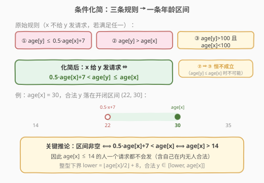
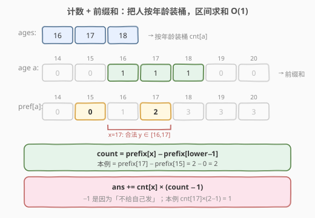
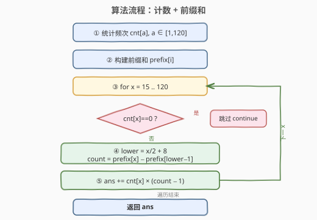

# 适龄的朋友

- **题目名称**：适龄的朋友
- **链接**：[825. 适龄的朋友](https://leetcode.cn/problems/friends-of-appropriate-ages/)
- **难度**：中等
- **标签**：数组、哈希表、计数排序、前缀和

## 1. 题目概述

有 `n` 个人，`ages[i]` 是第 `i` 个人的年龄。人们会互相发送好友请求。**人物 `x` 不会向人物 `y`（`x != y`）发送好友请求**，若满足以下任一条件：

1. `age[y] <= 0.5 * age[x] + 7`
2. `age[y] > age[x]`
3. `age[y] > 100 && age[x] < 100`

否则 `x` 就会向 `y` 发送好友请求。注意：`x` 向 `y` 发送并不代表 `y` 也会向 `x` 发送；且一个人不会给自己发请求。返回总共发出的好友请求数。

**示例 1**：

```text
输入：ages = [16,16]
输出：2
解释：两个 16 岁的人互相发送请求。0.5*16+7 = 15，16 > 15 且 16 ≤ 16，合法。
```

**示例 2**：

```text
输入：ages = [16,17,18]
输出：2
解释：17 岁的向 16 岁的发 1 个；18 岁的向 17 岁的发 1 个；16 岁的无可发送对象。共 2。
```

**示例 3**：

```text
输入：ages = [20,30,100,110,120]
输出：3
解释：110 岁的向 100 岁的发 1 个；120 岁的向 100、110 岁的各发 1 个。共 3。
```

**约束条件**：

- `n == ages.length`
- `1 <= n <= 2 * 10^4`
- `1 <= ages[i] <= 120`

---

## 2. 解题思路

### 2.1 暴力思路

对每一对人 `(x, y)`（`x != y`）逐一判定三条规则，合法则计数加一。时间复杂度 $O(n^2)$，而 $n$ 可达 $2 \times 10^4$，$n^2 = 4 \times 10^8$，必然超时。

> 💡 **关键瓶颈**：人的数量 $n$ 很大，但**年龄的取值范围极小**（仅 `1..120`，共 121 种）。这提示我们不要按「人」枚举，而要按「年龄」枚举——把 $O(n^2)$ 降成 $O(A^2)$ 甚至 $O(A)$，其中 $A = 120$。

### 2.2 核心观察：条件化简 + 计数装桶



**第一步：化简三条规则。** `x` 给 `y` 发请求，当且仅当三条规则**全部不成立**：

- 非①：`age[y] > 0.5 * age[x] + 7`
- 非②：`age[y] <= age[x]`
- 非③：`not (age[y] > 100 且 age[x] < 100)`

注意非②已经保证 `age[y] <= age[x]`。若此时 `age[y] > 100`，则 `age[x] >= age[y] > 100`，与 `age[x] < 100` 矛盾。**所以条件③在条件②不成立时恒不成立，是冗余项**。化简后只剩一条：

$$
x \text{ 给 } y \text{ 发请求} \iff 0.5 \cdot \text{age}[x] + 7 < \text{age}[y] \le \text{age}[x]
$$

> ⚠️ 别被第三条规则唬住——它是一个「永假」的干扰项。很多暴力解法把它也判一遍，结果既多写代码又无法化简。

**第二步：区间非空的门槛。** 要让上述区间非空，需 $0.5 \cdot \text{age}[x] + 7 < \text{age}[x]$，即 $\text{age}[x] > 14$。因此 **`age[x] <= 14` 的人一个请求都发不出去**（连同龄人都发不了，因为 $0.5 \times 14 + 7 = 14$，要求 `age[y] > 14` 而 `age[y] <= 14`，矛盾）。

**第三步：整型下界。** 年龄是整数，`age[y] > 0.5*age[x] + 7` 等价于 `age[y] >= floor(0.5*age[x] + 7) + 1`。用整数除法：

$$
\text{lower} = \lfloor \text{age}[x] / 2 \rfloor + 8
$$

（因为 $\lfloor 0.5x + 7 \rfloor = \lfloor x/2 \rfloor + 7$，再加 1 取严格大于。）合法 `y` 落在闭区间 $[\text{lower},\ \text{age}[x]]$。

**第四步：按年龄装桶。** 用 `cnt[a]` 统计年龄为 `a` 的人数。对每个年龄 `x`，合法接收者的总数就是年龄落在 `[lower, x]` 内的人数——用**前缀和** $O(1)$ 查询：

$$
\text{count} = \text{prefix}[x] - \text{prefix}[\text{lower}-1]
$$

其中 `count` 包含 `x` 自己。每个年龄为 `x` 的人不给自己发请求，所以每人能发 `count - 1` 个；该年龄共 `cnt[x]` 人，贡献为：

$$
\text{ans} \mathrel{+}= \text{cnt}[x] \times (\text{count} - 1)
$$



> 💡 **为什么 `-1` 而不是分类讨论 `y == x`？** `x` 自己一定落在合法区间 `[lower, x]` 内（只要 `x > 14`），所以 `count` 里天然包含 `x` 本人。每人剔除自己 1 个，等价于把「同龄人互相发」和「发给更小的」统一成一个公式。分类讨论 `y == x` 用 `cnt[x]*(cnt[x]-1)`、`y != x` 用 `cnt[x]*cnt[y]` 也能得到同样结果（见第 5 节）。

### 2.3 算法流程图



三个阶段：① 建桶计数 `O(n)` → ② 构建前缀和 `O(A)` → ③ 枚举每个年龄 `x` 做区间查询并累加 `O(A)`。

### 2.4 示例演算

![示例演算：ages = [20,30,100,110,120]](../images/foa_example_walkthrough.svg)

以示例 3 `ages = [20,30,100,110,120]` 为例，装桶后 `cnt` 仅在这 5 个年龄上各为 1。逐个 `x` 计算：

| x | lower=x/2+8 | 合法 y 区间 | 命中年龄 | count | 贡献 |
|---|---|---|---|---|---|
| 20 | 18 | [18, 20] | {20} | 1 | 1×(1−1)=0 |
| 30 | 23 | [23, 30] | {30} | 1 | 1×(1−1)=0 |
| 100 | 58 | [58, 100] | {100} | 1 | 1×(1−1)=0 |
| 110 | 63 | [63, 110] | {100, 110} | 2 | 1×(2−1)=1 |
| 120 | 68 | [68, 120] | {100, 110, 120} | 3 | 1×(3−1)=2 |

合计 `ans = 3`，与示例一致。注意 `x = 100` 时虽然区间 `[58,100]` 很宽，但桶里只有 100 岁自己一人，发不出去——这正是「装桶后只看实际存在的人数」的妙处。

---

## 3. 参考代码

### 方法一：计数 + 前缀和（O(n + A)，推荐）

### C++

```cpp
class Solution {
  public:
    int numFriendRequests(vector<int>& ages) {
        const int A = 120;
        vector<int> cnt(A + 1, 0);
        for (int a : ages) cnt[a]++;

        // prefix[i] = 年龄 <= i 的人数
        vector<int> prefix(A + 2, 0);
        for (int i = 1; i <= A; i++) prefix[i] = prefix[i - 1] + cnt[i];

        int ans = 0;
        for (int x = 1; x <= A; x++) {
            if (cnt[x] == 0) continue;
            int lower = x / 2 + 8;        // 最小的合法 y：y > 0.5*x + 7
            if (lower > x) continue;      // x <= 14，区间为空
            int count = prefix[x] - prefix[lower - 1]; // [lower, x] 内的人数
            ans += cnt[x] * (count - 1);  // 每人剔除自己
        }
        return ans;
    }
};
```

### Python

```python
class Solution:
    def numFriendRequests(self, ages: List[int]) -> int:
        A = 120
        cnt = [0] * (A + 1)
        for a in ages:
            cnt[a] += 1

        prefix = [0] * (A + 2)
        for i in range(1, A + 1):
            prefix[i] = prefix[i - 1] + cnt[i]

        ans = 0
        for x in range(1, A + 1):
            if cnt[x] == 0:
                continue
            lower = x // 2 + 8              # 最小的合法 y：y > 0.5*x + 7
            if lower > x:                   # x <= 14，区间为空
                continue
            count = prefix[x] - prefix[lower - 1]
            ans += cnt[x] * (count - 1)
        return ans
```

> ⚠️ **两个易错点**：
> 1. **下界别写错**：是 `x/2 + 8`（严格大于），不是 `x/2 + 7`。`x/2 + 7` 是 $\lfloor 0.5x + 7 \rfloor$，对应「不合法」的边界，写反会导致 `y == 0.5x+7`（整数时）被误判为合法。
> 2. **`count - 1` 前必须保证区间非空**：当 `x <= 14` 时 `lower > x`，此时直接 `continue`，否则 `count` 可能为 0 而 `count - 1` 变成 −1，把答案算错。

---

## 4. 复杂度分析

| 维度 | 方法 | 复杂度 | 说明 |
|------|------|--------|------|
| 时间复杂度 | 计数 + 前缀和 | $O(n + A)$ | 建桶遍历 $O(n)$；前缀和与枚举各 $O(A)$，$A = 120$ 视作常数 |
| 空间复杂度 | 计数 + 前缀和 | $O(A)$ | `cnt` 与 `prefix` 两个长度 121 的数组 |
| 时间复杂度 | 计数 + 双重枚举 | $O(n + A^2)$ | 建桶 $O(n)$；双层年龄循环 $A^2 = 14400$，仍是常数 |
| 空间复杂度 | 计数 + 双重枚举 | $O(A)$ | 仅 `cnt` 数组 |

> 💡 由于 $A = 120$ 是题目给出的固定上界，两种方法实际都是 $O(n)$ 级别。前缀和版常数更小（$A$ vs $A^2$），且写法更简洁；双重枚举版逻辑更直白、不需推下界公式，面试时可先用它讲清思路再优化。

---

## 5. 扩展：双重年龄枚举法

不做前缀和，直接双重枚举年龄对 `(x, y)`，判定 `x` 是否给 `y` 发请求。由于「同年龄」和「跨年龄」的计数公式不同，需要分类讨论：

- `y == x`：`cnt[x]` 人互发，每人对其余 `cnt[x] - 1` 人，贡献 `cnt[x] * (cnt[x] - 1)`。
- `y != x`：`cnt[x]` 人每人发给全部 `cnt[y]` 人，贡献 `cnt[x] * cnt[y]`。

判定条件用整数写法：跳过 `y <= x/2 + 7`（即 `y` 不满足严格大于 `0.5x+7`）或 `y > x`。

### C++

```cpp
class Solution {
  public:
    int numFriendRequests(vector<int>& ages) {
        const int A = 120;
        vector<int> cnt(A + 1, 0);
        for (int a : ages) cnt[a]++;

        int ans = 0;
        for (int x = 1; x <= A; x++) {
            if (cnt[x] == 0) continue;
            for (int y = 1; y <= A; y++) {
                if (cnt[y] == 0) continue;
                // 化简后：x 给 y 发 ⇔ 0.5*x+7 < y <= x（条件③冗余已略）
                if (y <= x / 2 + 7 || y > x) continue;
                if (y != x) ans += cnt[x] * cnt[y];
                else ans += cnt[x] * (cnt[x] - 1);
            }
        }
        return ans;
    }
};
```

### Python

```python
class Solution:
    def numFriendRequests(self, ages: List[int]) -> int:
        A = 120
        cnt = [0] * (A + 1)
        for a in ages:
            cnt[a] += 1

        ans = 0
        for x in range(1, A + 1):
            if cnt[x] == 0:
                continue
            for y in range(1, A + 1):
                if cnt[y] == 0:
                    continue
                if y <= x // 2 + 7 or y > x:
                    continue
                if y != x:
                    ans += cnt[x] * cnt[y]
                else:
                    ans += cnt[x] * (cnt[x] - 1)
        return ans
```

> 💡 **对照前缀和版**：双重枚举版把「同龄互发」与「跨龄发送」拆成两个分支；前缀和版用一个 `count - 1` 把两者合并——因为 `count` 里的「自己」恰好对应同龄分支里要剔除的那个 `1`。两种写法等价，理解了这一点就真正吃透了本题。

---

## 6. 面试要点

1. **为什么要按年龄装桶而不是枚举人对人？**
   - 人数 $n$ 可达 $2 \times 10^4$ 而年龄只有 `1..120` 共 121 种。枚举人对人是 $O(n^2)$ 会超时；按年龄装桶后枚举年龄对是 $O(A^2) = 14400$，再用前缀和降到 $O(A)$，把规模从「人」压缩到「值域」。

2. **第三条规则 `age[y] > 100 && age[x] < 100` 为什么是冗余的？**
   - `x` 给 `y` 发请求要求 `age[y] <= age[x]`（非②）。若 `age[y] > 100`，则 `age[x] >= age[y] > 100`，`age[x] < 100` 必为假，第三条恒不成立。所以化简后只剩 `0.5*age[x]+7 < age[y] <= age[x]`。

3. **`count - 1` 里的 `-1` 是怎么来的？**
   - `count` 是合法年龄区间 `[lower, x]` 内的总人数，包含 `x` 自己。每人不给自己发请求，所以每人能发 `count - 1` 个；`cnt[x]` 人共发 `cnt[x] * (count - 1)`。它把「同龄互发」和「发给更小的」统一进一个公式。

4. **整型下界为什么是 `x/2 + 8` 而不是 `x/2 + 7`？**
   - 合法条件是 `y > 0.5*x + 7`（严格大于）。`x/2 + 7`（整除）等于 $\lfloor 0.5x + 7 \rfloor$，是「不合法」的临界值。最小的合法 `y` 是它再加 1，即 `x/2 + 8`。当 `x` 为偶数时 `0.5x+7` 是整数，写成 `x/2+7` 会把等于它的 `y` 误判为合法。

5. **为什么 `age[x] <= 14` 的人发不出任何请求？**
   - 区间非空要求 `0.5*age[x] + 7 < age[x]`，即 `age[x] > 14`。`age[x] <= 14` 时区间为空，连同龄人都无法发送（如 14 岁：`0.5*14+7 = 14`，要求 `y > 14` 且 `y <= 14`，矛盾）。

---

## 7. 同类练习题

- [740. 删除并获得点数](https://leetcode.cn/problems/delete-and-earn/)（[题解](../0701-0800/740_删除并获得点数.md)）：同样是「值域极小」→ 按值装桶，再把相邻互斥转化为打家劫舍 DP，与本题「按年龄装桶」同思想
- [274. H 指数](https://leetcode.cn/problems/h-index/)（[题解](../0201-0300/274_H指数.md)）：按引用次数计数 + 值域统计，计数排序思想求阈值
- [303. 区域和检索 - 数组不可变](https://leetcode.cn/problems/range-sum-query-immutable/)（[题解](../0301-0400/303_区域和检索 - 数组不可变.md)）：一维前缀和区间求和模板，本题 `prefix[x] - prefix[lower-1]` 的母题
- [451. 根据字符出现频率排序](https://leetcode.cn/problems/sort-characters-by-frequency/)（[题解](../0401-0500/451_根据字符出现频率排序.md)）：按频率计数后排序，值域装桶思想的另一应用
- [204. 计数质数](https://leetcode.cn/problems/count-primes/)（[题解](../0201-0300/204_计数质数.md)）：值域上的计数问题（埃氏筛），与本题「在值域上做统计」思路相通
