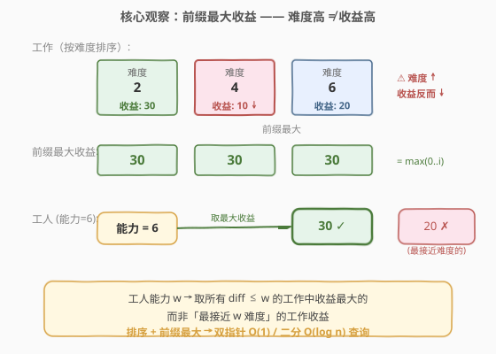
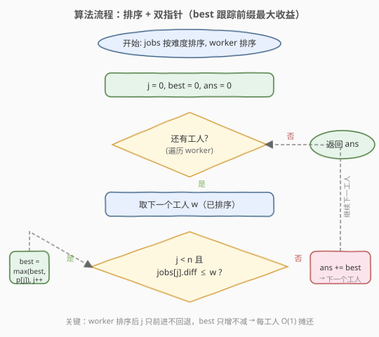
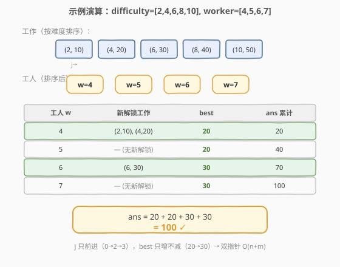

# LeetCode 安排工作以达到最大收益 题解

## 1. 题目概述

- **标题 / 题号**：安排工作以达到最大收益（#826，medium）
- **链接**：https://leetcode.cn/problems/most-profit-assigning-work/
- **难度**：中等
- **标签**：数组、排序、双指针、贪心

**题意**：你有 `n` 个工作和 `m` 个工人。给定三个数组 `difficulty`、`profit` 和 `worker`：

- `difficulty[i]` 表示第 `i` 个工作的难度，`profit[i]` 表示第 `i` 个工作的收益。
- `worker[i]` 是第 `i` 个工人的能力，即该工人只能完成难度小于等于 `worker[i]` 的工作。

每个工人**最多**只能安排**一个**工作，但是一个工作可以**完成多次**。返回把工人分配到工作岗位后所能获得的**最大利润**。

**示例 1**：

```text
输入：difficulty = [2,4,6,8,10], profit = [10,20,30,40,50], worker = [4,5,6,7]
输出：100
解释：工人被分配的工作难度是 [4,4,6,6]，分别获得 [20,20,30,30] 的收益。
```

**示例 2**：

```text
输入：difficulty = [85,47,57], profit = [24,66,99], worker = [40,25,25]
输出：0
解释：所有工人的能力都低于最低难度 47，无法完成任何工作。
```

**约束**：

- `n == difficulty.length == profit.length`
- `m == worker.length`
- $1 \leq n, m \leq 10^4$
- $1 \leq \text{difficulty}[i], \text{profit}[i], \text{worker}[i] \leq 10^5$

> 💡 本题的核心矛盾是「能力受限下的最优匹配」——每个工人有能力上限，应在能力范围内选**收益最高**的工作。难点在于：难度高 ≠ 收益高，不能简单按难度取对应收益。

## 2. 解题思路

### 2.1 暴力思路

对每个工人，遍历所有工作，筛选 `difficulty[i] <= worker[i]` 的，取其中 `profit[i]` 的最大值，累加到答案。时间复杂度 $O(n \cdot m)$，当 $n, m$ 都到 $10^4$ 时达到 $10^8$，会超时。

> ⚠️ 暴力法的瓶颈在于「每个工人都从头扫描所有工作」。但注意到一个关键单调性：如果把工作按难度排序、工人也按能力排序，那么能力更大的工人能解锁的工作集**包含**能力更小的工人——没必要求每个工人。

### 2.2 核心观察：排序 + 前缀最大收益 + 双指针



关键洞察分两步：

1. **按难度升序排序工作**，并维护**前缀最大收益** `best`。这是本题最易错的点：难度高不代表收益高（如难度 4 的工作收益可能只有 10，而难度 2 的工作收益 30）。一个能力为 6 的工人应取 `max(profit[diff<=6])` = 30，而非难度最接近的 6 对应的收益 20。`best` 就是「当前已解锁工作中收益的最大值」。

2. **工人也按能力升序排序**，用双指针 `j` 扫描工作。因为工人能力递增，`j` 只前进不回退——能力更大的工人只会解锁更多工作，不会减少。每解锁一个工作就更新 `best = max(best, jobs[j].profit)`，该工人的贡献就是 `best`。

> 💡 **为什么贪心正确？** 每个工人独立选择，工作可重复完成，工人间互不影响。对单个工人而言，在能力范围内选收益最高的工作显然最优——这是**无后效性**的贪心：一个工人的选择不会影响其他工人的可选集。

### 2.3 算法流程图



```text
1. 将 n 个工作组合为 (difficulty, profit) 二元组，按 difficulty 升序排序
2. 将 m 个工人按能力升序排序
3. 初始化 j = 0（工作指针）, best = 0（前缀最大收益）, ans = 0
4. 遍历每个工人 w（已排序）：
   a. while j < n 且 jobs[j].difficulty <= w:
        best = max(best, jobs[j].profit)
        j++
   b. ans += best     ← 该工人能获得的最大收益
5. 返回 ans
```

> 💡 步骤 4a 是关键：`j` 只前进不回退（工人排序保证），`best` 只增不减（取 max）。每个工作最多被访问一次，总扫描 $O(n + m)$。

### 2.4 示例演算

以 `difficulty = [2,4,6,8,10], profit = [10,20,30,40,50], worker = [4,5,6,7]` 为例。排序后工作为 `[(2,10), (4,20), (6,30), (8,40), (10,50)]`，工人为 `[4,5,6,7]`：



| 工人 w | 新解锁工作 | best | ans 累计 |
|--------|-----------|------|---------|
| 4 | (2,10), (4,20) | 20 | 20 |
| 5 | —（无新解锁） | 20 | 40 |
| 6 | (6,30) | 30 | 70 |
| 7 | —（无新解锁） | 30 | 100 |

- **w=4**：`j` 推进解锁 `(2,10)` 和 `(4,20)`，`best = max(0,10,20) = 20`，`ans = 20`
- **w=5**：能力 5 不够解锁 `(6,30)`（难度 6 > 5），`j` 不动，`best` 保持 20，`ans = 40`
- **w=6**：解锁 `(6,30)`，`best = max(20,30) = 30`，`ans = 70`
- **w=7**：能力 7 不够解锁 `(8,40)`（难度 8 > 7），`j` 不动，`best` 保持 30，`ans = 100`

返回 `100` ✓

> 💡 **观察**：`j` 从 0 只前进到 3（共推进 3 次），`best` 从 0 增到 30（只增不减）。这正是双指针 $O(n + m)$ 摊还效率的来源——排序后扫描是线性的。

## 3. 参考代码

### C++

```cpp
class Solution {
  public:
    int maxProfitAssignment(vector<int>& difficulty, vector<int>& profit,
                             vector<int>& worker) {
        int n = difficulty.size();
        vector<pair<int, int>> jobs;
        for (int i = 0; i < n; i++)
            jobs.push_back({difficulty[i], profit[i]});
        sort(jobs.begin(), jobs.end());  // 按难度升序

        sort(worker.begin(), worker.end());  // 工人按能力升序

        int ans = 0, j = 0, best = 0;
        for (int w : worker) {
            while (j < n && jobs[j].first <= w)
                best = max(best, jobs[j++].second);
            ans += best;
        }
        return ans;
    }
};
```

### Python

```python
class Solution:
    def maxProfitAssignment(self, difficulty: List[int], profit: List[int],
                            worker: List[int]) -> int:
        jobs = sorted(zip(difficulty, profit))  # 按难度升序
        worker.sort()

        ans = j = best = 0
        n = len(jobs)
        for w in worker:
            while j < n and jobs[j][0] <= w:
                best = max(best, jobs[j][1])
                j += 1
            ans += best
        return ans
```

> ⚠️ **易错点**：`best` 必须在 `while` 循环外初始化为 0 且不重置——它跨工人累积，表示「截至目前解锁的最大收益」。若每个工人都从 0 重新扫描，就退化成 $O(n \cdot m)$ 暴力了。

## 4. 复杂度分析

| 维度 | 复杂度 | 说明 |
|------|--------|------|
| 时间复杂度 | $O(n \log n + m \log m)$ | 排序工作 $O(n \log n)$、排序工人 $O(m \log m)$；双指针扫描 $O(n + m)$ |
| 空间复杂度 | $O(n)$ | 存储排序后的 `(difficulty, profit)` 二元组数组 |

> 💡 双指针扫描部分是 $O(n + m)$：`j` 在整个循环中最多前进 $n$ 次（每个工作访问一次），外层循环遍历 $m$ 个工人，总扫描次数 $n + m$。排序是主要开销。

## 5. 扩展：二分查找解法

如果工人**不需要排序**（例如题目要求保持工人原始顺序），可以用二分查找替代双指针：

1. 工作按难度排序后，显式构建**前缀最大收益数组** `pmax[i] = max(profit[0..i])`。
2. 对每个工人 `w`，二分找难度 $\leq w$ 的最后一个工作下标 `pos`，取 `pmax[pos]`。

```cpp
class Solution {
  public:
    int maxProfitAssignment(vector<int>& difficulty, vector<int>& profit,
                             vector<int>& worker) {
        int n = difficulty.size();
        vector<pair<int, int>> jobs;
        for (int i = 0; i < n; i++)
            jobs.push_back({difficulty[i], profit[i]});
        sort(jobs.begin(), jobs.end());

        // 前缀最大收益（原地修改）
        for (int i = 1; i < n; i++)
            jobs[i].second = max(jobs[i - 1].second, jobs[i].second);

        int ans = 0;
        for (int w : worker) {
            // 二分找难度 <= w 的最后一个工作
            int lo = 0, hi = n - 1, pos = -1;
            while (lo <= hi) {
                int mid = (lo + hi) / 2;
                if (jobs[mid].first <= w) {
                    pos = mid;
                    lo = mid + 1;
                } else {
                    hi = mid - 1;
                }
            }
            if (pos >= 0)
                ans += jobs[pos].second;  // 前缀最大收益
        }
        return ans;
    }
};
```

> 💡 也可用 `upper_bound` 简化：`auto it = upper_bound(jobs.begin(), jobs.end(), make_pair(w, INT_MAX)); if (it != jobs.begin()) ans += (--it)->second;`

| 维度 | 双指针 | 二分查找 |
|------|--------|---------|
| 时间 | $O(n \log n + m \log m)$ | $O(n \log n + m \log n)$ |
| 是否需排序工人 | 是 | 否 |
| 适用场景 | 工人顺序无所谓 | 需保留工人原始顺序 |

当 $n \approx m$ 时两者复杂度相当；双指针无需二分，常数更小。

## 6. 面试要点

1. **为什么不能直接按难度取对应收益？**

   - 难度和收益之间**没有单调关系**——难度高的工作收益可能更低。工人应在能力范围内取**收益最大**的工作，而非难度最接近的工作。这正是「前缀最大收益」的核心作用。

2. **为什么要排序工人？双指针的单调性来自哪里？**

   - 工人按能力升序排序后，能力更大的工人能解锁的工作集 $\supseteq$ 能力更小的。因此工作指针 `j` 只前进不回退，`best` 只增不减——这就是双指针 $O(n + m)$ 摊还效率的基础。若不排序工人，每个工人都需独立查找，退化到 $O(m \log n)$（二分）或 $O(n \cdot m)$（暴力）。

3. **`best` 变量为什么跨工人累积而不重置？**

   - `best` 表示「截至目前所有已解锁工作中的最大收益」。由于工人按能力升序处理，前面的工人已解锁的工作后面的工人也都能做（能力更大），所以 `best` 只需在上轮基础上继续更新，不必重置。重置会退化成暴力。

4. **工作可以完成多次这个条件意味着什么？**

   - 多个工人可以做同一份工作，工人间**互不影响**。这使得每个工人可以独立地贪心选最优，无需考虑「某个工作被别人做了」——与 502 IPO（每个项目只能做一次，需用堆动态维护可用集）形成对比。

5. **这题和 502. IPO 有什么异同？**

   - **同**：都是「资源受限下的最优匹配」，都先排序建立单调性。
   - **异**：826 的工作可重复完成 → 双指针 + 前缀最大即可；502 的项目只能做一次 → 需用大顶堆动态维护可用集，每轮弹出最大。826 是「静态前缀最大」，502 是「动态堆选最大」。

## 同类练习题

| # | 题目 | 与本题的关联 |
|---|------|-------------|
| 502 | [IPO](https://leetcode.cn/problems/ipo/) | 同为「资源受限下的贪心匹配」，但项目只能做一次，需用大顶堆动态选最大利润，与本题工作可重复的双指针解法形成对比 |
| 875 | [爱吃香蕉的珂珂](https://leetcode.cn/problems/koko-eating-bananas/) | 排序后二分查找 + 单调性验证，与本题的排序 + 双指针同为「排序建立单调性」范式 |
| 410 | [分割数组的最大值](https://leetcode.cn/problems/split-array-largest-sum/) | 二分答案 + 贪心验证，与本题的二分查找扩展同为「排序/二分 + 贪心」模式 |
| 881 | [救生艇](https://leetcode.cn/problems/boats-to-save-people/) | 排序 + 双指针贪心，与本题双指针扫描思路一致（排序后两端/同向扫描） |
