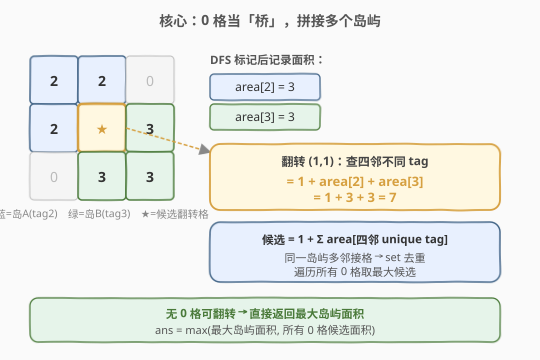
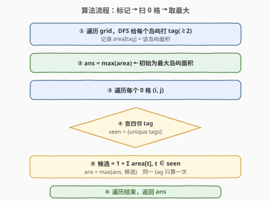
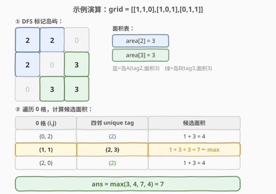

# LeetCode 最大人工岛 题解

## 1. 题目概述

- **标题 / 题号**：最大人工岛（#827，hard）
- **链接**：https://leetcode.cn/problems/making-a-large-island/
- **难度**：困难
- **标签**：图、DFS、并查集、连通分量

**题意**：给你一个大小为 `n x n` 二进制矩阵 `grid`。**最多**只能将一格 `0` 变成 `1`。返回执行此操作后，`grid` 中最大的岛屿面积是多少？

**岛屿**由一组上、下、左、右四个方向相连的 `1` 形成。

**示例 1**：

```text
输入：grid = [[1, 0], [0, 1]]
输出：3
解释：将一格 0 变成 1，连通两个小岛得到面积为 3 的岛屿。
```

**示例 2**：

```text
输入：grid = [[1, 1], [1, 0]]
输出：4
解释：将一格 0 变成 1，岛屿面积扩大为 4。
```

**示例 3**：

```text
输入：grid = [[1, 1], [1, 1]]
输出：4
解释：没有 0 可以变成 1，面积依然为 4。
```

**约束**：

- `n == grid.length`
- `n == grid[i].length`
- `1 <= n <= 500`
- `grid[i][j]` 为 `0` 或 `1`

## 2. 解题思路

### 2.1 暴力思路

枚举每个 `0` 格，尝试将其翻转为 `1`，然后对整个 `grid` 跑一遍 DFS 求最大岛屿面积。共 $O(n^2)$ 个 `0` 格，每次 DFS $O(n^2)$，总复杂度 $O(n^4)$。`n = 500` 时约 $6.25 \times 10^{10}$，必然超时。

瓶颈在于：**每次翻转后重复计算所有岛屿面积**。如果能预处理每个岛屿的面积，翻转一个 `0` 时只需查四邻属于哪些岛，把对应岛屿面积相加即可。

### 2.2 核心观察：DFS 预标记 + 0 格当桥



关键分两步：

1. **预标记**：遍历 `grid`，遇到 `1` 就 DFS 把整个连通块标记为唯一 `tag`（从 `2` 开始，避免与 `0`/`1` 混淆），同时记录 `area[tag]` = 该岛屿面积。标记后 `grid` 中只剩 `0`（水）和 `≥2`（岛 tag）。

2. **扫 0 格**：对每个 `0` 格 `(i, j)`，查四邻的 `tag`，用 `set` 去重后求和：候选面积 $= 1 + \sum_{t \in \text{seen}} \text{area}[t]$。这个 `0` 格就像一座**桥**，把周围不同岛屿拼在一起。

> 💡 **为什么 tag 从 2 开始？** `0` 表示水、`1` 表示未访问陆地，`tag ≥ 2` 表示已标记岛屿。用原 grid 原地存储 tag，省去额外 visited 数组，判断时 `grid[i][j] >= 2` 即可区分岛屿与水。

> ⚠️ **去重是关键**：一个 `0` 格的多个邻居可能属于**同一岛屿**（如同一个岛的上下两边都挨着这个 `0`），不加 `set` 去重会重复累加面积。例如一个 `0` 格上下左右都是 tag=2 的格子，正确结果是 $1 + \text{area}[2]$，不是 $1 + 4 \times \text{area}[2]$。

### 2.3 算法流程图



注意 `ans` 初始化为**最大岛屿面积**（`max(area)`），这样即使没有 `0` 格可翻转（如示例 3 全 1），也能正确返回。

### 2.4 示例演算



以 `grid = [[1,1,0],[1,0,1],[0,1,1]]` 为例：

- **第 1 步** DFS 标记：岛屿 A（tag=2，面积=3）、岛屿 B（tag=3，面积=3）
- **第 2 步** 扫 0 格：
  - `(0,2)`：四邻 tag = {2} → 候选 = 1 + 3 = 4
  - `(1,1)`：四邻 tag = {2, 3} → 候选 = 1 + 3 + 3 = **7** ← 最大
  - `(2,0)`：四邻 tag = {2} → 候选 = 1 + 3 = 4
- **结果**：`ans = max(3, 4, 7, 4) = 7`

## 3. 参考代码

### C++

```cpp
class Solution {
    int n;
    int dx[4] = {0, 0, 1, -1};
    int dy[4] = {1, -1, 0, 0};

    int dfs(vector<vector<int>>& grid, int i, int j, int tag) {
        if (i < 0 || i >= n || j < 0 || j >= n || grid[i][j] != 1)
            return 0;
        grid[i][j] = tag;
        int area = 1;
        for (int d = 0; d < 4; d++)
            area += dfs(grid, i + dx[d], j + dy[d], tag);
        return area;
    }

  public:
    int largestIsland(vector<vector<int>>& grid) {
        n = grid.size();
        vector<int> area(2, 0); // area[tag]，下标 0/1 占位

        int tag = 2;
        for (int i = 0; i < n; i++)
            for (int j = 0; j < n; j++)
                if (grid[i][j] == 1) {
                    area.push_back(dfs(grid, i, j, tag));
                    tag++;
                }

        int ans = *max_element(area.begin(), area.end());

        for (int i = 0; i < n; i++)
            for (int j = 0; j < n; j++)
                if (grid[i][j] == 0) {
                    int total = 1;
                    unordered_set<int> seen;
                    for (int d = 0; d < 4; d++) {
                        int ni = i + dx[d], nj = j + dy[d];
                        if (ni >= 0 && ni < n && nj >= 0 && nj < n && grid[ni][nj] >= 2) {
                            int t = grid[ni][nj];
                            if (seen.insert(t).second)
                                total += area[t];
                        }
                    }
                    ans = max(ans, total);
                }
        return ans;
    }
};
```

### Python

```python
class Solution:
    def largestIsland(self, grid: List[List[int]]) -> int:
        n = len(grid)
        dirs = [(0, 1), (0, -1), (1, 0), (-1, 0)]
        area = [0, 0]  # area[tag]，下标 0/1 占位

        def dfs(i, j, tag):
            if i < 0 or i >= n or j < 0 or j >= n or grid[i][j] != 1:
                return 0
            grid[i][j] = tag
            s = 1
            for di, dj in dirs:
                s += dfs(i + di, j + dj, tag)
            return s

        tag = 2
        for i in range(n):
            for j in range(n):
                if grid[i][j] == 1:
                    area.append(dfs(i, j, tag))
                    tag += 1

        ans = max(area)

        for i in range(n):
            for j in range(n):
                if grid[i][j] == 0:
                    total = 1
                    seen = set()
                    for di, dj in dirs:
                        ni, nj = i + di, j + dj
                        if 0 <= ni < n and 0 <= nj < n and grid[ni][nj] >= 2:
                            t = grid[ni][nj]
                            if t not in seen:
                                seen.add(t)
                                total += area[t]
                    ans = max(ans, total)

        return ans
```

> ⚠️ **Python 递归深度**：`n ≤ 500` 时最坏情况 DFS 深度达 `250000`，超过默认递归上限。LeetCode 环境通常已调高，本地运行需加 `sys.setrecursionlimit(300000)`，或改用 BFS 迭代标记。

## 4. 复杂度分析

| 维度 | 复杂度 | 说明 |
|------|--------|------|
| 时间复杂度 | $O(n^2)$ | DFS 标记每个格子访问一次 $O(n^2)$；扫 0 格每个查 4 邻 $O(n^2)$ |
| 空间复杂度 | $O(n^2)$ | DFS 递归栈最坏（全 1）$O(n^2)$；`area` 数组 $O(\text{岛屿数})$ |

## 5. 扩展：并查集解法

也可用并查集（Union-Find）替代 DFS 标记：

1. 遍历所有 `1` 格，与左/上邻居 union，同时维护 `size[root]` 记录每个连通块大小。
2. 对每个 `0` 格，查四邻的 `find(root)`，用 `set` 去重后求和：候选 $= 1 + \sum \text{size}[root]$。
3. `ans = max(最大 size, 所有候选)`。

复杂度 $O(n^2 \alpha(n))$，与 DFS 同阶。并查集的优势在于支持**动态加边**——若题目改为多次翻转查询，并查集更灵活。

## 6. 面试要点

1. **为什么 tag 从 2 开始？**

   - `0` = 水、`1` = 未访问陆地，用 `≥2` 表示已标记岛屿 tag，三者互不冲突。原地修改 grid 存 tag，省 visited 数组，判断 `grid[i][j] >= 2` 即可区分岛屿与水。

2. **为什么必须用 set 去重？**

   - 一个 `0` 格的多个邻居可能属于**同一岛屿**（如 `0` 格被同一个岛的三面环绕）。不去重会把同一岛屿面积重复累加。`set` 确保每个 tag 只算一次。

3. **没有 0 格怎么办？**

   - `ans` 初始化为 `max(area)`（最大岛屿面积）。若全为 `1`，grid 本身就是一个面积为 $n^2$ 的岛，`ans = n^2`，0 格循环不执行，直接返回。

4. **DFS 标记 vs 并查集，怎么选？**

   - DFS 标记更简洁、常数更小，适合本题「一次性求所有连通块」。并查集适合需要**动态加边**或**反复查询连通性**的场景（如 684 冗余连接）。本题两者复杂度同阶。

5. **暴力 $O(n^4)$ 的瓶颈在哪？优化后的关键是什么？**

   - 暴力每次翻转后重新 DFS，重复计算岛屿面积。优化关键是**预处理**：先标记所有岛屿并记录面积，翻转时只需查四邻 tag 求和，从 $O(n^4)$ 降到 $O(n^2)$。

## 同类练习题

| # | 题目 | 与本题的关联 |
|---|------|-------------|
| 695 | [岛屿的最大面积](https://leetcode.cn/problems/max-area-of-island/) | DFS 求单个岛屿面积，本题的前置基础 |
| 200 | [岛屿数量](https://leetcode.cn/problems/number-of-islands/) | DFS/BFS 求连通分量，标记岛屿的经典模板 |
| 547 | [省份数量](https://leetcode.cn/problems/number-of-provinces/) | 并查集求连通分量，可替代 DFS 标记 |
| 684 | [冗余连接](https://leetcode.cn/problems/redundant-connection/) | 并查集判环，动态加边场景 |
