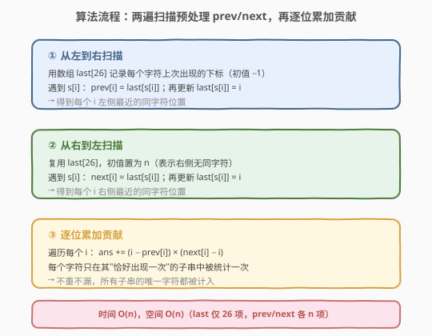
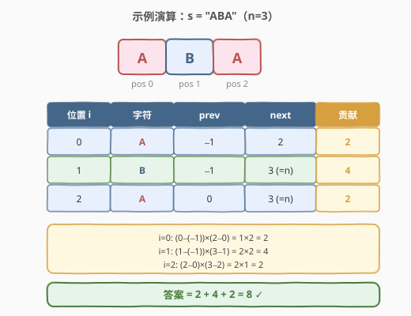

# LeetCode 统计子串中的唯一字符 题解

## 1. 题目概述

- **标题 / 题号**：统计子串中的唯一字符（#828，hard）
- **链接**：https://leetcode.cn/problems/count-unique-characters-of-all-substrings-of-a-given-string/
- **难度**：困难
- **标签**：字符串、哈希表、贡献法、动态规划

**题意**：定义函数 `countUniqueChars(s)`：统计字符串 `s` 中**只出现一次**的字符个数。现给定字符串 `s`，求 `s` 的**所有子串** `t` 的 `countUniqueChars(t)` 之和。子串可以重复，每个子串都要独立计数。

**示例 1**：

```text
输入: s = "ABC"
输出: 10
解释: 子串 "A","B","C","AB","BC","ABC"，每个子串字符全唯一，
      长度和 = 1 + 1 + 1 + 2 + 2 + 3 = 10
```

**示例 2**：

```text
输入: s = "ABA"
输出: 8
解释: 除 countUniqueChars("ABA") = 1（A 出现两次，只有 B 唯一）外，其余与示例 1 相同。
```

**示例 3**：

```text
输入: s = "LEETCODE"
输出: 92
```

**约束**：

- `1 <= s.length <= 10^5`
- `s` 只包含大写英文字符

> ⚠️ **关键约束**：子串总数 $O(n^2)$，`n` 可达 $10^5$，枚举所有子串再逐个统计必然 $O(n^3)$ 超时。必须换视角——**按字符算贡献**而非按子串算结果。

## 2. 解题思路

### 2.1 暴力思路

枚举所有 $O(n^2)$ 个子串 `[l, r]`，对每个子串扫描一遍统计唯一字符数，总计 $O(n^3)$。在 $n = 10^5$ 下完全不可行。

突破口在于**转换求和顺序**：题目要的是「所有子串的唯一字符数之和」，等价于「每个字符在多少个子串中是唯一字符」的总和。即：

$$
\text{ans} = \sum_{t \subseteq s} \text{countUniqueChars}(t) = \sum_{i=0}^{n-1} \text{包含 } s[i] \text{ 且 } s[i] \text{ 在其中唯一的子串数}
$$

这就是经典的**贡献法**：不枚举子串，而是固定每个位置 `i`，单独计算它对答案的贡献。

### 2.2 核心观察：贡献法——固定字符算"唯一出现"的子串数

![核心观察：字符 c 在 s[i] 的贡献](../images/cuc_concept.svg)

对位置 `i` 的字符 `c = s[i]`，我们要数：**有多少个子串包含 `s[i]`，且该子串中 `c` 只出现这一次**（即不含 `c` 的其他出现）。

设：

- `prev` = `i` 左侧最近一个 `c` 的下标（没有则为 $-1$）；
- `next` = `i` 右侧最近一个 `c` 的下标（没有则为 $n$）。

那么子串要包含 `s[i]` 且不再含其他 `c`，必须满足：

- **左边界** `l` 取在 `(prev, i]` 区间内 → 共 `i - prev` 种；
- **右边界** `r` 取在 `[i, next)` 区间内 → 共 `next - i` 种。

左边界选法与右边界选法相互独立（左界只约束左端、右界只约束右端），故：

$$
\text{s[i] 的贡献} = (i - \text{prev}) \times (\text{next} - i)
$$

> 💡 **为什么左边界取 `(prev, i]` 而非 `[prev, i]`？** 若左边界取到 `prev`，子串就包含了左侧那个 `c`，`s[i]` 便不再唯一。故左端必须严格大于 `prev`，但又必须 $\le i$（否则不含 `s[i]`）。同理右端必须 $\ge i$ 且严格小于 `next`。

> ⚠️ **不重不漏**：同一个子串中若有多个唯一字符，会被每个唯一字符各贡献一次——这正是 `countUniqueChars` 的定义（统计个数），所以重复计入是正确的，并非误差。

### 2.3 算法流程图



1. **第一遍（从左到右）**：维护 `last[26]`（初值 $-1$）记录每个字符上次出现的下标；对每个 `i`，`prev[i] = last[s[i]-'A']`，随后 `last[s[i]-'A'] = i`；
2. **第二遍（从右到左）**：`last[26]` 重置为 $n$；对每个 `i`，`next[i] = last[s[i]-'A']`，随后 `last[s[i]-'A'] = i`；
3. **累加**：`ans = Σ (i - prev[i]) * (next[i] - i)`。

只需两遍线性扫描，无需枚举子串。

### 2.4 示例演算

以 `s = "ABA"`（`n = 3`）为例：



| 位置 `i` | 字符 | `prev` | `next` | 贡献 `(i−prev)×(next−i)` |
|----------|------|--------|--------|--------------------------|
| 0 | A | $-1$ | 2 | $(0-(-1))\times(2-0) = 1\times2 = 2$ |
| 1 | B | $-1$ | 3 | $(1-(-1))\times(3-1) = 2\times2 = 4$ |
| 2 | A | 0 | 3 | $(2-0)\times(3-2) = 2\times1 = 2$ |

- `i=0` 的 A：左界只能取 0、右界可取 0 或 1（不能到 2，否则含另一个 A）→ 子串 `"A"`、`"AB"`，A 在其中都唯一 → 贡献 2；
- `i=1` 的 B：左界取 0/1、右界取 1/2 → `"B"`、`"AB"`、`"BA"`、`"ABA"`，B 在其中都唯一 → 贡献 4；
- `i=2` 的 A：左界取 1/2（不能取 0，否则含前一个 A）、右界只能取 2 → `"A"`、`"BA"`，A 唯一 → 贡献 2。

答案 $= 2 + 4 + 2 = 8$ ✓

> 💡 **验证不重不漏**：`"AB"` 中 A 唯一（由 `i=0` 贡献）且 B 唯一（由 `i=1` 贡献），被计了两次，对应 `countUniqueChars("AB") = 2`；`"ABA"` 中只有 B 唯一（A 出现两次），只被 `i=1` 贡献一次，对应 `countUniqueChars("ABA") = 1`。完全吻合定义。

## 3. 参考代码

### C++

```cpp
class Solution {
  public:
    int uniqueLetterString(string s) {
        int n = s.size();
        vector<int> prev(n), next(n);

        // 第一遍：从左到右求 prev
        vector<int> last(26, -1);
        for (int i = 0; i < n; ++i) {
            int c = s[i] - 'A';
            prev[i] = last[c];
            last[c] = i;
        }

        // 第二遍：从右到左求 next
        last.assign(26, n);
        for (int i = n - 1; i >= 0; --i) {
            int c = s[i] - 'A';
            next[i] = last[c];
            last[c] = i;
        }

        // 逐位累加贡献
        int ans = 0;
        for (int i = 0; i < n; ++i) {
            ans += (i - prev[i]) * (next[i] - i);
        }
        return ans;
    }
};
```

### Python

```python
class Solution:
    def uniqueLetterString(self, s: str) -> int:
        n = len(s)
        prev = [0] * n
        nxt = [0] * n

        # 第一遍：从左到右求 prev
        last = [-1] * 26
        for i, ch in enumerate(s):
            c = ord(ch) - ord('A')
            prev[i] = last[c]
            last[c] = i

        # 第二遍：从右到左求 next
        last = [n] * 26
        for i in range(n - 1, -1, -1):
            c = ord(s[i]) - ord('A')
            nxt[i] = last[c]
            last[c] = i

        # 逐位累加贡献
        return sum((i - prev[i]) * (nxt[i] - i) for i in range(n))
```

> 💡 **一次遍历写法**：也可只扫一遍，对每个字符维护其所有出现下标列表 `pos[c]`，贡献为 $\sum (pos[k] - pos[k-1]) \times (pos[k+1] - pos[k])$（边界用 $-1$ 与 $n$ 补齐）。两遍扫描法更直观、易讲清「左最近/右最近」的语义，面试首选。

## 4. 复杂度分析

| 维度 | 复杂度 | 说明 |
|------|--------|------|
| 时间复杂度 | $O(n)$ | 两遍线性扫描求 `prev`/`next`，一遍累加贡献，各 $O(n)$ |
| 空间复杂度 | $O(n)$ | `prev`、`next` 各 $n$ 项；`last` 仅 26 项常数空间 |

$n \le 10^5$，$O(n)$ 轻松通过，单次贡献计算为整数乘法无溢出风险（`n^2 ≤ 10^10` 在 `int` 范围内，C++ `int` 至少 $2 \times 10^9$，累加和最坏约 $n^2 = 10^{10}$ 需用 `long long`——本题答案保证 32 位整数，故 `int` 足够，但稳妥起见可改 `long long`）。

> ⚠️ 严格说答案上限 $\sum_i (i+1)(n-i)$，最大约 $n^3/6$。但题目保证返回值为 32 位整数，即实际答案不超 $2^{31}-1 \approx 2.1\times10^9$，故 `int` 不溢出。

## 5. 扩展：一次遍历 + 下标分组写法

把每个字符的所有出现下标收集成列表 `pos[c]`，并在两端各补哨兵 $-1$ 与 $n$。则该字符在第 `k` 次出现（下标 `pos[c][k]`）的贡献为：

$$
(pos[c][k] - pos[c][k-1]) \times (pos[c][k+1] - pos[c][k])
$$

```python
class Solution:
    def uniqueLetterString(self, s: str) -> int:
        pos = {c: [-1] for c in "ABCDEFGHIJKLMNOPQRSTUVWXYZ"}
        for i, ch in enumerate(s):
            pos[ch].append(i)
        for c in pos:
            pos[c].append(len(s))

        ans = 0
        for c in pos:
            p = pos[c]
            for k in range(1, len(p) - 1):
                ans += (p[k] - p[k - 1]) * (p[k + 1] - p[k])
        return ans
```

只需一次遍历建表，再对各字符的下标列表线性求和，本质与两遍扫描法等价——`pos[c][k-1]` 即 `prev`、`pos[c][k+1]` 即 `next`，只是按字符分组而非按下标分组。

## 6. 面试要点

1. **为什么不能枚举子串？时间复杂度差在哪？**
   - 子串共 $O(n^2)$ 个，每个统计唯一字符又 $O(n)$，总计 $O(n^3)$，$n = 10^5$ 时约 $10^{15}$ 必然超时。必须用贡献法把「按子串求和」转为「按字符求和」，降到 $O(n)$。

2. **贡献法的核心公式是怎么来的？**
   - 固定位置 `i` 的字符 `c`，它要在某子串中唯一，该子串左边界必须落在 `(prev, i]`（不含左侧另一个 `c`），右边界落在 `[i, next)`（不含右侧另一个 `c`）。两边独立，组合数 `(i-prev) × (next-i)`。

3. **同一个子串被多次贡献会不会算重？**
   - 不会算错。若子串中有 $k$ 个唯一字符，它会被这 $k$ 个位置各贡献一次，总和恰为 $k$，正是 `countUniqueChars` 的定义。题目要的就是「唯一字符个数之和」，重复计入是对的。

4. **`prev`/`next` 用哨兵 $-1$ 和 $n$ 的好处？**
   - 字符若左侧没有同字符，`prev = -1`，则 `i - prev = i + 1` 恰为左边界可选范围（$0$ 到 $i$）；右侧无同字符时 `next = n`，`next - i = n - i` 恰为右边界可选范围。无需特判边界，公式统一成立。

5. **为什么用 `last[26]` 而非哈希表？**
   - 题目保证 `s` 只含大写字母，仅 26 种，定长数组比哈希表更省空间且无哈希开销。若字符集更大（如全 ASCII），改用 `unordered_map` 即可，复杂度不变。

6. **答案会溢出 `int` 吗？**
   - 题目保证返回值为 32 位整数，故实际答案 $\le 2^{31}-1$。单步 `(i-prev)*(next-i)` 上界约 $n^2 \approx 10^{10}$ 超过 `int`，但累加前各步相加后落在 32 位内——稳妥起见中间用 `long long` 求和。

## 同类练习题

| # | 题目 | 与本题的关联 |
|---|------|-------------|
| 2262 | [字符串中子串的总吸引力](https://leetcode.cn/problems/total-appeal-of-a-string/) | 完全同模板的姐妹题，把「唯一字符数」换成「不同字符数」，仍是固定位置算贡献，`(i-prev)` 即该字符新增的子串数 |
| 1248 | [统计「优美子数组」](https://leetcode.cn/problems/count-number-of-nice-subarrays/)（[题解](../1201-1300/1248_统计优美子数组.md)） | 同样避免枚举子串，对比「贡献法」与「至多 K 容斥转化」两种降维思路 |
| 2083 | [求以相同字母开头和结尾的子串数量](https://leetcode.cn/problems/substrings-that-begin-and-end-with-the-same-letter/) | 按首尾同字母分组算贡献，`C(n_c,2)+n_c`，贡献法在「首尾约束」场景的迁移 |
| 62 | [不同路径](https://leetcode.cn/problems/unique-paths/) | 同为「不枚举方案、用组合公式直接计数」的思想，对比网格计数与子串计数的贡献拆解 |
