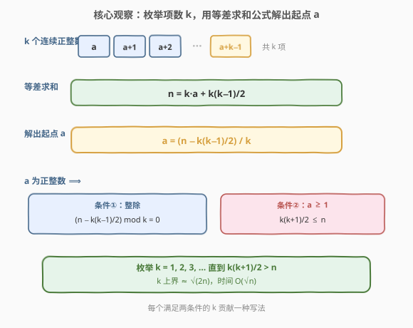
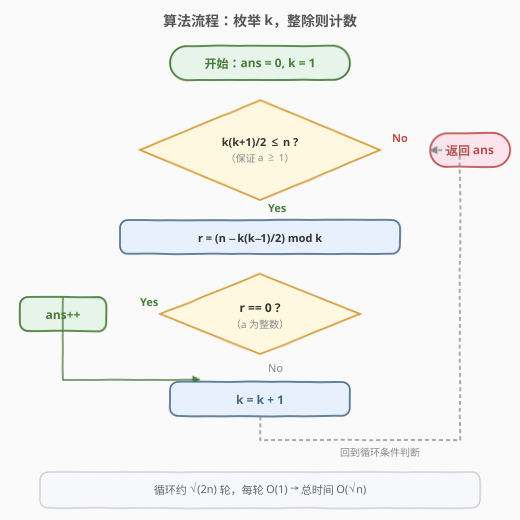
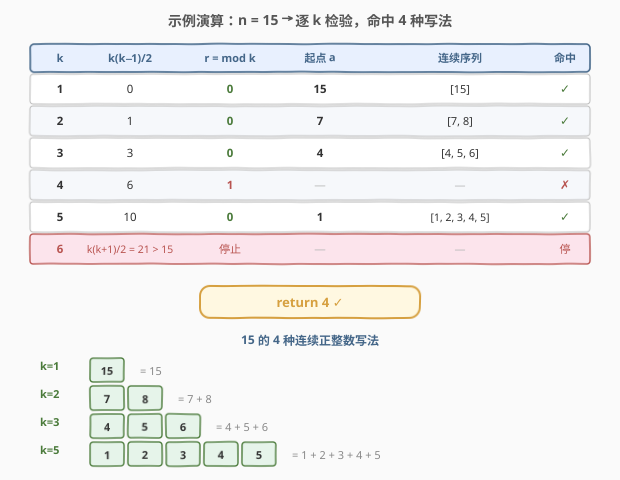
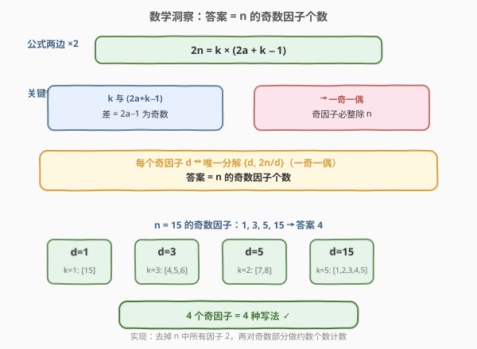

# 连续整数求和

- **题目名称**：连续整数求和
- **链接**：[829. 连续整数求和](https://leetcode.cn/problems/consecutive-numbers-sum/)
- **难度**：困难
- **标签**：数学、枚举

## 1. 题目概述

给定一个正整数 `n`，返回**连续正整数**满足所有数字之和为 `n` 的组数。

**示例 1**：

```text
输入：n = 5
输出：2
解释：5 = 2 + 3，共有两组连续整数（[5], [2,3]）求和后为 5。
```

**示例 2**：

```text
输入：n = 9
输出：3
解释：9 = 4 + 5 = 2 + 3 + 4
```

**示例 3**：

```text
输入：n = 15
输出：4
解释：15 = 8 + 7 = 4 + 5 + 6 = 1 + 2 + 3 + 4 + 5
```

**约束条件**：

- $1 \le n \le 10^9$

> ⚠️ $n$ 可达 $10^9$，任何 $O(n)$ 的做法都会超时。必须从**数学结构**切入，将搜索空间压缩到 $O(\sqrt{n})$。

---

## 2. 解题思路

### 2.1 暴力思路：枚举起点和长度

最直白的做法：枚举起点 $a$ 和项数 $k$，逐项累加判断是否等于 $n$。起点 $a$ 的范围是 $1 \sim n$，项数 $k$ 的范围是 $1 \sim O(\sqrt{n})$（因为 $k$ 个正整数之和至少为 $1+2+\cdots+k = k(k+1)/2$）。总复杂度约 $O(n\sqrt{n})$，对 $n = 10^9$ 必爆。

> 💡 暴力法的低效源于**同时枚举两个未知量**（起点 $a$ 和项数 $k$）。但等差数列的求和公式把 $n$、$a$、$k$ 三者绑定为一个等式——只要固定 $k$，$a$ 就被唯一确定，只需检验它是否为正整数。

### 2.2 核心观察：枚举项数 k，公式解出起点 a



设连续序列的**起点**为 $a$（$a \ge 1$），**项数**为 $k$（$k \ge 1$），则序列为 $a, a+1, a+2, \ldots, a+k-1$。由**等差数列求和公式**：

$$n = \sum_{i=0}^{k-1}(a+i) = k \cdot a + \frac{k(k-1)}{2}$$

移项解出 $a$：

$$a = \frac{n - \frac{k(k-1)}{2}}{k}$$

$a$ 要成为**正整数**，需同时满足两个条件：

- **条件①（整除）**：$n - \frac{k(k-1)}{2}$ 能被 $k$ 整除，即 $(n - k(k-1)/2) \bmod k = 0$。
- **条件②（$a \ge 1$）**：$n - \frac{k(k-1)}{2} \ge k$，化简得 $\frac{k(k+1)}{2} \le n$。

> 💡 **条件②同时给出了 $k$ 的上界**：$k \le \sqrt{2n}$。因为 $k(k+1)/2 \le n \Rightarrow k^2 < k(k+1) \le 2n \Rightarrow k < \sqrt{2n}$。当 $n = 10^9$ 时 $k$ 至多约 $44721$，枚举 $k$ 从 $1$ 到 $\sqrt{2n}$ 即可，复杂度 $O(\sqrt{n})$。

**算法**：枚举 $k = 1, 2, 3, \ldots$，对每个 $k$ 检验上述两个条件，满足则答案 $+1$。

### 2.3 算法流程图



流程清晰——**无回溯、无递归**，单层循环：

1. 初始化 `ans = 0`，`k = 1`。
2. 当 $k(k+1)/2 \le n$（保证 $a \ge 1$）：
   - 计算余数 $r = (n - k(k-1)/2) \bmod k$。
   - 若 $r = 0$（$a$ 为整数），`ans++`。
   - `k++`。
3. 返回 `ans`。

> 💡 **整除检验的化简**：当 $k$ 为奇数时，$k(k-1)/2 = k \cdot \frac{k-1}{2}$ 本身就是 $k$ 的倍数，故条件①退化为 $k \mid n$；当 $k$ 为偶数时，条件①等价于 $k \mid 2n$ 且 $k \nmid n$。但这只是理论分析，代码中直接用 `(n - k*(k-1)//2) % k == 0` 统一处理即可，无需分支。

### 2.4 示例演算



以 `n = 15` 为例，逐 $k$ 检验：

| $k$ | $k(k-1)/2$ | $r = (15 - \cdot) \bmod k$ | 起点 $a$ | 连续序列 | 命中 |
|-----|-----------|---------------------------|---------|---------|------|
| 1 | 0 | 0 | 15 | [15] | ✓ |
| 2 | 1 | 0 | 7 | [7, 8] | ✓ |
| 3 | 3 | 0 | 4 | [4, 5, 6] | ✓ |
| 4 | 6 | 1 | — | — | ✗ |
| 5 | 10 | 0 | 1 | [1, 2, 3, 4, 5] | ✓ |
| 6 | — | — | — | $k(k+1)/2 = 21 > 15$，停止 | — |

$k=4$ 时 $r = (15 - 6) \bmod 4 = 9 \bmod 4 = 1 \ne 0$，不整除，跳过。最终 `ans = 4` ✓。

> 💡 **注意 $k=1$ 也算一种**：单个数 $n$ 本身就是「1 个连续正整数之和」。这是合法的退化情形，循环从 $k=1$ 起自然包含。

---

## 3. 参考代码

### C++

```cpp
class Solution {
  public:
    int consecutiveNumbersSum(int n) {
        int ans = 0;
        for (int k = 1; (long long)k * (k + 1) / 2 <= n; k++) {
            if ((n - k * (k - 1) / 2) % k == 0) ans++;
        }
        return ans;
    }
};
```

### Python

```python
class Solution:
    def consecutiveNumbersSum(self, n: int) -> int:
        ans = 0
        k = 1
        while k * (k + 1) // 2 <= n:
            if (n - k * (k - 1) // 2) % k == 0:
                ans += 1
            k += 1
        return ans
```

> 💡 **C++ 溢出防护**：循环条件中 $k(k+1)$ 在 $k \approx 44721$ 时接近 $2 \times 10^9$，恰好逼近 `INT_MAX`（$2{,}147{,}483{,}647$）。用 `(long long)k * (k + 1)` 提升到 64 位运算避免溢出。Python 无此问题。循环体内 $k(k-1)/2$ 最大约 $10^9$，$n$ 减去后仍为 `int` 范围，取模运算安全。

---

## 4. 复杂度分析

| 维度 | 复杂度 | 说明 |
|------|--------|------|
| 时间复杂度 | $O(\sqrt{n})$ | 循环 $k$ 从 $1$ 到 $\lfloor\sqrt{2n}\rfloor$，每轮 $O(1)$ 整除检验。$n = 10^9$ 时约 $44721$ 轮 |
| 空间复杂度 | $O(1)$ | 仅 `ans`、`k` 两个变量 |

> 💡 **为何是 $O(\sqrt{n})$ 而非 $O(n)$**：关键在于条件② $\frac{k(k+1)}{2} \le n$ 将 $k$ 的搜索空间从 $O(n)$ 压缩到 $O(\sqrt{n})$。这是因为 $k$ 个正整数的**最小和**为 $1+2+\cdots+k = \frac{k(k+1)}{2}$，它以 $k^2$ 量级增长，远快于 $k$ 本身。等差数列的这一性质天然为枚举设定了平方级别的上界。

---

## 5. 扩展：数学洞察——答案 = n 的奇数因子个数



将求和公式两边乘以 $2$：

$$2n = k \cdot (2a + k - 1)$$

记 $m = 2a + k - 1$，则 $2n = k \times m$。关键观察：

- **$k$ 与 $m$ 奇偶性不同**：$m - k = 2a - 1$ 是奇数，故 $k$ 和 $m$ 必然一奇一偶。
- **奇因子必整除 $n$**：$2n = k \times m$ 中，奇因子不含因子 $2$，故它整除 $n$（$2n$ 去掉一个 $2$ 后的奇数部分）。

于是每个 $n$ 的**奇数因子** $d$ 都对应唯一分解 $\{k, m\} = \{d,\ 2n/d\}$（一奇一偶），取较小者为 $k$、较大者为 $m$，即可解出唯一的正整数 $a$。反之，每个合法的 $(k, a)$ 也产生唯一的奇因子。这是一一对应（双射），因此：

> **答案 = $n$ 的奇数因子个数。**

以 $n = 15$ 为例：奇数因子为 $\{1, 3, 5, 15\}$，共 $4$ 个，与枚举法结果一致。

基于此洞察的 $O(\sqrt{n})$ 实现——先去掉 $n$ 中所有因子 $2$，再对奇数部分做约数个数计数：

```python
class Solution:
    def consecutiveNumbersSum(self, n: int) -> int:
        # 去掉所有因子 2，剩下奇数部分
        while n % 2 == 0:
            n //= 2
        # 统计奇数部分的约数个数
        ans = 1
        d = 3
        while d * d <= n:
            cnt = 0
            while n % d == 0:
                n //= d
                cnt += 1
            ans *= (cnt + 1)
            d += 2
        if n > 1:
            ans *= 2
        return ans
```

> ⚠️ 两种写法复杂度同为 $O(\sqrt{n})$，但奇因子版只需遍历**奇数**且到 $\sqrt{n_{\text{奇}}}$（去掉因子 $2$ 后的奇数部分），常数更小。面试中先讲枚举法（直观、易推导），再引出奇因子洞察（深刻、体现数论功底），层次分明。

---

## 6. 面试要点

1. **为什么枚举 $k$ 而不是枚举起点 $a$？**

   > 因为固定 $k$ 后，等差求和公式 $n = ka + k(k-1)/2$ 把 $a$ 唯一确定为 $a = (n - k(k-1)/2)/k$，只需检验整除性，$O(1)$ 完成。而固定 $a$ 后 $k$ 仍需累加搜索，无法 $O(1)$ 判定。选择「能被公式直接解出」的变量作为枚举对象，是降维的关键。

2. **$k$ 的上界为什么是 $\sqrt{2n}$？**

   > $k$ 个正整数的最小和为 $1+2+\cdots+k = k(k+1)/2 \le n$，故 $k^2 < k(k+1) \le 2n$，即 $k < \sqrt{2n}$。$n = 10^9$ 时 $k$ 至多约 $44721$，循环 $O(\sqrt{n})$ 次。

3. **为什么 $k=1$ 也算一种？单个数 $n$ 算「连续正整数」吗？**

   > 算。$k=1$ 时序列为 $[n]$，即 $1$ 个连续正整数之和为 $n$，这是合法的退化情形。循环从 $k=1$ 起自然包含，对应的 $a = n/1 = n \ge 1$，整除条件 $n \bmod 1 = 0$ 恒成立。

4. **如何理解「答案 = 奇数因子个数」？**

   > $2n = k \times (2a+k-1)$，且 $k$ 与 $(2a+k-1)$ 一奇一偶。奇因子不含 $2$，故整除 $n$。每个奇因子 $d$ 对应唯一分解 $\{d, 2n/d\}$（一奇一偶），取小者为 $k$ 解出 $a$，形成双射。因此答案恰为 $n$ 的奇数因子个数。

5. **C++ 中 `(long long)k * (k + 1)` 为什么必须加？**

   > $k$ 上界约 $44721$，$k(k+1) \approx 2 \times 10^9$，逼近 `INT_MAX`（$2{,}147{,}483{,}647$）。若 $n$ 恰为 $10^9$，边界处 $k(k+1)$ 可能溢出 32 位有符号整数。强制转 `long long` 做 64 位乘法即可避免。Python 整数任意精度，无需此处理。

> 💡 **一句话总结**：829 的核心是「固定项数 $k$，公式解出起点 $a$」——等差求和 $n = ka + k(k-1)/2$ 把 $a$ 唯一确定，只需检验整除性。$k$ 的上界 $\sqrt{2n}$ 来自最小和约束，总复杂度 $O(\sqrt{n})$。更深一层，答案恰等于 $n$ 的奇数因子个数，源于 $2n = k(2a+k-1)$ 中两因子一奇一偶的双射结构。

---

## 7. 同类练习题

- [795. 区间子数组个数](https://leetcode.cn/problems/number-of-subarrays-with-bounded-maximum/)：同为「枚举一个量、公式确定另一个」的思路，固定右端点后按最大值分类计数，对比本题固定 $k$ 后公式解 $a$
- [172. 阶乘后的零](https://leetcode.cn/problems/factorial-trailing-zeroes/)（[题解](../0101-0200/172_阶乘后的零.md)）：同为数学题，用勒让德公式 $v_5(n!) = \sum \lfloor n/5^i \rfloor$ 把 $O(n)$ 计数降到 $O(\log n)$，对比本题用等差公式把 $O(n)$ 降到 $O(\sqrt{n})$
- [50. Pow(x, n)](https://leetcode.cn/problems/powx-n/)（[题解](../0001-0100/50_Powx_n.md)）：快速幂把 $O(n)$ 乘法降到 $O(\log n)$，同为「利用数学结构压缩枚举空间」的典范
- [204. 计数质数](https://leetcode.cn/problems/count-primes/)（[题解](../0201-0300/204_计数质数.md)）：埃氏筛用质数性质高效计数，与本题奇因子计数同为数论计数题，对比「筛法枚举」与「公式闭合计数」两种套路
- [400. 第 N 位数字](https://leetcode.cn/problems/nth-digit/)（[题解](../0301-0400/400_第N位数字.md)）：按位数分层定位，同为「按数学结构分层、逐层缩小搜索范围」的 $O(\log n)$ 数学题
