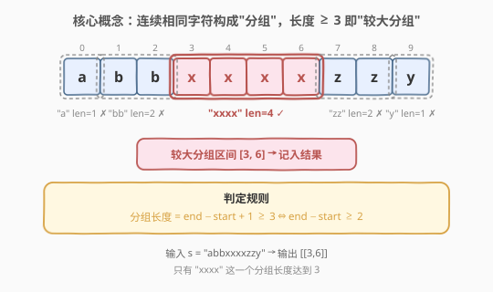
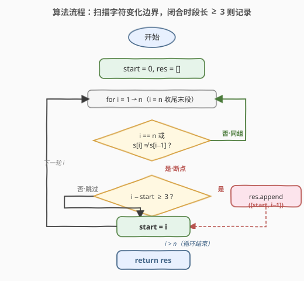
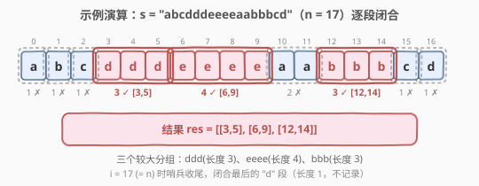

# 较大分组的位置

- **题目名称**：较大分组的位置
- **链接**：[830. 较大分组的位置](https://leetcode.cn/problems/positions-of-large-groups/)
- **难度**：简单
- **标签**：数组、双指针、一次遍历

## 1. 题目概述

给定一个由小写字母构成的字符串 `s`，其中包含若干由**连续相同字符**构成的分组。例如 `s = "abbxxxxzzy"` 含 `"a"`、`"bb"`、`"xxxx"`、`"zz"`、`"y"` 五个分组。

分组用区间 `[start, end]` 表示（`start`、`end` 为下标，闭区间）。称长度 **大于等于 3** 的分组为**较大分组**。要求找出所有较大分组的区间，**按起始下标递增顺序**返回。

**示例 1**：

```text
输入：s = "abbxxxxzzy"
输出：[[3,6]]
解释："xxxx" 是起始于 3、终止于 6 的较大分组（长度 4）。
```

**示例 2**：

```text
输入：s = "abc"
输出：[]
解释："a"、"b"、"c" 长度均为 1，没有较大分组。
```

**示例 3**：

```text
输入：s = "abcdddeeeeaabbbcd"
输出：[[3,5],[6,9],[12,14]]
解释：较大分组为 "ddd"、"eeee"、"bbb"。
```

**示例 4**：

```text
输入：s = "aba"
输出：[]
```

**约束条件**：

- `1 <= s.length <= 1000`
- `s` 仅含小写英文字母

> 💡 这是一道**一次遍历 + 起始指针**的入门题：本质上是在字符串上做"等值分段"——遇到字符变化的边界就闭合当前段，判定段长是否 ≥ 3。与 [228. 汇总区间](https://leetcode.cn/problems/summary-ranges/) 的"连续递增分段"形异神似，只是分段判据从"差为 1"换成"字符相同"。$O(n)$ 时间、$O(1)$ 额外空间。

---

## 2. 解题思路

### 2.1 暴力思路：枚举所有区间判等值

最直观的做法是枚举所有区间 `[i, j]`（$i \le j$），检查 `s[i..j]` 是否全为同一字符且长度 ≥ 3：

```text
res = []
for i in range(n):
    for j in range(i + 2, n):          # 长度至少 3 → j >= i+2
        if all(s[k] == s[i] for k in range(i, j + 1)):
            res.append([i, j])
return res
```

时间复杂度 $O(n^3)$（枚举区间 $O(n^2)$ × 判等值 $O(n)$）。对 $n = 1000$ 约 $10^9$ 次操作，明显超时。更糟的是，它还会产生大量**重叠**的区间（如 `"xxxx"` 会同时产出 `[3,5]`、`[3,6]`），与题意"分组"（极大同字符段）不符。

> ⚠️ 暴力法的问题在于：没有利用"分组"的极大性——同一个较大分组本应只对应**一个**区间（整段），而非所有长度 ≥ 3 的子区间。实际上只需在每个**同字符段的边界**判定一次段长即可。

### 2.2 核心观察：一次遍历 + 起始指针

**关键定义**：用变量 `start` 记录当前分组的起始下标。扫描 `i` 从 $1$ 到 $n$（**含 $n$**，用作哨兵收尾），当遇到以下情况时，当前分组 $[start,\ i-1]$ 闭合：

- `i == n`（走到末尾，闭合最后一段），或
- `s[i] != s[i-1]`（字符变化，前一段结束）。

闭合时，段长 $= i - start$（即 $(i-1) - start + 1$）。若 $i - start \ge 3$，则记录区间 $[start,\ i-1]$。随后令 `start = i`，开启新分组。



**为什么 `i` 要扫到 $n$？** 因为最后一段没有"下一个不同字符"来触发闭合。让 `i == n` 作为哨兵，统一在循环内处理末段的收尾，避免循环后再写一段重复逻辑——这与 [228. 汇总区间](https://leetcode.cn/problems/summary-ranges/) 用 `i == n` 收尾末段是同一技巧。

> 💡 **边界判据的等价转换**：题目要求长度 $\ge 3$，即 $\text{end} - \text{start} + 1 \ge 3$，等价于 $\text{end} - \text{start} \ge 2$，也等价于闭合时的 $i - \text{start} \ge 3$（因为 $\text{end} = i - 1$）。三种写法等价，用 $i - \text{start} \ge 3$ 最贴近代码（无需再 ±1）。

### 2.3 算法流程图



**完整步骤**：

1. **初始化**：`res = []`，`start = 0`（第一段起点），`n = len(s)`。
2. **扫描** $i = 1 \to n$（含 $n$）：
   - 若 `i == n` 或 `s[i] != s[i-1]`（分组边界）：
     - 若 $i - \text{start} \ge 3$：`res.append([start, i-1])`。
     - `start = i`（开启新分组）。
3. **返回** `res`。

> ⚠️ **两个易错点**：(1) 循环上界必须是 $n$（含），漏掉会导致最后一段（如 `"aba"` 末尾的 `"a"`，或恰好末段是较大分组如 `"abbxxx"` 的 `"xxx"`）不被闭合；(2) 闭合后务必 `start = i` 而非 `i-1`——`i` 已是新分组的起点（`s[i]` 是新字符）。

### 2.4 示例演算

以示例 3 `s = "abcdddeeeeaabbbcd"`（$n = 17$）为例，扫描过程每次在字符变化处闭合前段：



逐段解读：

| 闭合位置 i | 触发条件 | 闭合段 [start, i−1] | 段长 i−start | ≥3？ | 记录 |
|-----------|---------|---------------------|-------------|------|------|
| 1 | s[1]='b'≠s[0]='a' | [0,0] "a" | 1 | ✗ | — |
| 2 | s[2]='c'≠s[1]='b' | [1,1] "b" | 1 | ✗ | — |
| 3 | s[3]='d'≠s[2]='c' | [2,2] "c" | 1 | ✗ | — |
| 6 | s[6]='e'≠s[5]='d' | [3,5] "ddd" | 3 | ✓ | [3,5] |
| 10 | s[10]='a'≠s[9]='e' | [6,9] "eeee" | 4 | ✓ | [6,9] |
| 12 | s[12]='b'≠s[11]='a' | [10,11] "aa" | 2 | ✗ | — |
| 15 | s[15]='c'≠s[14]='b' | [12,14] "bbb" | 3 | ✓ | [12,14] |
| 16 | s[16]='d'≠s[15]='c' | [15,15] "c" | 1 | ✗ | — |
| 17 (n) | 哨兵收尾 | [16,16] "d" | 1 | ✗ | — |

最终 `res = [[3,5],[6,9],[12,14]]`，与示例一致。注意 $i = 17$（等于 $n$）这一轮用哨兵闭合了最后的 `"d"` 段——若无此哨兵，末段不会被处理。

> 💡 **对比示例 2** `s = "abc"`：每段长度都是 1，全部 $< 3$，结果为空 `[]`。**对比示例 4** `s = "aba"`：同样每段长度 1，结果为空。可见"较大分组"要求的是**同字符连续 ≥ 3**，与回文无关。

---

## 3. 参考代码

### C++

```cpp
class Solution {
public:
    vector<vector<int>> largeGroupPositions(string s) {
        vector<vector<int>> res;
        int n = s.size();
        for (int i = 1, start = 0; i <= n; ++i) {
            if (i == n || s[i] != s[i - 1]) {
                if (i - start >= 3) {
                    res.push_back({start, i - 1});
                }
                start = i;
            }
        }
        return res;
    }
};
```

### Python

```python
class Solution:
    def largeGroupPositions(self, s: str) -> List[List[int]]:
        res = []
        n = len(s)
        start = 0
        for i in range(1, n + 1):          # i 取到 n，用作哨兵收尾
            if i == n or s[i] != s[i - 1]:  # 分组边界
                if i - start >= 3:          # 段长 ≥ 3 → 较大分组
                    res.append([start, i - 1])
                start = i                   # 开启新分组
        return res
```

> 💡 两版逻辑完全一致：`start` 跟踪当前分组起点，`i` 扫到 $n$（含）以哨兵收尾。遇到边界时用 `i - start >= 3` 判段长（等价于 $\text{end} - \text{start} + 1 \ge 3$），命中则记录 $[start,\ i-1]$，随后 `start = i`。C++ 版把 `start` 收进 for 的 init 子句，体现其"循环私有状态"的语义。

---

## 4. 复杂度分析

| 维度 | 复杂度 | 说明 |
|------|--------|------|
| **时间复杂度** | $O(n)$ | `i` 从 $1$ 扫到 $n$，每轮 $O(1)$ 判定与更新 |
| **空间复杂度** | $O(1)$ | 仅 `start`、`i` 等常数变量；`res` 是输出，不计额外空间 |

> ⚠️ 本题已是该模型的最优复杂度——必须至少看每个字符一遍才能确定分组边界。相比暴力的 $O(n^3)$，关键在于利用了"同字符段是极大连续区间"的性质：每段只需在**唯一边界**处判定一次，无需枚举子区间。

---

## 5. 扩展：与"区间汇总"类问题的对照

本题的"等值分段"与若干"按单调性/连续性分段"的问题同源，差别仅在分段判据：

- **[228. 汇总区间](https://leetcode.cn/problems/summary-ranges/)**：按"值差为 1"分段（`nums[i] == nums[i-1] + 1`），分段后输出 `"start->end"` 或 `"start"` 字符串。判据是**数值连续递增**。
- **[830. 较大分组的位置](https://leetcode.cn/problems/positions-of-large-groups/)**（本题）：按"字符相同"分段（`s[i] == s[i-1]`），分段后过滤段长 $\ge 3$ 输出区间。判据是**等值**。
- **[1446. 连续字符](https://leetcode.cn/problems/consecutive-characters/)**：同样按"字符相同"分段，但输出**最长**段长而非所有长段区间——是 830 的"只取最值"变体。

三者共享同一个骨架：`start` 指针 + 扫到 $n$ 哨兵收尾 + 边界处闭合段。掌握这个模板，"分段型"字符串/数组题大都能快速拿下。

> 💡 进一步，若把分段判据换成"满足某谓词的最长段"，就过渡到 [485. 最大连续 1 的个数](https://leetcode.cn/problems/max-consecutive-ones/) 这类"最长满足谓词段"问题——仍可用 `start` 指针或直接维护段长计数。

---

## 6. 面试要点

1. **为什么 `i` 要扫到 $n$ 而不是 $n-1$？**

   - 最后一段没有"下一个不同字符"来触发闭合。若只扫到 $n-1$，末段（如 `"abbxxx"` 的 `"xxx"`）不会被处理。让 `i == n` 作为哨兵，配合 `i == n || s[i] != s[i-1]` 统一在循环内闭合末段，避免循环外再写重复代码。

2. **段长判定用 `i - start >= 3` 还是 `i - 1 - start >= 2`？**

   - 二者等价。闭合时段为 $[start,\ i-1]$，段长 $(i-1) - start + 1 = i - start$。写 `i - start >= 3` 直接对应"段长 $\ge 3$"，最不易出错；写成 `i - 1 - start >= 2` 则对应 $\text{end} - \text{start} \ge 2$，多一次减法容易笔误。

3. **闭合后为什么是 `start = i` 而不是 `start = i - 1`？**

   - 闭合发生在 `s[i] != s[i-1]` 时，意味着 `s[i]` 是**新字符**，即新分组的起点正是 $i$。若写成 `start = i - 1`，新分组起点会指向旧段的最后一个字符，导致下一段范围错误。

4. **结果是否天然按起始下标递增？需要排序吗？**

   - 不需要。`start` 随 `i` 单调递增，每次记录的区间 $[start,\ i-1]$ 的起点也单调递增，天然满足题目"按起始位置递增排序"的要求。

5. **能否用双指针 `i`/`j`（快慢）实现？**

   - 可以。让 `i` 指向段首，`j` 向后扩展直到 `s[j] != s[i]`，则段为 $[i,\ j-1]$，长度 $j - i$，判定后 `i = j` 继续。这与 `start` 指针法等价，只是把"边界检测"换成"主动扩展"。两者都是 $O(n)$，`start` 法更贴近 228 的模板。

> 💡 **一句话总结**：830 是"等值分段"的入门题——`start` 指针 + 扫到 $n$ 哨兵收尾 + 边界处用 `i - start >= 3` 判段长。$O(n)$ / $O(1)$，关键在哨兵 `i == n` 与闭合后 `start = i` 两个细节。

---

## 7. 同类练习题

- [228. 汇总区间](https://leetcode.cn/problems/summary-ranges/)：同骨架的"数值连续递增分段"，输出区间字符串，对照 830 的"等值分段"
- [1446. 连续字符](https://leetcode.cn/problems/consecutive-characters/)：同为"等值分段"，但只取最长段长，是 830 的"取最值"变体
- [485. 最大连续 1 的个数](https://leetcode.cn/problems/max-consecutive-ones/)：分段判据换成"值为 1"，求最长段，过渡到"满足谓词的最长段"
- [1869. 哪种连续子字符串更长](https://leetcode.cn/problems/longer-contiguous-segments-of-ones-than-zeros/)：等值分段后比较 1 段与 0 段的最长长度，830 模板的直接应用
