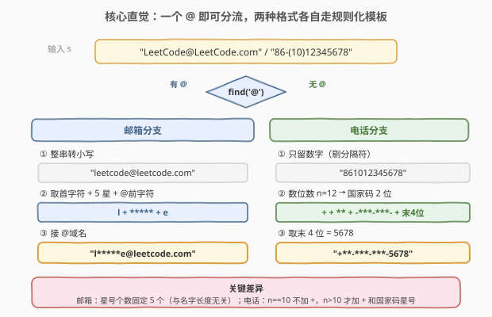
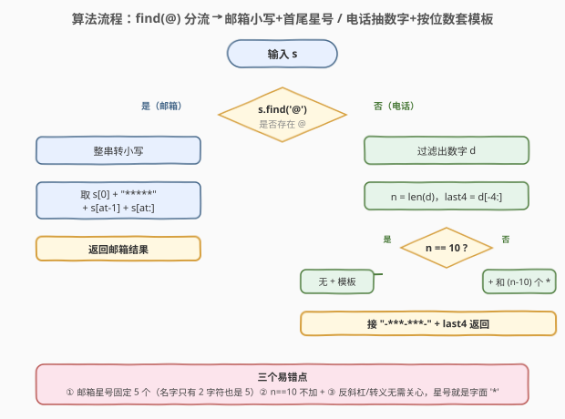
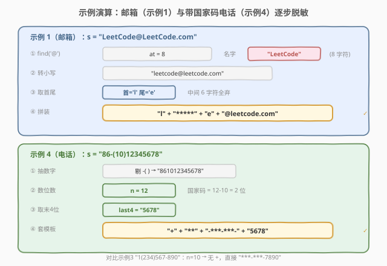

# 隐藏个人信息

- **题目名称**：隐藏个人信息
- **链接**：[831. 隐藏个人信息](https://leetcode.cn/problems/masking-personal-information/)
- **难度**：中等
- **标签**：字符串、模拟

## 1. 题目概述

给定一条个人信息字符串 `s`，它要么是一个**邮箱地址**，要么是一串**电话号码**。要求按以下规则对个人信息进行**隐藏（脱敏）**后返回。

**电子邮件地址**结构：`名字 @ 域名`。隐藏规则：

1. 名字和域名中的大写字母全部转**小写**；
2. 名字**中间**的字母（即除第一个和最后一个字母外的所有字符）一律用 **5 个 `*`** 替换。

**电话号码**结构：10–13 位数字，后 10 位是**本地号码**，前面剩下的 0–3 位是**国家代码**；数字之间可能夹杂 `{'+', '-', '(', ')', ' '}` 这些分隔字符。隐藏规则：

1. 先**移除所有分隔字符**，只保留数字；
2. 按位数套用如下模板（`XXXX` 为本地号码最后 4 位）：

| 国家代码位数 | 输出格式 |
|--------------|----------|
| 0 位（共 10 位） | `***-***-XXXX` |
| 1 位（共 11 位） | `+*-***-***-XXXX` |
| 2 位（共 12 位） | `+**-***-***-XXXX` |
| 3 位（共 13 位） | `+***-***-***-XXXX` |

**示例 1**：

```text
输入：s = "LeetCode@LeetCode.com"
输出："l*****e@leetcode.com"
解释：邮箱。名字和域名转小写，名字中间用 5 个 * 替换。
```

**示例 2**：

```text
输入：s = "AB@qq.com"
输出："a*****b@qq.com"
解释：邮箱。名字只有 2 个字符，中间仍必须有 5 个 *。
```

**示例 3**：

```text
输入：s = "1(234)567-890"
输出："***-***-7890"
解释：电话。共 10 位数字，国家代码 0 位，格式 "***-***-7890"。
```

**示例 4**：

```text
输入：s = "86-(10)12345678"
输出："+**-***-***-5678"
解释：电话。共 12 位数字，国家代码 2 位，格式 "+**-***-***-5678"。
```

**约束条件**：

- `s` 是一个**有效**的电子邮件或者电话号码
- 邮箱：`8 <= s.length <= 40`，由大小写英文字母、恰好一个 `@`、以及 `.` 组成
- 电话：`10 <= s.length <= 20`，由数字、空格、`(`、`)`、`-`、`+` 组成

> 💡 这是一道**字符串模拟**题：没有复杂算法，难点在于把「两种格式 + 多条规则」理清后用最简洁的代码落地。核心是「**分支判别 + 规则化模板**」——先看有没有 `@` 区分邮箱/电话，再各自走一条干净的格式化路径，避免堆砌 `if-else`。

---

## 2. 解题思路

### 2.1 朴素思路：逐字符扫描、边判边拼

最直观的做法是逐个字符处理：遇到字母判断大小写、遇到分隔符跳过、遇到 `@` 切分前后——边走边把结果拼出来。但这样会把**判别、清洗、格式化**三件事搅在一起：

- 邮箱需要知道 `@` 的位置才能确定「名字」的首尾，但逐字符扫到 `@` 时名字已处理一半，状态难维护；
- 电话需要先**知道总位数**才能判断国家代码长度、决定要不要加 `+` 和几个 `*`，而位数只有把分隔符全去掉后才能数清；
- 大小写转换、分隔符剔除散落在各处分支里，易漏易错。

> ⚠️ 朴素写法的问题不在于「错」，而在于「乱」——把多步规则耦合在一次遍历中，每加一条规则就要改多处。更稳妥的做法是**分阶段**：先判类型，再清洗数据，最后套模板。

### 2.2 核心观察：分支判别 + 规则化模板

**关键观察 1：一个字符即可判别类型。** 邮箱一定含 `@`，电话一定不含（电话字符集只有 `数字/空格/()+-`）。所以 `s.find('@')` 一步即可分流，无需正则或复杂判定。



**关键观察 2：邮箱的脱敏只依赖名字的首尾两个字符。** 名字中间无论几个字符，一律换成固定的 `*****`（5 个星号）——连「中间有几位」都不用算。所以邮箱只需：

```
小写化 → 取 name[0] + "*****" + name[-1] + "@" + domain
```

注意 `name` 至少 2 个字符，`name[-1]` 即 `@` 前一位，永远有效。

**关键观察 3：电话的格式由「数字总位数」唯一决定。** 剔除分隔符后设数字串长为 `n`：

- `n == 10`：国家代码 0 位，输出 `***-***-XXXX`（无 `+`）；
- `n > 10`：国家代码 `n-10` 位，输出 `+` + `(n-10)` 个 `*` + `-***-***-XXXX`。

后 10 位中的前 6 位永远是 `***-***`，**唯一变化的是国家代码部分的星号个数**。于是电话只需：

```
digits = 只留数字
last4  = digits[-4:]
n == 10 ? "***-***-" + last4
        : "+" + "*"*(n-10) + "-***-***-" + last4
```

> 💡 **模板化思维**：电话的四种格式看似要四个分支，实则可统一为 `+`+`cc_len` 个星号（`cc_len` 可为 0，此时 `+` 也省） + `-***-***-` + `last4`。把 `n==10` 视作 `cc_len=0` 的特例（不加 `+`），代码就能用一条表达式覆盖四种情形。

### 2.3 算法流程图



**完整步骤**：

1. **判别类型**：`at = s.find('@')`。
2. **若 `at` 存在（邮箱）**：
   - 整串 `s` 转小写；
   - 返回 `s[0] + "*****" + s[at-1] + s[at:]`（即 `首字符 + 5星 + @前字符 + @域名`）。
3. **否则（电话）**：
   - 抽出所有数字字符得 `digits`，记长度 `n`；
   - `last4 = digits[n-4:]`；
   - 若 `n == 10`：返回 `"***-***-" + last4`；
   - 否则：返回 `"+" + "*" * (n-10) + "-***-***-" + last4`。

> ⚠️ **两个易错点**：(1) 邮箱名字只有 2 个字符时（如 `AB@qq.com`），中间仍要填 **5 个** `*`，不是 `2-2=0` 个——星号个数固定为 5，与原名字长度无关；(2) 电话 `n==10` 时**不能加 `+`**，只有国家代码非 0（`n>10`）才以 `+` 开头。

### 2.4 示例演算

以示例 1（邮箱）和示例 4（带国家代码的电话）为例，展示两条分支的处理过程：



**邮箱分支** `s = "LeetCode@LeetCode.com"`：

| 步骤 | 操作 | 结果 |
|------|------|------|
| ① 找 `@` | `at = 8` | 名字 `"LeetCode"`，域名 `"LeetCode.com"` |
| ② 转小写 | 整串 lower | `"leetcode@leetcode.com"` |
| ③ 取首尾 | `s[0]='l'`，`s[at-1]=s[7]='e'` | 首尾字符 `'l'`、`'e'` |
| ④ 拼装 | `l + ***** + e + @leetcode.com` | `"l*****e@leetcode.com"` ✓ |

注意名字 `"LeetCode"` 有 8 个字符，中间 6 个（`eetCode` 除去首尾的 `e`、`e`... 实际中间是 `eetCod`）全部被 5 个 `*` 替换——星号个数与中间字符数**无关**。

**电话分支** `s = "86-(10)12345678"`：

| 步骤 | 操作 | 结果 |
|------|------|------|
| ① 抽数字 | 去掉 `-(  )` 等分隔符 | `"861012345678"` |
| ② 数位数 | `n = 12` | 国家代码 `n-10 = 2` 位 |
| ③ 取末 4 位 | `digits[-4:]` | `"5678"` |
| ④ 套模板 | `+` + `**` + `-***-***-` + `5678` | `"+**-***-***-5678"` ✓ |

对比示例 3 `s = "1(234)567-890"`：抽数字得 `"1234567890"`，`n=10`，国家代码 0 位，**不加 `+`**，直接 `"***-***-7890"`。可见 `n==10` 与 `n>10` 的唯一差别就是有没有那个 `+` 和前面的国家代码星号段。

> 💡 **边界对照**：国家代码最多 3 位（`n=13`），此时输出 `+***-***-***-XXXX`，星号段最长 3 个 `*`；邮箱名字最短 2 字符（如 `AB@qq.com`），中间仍 5 个 `*`。这两种「最少」情形恰好是两个易错点。

---

## 3. 参考代码

### C++

```cpp
class Solution {
public:
    string maskPII(string s) {
        auto at = s.find('@');
        if (at != string::npos) {                 // 邮箱
            transform(s.begin(), s.end(), s.begin(), ::tolower);
            return string(1, s[0]) + "*****" + string(1, s[at - 1]) + s.substr(at);
        }
        string d;                                  // 电话：只留数字
        for (char c : s) if (isdigit(c)) d += c;
        int n = d.size();
        string last4 = d.substr(n - 4);
        if (n == 10) return "***-***-" + last4;
        return "+" + string(n - 10, '*') + "-***-***-" + last4;
    }
};
```

### Python

```python
class Solution:
    def maskPII(self, s: str) -> str:
        at = s.find('@')
        if at != -1:                               # 邮箱
            s = s.lower()
            return s[0] + '*****' + s[at - 1] + s[at:]
        digits = [c for c in s if c.isdigit()]      # 电话：只留数字
        last4 = ''.join(digits[-4:])
        if len(digits) == 10:
            return '***-***-' + last4
        return '+' + '*' * (len(digits) - 10) + '-***-***-' + last4
```

> 💡 两版逻辑完全一致。邮箱分支先把整串转小写，再取 `s[0]`、`s[at-1]`（`@` 前一位）和 `s[at:]`（含 `@` 及域名）拼装，星号个数硬编码为 5。电话分支用 `isdigit` 过滤出纯数字串，按位数分流：`n==10` 走无 `+` 的本地模板，`n>10` 走带 `+` 和 `n-10` 个星号的国际模板。核心是「**先清洗再格式化**」，避免在脏数据上做判断。

---

## 4. 复杂度分析

| 维度 | 复杂度 | 说明 |
|------|--------|------|
| **时间复杂度** | `O(n)` | 邮箱：一次 `find` + 一次 `lower` + 一次切片拼装，均 `O(n)`；电话：一次过滤数字 `O(n)` + 一次切片 `O(1)`（末 4 位），整体线性 |
| **空间复杂度** | `O(n)` | 输出字符串长度与输入同阶；电话分支额外存数字串 `d`，最长 13 位为 `O(1)`，但按输出计仍 `O(n)` |

> ⚠️ 本题已是最优复杂度——必须至少遍历一遍输入才能完成清洗与判别。常数优化空间不大，重点在代码的**清晰度**与**正确性**（边界 `n==10` 是否漏 `+`、星号是否固定 5 个）。

---

## 5. 扩展：真实场景中的 PII 脱敏

本题的脱敏规则是 LeetCode 为练习设计的简化版，真实业务里个人信息（PII, Personally Identifiable Information）脱敏更复杂，但思想同源——**按字段类型套规则化模板**：

- **邮箱**：业界常见做法正是「保留首尾字符 + 固定星号」，与本题一致（如 `l*****e@xx.com`），目的是既隐藏真实用户名又保留可辨识度方便排查。
- **手机号**：常保留后 4 位（对照本题的 `last4`），因为后 4 位在客服核验场景里常被用作「部分校验」；国家代码一般全隐。
- **身份证 / 银行卡**：通常保留前 4 后 4，中间星号个数等于真实位数（与本题「星号固定 5 个」不同——身份证脱敏往往要保留长度信息以便校验格式）。
- **不可逆 vs 可逆**：本题是**不可逆脱敏**（星号无法还原）。若需可逆，则要用**加密 + 密钥分离**或**令牌化（tokenization）**：真实值存保险箱，业务侧只持有 token。

> ⚠️ 真实脱敏系统还要考虑**日志泄漏**：一次 `print` 可能把原始 PII 写进日志文件；合规框架（如 GDPR / 个保法）要求全链路脱敏。所以工程上往往用统一的 `mask(field_type, value)` 函数集中处理，而非各处手写——本题的 `maskPII` 就是这样一个「字段类型 → 模板」的微型脱敏器。

---

## 6. 面试要点

1. **怎么判断输入是邮箱还是电话？**

   - 看有没有 `@`：邮箱必含恰好一个 `@`，电话字符集只有 `数字/空格/()+-`，绝不含 `@`。`s.find('@')` 一步即可分流，无需正则。这是最简洁的判别条件。

2. **邮箱名字只有 2 个字符时，中间填几个星号？**

   - 仍是 **5 个**。星号个数固定为 5，与名字长度无关（见示例 2 `AB@qq.com → a*****b@qq.com`）。这是最高频的踩坑点——容易想当然地按「中间字符数」填星号。

3. **电话 10 位数字和 12 位数字的输出有什么区别？**

   - 10 位（`n==10`）国家代码 0 位，输出 `***-***-XXXX`，**没有 `+`**；12 位（`n==12`）国家代码 2 位，输出 `+**-***-***-XXXX`，**有 `+` 且前面 2 个星号**。差别只在开头的 `+` 和国家代码星号段，后 10 位的 `***-***-XXXX` 模板完全一致。

4. **能不能把电话的四种格式统一成一条表达式？**

   - 可以。把 `n==10` 视作国家代码长度 `cc = n-10 = 0` 的特例：当 `cc > 0` 时输出 `+` + `cc` 个 `*`，`cc == 0` 时输出空串；之后统一接 `-***-***-` + `last4`。代码里用 `if (n==10) ... else ...` 两个分支更直白，也可写成 `("+" + "*"*(n-10) + "-") if n>10 else ""` 前缀 + `"***-***-" + last4` 后缀的单表达式，权衡可读性。

5. **为什么要先剔除分隔符再判断位数，而不是直接用原始长度？**

   - 原始字符串里夹杂 `(`、`)`、`-`、空格等，长度远大于真实数字位数（如 `"1(234)567-890"` 长 14 但只有 10 位数字）。国家代码长度由**数字位数**决定，必须先清洗出纯数字串才能数对。这体现「先清洗再判别」的工程习惯。

> 💡 **一句话总结**：831 是字符串模拟题的范式——`find('@')` 分流邮箱/电话，邮箱走「小写 + 首尾保留 + 固定 5 星」，电话走「抽数字 + 按位数套模板」。`O(n)`/`O(n)`，关键在星号固定 5 个、`n==10` 不加 `+` 两个边界。

---

## 7. 同类练习题

- [468. 验证 IP 地址](https://leetcode.cn/problems/validate-ip-address/)（[题解](../0401-0500/468_验证IP地址.md)）：同为「按格式规则校验/转换字符串」，IPv4/IPv6 分流 + 分段规则校验，与 831 的邮箱/电话分流形异神似
- [93. 复原 IP 地址](https://leetcode.cn/problems/restore-ip-addresses/)（[题解](../0001-0100/93_复原IP地址.md)）：字符串分段合法性 + 回溯剪枝，与 831 电话分支「抽数字后按位数判格式」对照，体会「规则化校验」的两种粒度
- [819. 最常见的单词](https://leetcode.cn/problems/most-common-word/)（[题解](../0801-0900/819_最常见的单词.md)）：字符串清洗（去标点 + 转小写）再统计，与 831 电话分支「先剔分隔符再处理」同源，体会「清洗先行」的通用套路
- [816. 模糊坐标](https://leetcode.cn/problems/ambiguous-coordinates/)（[题解](../0801-0900/816_模糊坐标.md)）：把数字串按规则切成合法坐标的多种形式，与 831 电话「按位数套模板」对照，同为字符串格式化但多了枚举维度
