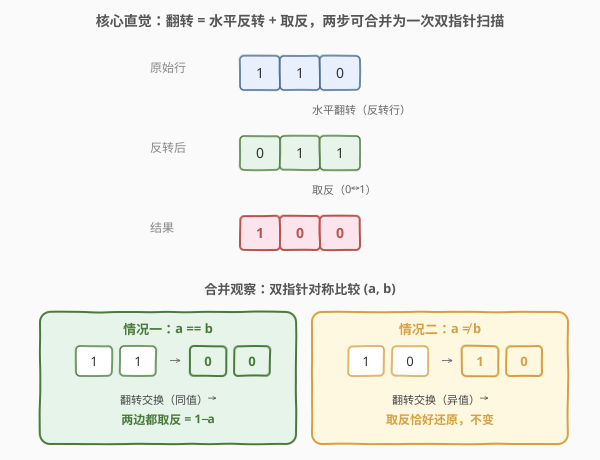
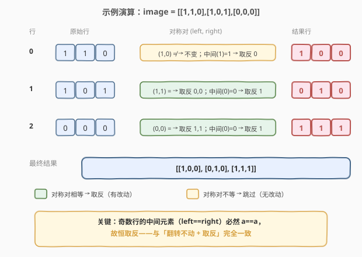

# LeetCode 翻转图像 题解

## 1. 题目概述

- **标题 / 题号**：翻转图像（#832，easy）
- **链接**：https://leetcode.cn/problems/flipping-an-image/
- **难度**：简单
- **标签**：数组、双指针、位运算、矩阵

**题意**：给定一个 $n \times n$ 的**二进制矩阵** `image`（每个元素为 `0` 或 `1`），要求对它依次执行两步操作，并返回结果矩阵：

1. **水平翻转**：把每一行**反转**（即第 `i` 行 `image[i]` 变成它的逆序）。
2. **反转**（取反）：把每个 `0` 变成 `1`，每个 `1` 变成 `0`。

两步必须**按顺序**执行：先水平翻转，再取反。

**示例 1**：

```text
输入：image = [[1,1,0],[1,0,1],[0,0,0]]
输出：[[1,0,0],[0,1,0],[1,1,1]]
解释：
    第一步 水平翻转（每行反转）：
        [1,1,0] → [0,1,1]
        [1,0,1] → [1,0,1]
        [0,0,0] → [0,0,0]
    第二步 取反（0↔1）：
        [0,1,1] → [1,0,0]
        [1,0,1] → [0,1,0]
        [0,0,0] → [1,1,1]
```

**示例 2**：

```text
输入：image = [[1,1,0,0],[1,0,0,1],[0,1,1,0],[1,0,1,0]]
输出：[[1,1,0,0],[0,1,1,0],[1,0,0,1],[1,0,1,0]]
解释：
    第一步 水平翻转：
        [1,1,0,0] → [0,0,1,1]
        [1,0,0,1] → [1,0,0,1]
        [0,1,1,0] → [0,1,1,0]
        [1,0,1,0] → [0,1,0,1]
    第二步 取反：
        [0,0,1,1] → [1,1,0,0]
        [1,0,0,1] → [0,1,1,0]
        [0,1,1,0] → [1,0,0,1]
        [0,1,0,1] → [1,0,1,0]
```

**约束**：

- `n == image.length`
- `n == image[i].length`
- `1 <= n <= 20`
- `image[i][j]` 为 `0` 或 `1`

> 💡 这是一道**双指针 + 位运算**的入门题。看似要分两步（反转行 + 取反），但对每一行用左右双指针**对称比较**时，两步可合并成一次扫描：若对称两值**相等**则都取反，**不等**则恰好不变。核心是把「翻转 + 取反」的复合变换化简为对对称对的单一判定，与 [48. 旋转图像](../0001-0100/48_旋转图像.md) 同属矩阵原地变换家族。

## 2. 解题思路

### 2.1 暴力思路：分两步模拟

最直观的做法是严格按题意分两步走：

```text
for each row in image:
    reverse(row)              # 第一步：水平翻转（反转行）
for each row in image:
    for each cell in row:
        cell = 1 - cell       # 第二步：取反（0↔1）
return image
```

时间复杂度 $O(n^2)$（每个元素被访问两次），空间 $O(1)$（原地修改）。对 $n \le 20$ 的规模毫无压力，一定能过。问题在于：**遍历了两遍矩阵**，且两步之间存在可被合并的冗余——水平翻转本质是「对称位置交换」，取反是「每个值异或 1」，二者叠加在对称对上有更简单的等价形式。

> ⚠️ 暴力法不是「过不了」，而是「没看透」。当反转与取反作用于**同一对对称位置**时，它们的复合效果会退化成一条极简规则——这正是双指针合并扫描的突破口。

### 2.2 核心观察：双指针合并翻转与取反

**关键定义**：对每一行，用左右双指针 `left`、`right` 从两端向中间走，考察**对称对** $(a, b) = (\text{image[row][left]}, \text{image[row][right]})$。

**核心推导**：水平翻转把对称对 $(a, b)$ 交换为 $(b, a)$，取反再把每个值异或 1，所以最终这对位置上的值变为：

$$
\text{left 位置} = b \oplus 1, \qquad \text{right 位置} = a \oplus 1
$$

由于 $a, b \in \{0, 1\}$，分两种情况：

- **情况一：$a = b$**。则 $b \oplus 1 = a \oplus 1$，**两边都变成 $1 - a$**（即都取反）。
- **情况二：$a \ne b$**。由于是二值，$a \ne b$ 意味着 $\{a, b\} = \{0, 1\}$，故 $b \oplus 1 = a$ 且 $a \oplus 1 = b$，**两边恰好还原成原值，不变**。



于是算法极其简洁：对每一行，`left` 从 `0`、`right` 从 `n-1` 相向而行，**当且仅当对称两值相等时**才把它们都取反（置为 $1 - a$）；不相等则跳过。两步合并成一次扫描，每个元素至多被访问一次。

> 💡 **为什么 $a \ne b$ 时可以跳过？** 因为翻转先把 $(a,b)$ 交换成 $(b,a)$，取反又把 $b$ 变 $1-b$、$a$ 变 $1-a$；而 $a \ne b$ 时 $1-b = a$、$1-a = b$，等于又换回来了——**交换两次等于没换，取反在二值下恰好抵消交换**。这是本题最优雅的洞察：复合变换在对称对上退化为「相等才取反」。
>
> ⚠️ **奇数行长的中间元素**：当 `left == right`（$n$ 为奇数时的正中元素），它和自身对称，恒有 $a = a$，落入「情况一」，必然取反。这与直觉一致——中间元素水平翻转后位置不变，只剩取反一步。

### 2.3 算法流程图


**完整步骤**：

1. **外层循环**：遍历每一行 `row = 0 … n-1`。
2. **初始化双指针**：`left = 0`，`right = n - 1`。
3. **内层循环**：当 `left <= right`（未交叉）时重复：
   - 取 $a = \text{image[row][left]}$，$b = \text{image[row][right]}$。
   - **若 $a = b$**：把两者都置为 $1 - a$（取反）。
   - **若 $a \ne b$**：不操作（跳过）。
   - `left++`，`right--`，继续。
4. **返回**原地修改后的 `image`。

> ⚠️ **循环条件用 `left <= right` 而非 `left < right`**：当 $n$ 为奇数时，中间元素 `left == right` 需要被处理（它必然满足 $a = a$，会被取反）。若用 `<`，中间元素会被漏掉导致错误。

### 2.4 示例演算

以示例 1 `image = [[1,1,0],[1,0,1],[0,0,0]]`（$n = 3$）为例，逐行追踪双指针对称对的判定：



| 行 | 原始行 | 对称对 $(a,b)$ 判定 | 结果行 |
|----|--------|---------------------|--------|
| 0 | `[1,1,0]` | $(1,0) \ne$ → 跳过；中间 $(1)=1$ → 取反 $0$ | `[1,0,0]` |
| 1 | `[1,0,1]` | $(1,1) =$ → 取反 $0,0$；中间 $(0)=0$ → 取反 $1$ | `[0,1,0]` |
| 2 | `[0,0,0]` | $(0,0) =$ → 取反 $1,1$；中间 $(0)=0$ → 取反 $1$ | `[1,1,1]` |

逐行解读：

- **行 0** `[1,1,0]`：`left=0`、`right=2`，$(1,0)$ 不等 → 跳过（两端保持 `1` 和 `0`）；`left=right=1`，中间值 $1$ 取反为 $0$。结果 `[1,0,0]`。
- **行 1** `[1,0,1]`：`left=0`、`right=2`，$(1,1)$ 相等 → 两端都取反为 $0$；`left=right=1`，中间值 $0$ 取反为 $1$。结果 `[0,1,0]`。
- **行 2** `[0,0,0]`：`left=0`、`right=2`，$(0,0)$ 相等 → 两端都取反为 $1$；`left=right=1`，中间值 $0$ 取反为 $1$。结果 `[1,1,1]`。

最终答案 `[[1,0,0],[0,1,0],[1,1,1]]`，与示例一致。

> 💡 注意行 0：对称对 $(1,0)$ 不等时**两端原值得以保留**——这正是「交换两次抵消 + 二值取反抵消」的体现。若误用暴力法分两步，行 0 反转得 `[0,1,1]` 再取反得 `[1,0,0]`，结果相同，但合并法省去了对这对位置的任何写入。

## 3. 参考代码

### C++

```cpp
class Solution {
public:
    vector<vector<int>> flipAndInvertImage(vector<vector<int>>& image) {
        int n = image.size();
        for (int row = 0; row < n; ++row) {
            int left = 0, right = n - 1;
            while (left <= right) {           // <= 保留奇数长的中间元素
                if (image[row][left] == image[row][right]) {
                    int inv = 1 - image[row][left];   // 相等：两边都取反
                    image[row][left] = inv;
                    image[row][right] = inv;
                }
                // 不等：跳过（取反恰好还原）
                ++left;
                --right;
            }
        }
        return image;
    }
};
```

### Python

```python
class Solution:
    def flipAndInvertImage(self, image: List[List[int]]) -> List[List[int]]:
        n = len(image)
        for row in image:
            left, right = 0, n - 1
            while left <= right:              # <= 保留奇数长的中间元素
                if row[left] == row[right]:
                    inv = 1 - row[left]       # 相等：两边都取反
                    row[left] = inv
                    row[right] = inv
                # 不等：跳过（取反恰好还原）
                left += 1
                right -= 1
        return image
```

> 💡 两版逻辑完全一致：逐行用左右双指针对向收缩，**仅当对称两值相等**时把它们都置为 $1 - a$，否则跳过。`while left <= right` 的 `=` 保证奇数行长时中间元素被取反。原地修改，无需额外矩阵。

## 4. 复杂度分析

| 维度 | 复杂度 | 说明 |
|------|--------|------|
| **时间复杂度** | $O(n^2)$ | 共 $n$ 行，每行双指针扫 $n/2$ 对，每个元素至多访问一次；总体线性于矩阵元素总数 |
| **空间复杂度** | $O(1)$ | 仅用 `left`、`right`、`inv` 等常数变量，原地修改输入矩阵 |

> ⚠️ 本题已是该模型的最优复杂度——必须至少看每个元素一次才能确定其最终值。合并法相比暴力的两遍扫描，把「反转 + 取反」两次遍历压成一次，且利用「不等则跳过」减少了写入次数。约束 $n \le 20$ 规模极小，任意解法都能过，但合并法是面试中最干净的写法。

## 5. 扩展：异或统一视角

取反操作的本质是**异或 1**（$x \oplus 1 = 1 - x$，对 $x \in \{0,1\}$ 成立）。从异或角度看，对称对 $(a, b)$ 经「翻转（交换）+ 取反（异或 1）」后：

$$
\text{left} = b \oplus 1, \qquad \text{right} = a \oplus 1
$$

- $a = b$ 时：$b \oplus 1 = a \oplus 1$，两边都等于 $a \oplus 1$，即**都取反**。
- $a \ne b$ 时：$b \oplus 1 = a$、$a \oplus 1 = b$，两边**还原成原值**，等价于不动。

这说明「相等才取反、不等则跳过」并非投机取巧，而是复合变换 $\text{swap} \circ \text{xor } 1$ 在二值对称对上的**精确等价**。跳过分支只是避免了「写回相同值」的冗余操作，结果与暴力两步法完全一致。

> 💡 **一个推论**：若把「取反」换成「异或任意常数 $c$」，结论仍成立——$a = b$ 时两边都异或 $c$，$a \ne b$ 时仅当 $c = 1$（二值下 $a \ne b \Rightarrow b \oplus c = a$ 当且仅当 $c = 1$）才恰好还原。所以本题的「跳过」优化是 $c = 1$ 的特例，理解这一点有助于迁移到类似的位运算矩阵题。

## 6. 面试要点

1. **为什么 $a \ne b$ 时可以跳过，结果不会错？**

   - 翻转先把 $(a,b)$ 交换成 $(b,a)$，取反再把 $b \oplus 1$、$a \oplus 1$ 放回两端。$a \ne b$ 时（二值）$b \oplus 1 = a$、$a \oplus 1 = b$，等于又换回原值——交换两次抵消，取反在二值下恰好补回交换，故不动。

2. **循环条件为什么是 `left <= right` 而不是 `left < right`？**

   - $n$ 为奇数时中间元素 `left == right` 需要被取反。它和自身对称，恒满足 $a = a$，落入「相等取反」分支。若用 `<`，中间元素被漏过，结果错误。

3. **能不能不分两步、也不双指针，直接用公式算每个位置？**

   - 可以。最终 `result[row][j] = 1 - image[row][n-1-j]`（先翻转移到 $n-1-j$ 位置，再取反）。这也是 $O(n^2)$，但需新矩阵或两次遍历原地倒腾。双指针合并法的优势是**一次扫描、原地、且对不等对零写入**。

4. **如果不要求原地，写出新矩阵会更简单吗？**

   - 会。直接 `result[row][j] = 1 - image[row][n-1-j]` 一行搞定，无需双指针。但牺牲了 $O(n^2)$ 额外空间。面试中若被追问「能否原地」，再切换到双指针合并法。

5. **这道题和 48. 旋转图像 有什么联系与区别？**

   - 同属矩阵原地变换家族。48 是「转置 + 反射」合成 90° 旋转，两步也可合并但需分主对角线/副对角线处理；832 是「反转 + 取反」，因取反是二值异或 1，合并后规则更简（相等取反）。两者都体现了「复合变换在对称结构上可化简」的思想。

> 💡 **一句话总结**：832 是双指针合并两步变换的入门题——逐行左右对称比较，相等则取反、不等则跳过，$O(n^2)$ / $O(1)$。关键洞察是「翻转 + 取反」在二值对称对上退化为「相等才取反」，奇数长的中间元素恒取反。

## 同类练习题

| # | 题目 | 与本题的关联 |
|---|------|-------------|
| 48 | [旋转图像](https://leetcode.cn/problems/rotate-image/)（[题解](../0001-0100/48_旋转图像.md)） | 矩阵原地变换家族，转置 + 反射两步合成 90° 旋转，对比 832 的反转 + 取反两步可合并 |
| 977 | [有序数组的平方](https://leetcode.cn/problems/squares-of-a-sorted-array/)（[题解](../0901-1000/977_有序数组的平方.md)） | 对撞双指针从两端向中间填结果，与 832 的对称双指针同源 |
| 876 | [链表的中间结点](https://leetcode.cn/problems/middle-of-the-linked-list/)（[题解](../0801-0900/876_链表的中间结点.md)） | 快慢双指针定位中点，与 832 的左右对称双指针对照，体会「中点处理」的细节差异 |
| 11 | [盛最多水的容器](https://leetcode.cn/problems/container-with-most-water/)（[题解](../0001-0100/11_盛最多水的容器.md)） | 双指针收缩求最值，832 双指针家族的另一形态——两端相向而行但判定逻辑不同 |
