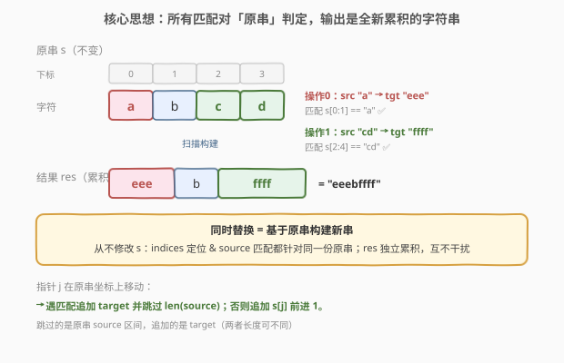
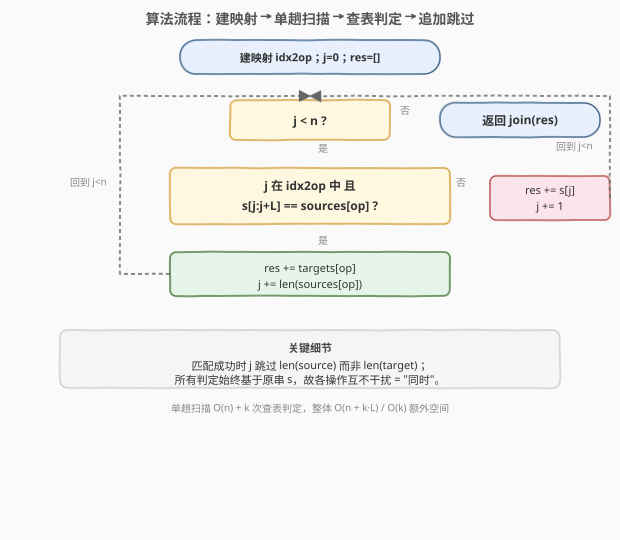
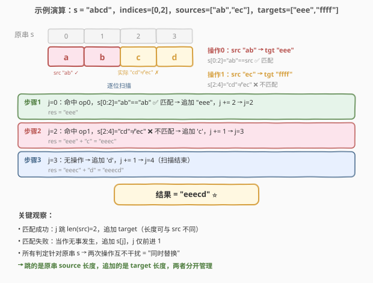

# LeetCode 字符串中的查找与替换 题解

## 1. 题目概述

- **标题 / 题号**：字符串中的查找与替换（#833，medium）
- **链接**：https://leetcode.cn/problems/find-and-replace-in-string/
- **难度**：中等
- **标签**：字符串、哈希表、模拟

**题意**：给定一个 0-indexed 字符串 `s`，以及 `k` 个替换操作（由三个长度均为 `k` 的并行数组 `indices`、`sources`、`targets` 给出）。对第 `i` 个操作：

1. 检查子串 `sources[i]` 是否出现在**原串** `s` 的索引 `indices[i]` 处；
2. 若未出现，**什么都不做**；
3. 若出现，则用 `targets[i]` **替换**该子串。

**关键约束**：所有替换必须**同时**发生——即一个替换不应影响其它替换的索引定位。测试用例保证各操作的替换区间**不会重叠**。

**示例 1**：

```text
输入：s = "abcd", indices = [0,2], sources = ["a","cd"], targets = ["eee","ffff"]
输出："eeebffff"
解释：索引 0 处 "a" 匹配 → 替换为 "eee"；索引 2 处 "cd" 匹配 → 替换为 "ffff"。
```

**示例 2**：

```text
输入：s = "abcd", indices = [0,2], sources = ["ab","ec"], targets = ["eee","ffff"]
输出："eeecd"
解释：索引 0 处 "ab" 匹配 → 替换为 "eee"；索引 2 处 "ec" 不匹配（原串是 "cd"）→ 不替换，保留 "cd"。
```

**约束**：

- `1 <= s.length <= 1000`
- `k == indices.length == sources.length == targets.length`
- `1 <= k <= 100`
- `0 <= indices[i] < s.length`
- `1 <= sources[i].length, targets[i].length <= 50`
- `s`、`sources[i]`、`targets[i]` 仅由小写英文字母组成

> 💡 题眼在「**同时**」二字：替换基于**原串**判定与定位，而非前一次替换后的串。一旦想清楚"输出是一棵全新字符串、所有匹配都对着原串做"，问题就退化为一次扫描 + 查表。

## 2. 解题思路

### 2.1 暴力陷阱：按 indices 顺序逐个原地替换

最直觉的做法是遍历操作、在 `s` 上原地 `replace`：

```text
for i in range(k):
    if s[indices[i] : indices[i]+len(sources[i])] == sources[i]:
        s = s[:indices[i]] + targets[i] + s[indices[i]+len(sources[i]):]
```

但这会**破坏同时性**——第一次替换后字符串长度变了，后续 `indices[i]` 指向的是新串位置而非原串位置。例如 `s="abcd"`，先在索引 0 把 `"ab"`→`"eee"` 得 `"eeecd"`，此时索引 2 指向 `'e'` 而非原串的 `'c'`，本应匹配的 `"cd"` 操作就此失效。

> ⚠️ 即便按 `indices` 排序、用累计偏移量补偿，也因「替换成功才改偏移、失败则不变」而极易写错；且 `source` 匹配必须始终对**原串**判定，原地做法还需额外维护一份原串副本，徒增复杂度。正确思路是**根本不要原地改**。

### 2.2 核心观察：同时替换 = 基于原串构建新串

把所有操作视为对**原串**的"标注"：先建一张「起始位置 → 操作编号」的映射 `idx2op`（因为区间不重叠，每个起始位置至多一个操作），再**单趟扫描原串** `j = 0 → n-1`：

- 若 `j` 在映射中（即 `j == indices[op]`），则对**原串**判定 `s[j : j+len(sources[op])] == sources[op]`：
  - **匹配**：把 `targets[op]` 追加到结果，`j` 跳过 `len(sources[op])`；
  - **不匹配**：当作无事发生，追加 `s[j]`，`j += 1`。
- 若 `j` 不在映射中：追加 `s[j]`，`j += 1`。



**为什么这样天然"同时"？** 因为我们从不修改原串 `s`，所有 `indices[i]` 定位与 `source` 匹配都针对同一份不变的 `s`；结果字符串是独立累积出来的，各操作互不干扰。扫描指针 `j` 始终在原串坐标上移动，跳过已替换区间即等价于"同时应用"。

> 💡 **不重叠保证的作用**：题目保证区间不重叠，所以 `idx2op` 用普通哈希表即可（每个 `indices[i]` 唯一）。若允许重叠，则需额外处理（见第 5 节扩展）。

### 2.3 算法流程图



**完整步骤**：

1. **建映射**：`idx2op = {indices[i]: i for i in range(k)}`。
2. **初始化**：`res = []`，`j = 0`，`n = len(s)`。
3. **扫描** `j = 0 → n-1`：
   - 若 `j in idx2op`，令 `op = idx2op[j]`，`src = sources[op]`：
     - 若 `s[j : j+len(src)] == src`：`res.append(targets[op])`，`j += len(src)`，**continue**（跳过被替换区间）。
     - 否则：`res.append(s[j])`，`j += 1`。
   - 否则：`res.append(s[j])`，`j += 1`。
4. **返回** `"".join(res)`。

> ⚠️ **易错点**：匹配成功时 `j` 要跳过 `len(src)` 而非 `len(target)`——跳过的是**原串**中被替换掉的 `source` 区间，而追加进结果的是 `target`（长度可不同）。这两段长度必须分开管理。

### 2.4 示例演算

以示例 2 `s = "abcd"`、`indices = [0,2]`、`sources = ["ab","ec"]`、`targets = ["eee","ffff"]` 为例（演示一次"匹配"与一次"不匹配"）：



| 步骤 | `j` | `j` 在映射? | 原串子串 vs source | 判定 | 追加到 `res` | `j` 更新 |
|------|-----|------------|-------------------|------|--------------|----------|
| 1 | 0 | 是 (op=0) | `s[0:2]="ab"` vs `"ab"` | ✅ 匹配 | `"eee"` | `j=0+2=2` |
| 2 | 2 | 是 (op=1) | `s[2:4]="cd"` vs `"ec"` | ❌ 不匹配 | `"c"` | `j=2+1=3` |
| 3 | 3 | 否 | — | — | `"d"` | `j=3+1=4` |

最终 `res = ["eee","c","d"]` → `"eeecd"`，与示例一致。

逐行解读：

- **步骤 1**（`j=0`）：命中操作 0，原串 `"ab"` 与 `"ab"` 相等，追加 `"eee"`，`j` 跳过 `len("ab")=2` 直接到 2。
- **步骤 2**（`j=2`）：命中操作 1，但原串 `s[2:4]="cd"` ≠ `"ec"`，匹配失败，按"无事发生"追加原字符 `'c'`，`j` 仅前进 1 到 3。
- **步骤 3**（`j=3`）：无操作，追加 `'d'`，扫描结束。

> 💡 **对照示例 1** `sources = ["a","cd"]`、`targets = ["eee","ffff"]`：`j=0` 匹配 `"a"` 追加 `"eee"` 跳到 1；`j=1` 无操作追加 `'b'` 到 2；`j=2` 匹配 `"cd"` 追加 `"ffff"` 跳到 4。结果 `"eeebffff"`。两例唯一差别在索引 2 处 source 是否匹配，凸显"**对原串判定**"的核心。

## 3. 参考代码

### C++

```cpp
class Solution {
public:
    string findReplaceString(string s, vector<int>& indices,
                             vector<string>& sources, vector<string>& targets) {
        int k = indices.size();
        unordered_map<int, int> idx2op;               // 起始位置 -> 操作编号
        for (int i = 0; i < k; ++i)
            idx2op[indices[i]] = i;

        string res;
        int n = s.size(), j = 0;
        while (j < n) {
            auto it = idx2op.find(j);
            if (it != idx2op.end()) {
                int op = it->second;
                const string& src = sources[op];
                // 对原串判定 source 是否匹配
                if (j + src.size() <= n && s.compare(j, src.size(), src) == 0) {
                    res += targets[op];
                    j += src.size();                  // 跳过原串中被替换的 source 区间
                    continue;
                }
            }
            res.push_back(s[j]);                      // 不匹配或无操作：保留原字符
            ++j;
        }
        return res;
    }
};
```

### Python

```python
class Solution:
    def findReplaceString(self, s: str, indices: List[int],
                          sources: List[str], targets: List[str]) -> str:
        idx2op = {indices[i]: i for i in range(len(indices))}  # 起始位置 -> 操作编号
        res = []
        j, n = 0, len(s)
        while j < n:
            op = idx2op.get(j)
            if op is not None:
                src = sources[op]
                if s[j:j + len(src)] == src:          # 对原串判定 source 是否匹配
                    res.append(targets[op])
                    j += len(src)                     # 跳过原串中被替换的 source 区间
                    continue
            res.append(s[j])                          # 不匹配或无操作：保留原字符
            j += 1
        return "".join(res)
```

> 💡 两版逻辑一致：哈希表把"位置"映射到"操作"，扫描时遇位置即查表判定。C++ 用 `s.compare(j, len, src)` 一步完成"取子串 + 比较"避免显式构造子串，并先判 `j + src.size() <= n` 防越界；Python 切片 `s[j:j+len(src)]` 越界时自动返回短串，与 `src` 比较天然判为不等，无需特判。注意匹配成功后 `j` 跳 `len(src)` 而非 `len(target)`。

## 4. 复杂度分析

| 维度 | 复杂度 | 说明 |
|------|--------|------|
| **时间复杂度** | $O(n + k \cdot L)$ | 单趟扫描原串 $O(n)$；每个操作至多做一次 source 比较 $O(L)$ 与一次 target 追加 $O(L)$，共 $k$ 个操作。其中 $L \le 50$、$k \le 100$、$n \le 1000$，总计不超过约 $6000$ 次字符操作 |
| **空间复杂度** | $O(n + k \cdot L)$ | 结果字符串所占空间（输出本身）；哈希表存 $k$ 个映射 $O(k)$。若输出不计入额外空间，则为 $O(k)$ |

> ⚠️ 本题已是该模型最优——必须至少看原串每个字符一遍才能确定输出。关键优化在于"一次扫描 + 位置查表"把"对每个操作独立查找位置"的 $O(k \cdot n)$ 降为 $O(n + k)$。$n \le 1000$、$k \le 100$ 的约束下任何正确做法都能过，但"不原地改"的思路决定了正确性。

## 5. 扩展：若替换区间允许重叠怎么办？

题目保证不重叠，故哈希表够用。若放宽为**允许重叠**，则需要先确定"每个原串位置被哪个操作覆盖"。常见策略：

1. **布尔标记数组** `covered[j]`：对每个匹配成功的操作，把 `[indices[i], indices[i]+len(sources[i]))` 标记为"已覆盖"并记录该位置归属的操作编号。
2. 若多个操作覆盖同一位置——需规定优先级（如取 `indices` 最小者、或 source 最长者），再按归属分段构建输出。
3. 若覆盖区间相邻可合并——退化为 [56. 合并区间](../0001-0100/56_合并区间.md) 式的区间合并，再在合并后的段上决定是否加标签（参见 [616. 给字符串添加加粗标签](https://leetcode.cn/problems/add-bold-tag-in-string/)）。

> 💡 这正是"加粗标签"类问题的通用解法：先用布尔数组标记所有应加粗区间（含重叠），合并相邻段，再单趟扫描插入标签。本题是其"无重叠、直接替换"的特例。

## 6. 面试要点

1. **为什么不能原地逐个替换？**

   - 替换会改变字符串长度，使后续操作的 `indices[i]` 指向新串而非原串的位置，破坏"同时性"。例如 `s="abcd"` 先在索引 0 把 `"ab"`→`"eee"`，串变 `"eeecd"`，索引 2 就从原 `'c'` 漂移到 `'e'`。必须基于原串判定与定位，构建全新输出。

2. **"同时发生"在算法上如何体现？**

   - 从不修改原串 `s`：所有 `indices[i]` 定位与 `sources[i]` 匹配都针对同一份不变的 `s`；结果字符串独立累积。扫描指针 `j` 始终在原串坐标上，遇到匹配就追加 `target` 并跳过 `source` 长度，等价于"所有替换一次性应用"。

3. **为什么用「起始位置→操作」的哈希映射？**

   - 题目保证区间不重叠，故每个起始位置至多一个操作，`indices[i]` 唯一。哈希映射把"在某位置是否有操作"的查询降到 $O(1)$，整体扫描 $O(n)$。若无此保证（允许重叠），则需改为布尔标记数组 + 区间合并（见第 5 节）。

4. **匹配成功后 `j` 应该跳多少？为什么不是 `len(target)`？**

   - 跳 `len(source)`。因为 `j` 是**原串**坐标，跳过的是原串中被替换掉的 `source` 区间；而 `target` 是追加进结果串的，其长度只影响结果、不影响原串扫描进度。两者长度可以不同，必须分开管理。

5. **`source` 越界（`indices[i]+len > n`）时要特别处理吗？**

   - 需要。C++ 用 `j + src.size() <= n` 先判越界再 `compare`，避免依赖 `compare` 对超长 `count` 的隐式截断语义；Python 切片 `s[j:j+len]` 越界时自动返回短串，与 `src` 比较自然判为不等，无需特判。这是两版实现的细微差异。

> 💡 **一句话总结**：833 的题眼是"同时替换"——所有匹配与定位都基于原串，构建全新输出串。哈希映射 + 单趟扫描，$O(n + k \cdot L)$ 时间、$O(k)$ 额外空间；关键细节是匹配成功跳 `len(source)` 而非 `len(target)`，以及始终对原串判定。

## 同类练习题

| # | 题目 | 与本题的关联 |
|---|------|-------------|
| 616 | [给字符串添加加粗标签](https://leetcode.cn/problems/add-bold-tag-in-string/) | 标记原串区间后单趟扫描构建带标签输出，与本题"基于原串预计算 + 单遍构建"同构，进阶在于区间可重叠需先合并 |
| 56 | [合并区间](https://leetcode.cn/problems/merge-intervals/)（[题解](../0001-0100/56_合并区间.md)） | 区间合并底层技巧，是 616 及本题"重叠替换"扩展中处理区间交集/并集的基石 |
| 1528 | [重新排列字符串](https://leetcode.cn/problems/shuffle-string/) | 用 `indices` 映射重建字符串，同为"索引映射构建新串、不原地改"的思想 |
| 890 | [查找和替换模式](https://leetcode.cn/problems/find-and-replace-pattern/) | 同名"查找与替换"但实为模式双射匹配（[205. 同构字符串](../0001-0100/205_同构字符串.md) 的多串版），作对比避免按题名混淆 |
