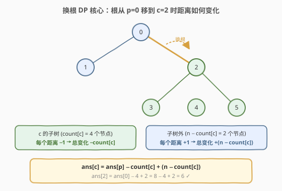
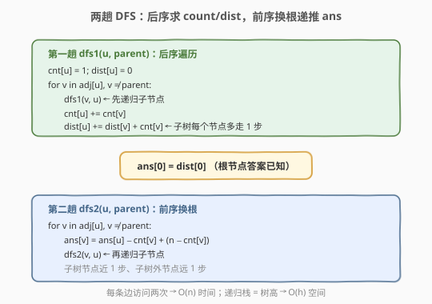
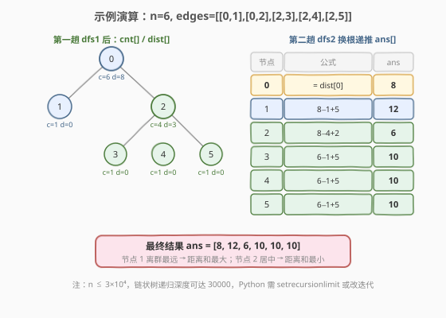

# LeetCode 树中距离之和 题解

## 1. 题目概述

- **标题 / 题号**：树中距离之和（#834，hard）
- **链接**：https://leetcode.cn/problems/sum-of-distances-in-tree/
- **难度**：困难
- **标签**：树、动态规划、深度优先搜索、换根 DP

**题意**：给定一棵无向树（连通无环图），$n$ 个节点编号 $0$ 到 $n-1$，以及边列表 `edges`。返回数组 `ans`，其中 `ans[i]` 表示节点 $i$ 到所有其他节点的**距离之和**（距离 = 两点间路径的边数）。

**示例 1**：

```text
输入：n = 6, edges = [[0,1],[0,2],[2,3],[2,4],[2,5]]
输出：[8,12,6,10,10,10]
解释：树结构如下，各节点到其余节点的距离之和如输出所示。

        0
       / \
      1   2
         / | \
        3  4  5
```

以节点 0 为例：$\text{dist}(0,1)=1, \text{dist}(0,2)=1, \text{dist}(0,3)=2, \text{dist}(0,4)=2, \text{dist}(0,5)=2$，总和 $= 1+1+2+2+2 = 8$。

**示例 2**：

```text
输入：n = 1, edges = []
输出：[0]
```

**示例 3**：

```text
输入：n = 2, edges = [[1,0]]
输出：[1,1]
```

**约束**：

- $1 \le n \le 3 \times 10^4$
- `edges.length == n - 1`
- `edges[i].length == 2`
- $0 \le a_i, b_i < n$
- $a_i \ne b_i$
- 给定的输入表示一棵有效的无向树

> 💡 题眼在「**所有节点**的距离之和」——对 $n$ 个节点各求一次距离和，朴素 BFS 是 $O(n^2)$。$n = 3 \times 10^4$ 时 $n^2 = 9 \times 10^8$，必然超时。突破口是利用**树的相邻节点间距离和的递推关系**，用两趟 DFS 在 $O(n)$ 内一次求出所有答案。

## 2. 解题思路

### 2.1 暴力思路：逐节点 BFS

最直觉的做法：对每个节点 $u$ 做一次 BFS/DFS，求 $u$ 到所有其他节点的距离，累加得到 `ans[u]`。共 $n$ 次 BFS，每次 $O(n)$，总复杂度 $O(n^2)$。

$n = 3 \times 10^4$ 时约 $9 \times 10^8$ 次操作，超出时间限制。瓶颈在于：**每次 BFS 从零开始，完全忽略了相邻节点答案之间的关联**。

### 2.2 核心观察：换根 DP（Rerooting DP）

关键洞察：**相邻节点 $p$ 和 $c$ 的距离和只差一个常数**。当根从 $p$ 移到其子节点 $c$ 时：

- $c$ 的**子树内**每个节点到新根 $c$ 的距离比到旧根 $p$ **少 1**（因为 $p$ 到这些节点都要经过 $c$，少走 $p \to c$ 这一步）→ 总变化 $-\text{count}[c]$
- $c$ 的**子树外**每个节点到新根 $c$ 的距离比到旧根 $p$ **多 1**（因为要先走 $c \to p$ 再到子树外的节点）→ 总变化 $+(n - \text{count}[c])$

由此得到**换根递推式**：

$$\text{ans}[c] = \text{ans}[p] - \text{count}[c] + (n - \text{count}[c])$$

其中 $\text{count}[c]$ 是以 $0$ 为根时 $c$ 的子树大小。



> 💡 **为什么这个递推成立？** 树中任意两点间路径唯一。$p$ 与 $c$ 相邻，把根从 $p$ 换到 $c$ 等价于「翻转边 $p \to c$ 的方向」。子树内的节点原本经 $c$ 再到 $p$，现在直接以 $c$ 为根，少走一步；子树外的节点原本直接连 $p$，现在要经 $c \to p$，多走一步。这种「一进一退」的对称性正是换根 DP 的本质。

### 2.3 算法流程图

两趟 DFS 配合完成：第一趟后序求 `count[]` 和 `dist[]`，第二趟前序换根递推 `ans[]`。



**完整步骤**：

1. **建邻接表**：无向边双向加入 `adj`。
2. **第一趟 `dfs1(u, parent)`（后序）**：以 $0$ 为根，自底向上计算：
   - $\text{count}[u] = 1 + \sum_{v} \text{count}[v]$（$v$ 是 $u$ 的子节点）
   - $\text{dist}[u] = \sum_{v} (\text{dist}[v] + \text{count}[v])$（子树中每个节点到 $u$ 比到 $v$ 多走 1 步）
3. **根节点答案**：$\text{ans}[0] = \text{dist}[0]$（第一趟已求出根到所有节点的距离和）。
4. **第二趟 `dfs2(u, parent)`（前序换根）**：自顶向下递推：
   - 对 $u$ 的每个子节点 $c$：$\text{ans}[c] = \text{ans}[u] - \text{count}[c] + (n - \text{count}[c])$
   - 递归处理 $c$ 的子树。
5. **返回** `ans`。

> ⚠️ **无向树避免重复访问**：两趟 DFS 都传 `parent` 参数，遍历邻居时跳过 `parent`，保证每条边只向下走一次，不会回头。

### 2.4 示例演算

以示例 1 为例，$n = 6$，树结构 `0-1, 0-2, 2-3, 2-4, 2-5`。

**第一趟 `dfs1`（后序，从 0 出发）**：

| 节点 | 子节点 | count 计算 | dist 计算 | count | dist |
|------|--------|-----------|-----------|-------|------|
| 3 (叶) | — | 1 | 0 | 1 | 0 |
| 4 (叶) | — | 1 | 0 | 1 | 0 |
| 5 (叶) | — | 1 | 0 | 1 | 0 |
| 2 | 3,4,5 | $1+1+1+1$ | $(0+1)+(0+1)+(0+1)$ | 4 | 3 |
| 1 (叶) | — | 1 | 0 | 1 | 0 |
| 0 | 1,2 | $1+1+4$ | $(0+1)+(3+4)$ | 6 | 8 |

**第二趟 `dfs2`（前序换根）**：



| 节点 | 公式 | ans |
|------|------|-----|
| 0 | $= \text{dist}[0]$ | 8 |
| 1 | $8 - 1 + 5$ | 12 |
| 2 | $8 - 4 + 2$ | 6 |
| 3 | $6 - 1 + 5$ | 10 |
| 4 | $6 - 1 + 5$ | 10 |
| 5 | $6 - 1 + 5$ | 10 |

最终 `ans = [8, 12, 6, 10, 10, 10]`，与示例一致。

> 💡 **观察**：节点 2 位于树的「重心」位置，到所有节点距离之和最小（6）；节点 1 是叶子，离群最远，距离和最大（12）。这与「树的重心」概念一致——重心即距离和最小的节点。

## 3. 参考代码

### C++

```cpp
class Solution {
    vector<vector<int>> adj;
    vector<int> cnt;
    vector<int> dist;
    int n;

    void dfs1(int u, int parent) {
        cnt[u] = 1;
        dist[u] = 0;
        for (int v : adj[u]) {
            if (v == parent) continue;
            dfs1(v, u);
            cnt[u] += cnt[v];
            dist[u] += dist[v] + cnt[v];
        }
    }

    void dfs2(int u, int parent, vector<int>& ans) {
        for (int v : adj[u]) {
            if (v == parent) continue;
            ans[v] = ans[u] - cnt[v] + (n - cnt[v]);
            dfs2(v, u, ans);
        }
    }

public:
    vector<int> sumOfDistancesInTree(int n, vector<vector<int>>& edges) {
        this->n = n;
        adj.assign(n, {});
        for (auto& e : edges) {
            adj[e[0]].push_back(e[1]);
            adj[e[1]].push_back(e[0]);
        }
        cnt.assign(n, 0);
        dist.assign(n, 0);
        dfs1(0, -1);

        vector<int> ans(n);
        ans[0] = dist[0];
        dfs2(0, -1, ans);
        return ans;
    }
};
```

### Python

```python
class Solution:
    def sumOfDistancesInTree(self, n: int, edges: List[List[int]]) -> List[int]:
        adj = [[] for _ in range(n)]
        for u, v in edges:
            adj[u].append(v)
            adj[v].append(u)

        cnt = [1] * n
        dist = [0] * n

        def dfs1(u, parent):
            for v in adj[u]:
                if v == parent:
                    continue
                dfs1(v, u)
                cnt[u] += cnt[v]
                dist[u] += dist[v] + cnt[v]

        def dfs2(u, parent, ans):
            for v in adj[u]:
                if v == parent:
                    continue
                ans[v] = ans[u] - cnt[v] + (n - cnt[v])
                dfs2(v, u, ans)

        dfs1(0, -1)
        ans = [0] * n
        ans[0] = dist[0]
        dfs2(0, -1, ans)
        return ans
```

> ⚠️ **Python 递归深度**：$n \le 3 \times 10^4$，链状树递归深度可达 30000，超过默认递归上限 1000。LeetCode 环境通常已调高，本地运行需加 `sys.setrecursionlimit(30000)`。若需彻底规避，可将两趟 DFS 改为显式栈迭代实现。

> 💡 **数据范围安全性**：最大距离和出现在链状树的端点，值为 $\frac{n(n-1)}{2} \approx 4.5 \times 10^8$，小于 `INT_MAX`（$2.1 \times 10^9$），C++ `int` 足够。Python 天然支持大整数，无需担心溢出。

## 4. 复杂度分析

| 维度 | 复杂度 | 说明 |
|------|--------|------|
| **时间复杂度** | $O(n)$ | 两趟 DFS 各遍历每条边一次（无向树 $n-1$ 条边），每条边在每趟 DFS 中被访问两次（正反方向），总计 $O(n)$ |
| **空间复杂度** | $O(n)$ | 邻接表 $O(n)$、`cnt`/`dist`/`ans` 数组各 $O(n)$、递归栈最坏 $O(n)$（链状树） |

> ⚠️ 本题已是最优——必须至少访问每个节点一次才能求出答案，$O(n)$ 是下界。换根 DP 的精髓在于**用一次后序 + 一次前序替代 $n$ 次独立 BFS**，将 $O(n^2)$ 降为 $O(n)$。

## 5. 扩展：暴力 BFS 对照与树的重心

### 暴力 BFS（对照组）

对每个节点做一次 BFS，时间 $O(n^2)$、空间 $O(n)$。$n$ 较小（$\le 10^4$）时可作为正确性对照：

```python
def sumOfDistancesInTree_brute(n, edges):
    adj = [[] for _ in range(n)]
    for u, v in edges:
        adj[u].append(v)
        adj[v].append(u)
    ans = []
    for start in range(n):
        from collections import deque
        q = deque([(start, 0)])
        visited = {start}
        total = 0
        while q:
            u, d = q.popleft()
            total += d
            for v in adj[u]:
                if v not in visited:
                    visited.add(v)
                    q.append((v, d + 1))
        ans.append(total)
    return ans
```

### 树的重心

换根 DP 求出的 `ans` 数组中，**最小值对应的节点就是树的重心**（centroid）。重心有一个重要性质：删除重心后，各连通块的大小不超过 $n/2$。本题的换根 DP 天然求出了所有节点的距离和，取最小即得重心，无需额外算法。

> 💡 树的重心相关问题（如 [310. 最小高度树](https://leetcode.cn/problems/minimum-height-trees/)）都可以用换根 DP 或逐层剥叶（BFS 拓扑排序）求解。

## 6. 面试要点

1. **为什么不能对每个节点单独 BFS？**

   - 朴素 BFS 对 $n$ 个节点各跑一次，$O(n^2)$。$n = 3 \times 10^4$ 时约 $9 \times 10^8$ 次操作，必然超时。关键在于相邻节点的答案之间存在递推关系，可以复用。

2. **换根 DP 的核心递推式怎么推导？**

   - 根从 $p$ 移到相邻子节点 $c$ 时，$c$ 的子树内 $\text{count}[c]$ 个节点每个距离 $-1$（少走 $p \to c$ 一步），子树外 $n - \text{count}[c]$ 个节点每个距离 $+1$（多走 $c \to p$ 一步）。故 $\text{ans}[c] = \text{ans}[p] - \text{count}[c] + (n - \text{count}[c])$。

3. **`count[]` 和 `dist[]` 在第一趟 DFS 中怎么计算？**

   - 后序遍历：$\text{count}[u] = 1 + \sum \text{count}[v]$（子树大小）；$\text{dist}[u] = \sum (\text{dist}[v] + \text{count}[v])$（子树每个节点到 $u$ 比到 $v$ 多走 1 步，所以贡献为 $\text{dist}[v] + \text{count}[v]$）。

4. **无向树如何避免重复访问？**

   - 两趟 DFS 都传 `parent` 参数，遍历邻居时 `if (v == parent) continue`，保证每条边只向下递归一次，不回头。这是无向图 DFS 的标准技巧。

5. **时间复杂度为什么是 $O(n)$？**

   - 两趟 DFS 各遍历 $n-1$ 条边一次（每条边被两端各访问一次但只递归一次），总计 $O(n)$。预处理邻接表也是 $O(n)$。空间上三个数组 + 邻接表 + 递归栈均为 $O(n)$。

> 💡 **一句话总结**：834 的核心是换根 DP——第一趟后序 DFS 求 `count`（子树大小）和 `dist`（子树内距离和），第二趟前序 DFS 用 `ans[c] = ans[p] - count[c] + (n - count[c])` 递推出所有节点的答案。$O(n)$ 时间、$O(n)$ 空间，一次遍历代替 $n$ 次 BFS。

## 同类练习题

| # | 题目 | 与本题的关联 |
|---|------|-------------|
| 310 | [最小高度树](https://leetcode.cn/problems/minimum-height-trees/) | 换根 DP 经典题，求使树高最小的根节点，同样可两趟 DFS 求每个节点为根的树高后取最小 |
| 2246 | [相邻字符不同的最长路径](https://leetcode.cn/problems/longest-path-with-different-adjacent-characters/) | 换根 DP 求树上最长路径，后序维护子树最大/次大贡献，前序换根传递父侧贡献 |
| 2477 | [到达首都的最少油耗](https://leetcode.cn/problems/minimum-fuel-cost-to-report-to-the-capital/) | 树 DFS + 子树大小计算，按子树节点数分配车辆，与本题 `count[]` 的后序计算同构 |
| 2003 | [每棵子树内缺失的最小基因值](https://leetcode.cn/problems/smallest-missing-genetic-value-in-each-subtree/) | 换根 DP + 子树信息合并，后序 DFS 维护子树集合，难度更高 |
