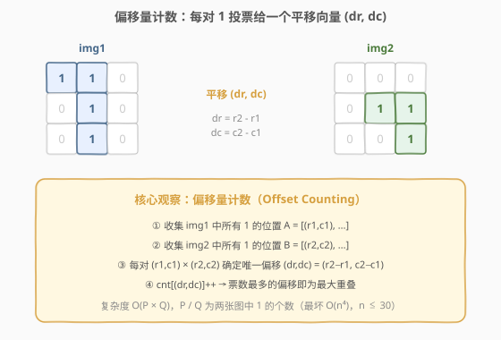
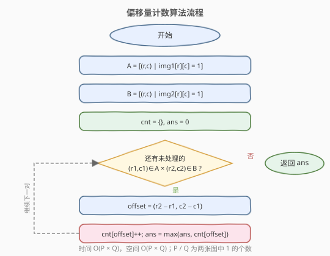
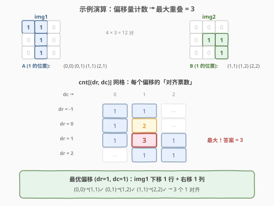

# LeetCode 图像重叠 题解

## 1. 题目概述

- **标题 / 题号**：图像重叠（#835，medium）
- **链接**：https://leetcode.cn/problems/image-overlap/
- **难度**：中等
- **标签**：数组、哈希表

**题意**：给定两个大小均为 $n \times n$ 的二进制矩阵 `img1` 和 `img2`（元素为 `0` 或 `1`）。将其中一个图像做**平移转换**（所有 `1` 整体向左/右/上/下滑动任意单位，不旋转，越界的 `1` 被清除），然后叠在另一个图像上。**重叠数** = 两个图像在该位置**都有 `1`** 的格子总数。求**最大可能的重叠数**。

**示例 1**：

```text
输入：img1 = [[1,1,0],[0,1,0],[0,1,0]], img2 = [[0,0,0],[0,1,1],[0,0,1]]
输出：3
解释：将 img1 向右移 1、向下移 1 后：
  img1 变为 [[0,0,0],[0,1,1],[0,0,1]]，与 img2 完全重合，重叠数 = 3。
```

**示例 2**：

```text
输入：img1 = [[1]], img2 = [[1]]
输出：1
```

**示例 3**：

```text
输入：img1 = [[0]], img2 = [[0]]
输出：0
```

**约束**：

- `n == img1.length == img1[i].length`
- `n == img2.length == img2[i].length`
- `1 <= n <= 30`
- `img1[i][j]` 为 `0` 或 `1`
- `img2[i][j]` 为 `0` 或 `1`

## 2. 解题思路

### 2.1 暴力思路

平移量 `(dr, dc)` 的取值范围是 `dr, dc ∈ [-(n-1), n-1]`，共 $(2n-1)^2$ 种。对每种平移，遍历整个矩阵统计重叠（两个对应位置都为 `1`），取最大值。

- 时间复杂度：$O(n^4)$——$(2n-1)^2$ 种平移 × 每种 $O(n^2)$ 检查。
- `n = 30` 时约 $59^2 \times 900 \approx 3.1 \times 10^6$，可以接受，但不是最优思路。

> ⚠️ 暴力法的问题在于：**它对每种平移独立地扫描整张矩阵**，没有利用「不同平移之间的联系」。事实上，决定重叠数的只有 `1` 的位置——`0` 的格子无论怎么平移都不会贡献重叠。

### 2.2 核心观察：偏移量计数（Offset Counting）



关键转换思路：**不要枚举平移再找匹配，而是让每对 `1` 自己「投票」选出能对齐它们的平移量。**

具体来说：

1. 收集 `img1` 中所有 `1` 的位置 $A = \{(r_1, c_1), \ldots\}$，共 $P$ 个。
2. 收集 `img2` 中所有 `1` 的位置 $B = \{(r_2, c_2), \ldots\}$，共 $Q$ 个。
3. 对每一对 $(r_1, c_1) \in A$ 和 $(r_2, c_2) \in B$，能将 `img1` 的这个 `1` 平移到 `img2` 的那个 `1` 上的**唯一偏移量**为：

$$
(\text{dr}, \text{dc}) = (r_2 - r_1,\ c_2 - c_1)
$$

4. 用哈希表 `cnt` 统计每个偏移量被多少对「投了票」：`cnt[(dr, dc)]++`。
5. **票数最多的偏移量即为答案**——因为同一偏移量下所有投票的对都能在该平移下同时对齐。

> 💡 **为什么正确？** 偏移量 `(dr, dc)` 的票数 = 在该平移下 `img1` 和 `img2` 中 `1` 重叠的格子数。如果两个 `1` 对投票给了同一个 `(dr, dc)`，说明它们可以在**同一次平移**中同时对齐。因此最大票数 = 最大重叠数。

> ⚠️ **与暴力的本质区别**：暴力法枚举 $O(n^2)$ 个平移，每个平移扫描 $O(n^2)$ 格；偏移量计数法只关注 $P \times Q$ 对 `1`，跳过了所有 `0` 的无效计算。当 `1` 稀疏时效率提升巨大。

### 2.3 算法流程图



流程简述：收集两张图的 `1` 坐标 → 双重循环枚举每对 `1` → 计算偏移量并计数 → 取最大计数值。

### 2.4 示例演算



以 `img1 = [[1,1,0],[0,1,0],[0,1,0]]`、`img2 = [[0,0,0],[0,1,1],[0,0,1]]` 为例：

- $A$（img1 的 `1`）：$(0,0),\ (0,1),\ (1,1),\ (2,1)$ — 共 4 个
- $B$（img2 的 `1`）：$(1,1),\ (1,2),\ (2,2)$ — 共 3 个
- 配对数：$4 \times 3 = 12$ 对

逐一计算偏移量并计数：

| $(r_1,c_1)$ | $(r_2,c_2)$ | $(\text{dr}, \text{dc})$ |
|-------------|-------------|--------------------------|
| (0,0) | (1,1) | **(1,1)** |
| (0,0) | (1,2) | (1,2) |
| (0,0) | (2,2) | (2,2) |
| (0,1) | (1,1) | (1,0) |
| (0,1) | (1,2) | **(1,1)** |
| (0,1) | (2,2) | (2,1) |
| (1,1) | (1,1) | (0,0) |
| (1,1) | (1,2) | (0,1) |
| (1,1) | (2,2) | **(1,1)** |
| (2,1) | (1,1) | (−1,0) |
| (2,1) | (1,2) | (−1,1) |
| (2,1) | (2,2) | (0,1) |

统计结果（按票数排序）：

| 偏移量 $(\text{dr}, \text{dc})$ | 票数 |
|----------------------------------|------|
| **(1, 1)** | **3** ← 最大 |
| (0, 1) | 2 |
| (1, 2) | 1 |
| (2, 2) | 1 |
| (1, 0) | 1 |
| (2, 1) | 1 |
| (0, 0) | 1 |
| (−1, 0) | 1 |
| (−1, 1) | 1 |

最优偏移 $(1, 1)$：img1 下移 1 行、右移 1 列。验证——img1 的 `1` 平移后：

- $(0,0) \to (1,1)$：img2[1][1] = 1 ✓
- $(0,1) \to (1,2)$：img2[1][2] = 1 ✓
- $(1,1) \to (2,2)$：img2[2][2] = 1 ✓
- $(2,1) \to (3,2)$：越界，清除

重叠数 = 3，即为答案。

## 3. 参考代码

### C++

```cpp
class Solution {
  public:
    int largestOverlap(vector<vector<int>>& img1, vector<vector<int>>& img2) {
        int n = img1.size();
        vector<pair<int,int>> A, B;
        for (int i = 0; i < n; i++) {
            for (int j = 0; j < n; j++) {
                if (img1[i][j]) A.emplace_back(i, j);
                if (img2[i][j]) B.emplace_back(i, j);
            }
        }
        map<pair<int,int>, int> cnt;
        int ans = 0;
        for (auto& [r1, c1] : A) {
            for (auto& [r2, c2] : B) {
                int v = ++cnt[{r2 - r1, c2 - c1}];
                ans = max(ans, v);
            }
        }
        return ans;
    }
};
```

### Python

```python
class Solution:
    def largestOverlap(self, img1: List[List[int]], img2: List[List[int]]) -> int:
        n = len(img1)
        A = [(r, c) for r in range(n) for c in range(n) if img1[r][c]]
        B = [(r, c) for r in range(n) for c in range(n) if img2[r][c]]
        cnt = Counter()
        ans = 0
        for r1, c1 in A:
            for r2, c2 in B:
                offset = (r2 - r1, c2 - c1)
                cnt[offset] += 1
                ans = max(ans, cnt[offset])
        return ans
```

> 💡 **边界情况**：若 `A` 或 `B` 为空（某张图全为 `0`），双重循环不执行，`ans` 保持 0，直接返回——正确，因为无法产生任何重叠。

## 4. 复杂度分析

| 维度 | 复杂度 | 说明 |
|------|--------|------|
| 时间复杂度 | $O(P \times Q)$ | $P$、$Q$ 分别为 img1、img2 中 `1` 的个数；最坏 $P = Q = n^2$ 时退化为 $O(n^4)$ |
| 空间复杂度 | $O(P \times Q)$ | 哈希表最多存储 $P \times Q$ 个不同的偏移量；最坏 $O(n^2)$（偏移量范围 $(2n-1)^2$） |

> 💡 `n ≤ 30` 时 $P, Q \leq 900$，$P \times Q \leq 810000$，完全在时限内。

## 5. 扩展：二维互相关（卷积视角）

从信号处理的角度看，本题求的是 `img1` 与 `img2` 的**二维互相关**（cross-correlation）的最大值：

$$
\text{overlap}(\text{dr}, \text{dc}) = \sum_{r,c} \text{img1}[r][c] \cdot \text{img2}[r + \text{dr}][c + \text{dc}]
$$

这正是互相关的定义。当 $n$ 很大时（如 $n > 100$），可以用 **FFT**（快速傅里叶变换）将互相关加速到 $O(n^2 \log n)$：

1. 将 `img1` 翻转后对 `img2` 做二维卷积。
2. 卷积结果中每个位置对应一个偏移量的重叠数。
3. 取最大值即为答案。

但对于 $n \leq 30$ 的约束，偏移量计数法已足够高效，FFT 的常数开销反而更大。

## 6. 面试要点

1. **为什么偏移量计数法是正确的？**

   偏移量 `(dr, dc)` 的票数 = 该平移下 `img1` 与 `img2` 中 `1` 重叠的格子数。因为同一偏移量下的多对 `1` 可以在**同一次平移**中同时对齐（它们各自的 `1` 互不干扰），所以最大票数即为最大重叠数。

2. **偏移量计数法与暴力法的本质区别是什么？**

   暴力法枚举 $O(n^2)$ 个平移，每个平移扫描 $O(n^2)$ 格（含大量 `0`）；偏移量计数法只对 $P \times Q$ 对 `1` 操作，完全跳过 `0`。当 `1` 稀疏时效率提升巨大；最坏情况（全 `1`）两者都是 $O(n^4)$。

3. **为什么偏移量是 $(r_2 - r_1, c_2 - c_1)$ 而不是 $(r_1 - r_2, c_1 - c_2)$？**

   取决于「平移哪个图」：若将 `img1` 平移使其 `1` 从 $(r_1, c_1)$ 移到 $(r_2, c_2)$，则偏移 $\text{dr} = r_2 - r_1$（目标 − 源）。反过来若平移 `img2` 则符号相反，但最大重叠数相同。

4. **如果两张图全为 `0` 怎么办？**

   `A` 或 `B` 为空，双重循环不执行，`ans = 0`，直接返回。无需特殊处理。

5. **能否用二维数组代替哈希表？**

   可以。偏移量范围 $\text{dr}, \text{dc} \in [-(n-1), n-1]$，可用大小 $(2n-1) \times (2n-1)$ 的二维数组替代哈希表，下标偏移 $n-1$。避免哈希开销，但代码略繁琐。`n ≤ 30` 时哈希表已足够快。

## 同类练习题

| # | 题目 | 与本题的关联 |
|---|------|-------------|
| 454 | [四数相加 II](https://leetcode.cn/problems/4sum-ii/)（[题解](../0401-0500/454_四数相加%20II.md)） | 同样用哈希表统计「数对」并计数，分组 + Meet in the Middle |
| 718 | [最长重复子数组](https://leetcode.cn/problems/maximum-length-of-repeated-subarray/)（[题解](../0701-0800/718_最长重复子数组.md)） | 同样是「对齐两个序列」的思想，用 DP 或滑动窗口求最长公共子串 |
| 1143 | [最长公共子序列](https://leetcode.cn/problems/longest-common-subsequence/)（[题解](../1101-1200/1143_最长公共子序列.md)） | 二维 DP 求两个序列的对齐，对比本题的「偏移对齐」思路 |
| 149 | [直线上最多的点数](https://leetcode.cn/problems/max-points-on-a-line/)（[题解](../0101-0200/149_直线上最多的点数.md)） | 固定一点按斜率分组计数，与本题「固定一图按偏移量计数」思路同构 |
| 719 | [找出第 K 小的数对距离](https://leetcode.cn/problems/find-k-th-smallest-pair-distance/)（[题解](../0701-0800/719_找出第K小的数对距离.md)） | 同样是「枚举数对」的思路，但用二分 + 双指针计数 |
